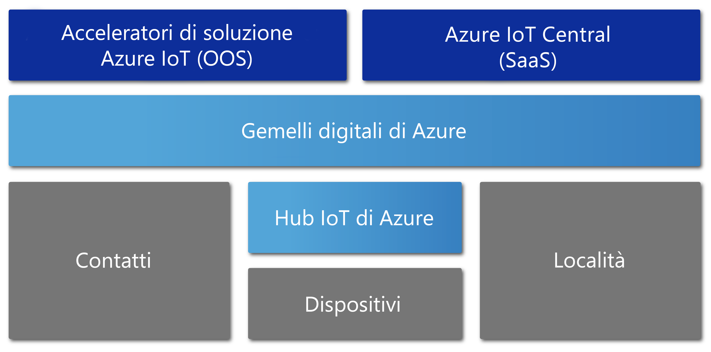

# Panoramica di Gemelli digitali di Azure

Anteprima di Gemelli digitali di Azure è un servizio Azure IoT che consente di creare modelli completi dell'ambiente fisico. Consente di creare grafici di intelligenza spaziale per modellare le relazioni e le interazioni tra persone, spazi e dispositivi.

Con Gemelli digitali di Azure è possibile eseguire query sui dati da uno spazio fisico invece che da sensori diversi. Questo servizio consente di creare esperienze riutilizzabili, altamente scalabili, con riconoscimento dello spazio, che collegano flussi di dati del mondo digitale e fisico. Queste speciali funzionalità contestuali contribuiscono al miglioramento delle app. 

Gemelli digitali di Azure si applica a tutti i tipi di ambienti, ad esempio, data warehouse, uffici, scuole, ospedali e banche. ma può essere usato anche per stadi, fabbriche, parcheggi, parchi, reti intelligenti e città. Di seguito sono indicati alcuni scenari in cui Gemelli digitali di Azure può essere utile:

- Prevedere gli interventi di manutenzione necessari di una fabbrica.
- Analizzare in tempo reale il fabbisogno energetico di una rete elettrica.
- Ottimizzare l'uso dello spazio disponibile per un ufficio.
- Tenere traccia della temperatura giornaliera in diversi stati o province.
- Monitorare i percorsi dei droni in volo.
- Identificare veicoli autonomi.
- Analizzare i livelli di occupazione di un edificio.
- Individuare la cassa più attiva del punto vendita.

Qualsiasi sia lo scenario del mondo reale, è probabile poter eseguire il provisioning di un'istanza digitale corrispondente con Gemelli digitali di Azure.

Il video seguente illustra in modo più approfondito il servizio Gemelli digitali di Azure.

> [!VIDEO https://www.youtube.com/embed/TvN_NxpgyzQ]

## Funzionalità principali

Gemelli digitali include le funzionalità chiave seguenti.

### Grafico di intelligenza spaziale

Il [*grafico di intelligenza spaziale*](./concepts-objectmodel-spatialgraph.md#spatial-intelligence-graph), o *grafico spaziale*, è una rappresentazione virtuale dell'ambiente fisico che consente di modellare le relazioni tra persone, luoghi e dispositivi.

Si consideri un'app Smart Utility che prevede diversi contatori di utilizzo dell'energia elettrica connessi in un quartiere. L'azienda Smart Utility deve monitorare e prevedere con precisione l'utilizzo e la fatturazione dell'energia elettrica. A tale scopo, è necessario modellare ogni dispositivo e sensore con informazioni di contesto sulla località e sul cliente destinatario della fattura. È possibile usare il grafico di intelligenza spaziale per modellare questi tipi di relazioni complesse.

### Modelli a oggetti di gemelli digitali

I [modelli a oggetti di gemelli digitali](./concepts-objectmodel-spatialgraph.md#digital-twins-object-models) sono protocolli di dispositivo e schemi di dati predefiniti che consentono di allineare le esigenze specifiche del dominio di una soluzione per accelerare e semplificare lo sviluppo.

Per esempio, un'applicazione per la gestione dell'occupazione delle stanze che può usare tipi di spazio predefiniti, come campus, edificio, piano e stanza.

### Più tenant annidati

È possibile realizzare soluzioni che possono essere ridimensionate in modo sicuro ed essere riutilizzate per più tenant. È anche possibile creare più subtenant accessibili e utilizzabili in modo isolato e sicuro.

Un esempio è costituito da un'app per l'utilizzo dello spazio che è configurata in modo da isolare i dati di un tenant da quelli di altri tenant all'interno di un singolo edificio oppure che viene usata per combinare i dati per un singolo tenant con più edifici.

### Funzionalità di calcolo avanzate

Le [funzioni definite dall'utente](./concepts-user-defined-functions.md) consentono di definire ed eseguire funzioni personalizzate sui [dati dei dispositivi](./concepts-device-ingress.md) in ingresso per inviare segnali a endpoint predefiniti. Questa funzionalità avanzata migliora la personalizzazione e l'automazione delle attività dei dispositivi.

Un esempio è costituito da un'applicazione intelligente per l'agricoltura che include una funzione definita dall'utente per valutare le letture dei sensori dell'umidità del suolo insieme alle previsioni meteo e inviare quindi segnali sulle esigenze di irrigazione.

### Controllo di accesso predefinito

Le funzionalità avanzate di gestione dell'accesso e delle identità, come il [controllo degli accessi in base al ruolo](./security-role-based-access-control.md) e [Azure Active Directory](./security-authenticating-apis.md), consentono di controllare in modo sicuro l'accesso per singoli utenti e dispositivi.

Un esempio è costituito da un'app per la gestione di strutture che è configurata per consentire agli occupanti di una stanza di regolare la temperatura entro un intervallo specificato e ai responsabili della struttura di impostare la temperatura in qualsiasi stanza su qualsiasi valore.

### Ecosistema

È possibile connettere un'istanza di Gemelli digitali di Azure a numerosi servizi avanzati di Azure. Questi servizi includono Analisi di flusso di Azure, Azure AI e Archiviazione di Azure, nonché Mappe di Azure, Microsoft Mixed Reality, Dynamics 365 oppure Office 365.

Un esempio è costituito da un'applicazione per un edificio per uffici smart che usa Gemelli digitali di Azure per rappresentare i team e i dispositivi distribuiti su molti piani. Man mano che i dispositivi trasmettono i dati in tempo reale nell'istanza di Gemelli digitali di cui è stato effettuato il provisioning, Analisi di flusso elabora tali dati per fornire informazioni dettagliate significative su cui è possibile intervenire. I dati vengono archiviati in Archiviazione di Azure e convertiti in un formato di file condivisibile. Il file viene distribuito in tutta l'organizzazione con Office 365.

## Soluzioni che traggono vantaggio da Gemelli digitali di Azure

Gemelli digitali di Azure è utile per rappresentare il mondo fisico e le tante relazioni che lo caratterizzano. Semplifica infatti la modellazione, l'elaborazione dei dati, la gestione degli eventi e il rilevamento dei dispositivi IoT. L'elenco seguente include solo alcuni dei tanti scenari, in diversi settori, che traggono vantaggio dall'uso di questo servizio:

* Mostrare a una società che gestisce proprietà immobiliari i livelli di occupazione di uno spazio nel tempo per ottenere informazioni dettagliate sui modi migliori per configurare un edificio a uso uffici.
* Attivare ticket di ordine di lavoro per un'app per dispositivi mobili in modo da gestire il servizio di sicurezza, pianificare i turni di pulizia e altri servizi in uno spazio commerciale o in una sede di eventi sportivi.
* Mostrare agli occupanti di un edificio quali stanze sono occupate in tempo reale, consentendo quindi la prenotazione di spazi di lavoro adatti alle specifiche esigenze.
* Registrare la posizione delle dotazioni all'interno di uno spazio.
* Ottimizzare la ricarica di veicoli elettrici modellando le preferenze degli utenti e i vincoli della rete elettrica.

## Gemelli digitali di Azure nel contesto di altri servizi IoT

Gemelli digitali di Azure usa l'hub IoT di Azure per connettere i dispositivi e i sensori IoT che consentono di mantenere tutto aggiornato con il mondo fisico. Il diagramma seguente mostra le relazioni tra Gemelli digitali di Azure e altri servizi Azure IoT.

Per altre informazioni su IoT, vedere l'articolo su [tecnologie e soluzioni di Azure IoT](../iot-fundamentals/iot-services-and-technologies.md).

## Passaggi successivi

Passare a una breve demo delle funzionalità di Gemelli digitali di Azure:

>[!div class="nextstepaction"]
>[Guida introduttiva: Trovare le stanze disponibili usando Gemelli digitali di Azure](./quickstart-view-occupancy-dotnet.md)

Analizzare in dettaglio un'applicazione di gestione di strutture con Gemelli digitali di Azure:

>[!div class="nextstepaction"]
>[Esercitazione: Distribuire Gemelli digitali di Azure e configurare un grafico spaziale](./tutorial-facilities-setup.md)

Informazioni su concetti di base relativi a Gemelli digitali di Azure:

>[!div class="nextstepaction"]
>[Informazioni sui modelli a oggetti di Gemelli digitali e sul grafico di intelligenza spaziale](./concepts-objectmodel-spatialgraph.md)