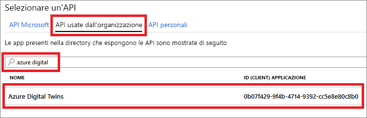
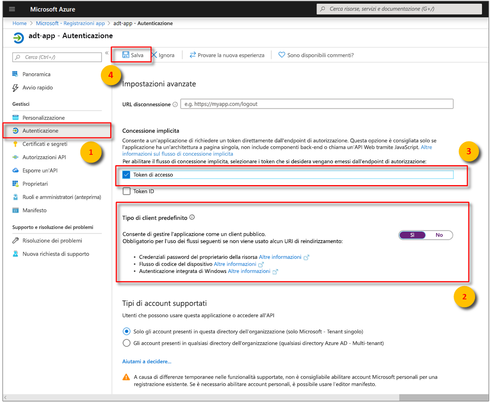

# <a name="how-to-configure-postman-for-azure-digital-twins"></a>Come configurare Postman per Gemelli digitali di Azure

Questo articolo illustra come configurare il client REST di Postman per testare e interagire con le API di gestione di Gemelli digitali di Azure. In particolare, illustra le operazioni seguenti:

* Come configurare un'applicazione di Azure Active Directory per usare il flusso di concessione implicita OAuth 2.0.
* Come usare il client REST di Postman per inviare richieste HTTP di token alle API di gestione.
* Come usare Postman per inviare richieste POST multipart alle API di gestione.

## <a name="postman-summary"></a>Riepilogo di Postman

Iniziare a usare Gemelli digitali di Azure tramite uno strumento client REST, ad esempio [Postman](https://www.getpostman.com/), per preparare l'ambiente di test locale. Il client Postman consente di creare rapidamente richieste HTTP complesse. Scaricare la versione desktop del client Postman accedendo a [www.getpostman.com/apps](https://www.getpostman.com/apps).

[Postman](https://www.getpostman.com/) è uno strumento di test REST che inserisce le principali funzionalità di richiesta HTTP in un'utile GUI desktop e basata su plug-in.

Tramite il client Postman gli sviluppatori di soluzioni possono specificare il tipo di richiesta HTTP (*POST*, *GET*, *UPDATE*, *PATCH* e *DELETE*), l'endpoint dell'API da chiamare e l'uso di SSL. Postman supporta anche l'aggiunta di intestazioni della richiesta HTTP, parametri, dati del modulo e corpi.

## <a name="configure-azure-active-directory-to-use-the-oauth-20-implicit-grant-flow"></a>Configurare Azure Active Directory per usare il flusso di concessione implicita OAuth 2.0

Configurare l'app di Azure Active Directory per usare il flusso di concessione implicita OAuth 2.0.

1. Aprire il riquadro **Autorizzazioni API** per la app registrazione app. Selezionare il pulsante **Aggiungi un'autorizzazione**. Nel riquadro **Richiedi le autorizzazioni dell'API** selezionare la scheda **API usate dall'organizzazione** e quindi cercare:
    
    1. `Azure Digital Twins`. Selezionare l'API **Gemelli digitali di Azure**.

        [](../../includes/media/digital-twins-permissions/aad-aap-search-api-dt.png#lightbox)

    1. In alternativa, cercare `Azure Smart Spaces Service`. Selezionare l'API **Azure Smart Spaces Service** (Servizio Spazi intelligenti Azure).

        [](../../includes/media/digital-twins-permissions/aad-app-search-api.png#lightbox)

    > [!IMPORTANT]
    > Il nome e l'ID dell'API di Azure AD che verranno visualizzati dipendono dal tenant:
    > * Gli account dei clienti e dei tenant di test devono cercare `Azure Digital Twins`.
    > * Gli altri account Microsoft devono cercare `Azure Smart Spaces Service`.

1. L'API selezionata viene visualizzata come **Gemelli digitali di Azure** nello stesso riquadro **Richiedi le autorizzazioni dell'API**. Selezionare il menu a discesa **Lettura (1)** e quindi la casella di controllo **Read.Write**. Selezionare il pulsante **Aggiungi autorizzazioni**.

    [](../../includes/media/digital-twins-permissions/aad-app-req-permissions.png#lightbox)

1. A seconda delle impostazioni dell'organizzazione, potrebbe essere necessario eseguire passaggi aggiuntivi per concedere l'accesso amministratore a questa API. Contattare l'amministratore per altre informazioni. Una volta approvato l'accesso amministratore, la colonna **CONSENSO AMMINISTRATORE OBBLIGATORIO** nel riquadro **Autorizzazioni API** sarà simile a quanto illustrato di seguito per le API:

    [approvazione del consenso dell'amministratore di ](../../includes/media/digital-twins-permissions/aad-app-admin-consent.png#lightbox)

1. Configurare un secondo **URI di reindirizzamento** per `https://www.getpostman.com/oauth2/callback`.

    [](media/how-to-configure-postman/authentication-redirect-uri.png#lightbox)

1. Per assicurarsi che [l'app sia registrata come **client pubblico**](https://docs.microsoft.com/azure/active-directory/develop/scenario-desktop-app-registration), aprire il riquadro di **autenticazione** per la registrazione dell'app e scorrere verso il basso in tale riquadro. Nella sezione **tipo di client predefinito** scegliere **Sì** per **considera applicazione come client pubblico**e quindi fare clic su **Salva**.

    Controllare i **token di accesso** per abilitare l'impostazione **Oauth2AllowImplicitFlow** nel file manifest. JSON.

    [impostazione di configurazione client pubblica ](../../includes/media/digital-twins-permissions/aad-public-client.png#lightbox)

1. Copiare e conservare l'**ID applicazione** dell'app di Azure Active Directory. Viene usato nei passaggi seguenti.

   [](../../includes/media//digital-twins-permissions/aad-app-reg-app-id.png#lightbox)


## <a name="obtain-an-oauth-20-token"></a>Ottenere un token OAuth 2.0

[!INCLUDE [digital-twins-management-api](../../includes/digital-twins-management-api.md)]

Configurare e configurare il post per ottenere un token di Azure Active Directory. In seguito, eseguire una richiesta HTTP autenticata a Gemelli digitali usando il token acquisito:

1. Passare a [www.getpostman.com](https://www.getpostman.com/) per scaricare l'app.
1. Verificare che l'**URL di autorizzazione** sia corretto. Deve essere nel formato seguente:

    ```plaintext
    https://login.microsoftonline.com/YOUR_AZURE_TENANT.onmicrosoft.com/oauth2/authorize?resource=0b07f429-9f4b-4714-9392-cc5e8e80c8b0
    ```

    | Nome  | Sostituire con | Esempio |
    |---------|---------|---------|
    | YOUR_AZURE_TENANT | Il nome del tenant o dell'organizzazione | `microsoft` |

1. Selezionare la scheda **Authorization** (Autorizzazione), **OAuth 2.0** e quindi **Get New Access Token** (Ottieni nuovo token di accesso).

    | Campo  | Valore |
    |---------|---------|
    | Grant Type (Tipo di concessione) | `Implicit` |
    | Callback URL (URL callback) | `https://www.getpostman.com/oauth2/callback` |
    | Auth URL (URL autorizzazione) | Usare l' **URL di autorizzazione** del **passaggio 2** |
    | ID Client | Usare l' **ID applicazione** per l'app Azure Active Directory creata o riutilizzata nella sezione precedente |
    | Ambito | Lasciare vuoto |
    | Stato | Lasciare vuoto |
    | Client Authentication (Autenticazione client) | `Send as Basic Auth header` |

1. Il client ora dovrebbe essere visualizzato come:

    [esempio di client Post ](media/how-to-configure-postman/postman-oauth-token.png#lightbox)

1. Selezionare **Request Token** (Richiedi token).
  
1. Scorrere verso il basso e selezionare **Use Token** (Usa token).

## <a name="make-a-multipart-post-request"></a>Effettuare una richiesta POST multipart

Dopo aver completato i passaggi precedenti, configurare Postman per eseguire una richiesta POST multipart HTTP autenticata:

1. Nella scheda **intestazioni** aggiungere una chiave di intestazione della richiesta HTTP **Content-Type** con valore `multipart/mixed`.

   [tipo di contenuto ](media/how-to-configure-postman/content-type.png#lightbox)

1. Serializzare i dati non di testo nel file. I dati JSON verranno salvati come un file JSON.
1. Nella scheda **corpo** selezionare `form-data`. 
1. Aggiungere ogni file assegnando un nome di **chiave** , selezionando `File`.
1. Quindi, selezionare ogni file tramite il pulsante **Scegliere un file**.

   [esempio di client Post ](media/how-to-configure-postman/form-body.png#lightbox)

   >[!NOTE]
   > * Il client di Postman non richiede che ai blocchi multipart sia assegnata manualmente un'informazione **Content-Type** oppure **Content-Disposition**.
   > * Non è necessario specificare tali intestazioni per ogni parte.
   > * Selezionare `multipart/mixed` o un altro **Content-Type** appropriato per l'intera richiesta.

1. Selezionare infine **Invia** per inviare la richiesta post http multiparte. Un codice di stato `200` o `201` indica una richiesta con esito positivo. Viene visualizzato anche il messaggio di risposta appropriato.

## <a name="next-steps"></a>Passaggi successivi

- Per informazioni sulle API di gestione di Gemelli digitali e su come usarle, consultare [How to use Azure Digital Twins management APIs](how-to-navigate-apis.md)(Come usare le API di gestione di Gemelli digitali di Azure).

- Usare richieste multipart per [aggiungere BLOB alle entità Gemelli digitali di Azure](./how-to-add-blobs.md).

- Per informazioni sull'autenticazione con le API di gestione, vedere [Eseguire l'autenticazione con le API](./security-authenticating-apis.md).
