# <a name="quickstart-create-an-instance-of-azure-database-migration-service-in-hybrid-mode-using-the-azure-portal-preview"></a>Guida introduttiva: Creare un'istanza del Servizio Migrazione del database di Azure in modalità ibrida usando il portale di Azure (anteprima)

La modalità ibrida del Servizio Migrazione del database di Azure gestisce le migrazioni dei database usando un ruolo di lavoro di migrazione ospitato in locale insieme a un'istanza del Servizio Migrazione del database di Azure in esecuzione nel cloud. La modalità ibrida è particolarmente utile per gli scenari in cui si verifica una mancanza di connettività da sito a sito tra la rete locale e Azure oppure è disponibile una larghezza di banda di connettività da sito a sito limitata.

In questa guida di avvio rapido viene usato il portale di Azure per creare un'istanza del Servizio Migrazione del database di Azure in modalità ibrida. Successivamente, viene scaricato, installato e configurato il ruolo di lavoro ibrido nella rete locale. In fase di anteprima è possibile usare la modalità ibrida del Servizio Migrazione del database di Azure per eseguire la migrazione dei dati da un'istanza locale di SQL Server al database SQL di Azure.

> [!IMPORTANT]
> Il programma di installazione ibrido del Servizio Migrazione del database di Azure richiede .NET 4.7.2 o versione successiva. Per trovare le versioni più recenti di .NET, vedere la pagina di [download di .NET Framework](https://dotnet.microsoft.com/download/dotnet-framework).

Se non si ha una sottoscrizione di Azure, creare un account [gratuito](https://azure.microsoft.com/free/) prima di iniziare.

## <a name="sign-in-to-the-azure-portal"></a>Accedere al portale di Azure

Nel Web browser passare al [portale di Microsoft Azure](https://portal.azure.com/) e quindi immettere le credenziali per accedere al portale.

La visualizzazione predefinita è il dashboard del servizio.

## <a name="register-the-resource-provider"></a>Registrare il provider di risorse

Prima di creare la prima istanza del Servizio Migrazione del database di Azure, registrare il provider di risorse Microsoft.DataMigration.

1. Nel portale di Azure selezionare **Sottoscrizioni**, selezionare la sottoscrizione in cui si vuole creare l'istanza del Servizio Migrazione del database di Azure e quindi selezionare **Provider di risorse**.

    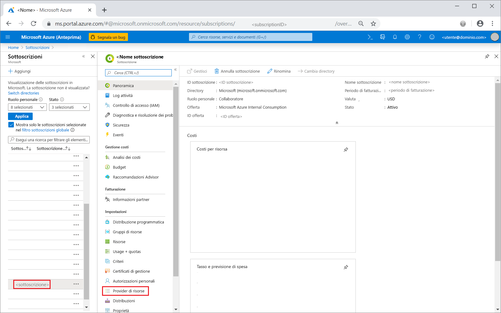

2. Ricercare la migrazione e quindi a destra del **Microsoft.DataMigration** selezionare **Registro**.

    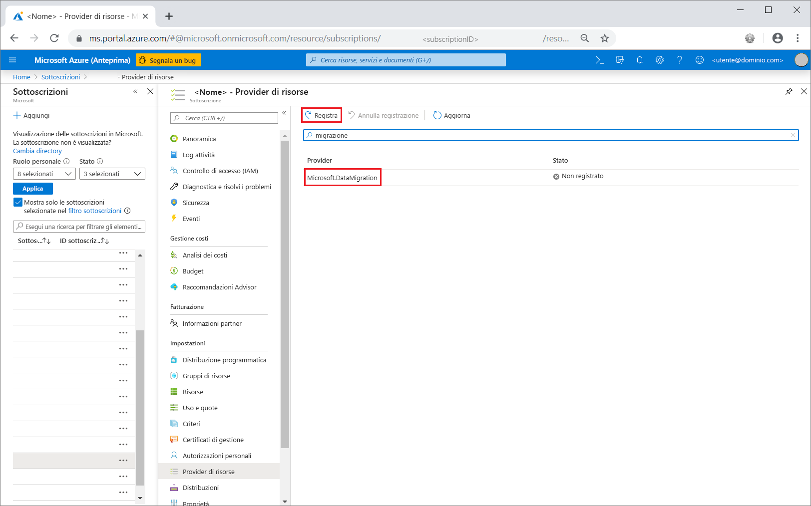

## <a name="create-an-instance-of-the-service"></a>Creare un'istanza del servizio

1. Selezionare **+ Create a resource** (+ Crea una risorsa) per creare un'istanza del Servizio Migrazione del database di Azure.

2. Cercare "migrazione" nel marketplace, selezionare **Servizio Migrazione del database di Azure** e quindi nella schermata **Servizio Migrazione del database di Azure** selezionare **Crea**.

3. Nella schermata **Crea servizio Migrazione**:

    - Per **Nome servizio** scegliere un nome facile da ricordare e univoco per identificare l'istanza del Servizio Migrazione del database di Azure.
    - Selezionare la **sottoscrizione** di Azure in cui creare l'istanza.
    - Selezionare un gruppo esistente in **Gruppo di risorse** oppure creare un nuovo gruppo.
    - Scegliere la **Posizione** più vicina al server di origine o di destinazione.

    > [!IMPORTANT]
    > In fase di anteprima la modalità ibrida è supportata solo nell'area Stati Uniti orientali. Poiché il ruolo di lavoro ibrido viene installato nella rete locale, non vi è alcun effetto sulle prestazioni anche se si esegue la migrazione a una destinazione in un'area diversa.

    - Per **Modalità servizio**, selezionare **Ruolo di lavoro ibrido (Anteprima)** .

      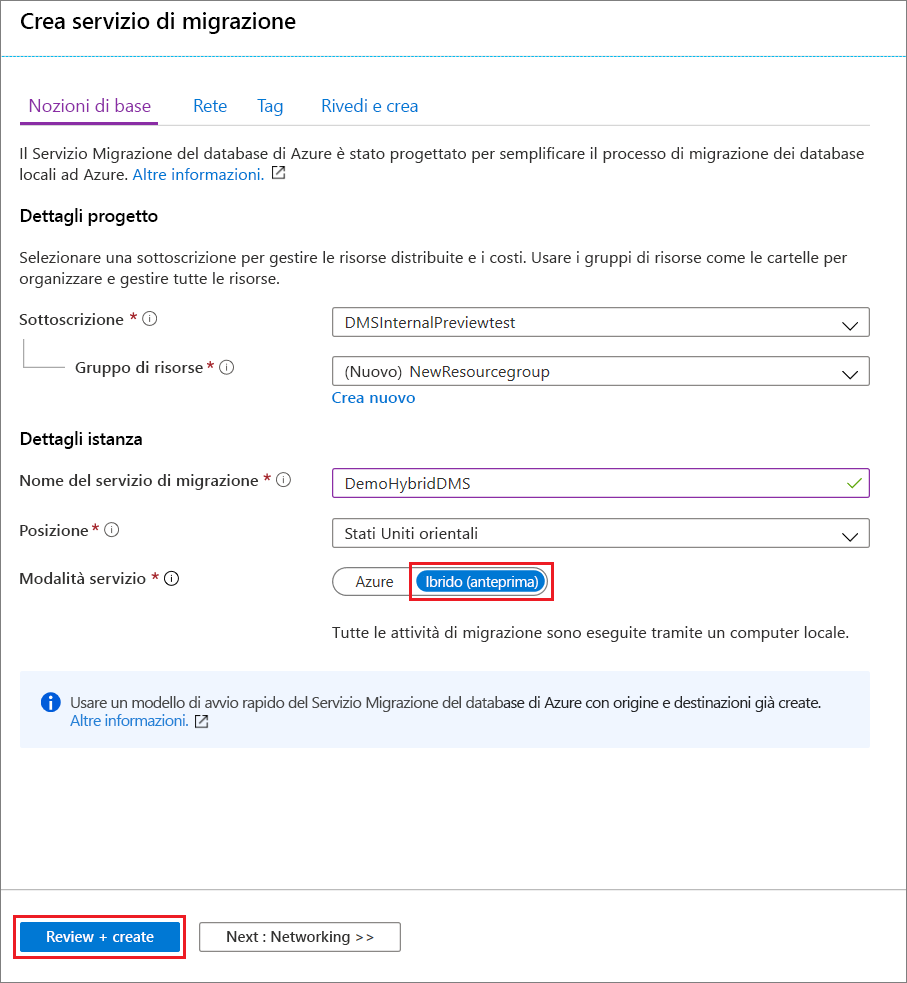

4. Selezionare **Rivedi e crea**.

5. Nella scheda **Rivedi e crea** rivedere le condizioni, verificare le altre informazioni specificate e quindi selezionare **Crea**.

    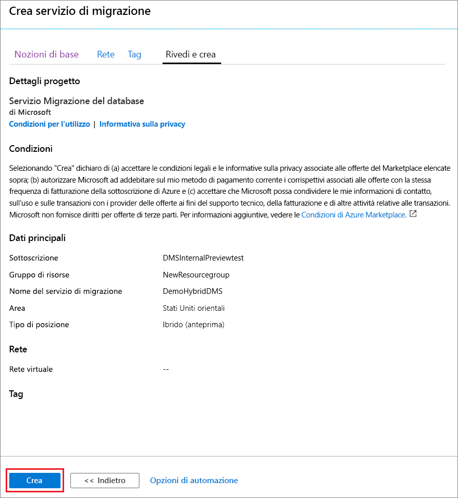

    Dopo qualche istante, viene creata l'istanza del Servizio Migrazione del database di Azure in modalità ibrida che può essere quindi configurata. L'istanza del Servizio Migrazione del database di Azure viene visualizzata come illustrato nell'immagine seguente:

    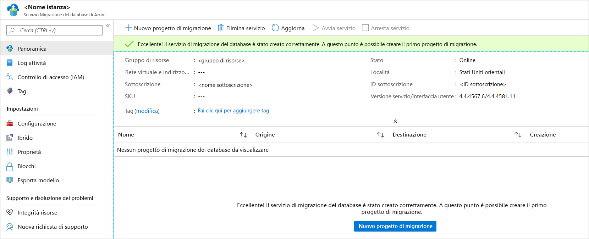

6. Dopo aver creato il servizio, selezionare **Proprietà**, quindi copiare il valore visualizzato nella casella **ID risorsa** che verrà usato per installare il ruolo di lavoro ibrido del Servizio Migrazione del database di Azure.

    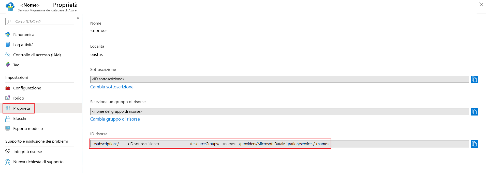

## <a name="create-azure-app-registration-id"></a>Creare l'ID registrazione dell'app Azure

È necessario creare un ID registrazione dell'app Azure che il ruolo di lavoro ibrido locale può usare per comunicare con il Servizio Migrazione del database di Azure nel cloud.

1. Nel portale di Azure selezionare **Azure Active Directory**, selezionare **Registrazioni app** e quindi **Nuova registrazione**.
2. Specificare un nome per l'applicazione e quindi in **Tipi di account supportati** selezionare il tipo di account da supportare per specificare gli utenti che possono usare l'applicazione.

    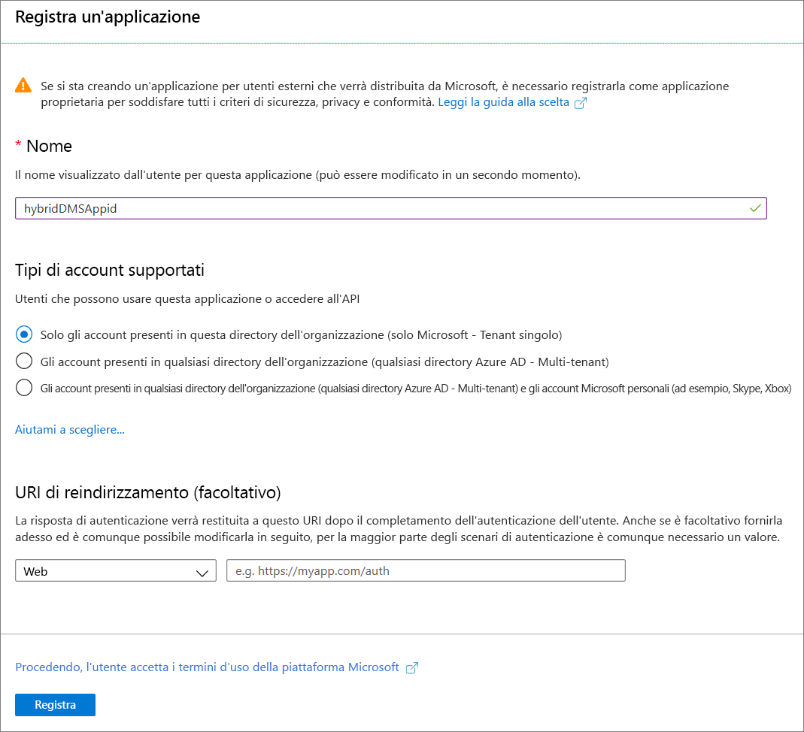

3. Usare i valori predefiniti per i campi **URI di reindirizzamento (facoltativo)** e quindi selezionare **Registra**.

4. Al termine della registrazione dell'ID app, prendere nota dell'**ID client applicazione** che verrà usato durante l'installazione del ruolo di lavoro ibrido.

5. Nel portale di Azure passare al Servizio Migrazione del database di Azure, selezionare **Controllo di accesso (IAM)** e quindi selezionare **Aggiungi un'assegnazione di ruolo** per assegnare l'accesso collaboratore all'ID app.

    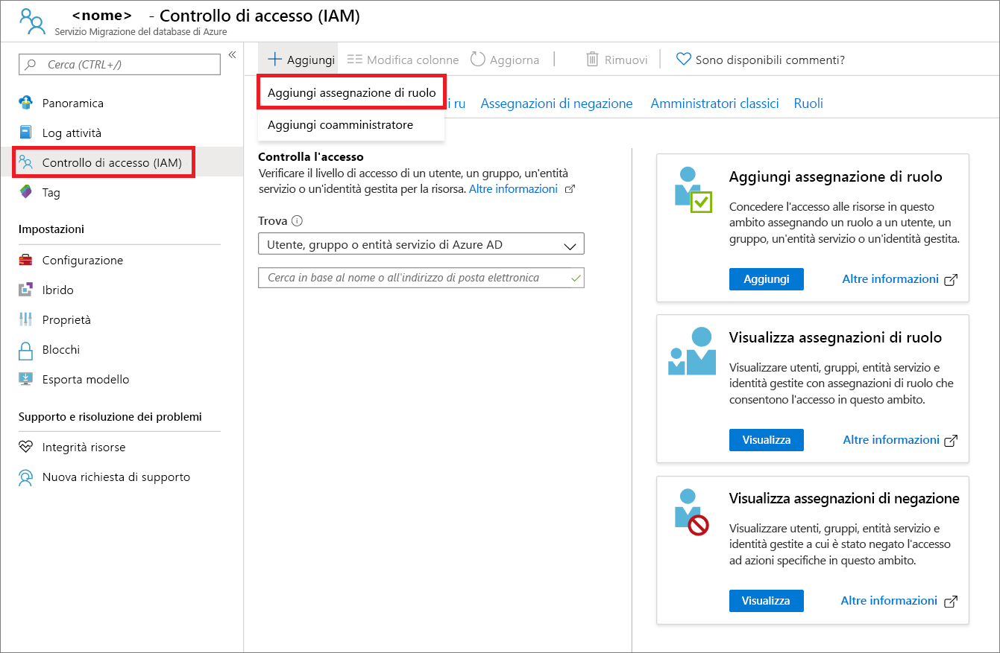

6. Selezionare **Collaboratore** come ruolo, assegnare l'accesso all'**utente di Azure AD o all'entità servizio**, quindi selezionare il nome dell'ID app.

    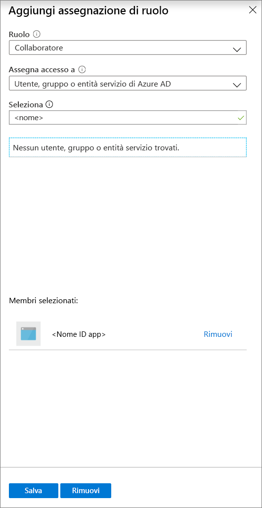

7. Selezionare **Salva** per salvare l'assegnazione di ruolo per l'ID app nella risorsa del Servizio Migrazione del database di Azure.

## <a name="download-and-install-the-hybrid-worker"></a>Scaricare e installare il ruolo di lavoro ibrido

1. Nel portale di Azure passare all'istanza del Servizio Migrazione del database di Azure.

2. In **Impostazioni** selezionare **Ibrido** e quindi selezionare il **download del programma di installazione** per scaricare il ruolo di lavoro ibrido.

    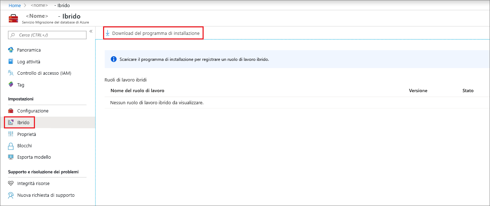

3. Estrarre il file ZIP nel server che ospiterà il ruolo di lavoro ibrido del Servizio Migrazione del database di Azure.

    > [!IMPORTANT]
    > Il programma di installazione ibrido del Servizio Migrazione del database di Azure richiede .NET 4.7.2 o versione successiva. Per trovare le versioni più recenti di .NET, vedere la pagina di [download di .NET Framework](https://dotnet.microsoft.com/download/dotnet-framework).

4. Nella cartella di installazione individuare e aprire il file **dmsSettings.json**, specificare **ApplicationId** e **resourceId** e quindi salvare il file.

    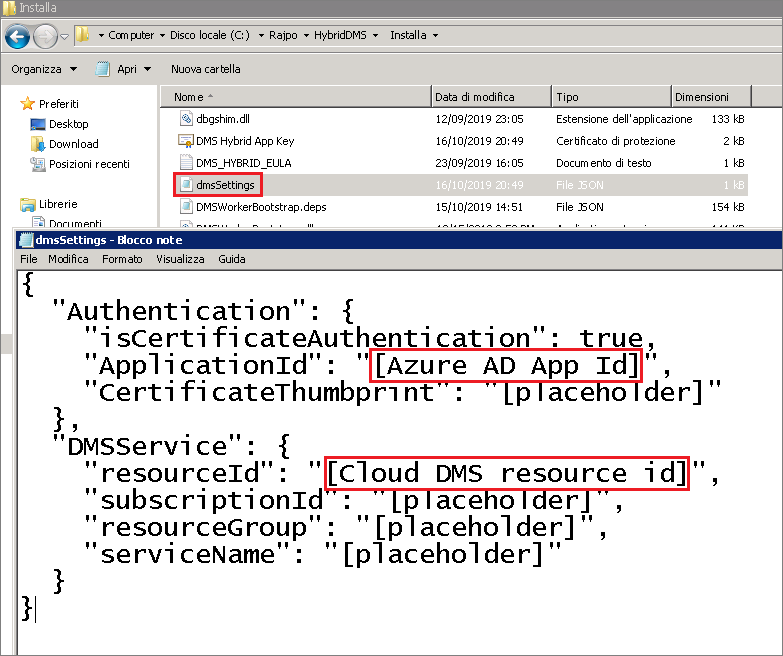
 
5. Generare un certificato che il Servizio Migrazione del database di Azure può usare per autenticare la comunicazione del ruolo di lavoro ibrido usando il comando seguente.

    ```
    <drive>:\<folder>\Install>DMSWorkerBootstrap.exe -a GenerateCert
    ```

    Viene generato un certificato nella cartella di installazione.

    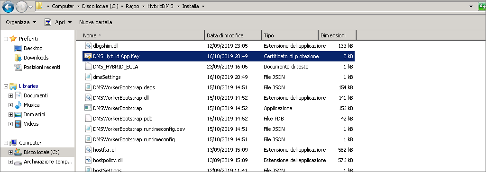

6. Nel portale di Azure passare all'ID app in **Gestisci**, selezionare **Certificati e segreti** e quindi selezionare **Carica certificato** per selezionare il certificato pubblico generato.

    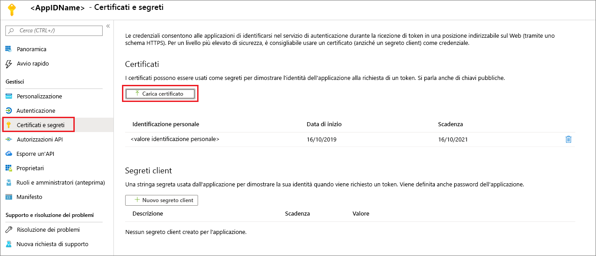

7. Installare il ruolo di lavoro ibrido del Servizio Migrazione del database di Azure nel server locale eseguendo il comando seguente:

    ```
    <drive>:\<folder>\Install>DMSWorkerBootstrap.exe -a Install -IAcceptDMSLicenseTerms
    ```

8. Se il programma di installazione viene eseguito senza errori, il servizio visualizzerà uno stato online nel Servizio Migrazione del database di Azure e si sarà pronti per eseguire la migrazione dei database.

    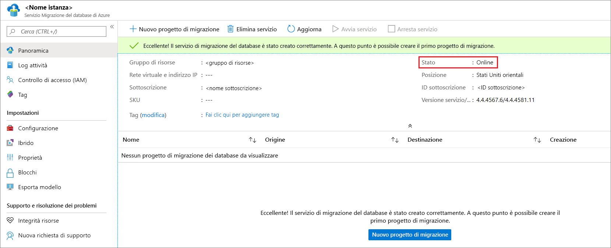

## <a name="uninstall-azure-database-migration-service-hybrid-mode"></a>Disinstallare la modalità ibrida del Servizio Migrazione del database di Azure

Attualmente la disinstallazione della modalità ibrida del Servizio Migrazione del database di Azure è supportata solo tramite il programma di installazione del ruolo di lavoro ibrido del Servizio Migrazione del database di Azure nel server locale usando il comando seguente:

```
<drive>:\<folder>\Install>DMSWorkerBootstrap.exe -a uninstall
```

## <a name="next-steps"></a>Passaggi successivi

> [!div class="nextstepaction"]
> [Eseguire la migrazione online di SQL Server a un'istanza gestita di database SQL di Azure](tutorial-sql-server-managed-instance-online.md)
> [Eseguire la migrazione offline di SQL Server a un database singolo o in pool in Database SQL di Azure](tutorial-sql-server-to-azure-sql.md)
