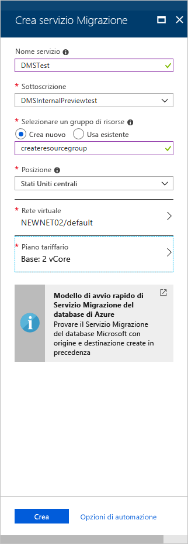

# Guida introduttiva: Creare un'istanza del Servizio Migrazione del database di Azure usando il portale di Azure

In questa guida di avvio rapido viene usato il portale di Azure per creare un'istanza del Servizio Migrazione del database di Azure.  Dopo aver creato il servizio, è possibile usarlo per eseguire la migrazione dei dati da SQL Server locale a un database SQL di Azure.

Se non si ha una sottoscrizione di Azure, creare un account [gratuito](https://azure.microsoft.com/free/) prima di iniziare.

## Accedere al portale di Azure

Nel Web browser passare al [portale di Microsoft Azure](https://portal.azure.com/) e quindi immettere le credenziali per accedere al portale.

La visualizzazione predefinita è il dashboard del servizio.

## Registrare il provider di risorse

Prima di creare la prima istanza del servizio Migrazione del database, registrare il provider di risorse Microsoft.DataMigration.

1. Nel portale di Azure selezionare **Tutti i servizi** e quindi **Sottoscrizioni**.

2. Selezionare la sottoscrizione in cui si vuole creare l'istanza del Servizio Migrazione del database di Azure e quindi selezionare **Provider di risorse**.

3. Ricercare la migrazione e quindi a destra del **Microsoft.DataMigration** selezionare **Registro**.

    

## Creare un'istanza del servizio

1. Selezionare **+ Create a resource** (+ Crea una risorsa) per creare un'istanza del Servizio Migrazione del database di Azure.

2. Cercare "migrazione" nel marketplace, selezionare **Servizio Migrazione del database di Azure** e quindi nella schermata **Servizio Migrazione del database di Azure** selezionare **Crea**.

3. Nella schermata **Crea servizio Migrazione**:

    - Per **Nome servizio** scegliere un nome facile da ricordare e univoco per identificare l'istanza del Servizio Migrazione del database di Azure.
    - Selezionare la **sottoscrizione** di Azure in cui creare l'istanza.
    - Selezionare un gruppo esistente in **Gruppo di risorse** oppure creare un nuovo gruppo.
    - Scegliere la **Posizione** più vicina al server di origine o di destinazione.
    - Selezionare una **Rete virtuale** (VNET) esistente oppure crearne una nuova.

        La rete virtuale consente al Servizio Migrazione del database di Azure di accedere al database di origine e all'ambiente di destinazione.

        Per altre informazioni su come creare una rete virtuale nel portale di Azure, vedere l'articolo [Creare una rete virtuale con il portale di Azure](https://aka.ms/vnet).

    - Selezionare Basic: 1 vCore come **piano tariffario**.

        

4. Selezionare **Create** (Crea).

    Dopo qualche istante, viene creata l'istanza del Servizio Migrazione del database di Azure che può essere quindi usata. Il Servizio Migrazione del database di Azure viene visualizzato come illustrato nell'immagine seguente:

    

## Pulire le risorse

È possibile pulire le risorse create in questa guida introduttiva eliminando il [gruppo di risorse di Azure](../azure-resource-manager/resource-group-overview.md). Per eliminare il gruppo di risorse, passare all'istanza del servizio Migrazione del database di Azure creata. Selezionare il nome **Gruppo di risorse** e quindi selezionare **Elimina gruppo di risorse**. Questa azione elimina tutti gli asset nel gruppo di risorse, nonché il gruppo stesso.

## Passaggi successivi

> [!div class="nextstepaction"]
> [Eseguire la migrazione di SQL Server locale nel database SQL di Azure](tutorial-sql-server-to-azure-sql.md)