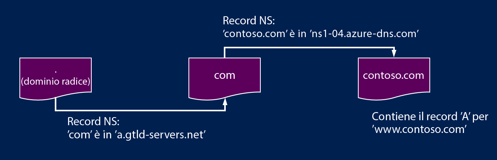

# Delega di zone DNS con DNS di Azure

DNS di Azure consente di ospitare una zona DNS e gestire i record DNS per un dominio in Azure. Per consentire l'esecuzione di query DNS in modo che un dominio raggiunga DNS di Azure, il dominio deve essere delegato a DNS di Azure dal dominio padre. Tenere presente che DNS di Azure non è il registrar. Questo articolo illustra il funzionamento della delega di dominio e come delegare domini a DNS di Azure.

## Funzionamento della delega DNS

### Domini e zone

Domain Name System è una gerarchia di domini. La gerarchia inizia dal dominio "radice", il cui nome è semplicemente "**.**",  seguito dai domini di primo livello, come "com", "net", "org", "uk" o "jp",  e quindi dai domini di secondo livello, come "org.uk" o "co.jp"  e così via. I domini nella gerarchia DNS sono ospitati usando zone DNS separate. Queste zone vengono distribuite a livello globale, ospitate dai server dei nomi DNS in tutto il mondo.

**Zona DNS**: un dominio è un nome univoco nel Domain Name System, ad esempio "contoso.com". Una zona DNS viene usata per ospitare i record DNS per un particolare dominio. Il dominio "contoso.com", ad esempio, può contenere diversi record DNS, come "mail.contoso.com" (per un server di posta) e "www.contoso.com" (per un sito Web).

**Registrar**: un registrar è una società che può fornire nomi di dominio Internet. e verificare se il dominio Internet richiesto è disponibile, consentendo all'utente di acquistarlo. Dopo che il nome di dominio è stato registrato, si diventa il legittimo proprietario del nome di dominio. Se si ha già un dominio Internet, si userà il registrar corrente per delegare al NS di Azure.

Per altre informazioni sul proprietario di un determinato nome di dominio o su come acquistare un dominio, vedere [Gestione dei domini Internet in Azure AD](https://msdn.microsoft.com/library/azure/hh969248.aspx).

### Risoluzione e delega

Esistono due tipi di server DNS:

* Un server DNS *autorevole* ospita le zone DNS e risponde alle query DNS solo per i record presenti in tali zone.
* Un server DNS *ricorsivo* non ospita zone DNS, ma risponde a tutte le query DNS, chiamando i server DNS autorevoli per raccogliere tutti i dati necessari.

Il servizio DNS di Azure fornisce un servizio DNS autorevole.  Non fornisce un servizio DNS ricorsivo. I servizi cloud e le macchine virtuali in Azure vengono configurati automaticamente per l'uso di un servizio DNS ricorsivo fornito separatamente come parte dell'infrastruttura di Azure. Per informazioni su come modificare queste impostazioni DNS, vedere [Risoluzione dei nomi usando il server DNS](../virtual-network/virtual-networks-name-resolution-for-vms-and-role-instances.md#name-resolution-using-your-own-dns-server).

I client DNS nei computer o dispositivi mobili in genere chiamano un server DNS ricorsivo per eseguire tutte le query DNS necessarie per le applicazioni client.

Quando un server DNS ricorsivo riceve una query per un record DNS, ad esempio "www.contoso.com", deve prima trovare il server dei nomi che ospita la zona per il dominio "contoso.com". Per trovare il server di nomi, inizia dal server dei nomi radice e da lì rileva il server dei nomi che ospita la zona "com". Esegue quindi la query sui server dei nomi "com" per trovare i server dei nomi che ospitano la zona "contoso.com".  Sarà infine possibile eseguire la query su questi server dei nomi per "www.contoso.com".

Questa procedura è definita risoluzione del nome DNS. In modo più specifico, la risoluzione DNS include passaggi aggiuntivi, ad esempio seguire i CNAME, ma questo aspetto non è importante per comprendere il funzionamento della delega DNS.

In che modo una zona padre "punta" ai server dei nomi per una zona figlio? Usando un tipo speciale di record DNS, denominato record NS (Name Server, server dei nomi). Ad esempio, la zona radice contiene record NS per "com" e mostra i server dei nomi per la zona "com". A sua volta, la zona "com" contiene record NS per "contoso.com" che mostra i server dei nomi per la zona "contoso.com". La configurazione di record NS per una zona figlio in una zona padre è definita delega del dominio.

La figura seguente mostra una query DNS di esempio: I valori contoso.net e partners.contoso.net indicano zone DNS di Azure.

1. Il client richiede `www.partners.contoso.net` dal proprio server DNS locale.
1. Il server DNS locale non ha il record, quindi invia una richiesta al rispettivo server dei nomi radice.
1. Il server dei nomi radice non ha il record, ma conosce l'indirizzo del server dei nomi `.net` e fornisce tale indirizzo al server DNS.
1. Il server DNS invia la richiesta al server dei nomi `.net`. Non ha il record ma conosce l'indirizzo del server dei nomi contoso.net. In questo caso si tratta di una zona DNS ospitata in DNS di Azure.
1. La zona `contoso.net` non ha il record ma conosce il server dei nomi per `partners.contoso.net` e invia tale risposta. In questo caso si tratta di una zona DNS ospitata in DNS di Azure.
1. Il server DNS richiede l'indirizzo IP di `partners.contoso.net` dalla zona `partners.contoso.net`. Contiene il record A e risponde con l'indirizzo IP.
1. Il server DNS fornisce l'indirizzo IP al client.
1. Il client si connette al sito Web `www.partners.contoso.net`.

Ogni delega include effettivamente due copie dei record NS, una nella zona padre, che punta al figlio, e un'altra nella stessa zona figlio. La zona "contoso.net" contiene i record NS per "contoso.net" (oltre ai record NS contenuti in "net"). Questi record sono denominati record NS autorevoli e si trovano al vertice della zona figlio.

## Passaggi successivi

Informazioni su come [delegare il dominio al servizio DNS di Azure](dns-delegate-domain-azure-dns.md).

