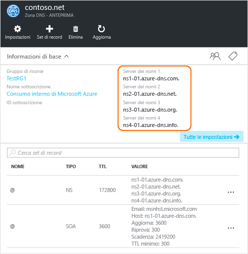

<properties
   pageTitle="Delegare il dominio a DNS di Azure | Microsoft Azure"
   description="Informazioni su come modificare la delega di dominio e usare server dei nomi DNS di Azure per fornire hosting di dominio."
   services="dns"
   documentationCenter="na"
   authors="cherylmc"
   manager="carmonm"
   editor=""/>

<tags
   ms.service="dns"
   ms.devlang="na"
   ms.topic="get-started-article"
   ms.tgt_pltfrm="na"
   ms.workload="infrastructure-services"
   ms.date="06/30/2016"
   ms.author="cherylmc"/>

# Delegare un dominio al servizio DNS di Azure

DNS di Azure consente di ospitare una zona DNS e gestire i record DNS per un dominio in Azure. Per consentire l'esecuzione di query DNS in modo che un dominio raggiunga DNS di Azure, il dominio deve essere delegato a DNS di Azure dal dominio padre. Tenere presente che DNS di Azure non è il registrar. Questo articolo illustra il funzionamento della delega di dominio e come delegare domini a DNS di Azure.

## Funzionamento della delega DNS

### Domini e zone

Domain Name System è una gerarchia di domini. La gerarchia inizia dal dominio "radice", denominato semplicemente "**.**", seguito dai domini di primo livello, come "com", "net", "org", "uk" o "jp", e quindi dai domini di secondo livello, come "org.uk" o "co.jp" e così via. I domini nella gerarchia DNS sono ospitati usando zone DNS separate. Queste zone vengono distribuite a livello globale, ospitate dai server dei nomi DNS in tutto il mondo.

**Zona DNS**

Un dominio è un nome univoco nel Domain Name System, ad esempio "contoso.com". Una zona DNS viene usata per ospitare i record DNS per un particolare dominio. Ad esempio, il dominio "contoso.com" può contenere una serie di record DNS, come "mail.contoso.com" (per un server di posta elettronica) e "www.contoso.com" (per un sito Web).

**Registrar**

Un registrar è una società che può fornire nomi di dominio Internet e verificare se il dominio Internet richiesto è disponibile, consentendo all'utente di acquistarlo. Una volta registrato il nome di dominio, si sarà il legittimo proprietario del nome di dominio. Se si ha già un dominio Internet, si userà il registrar corrente per delegare al NS di Azure.

>[AZURE.NOTE] Per altre informazioni sul proprietario di un determinato nome di dominio o su come acquistare un dominio, vedere [Gestione dei domini Internet in Azure AD](https://msdn.microsoft.com/library/azure/hh969248.aspx).

### Risoluzione e delega

Esistono due tipi di server DNS:

- Un server DNS _autorevole_ ospita le zone DNS e risponde alle query DNS solo per i record presenti in tali zone.
- Un server DNS _ricorsivo_ non ospita zone DNS, ma risponde a tutte le query DNS, chiamando i server DNS autorevoli per raccogliere tutti i dati necessari.

>[AZURE.NOTE] Il servizio DNS di Azure fornisce un servizio DNS autorevole. Non fornisce un servizio DNS ricorsivo.

> I servizi cloud e le macchine virtuali in Azure vengono configurati automaticamente per l'uso di un servizio DNS ricorsivo fornito separatamente come parte dell'infrastruttura di Azure. Per informazioni su come modificare queste impostazioni DNS, vedere [Risoluzione dei nomi usando il server DNS](../virtual-network/virtual-networks-name-resolution-for-vms-and-role-instances.md#name-resolution-using-your-own-dns-server).

I client DNS nei computer o dispositivi mobili in genere chiamano un server DNS ricorsivo per eseguire tutte le query DNS necessarie per le applicazioni client.

Quando un server DNS ricorsivo riceve una query per un record DNS, ad esempio "www.contoso.com", deve prima trovare il server dei nomi che ospita la zona per il dominio "contoso.com". A tale scopo, inizia dal server dei nomi radice e da lì rileva il server dei nomi che ospita la zona "com". Quindi, esegue la query sui server dei nomi "com" per trovare i server dei nomi che ospitano la zona "contoso.com". Sarà infine possibile eseguire la query su questi server dei nomi per "www.contoso.com".

Questa procedura è definita risoluzione del nome DNS. In modo più specifico, la risoluzione DNS include passaggi aggiuntivi, ad esempio seguire i CNAME, ma questo aspetto non è importante per comprendere il funzionamento della delega DNS.

In che modo una zona padre "punta" ai server dei nomi per una zona figlio? Usando un tipo speciale di record DNS, denominato record NS (Name Server, server dei nomi). Ad esempio, la zona radice contiene record NS per "com" e mostra i server dei nomi per la zona "com". A sua volta, la zona "com" contiene record NS per "contoso.com" che mostra i server dei nomi per la zona "'contoso.com". La configurazione di record NS per una zona figlio in una zona padre è definita delega del dominio.





Ogni delega include effettivamente due copie dei record NS, una nella zona padre, che punta al figlio, e un'altra nella stessa zona figlio. la zona "contoso.com" contiene i record NS per "contoso.com" (oltre ai record NS contenuti in "com"). Questi sono denominati record NS autorevoli e si trovano al vertice della zona figlio.

## Delegare un dominio a DNS di Azure

Dopo aver creato la zona DNS nel servizio DNS di Azure, è necessario configurare i record NS nella zona padre per rendere DNS di Azure l'origine autorevole per la risoluzione dei nomi per la propria zona. Per i domini acquistati da un registrar, il registrar offre la possibilità di configurare questi record NS.

>[AZURE.NOTE] Non è necessario essere proprietari di un dominio per creare una zona DNS con tale nome di dominio in DNS di Azure, tuttavia è necessario esserlo per configurare la delega in DNS di Azure con il registrar.

Si supponga, ad esempio, di acquistare il dominio "contoso.com" e di creare una zona con il nome "contoso.com" nel servizio DNS di Azure. In qualità di proprietario del dominio, il registrar offrirà l'opzione di configurare gli indirizzi del server dei nomi (cioè i record NS) per il dominio. Il registrar archivierà questi record NS nel dominio padre, in questo caso ".com". I clienti di tutto il mondo verranno quindi reindirizzato al dominio nella zona DNS di Azure quando provano a risolvere i record DNS in "contoso.com".

### Ricerca dei nomi dei server dei nomi

Prima di poter delegare la zona DNS a DNS Azure è necessario conoscere i nomi dei server dei nomi per la zona. DNS Azure alloca i server dei nomi da un pool ogni volta che viene creata una zona.

Il modo più semplice per visualizzare i server dei nomi assegnati alla zona è con il portale di Azure. In questo esempio, alla zona "contoso.net" sono stati assegnati i server dei nomi 'ns1-01.azure-dns.com', 'ns2-01.azure-dns.net', 'ns3-01.azure-dns.org' e 'ns4-01.azure-dns.info'.

 



DNS Azure crea automaticamente i record NS autorevoli nella zona con i server dei nomi assegnati. Per visualizzare i nomi dei server dei nomi con Azure PowerShell o l'interfaccia della riga di comando di Azure è sufficiente recuperare questi record.

Con Azure PowerShell i record NS autorevoli possono essere recuperati come indicato di seguito. Si noti che il nome del record "@" viene usato per fare riferimento ai record al vertice della zona.

	PS> $zone = Get-AzureRmDnsZone –Name contoso.net –ResourceGroupName MyResourceGroup
	PS> Get-AzureRmDnsRecordSet –Name “@” –RecordType NS –Zone $zone

	Name              : @
	ZoneName          : contoso.net
	ResourceGroupName : MyResourceGroup
	Ttl               : 3600
	Etag              : 5fe92e48-cc76-4912-a78c-7652d362ca18
	RecordType        : NS
	Records           : {ns1-01.azure-dns.com, ns2-01.azure-dns.net, ns3-01.azure-dns.org,
                        ns4-01.azure-dns.info}
	Tags              : {}

È anche possibile usare l'interfaccia della riga di comando multipiattaforma di Azure per recuperare i record NS autorevoli e quindi trovare i server dei nomi assegnati alla zona:

	C:\> azure network dns record-set show MyResourceGroup contoso.net @ NS
	info:    Executing command network dns record-set show
		+ Looking up the DNS Record Set "@" of type "NS"
	data:    Id                              : /subscriptions/.../resourceGroups/MyResourceGroup/providers/Microsoft.Network/dnszones/contoso.net/NS/@
	data:    Name                            : @
	data:    Type                            : Microsoft.Network/dnszones/NS
	data:    Location                        : global
	data:    TTL                             : 172800
	data:    NS records
	data:        Name server domain name     : ns1-01.azure-dns.com.
	data:        Name server domain name     : ns2-01.azure-dns.net.
	data:        Name server domain name     : ns3-01.azure-dns.org.
	data:        Name server domain name     : ns4-01.azure-dns.info.
	data:
	info:    network dns record-set show command OK

### Per configurare la delega

Ogni registrar prevede i propri strumenti di gestione DNS per modificare i record del server dei nomi per un dominio. Nella pagina di gestione DNS del registrar, modificare i record NS e sostituirli con quelli creati da DNS di Azure.

Quando si delega un dominio a DNS di Azure, è necessario usare i nomi dei server dei nomi forniti da DNS di Azure. È necessario usare sempre tutti e 4 i nomi di server dei nomi, indipendentemente dal nome del dominio. La delega del dominio non richiede il nome del server dei nomi per usare lo stesso dominio di primo livello del dominio locale.

È consigliabile non usare "glue record" per puntare agli indirizzi IP del server dei nomi DNS di Azure, perché questi indirizzi IP possono cambiare in futuro. Le deleghe che usano nomi dei server dei nomi nella propria zona, definiti a volte "server dei nomi personali", non sono attualmente supportate in DNS di Azure.

### Per verificare che la risoluzione dei nomi funzioni

Dopo aver completato la delega, è possibile verificare il corretto funzionamento della risoluzione dei nomi usando uno strumento come "nslookup" per eseguire una query sul record SOA per la zona, che viene creato automaticamente anche al momento della creazione della zona.

Si noti che non è necessario specificare i server dei nomi DNS di Azure, perché il normale processo di risoluzione DNS troverà i server dei nomi automaticamente se la delega è stata configurata correttamente.

	nslookup –type=SOA contoso.com

	Server: ns1-04.azure-dns.com
	Address: 208.76.47.4

	contoso.com
	primary name server = ns1-04.azure-dns.com
	responsible mail addr = msnhst.microsoft.com
	serial = 1
	refresh = 900 (15 mins)
	retry = 300 (5 mins)
	expire = 604800 (7 days)
	default TTL = 300 (5 mins)

## Delega di sottodomini in DNS di Azure

Se si vuole configurare una zona figlio separata, è possibile delegare un sottodominio in DNS di Azure. Dopo aver configurato e delegato "contoso.com" in DNS di Azure, si supponga di voler configurare una zona figlio separata, "partners.contoso.com".

La configurazione di un sottodominio segue un processo simile a una normale delega. L'unica differenza è che nel passaggio 3 è necessario creare i record NS nella zona padre "contoso.com" in DNS di Azure, piuttosto che configurarli con un registrar.

1. Creare la zona figlio "partners.contoso.com" in DNS di Azure.
2. Cercare i record NS autorevoli nella zona figlio per ottenere i server dei nomi che ospitano la zona figlio nel sistema DNS di Azure.
3. Delegare la zona figlio configurando i record NS nella zona padre che punta alla zona figlio.

### Per delegare un sottodominio

L'esempio di PowerShell seguente dimostra il funzionamento. Gli stessi passaggi possono essere eseguiti con il portale di Azure o l'interfaccia della riga di comando multipiattaforma di Azure.

#### Passaggio 1. Creare le zone padre e figlio

Prima di tutto si creeranno le zone padre e figlio, che possono trovarsi nello stesso gruppo di risorse o in gruppi di risorse diversi.

	$parent = New-AzureRmDnsZone -Name contoso.com -ResourceGroupName RG1
	$child = New-AzureRmDnsZone -Name partners.contoso.com -ResourceGroupName RG1

#### Passaggio 2. Recuperare i record NS

Successivamente, si recupereranno i record NS autorevoli dalla zona figlio, come indicato nel seguente esempio: Contiene i server dei nomi assegnati alla zona figlio.

	$child_ns_recordset = Get-AzureRmDnsRecordSet -Zone $child -Name "@" -RecordType NS

#### Passaggio 3. Delegare la zona figlio

Creare il set di record NS corrispondente nella zona padre per completare la delega. Si noti che il nome del set di record nella zona padre corrisponde al nome della zona figlio, in questo caso "partners".

	$parent_ns_recordset = New-AzureRmDnsRecordSet -Zone $parent -Name "partners" -RecordType NS -Ttl 3600
	$parent_ns_recordset.Records = $child_ns_recordset.Records
	Set-AzureRmDnsRecordSet -RecordSet $parent_ns_recordset

### Per verificare che la risoluzione dei nomi funzioni

È possibile verificare che tutto sia configurato correttamente eseguendo la ricerca del record SOA della zona figlio.

	nslookup –type=SOA partners.contoso.com

	Server: ns1-08.azure-dns.com
	Address: 208.76.47.8

	partners.contoso.com
		primary name server = ns1-08.azure-dns.com
		responsible mail addr = msnhst.microsoft.com
		serial = 1
		refresh = 900 (15 mins)
		retry = 300 (5 mins)
		expire = 604800 (7 days)
		default TTL = 300 (5 mins)

## Passaggi successivi

[Gestire le zone DNS](dns-operations-dnszones.md)

[Gestire i record DNS](dns-operations-recordsets.md)

<!---HONumber=AcomDC_0824_2016-->