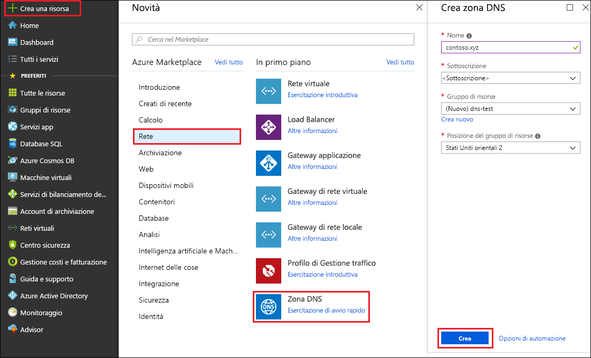
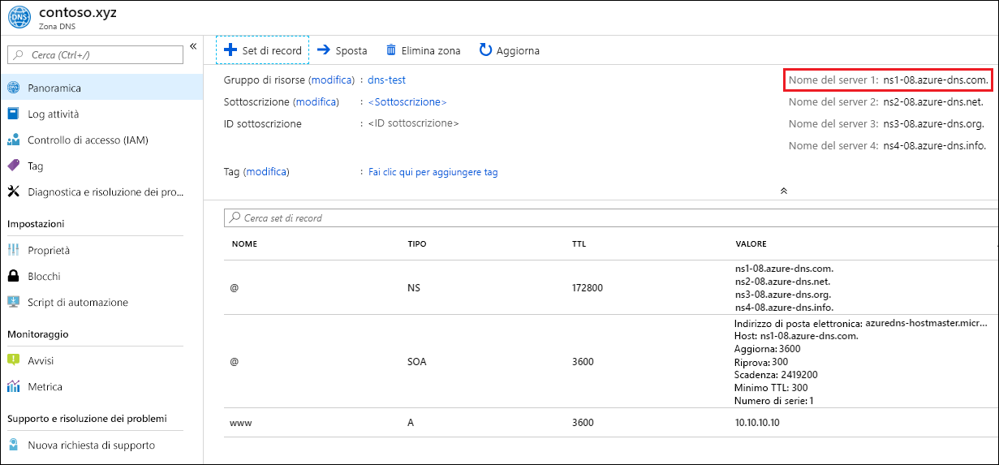

# Introduzione a DNS Azure con il portale di Azure

> [!div class="op_single_selector"]
> * [Portale di Azure](dns-getstarted-portal.md)
> * [PowerShell](dns-getstarted-powershell.md)
> * [Interfaccia della riga di comando di Azure 1.0](dns-getstarted-cli-nodejs.md)
> * [Interfaccia della riga di comando di Azure 2.0](dns-getstarted-cli.md)

Questo articolo illustra i passaggi per creare la prima zona e il primo record DNS nel portale di Azure. È possibile eseguire questi passaggi usando Azure PowerShell o nell'interfaccia della riga di comando di Azure multipiattaforma.

Una zona DNS viene usata per ospitare i record DNS per un particolare dominio. Per iniziare a ospitare il dominio in DNS di Azure, è necessario creare una zona DNS per il nome di dominio. Ogni record DNS per il dominio viene quindi creato all'interno di questa zona DNS. Per pubblicare infine la zona DNS su Internet, è necessario configurare i server dei nomi per il dominio. Ogni passaggio viene descritto di seguito.

## Creare una zona DNS

1. Accedere al portale di Azure
2. Nel menu Hub fare clic su **Nuovo > Rete >** e quindi fare clic su **Zona DNS** per aprire il pannello per creare una zona DNS.

    

4. Nel pannello **Crea zona DNS** immettere i valori seguenti, quindi fare clic su **Crea**:

   | **Impostazione** | **Valore** | **Dettagli** |
   |---|---|---|
   |**Nome**|contoso.com|Nome della zona DNS|
   |**Sottoscrizione**|[Sottoscrizione]|Selezionare una sottoscrizione in cui creare il gateway applicazione.|
   |**Gruppo di risorse**|**Crea nuovo:** contosoDNSRG|Creare un gruppo di risorse. Il nome del gruppo di risorse deve essere univoco all'interno della sottoscrizione selezionata. Per altre informazioni sui gruppi di risorse, vedere l'articolo [Panoramica di Resource Manager](../azure-resource-manager/resource-group-overview.md?toc=%2fazure%2fdns%2ftoc.json#resource-groups).|
   |**Posizione**|Stati Uniti occidentali||

> [!NOTE]
> Il gruppo di risorse indica la località del gruppo di risorse e non ha alcun impatto sulla zona DNS. La posizione della zona DNS è sempre "globale" e non viene visualizzata.

## Creare un record DNS

L'esempio seguente fornisce indicazioni dettagliate sul processo di creazione di un nuovo record 'A'. Per altri tipi di record e per modificare i record esistenti, vedere [Gestire record e set di record DNS con il portale di Azure](dns-operations-recordsets-portal.md). 

1. Dopo la creazione della zona DNS, nel riquadro **Preferiti** del portale di Azure fare clic su **Tutte le risorse**. Fare clic sulla zona DNS **contoso.com** nel pannello Tutte le risorse. Se nella sottoscrizione selezionata sono già presenti delle risorse, è possibile immettere **contoso.com** nella casella **Filtra per nome** per accedere facilmente alla zona DNS.

1. Nella parte superiore del pannello **Zona DNS** selezionare **+ Record set** (Aggiungi set di record) per aprire il pannello **Aggiungi set di record**.

1. Nel pannello **Aggiungi set di record** immettere i valori seguenti e fare clic su **OK**. In questo esempio viene creato un record A.

   |**Impostazione** | **Valore** | **Dettagli** |
   |---|---|---|
   |**Nome**|www|Nome del record|
   |**Tipo**|Una | Tipo del record DNS da creare. I valori accettabili sono A, AAAA, CNAME, MX, NS, SRV, TXT e PTR.  Per altre informazioni sui tipi di record, vedere [Panoramica delle zone e dei record DNS](dns-zones-records.md)|
   |**TTL**|1|Durata (TTL) della richiesta DNS.|
   |**Unità TTL**|Ore|Misura di tempo per il valore TTL.|
   |**Indirizzo IP**|{ipAddressValue| Questo valore indica l'indirizzo IP che viene risolto dal record DNS.|

## Visualizzare i record

Nella parte inferiore del pannello Zona DNS è possibile visualizzare i record per la zona DNS. Verranno visualizzati i record DNS e SOA predefiniti, che vengono creati in ogni zona, ed eventuali nuovi record creati.

## Aggiornare i server dei nomi

Dopo essersi assicurati che la zona e i record DNS siano stati configurati correttamente, è necessario configurare il nome di dominio in modo che usi i server dei nomi di DNS Azure. Ciò consente agli altri utenti su Internet di trovare i record DNS.

I server dei nomi per la zona sono presenti nel portale di Azure:

I server dei nomi devono essere configurati con il registrar dei nomi di dominio, in cui è stato acquistato il nome di dominio. Il registrar offre l'opzione per la configurazione dei server dei nomi per il dominio. Per altre informazioni, vedere [Delegare un dominio al servizio DNS Azure](dns-domain-delegation.md).

## Eliminare tutte le risorse

Per eliminare tutte le risorse create nell'esecuzione dell'esercizio, seguire questa procedura:

1. Nel riquadro **Preferiti** del portale di Azure fare clic su **Tutte le risorse**. Fare clic sul gruppo di risorse **MyResourceGroup** nel pannello Tutte le risorse. Se nella sottoscrizione selezionata sono già presenti delle risorse, è possibile immettere **MyResourceGroup** nella casella **Filtra per nome** per accedere facilmente al gruppo di risorse.
1. Nel pannello **MyResourceGroup** fare clic sul pulsante **Elimina**.
1. Il portale richiede di digitare il nome del gruppo di risorse per confermare che si desidera effettivamente procedere all'eliminazione. Fare clic su **Elimina**, digitare *MyResourceGroup* come nome del gruppo di risorse e quindi fare clic su **Elimina**. L'eliminazione di un gruppo di risorse determina l'eliminazione di tutte le risorse in esso contenute. È quindi consigliabile verificare sempre il contenuto di un gruppo prima di eliminarlo. Il portale elimina tutte le risorse contenute nel gruppo di risorse e quindi elimina il gruppo. Questo processo richiede alcuni minuti.

## Passaggi successivi

Per altre informazioni sul servizio DNS Azure, vedere [Panoramica di DNS Azure](dns-overview.md).

Per altre informazioni sulla gestione dei record DNS in DNS Azure, vedere [Gestire record e set di record DNS con il portale di Azure](dns-operations-recordsets-portal.md).

