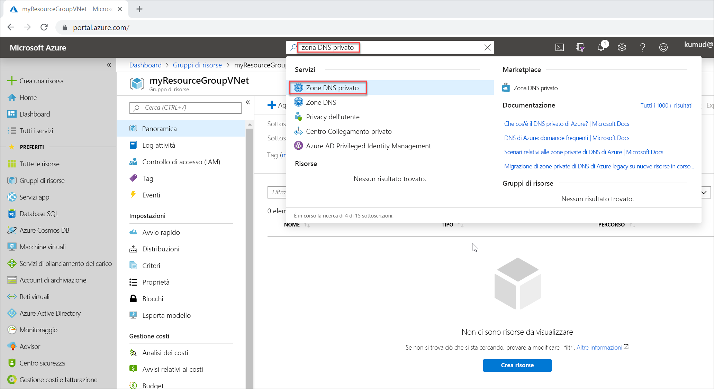

# <a name="quickstart-create-an-azure-private-dns-zone-using-the-azure-portal"></a>Guida introduttiva: Creare una zona DNS privato di Azure con il portale di Azure

Questo avvio rapido descrive i passaggi necessari per creare la prima zona DNS privato e il primo record DNS con il portale di Azure.

[!INCLUDE [private-dns-public-preview-notice](../../includes/private-dns-public-preview-notice.md)]

Una zona DNS viene usata per ospitare i record DNS per un particolare dominio. Per iniziare a ospitare il dominio in DNS di Azure, è necessario creare una zona DNS per il nome di dominio. Ogni record DNS per il dominio viene quindi creato all'interno di questa zona DNS. Per pubblicare una zona DNS privata nella rete virtuale, specificare l'elenco di reti virtuali autorizzate a risolvere i record nella zona.  Tali reti vengono definite reti virtuali *collegate*. Se è abilitata la registrazione automatica, DNS di Azure aggiorna anche i record di zona ogni volta che una macchina virtuale viene creata o eliminata o quando cambia il relativo indirizzo IP.

In questa guida introduttiva si apprende come:

> [!div class="checklist"]
> * Creare una zona DNS privato
> * Crea rete virtuale
> * Collegare la rete virtuale
> * Creare le macchine virtuali di test
> * Creare un record DNS aggiuntivo
> * Testare la zona privata

Se non si ha una sottoscrizione di Azure, creare un [account gratuito](https://azure.microsoft.com/free/?WT.mc_id=A261C142F) prima di iniziare.

Se si preferisce, è possibile completare questo avvio rapido usando [Azure PowerShell](private-dns-getstarted-powershell.md) o l'[interfaccia della riga di comando di Azure](private-dns-getstarted-cli.md).

## <a name="create-a-private-dns-zone"></a>Creare una zona DNS privato

L'esempio seguente crea una zona DNS denominata **private.contoso.com** in un gruppo di risorse denominato **MyAzureResourceGroup**.

Una zona DNS contiene le voci DNS per un dominio. Per iniziare a ospitare il dominio in DNS di Azure, creare una zona DNS per il nome di dominio.



1. Nella barra di ricerca del portale digitare **zone dns private** nella casella di testo per la ricerca e premere **INVIO**.
1. Selezionare **Zona DNS privato**.
2. Selezionare **Crea zona DNS privato**.

1. Nella pagina **Crea zona DNS privato** digitare o selezionare i valori seguenti:

   - **Gruppo di risorse**: Selezionare **Crea nuovo**, immettere *MyAzureResourceGroup* e selezionare **OK**. Il nome del gruppo di risorse deve essere univoco all'interno della sottoscrizione di Azure. 
   -  **Nome**: Digitare *private.contoso.com* per questo esempio.
1. Per **Località del gruppo di risorse** selezionare **Stati Uniti centro-occidentali**.

1. Selezionare **Rivedi e crea**.

1. Selezionare **Create** (Crea).

La creazione della zona può richiedere alcuni minuti.

## <a name="create-a-virtual-network"></a>Crea rete virtuale

1. In alto a sinistra nella pagina del portale selezionare **Crea una risorsa**, quindi **Rete** e infine **Rete virtuale**.
2. Per **Nome** digitare **myAzureVNet**.
3. Per **Gruppo di risorse** selezionare **MyAzureResourceGroup**.
4. Per **Località** selezionare **Stati Uniti centro-occidentali**.
5. Accettare gli altri valori predefiniti e selezionare **Crea**.

## <a name="link-the-virtual-network"></a>Collegare la rete virtuale

Per collegare la zona DNS privata a una rete virtuale, è necessario creare un collegamento di rete virtuale.


1. Aprire il gruppo di risorse **MyAzureResourceGroup** e selezionare la zona privata **private.contoso.com**.
2. Nel riquadro di sinistra selezionare **Collegamenti di rete virtuale**.
3. Selezionare **Aggiungi**.
4. Digitare **myLink** per **Nome collegamento**.
5. Per **Rete virtuale**, selezionare **myAzureVNet**.
6. Selezionare la casella di controllo **Abilita registrazione automatica**.
7. Selezionare **OK**.

## <a name="create-the-test-virtual-machines"></a>Creare le macchine virtuali di test

A questo punto, creare due macchine virtuali in modo da testare la zona DNS privata:

1. In altro a sinistra nella pagina del portale selezionare **Crea una risorsa** e quindi selezionare **Windows Server 2016 Datacenter**.
1. Selezionare **MyAzureResourceGroup** come gruppo di risorse.
1. Digitare **myVM01** come nome della macchina virtuale.
1. Selezionare **Stati Uniti centro-occidentali** per **Area**.
1. Digitare **azureadmin** come nome utente amministratore.
2. Digitare **Azure12345678** come password e confermarla.

5. In **Porte in ingresso pubbliche** selezionare **Consenti porte selezionate** e quindi selezionare **RDP (3389)** in **Selezionare le porte in ingresso**.
10. Accettare gli altri valori predefiniti nella pagina e quindi fare clic su **Avanti: Dischi >** .
11. Accettare i valori predefiniti nella pagina **Dischi** e quindi fare clic su **Avanti: Rete >** .
1. Assicurarsi che come rete virtuale sia selezionata **myAzureVNet**.
1. Accettare gli altri valori predefiniti nella pagina e quindi fare clic su **Avanti: Gestione >** .
2. Per **Diagnostica di avvio**, selezionare **No**, accettare gli altri valori predefiniti e quindi selezionare **Rivedi e crea**.
1. Controllare le impostazioni e quindi fare clic su **Crea**.

Ripetere questi passaggi e creare un'altra macchina virtuale denominata **myVM02**.

La creazione di entrambe le macchine virtuali richiederà pochi minuti.

## <a name="create-an-additional-dns-record"></a>Creare un record DNS aggiuntivo

 L'esempio seguente crea un record con il nome relativo **db** nella zona DNS **private.contoso.com** nel gruppo di risorse **MyAzureResourceGroup**. Il nome completo del set di record è **db.private.contoso.com**. Il tipo di record è "A", con l'indirizzo IP di **myVM01**.

1. Aprire il gruppo di risorse **MyAzureResourceGroup** e selezionare la zona privata **private.contoso.com**.
2. Selezionare **+ Set di record**.
3. Per **Nome** digitare **db**.
4. Per **Indirizzo IP** digitare l'indirizzo IP visualizzato per **myVM01**. Questo dovrebbe essere stato registrato automaticamente all'avvio della macchina virtuale.
5. Selezionare **OK**.

## <a name="test-the-private-zone"></a>Testare la zona privata

A questo punto è possibile testare la risoluzione dei nomi per la zona privata **private.contoso.com**.

### <a name="configure-vms-to-allow-inbound-icmp"></a>Configurare le macchine virtuali per consentire il traffico ICMP in entrata

È possibile usare il comando ping per testare la risoluzione dei nomi. Configurare quindi il firewall in entrambe le macchine virtuali per consentire i pacchetti ICMP in ingresso.

1. Connettersi a myVM01 e aprire una finestra di Windows PowerShell con privilegi di amministratore.
2. Eseguire il comando seguente:

   ```powershell
   New-NetFirewallRule –DisplayName “Allow ICMPv4-In” –Protocol ICMPv4
   ```

Ripetere l'operazione per myVM02.

### <a name="ping-the-vms-by-name"></a>Effettuare il ping delle macchine virtuali in base al nome

1. Dal prompt dei comandi di Windows PowerShell in myVM02, effettuare il ping di myVM01 usando il nome host registrato automaticamente:
   ```
   ping myVM01.private.contoso.com
   ```
   Verrà visualizzato un output simile al seguente:
   ```
   PS C:\> ping myvm01.private.contoso.com

   Pinging myvm01.private.contoso.com [10.2.0.4] with 32 bytes of data:
   Reply from 10.2.0.4: bytes=32 time<1ms TTL=128
   Reply from 10.2.0.4: bytes=32 time=1ms TTL=128
   Reply from 10.2.0.4: bytes=32 time<1ms TTL=128
   Reply from 10.2.0.4: bytes=32 time<1ms TTL=128

   Ping statistics for 10.2.0.4:
       Packets: Sent = 4, Received = 4, Lost = 0 (0% loss),
   Approximate round trip times in milli-seconds:
       Minimum = 0ms, Maximum = 1ms, Average = 0ms
   PS C:\>
   ```
2. Ora effettuare il ping del nome **db** creato in precedenza:
   ```
   ping db.private.contoso.com
   ```
   Verrà visualizzato un output simile al seguente:
   ```
   PS C:\> ping db.private.contoso.com

   Pinging db.private.contoso.com [10.2.0.4] with 32 bytes of data:
   Reply from 10.2.0.4: bytes=32 time<1ms TTL=128
   Reply from 10.2.0.4: bytes=32 time<1ms TTL=128
   Reply from 10.2.0.4: bytes=32 time<1ms TTL=128
   Reply from 10.2.0.4: bytes=32 time<1ms TTL=128

   Ping statistics for 10.2.0.4:
       Packets: Sent = 4, Received = 4, Lost = 0 (0% loss),
   Approximate round trip times in milli-seconds:
       Minimum = 0ms, Maximum = 0ms, Average = 0ms
   PS C:\>
   ```

## <a name="delete-all-resources"></a>Eliminare tutte le risorse

Quando non è più necessario, eliminare il gruppo di risorse **MyAzureResourceGroup** per eliminare le risorse create in questo avvio rapido.


## <a name="next-steps"></a>Passaggi successivi

> [!div class="nextstepaction"]
> [Scenari di Zone private di DNS di Azure](private-dns-scenarios.md)

