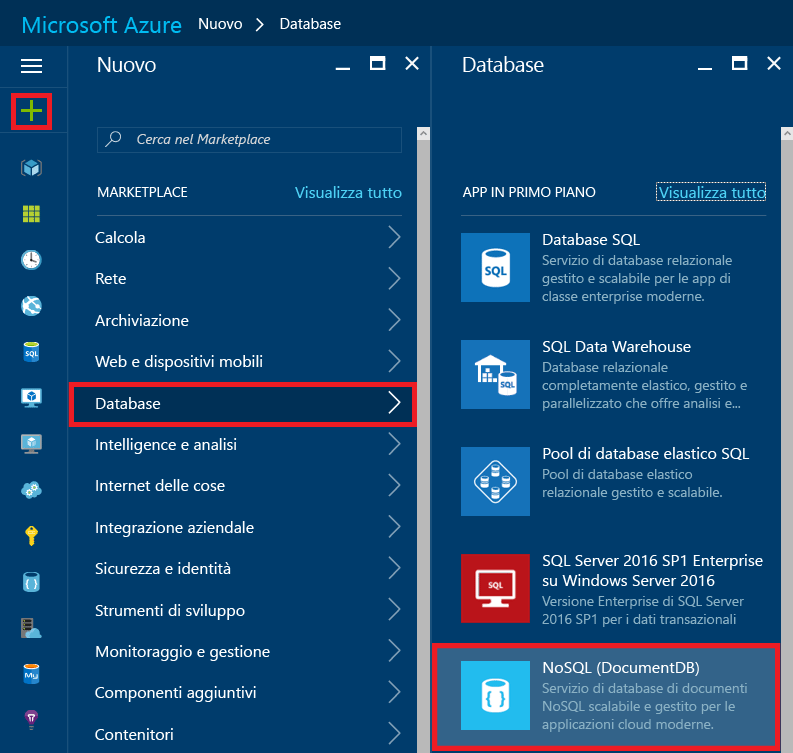
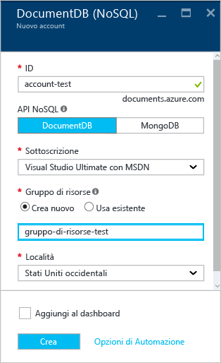
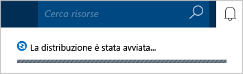
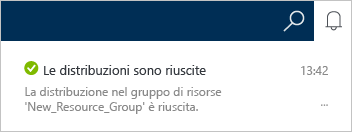
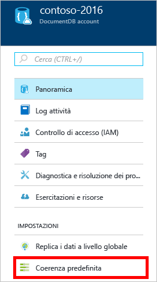
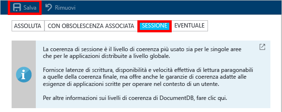

<properties
	pageTitle="Come creare un account DocumentDB | Microsoft Azure"
	description="Compilare un database NoSQL con Azure DocumentDB. Seguire queste istruzioni per creare un account DocumentDB e iniziare a compilare un database NoSQL estremamente veloce su scala mondiale." 
	keywords="Compilare un database"
	services="documentdb"
	documentationCenter=""
	authors="mimig1"
	manager="jhubbard"
	editor="monicar"/>

<tags
	ms.service="documentdb"
	ms.workload="data-services"
	ms.tgt_pltfrm="na"
	ms.devlang="na"
	ms.topic="get-started-article"
	ms.date="09/12/2016"
	ms.author="mimig"/>

# Come creare un account DocumentDB NoSQL usando il portale di Azure

> [AZURE.SELECTOR]
- [Portale di Azure](documntdb-create-account.md)
- [Interfaccia della riga di comando di Azure e Azure Resource Manager](documentdb-automation-resource-manager-cli.md)

Per compilare un database con Microsoft Azure DocumentDB, è necessario quanto segue:

- Avere un account Azure. È possibile ottenere un [account Azure gratuito](https://azure.microsoft.com/free) se non se ne ha già uno.
- Creare un account DocumentDB.

Per creare un account DocumentDB è possibile usare il portale di Azure, i modelli Azure Resource Manager o l'interfaccia della riga di comando di Azure. Questo articolo illustra come creare un account DocumentDB usando il portale di Azure. Per creare un account con Azure Resource Manager o l'interfaccia della riga di comando di Azure, vedere [Automatizzare la creazione dell'account DocumentDB con i modelli Azure Resource Manager e l'interfaccia della riga di comando di Azure](documentdb-automation-resource-manager-cli.md).

Se non si ha familiarità con DocumentDB, è possibile guardare [questo](https://azure.microsoft.com/documentation/videos/create-documentdb-on-azure/) video di quattro minuti a cura di Scott Hanselman per vedere come eseguire le attività più comuni nel portale.

1.	Accedere al [portale di Azure](https://portal.azure.com/).
2.	Nell'indice scegliere **Nuovo**, fare clic su **Dati e archiviazione** e quindi su **DocumentDB (NoSQL)**.

	

3. Nel pannello **Nuovo account** specificare la configurazione per l'account DocumentDB.

	

	- Nella casella **ID** immettere un nome identificativo per l'account DocumentDB. Quando l'**ID** viene convalidato, nella casella **ID** viene visualizzato un segno di spunta verde. Il valore **ID** diventa il nome host all'interno dell'URI. L'**ID** può contenere solo lettere minuscole, numeri e il carattere '-' e deve avere una lunghezza compresa tra 3 e 50 caratteri. Si noti che al nome dell'endpoint scelto viene aggiunto *documents.azure.com* e il risultato finale sarà l'endpoint dell'account DocumentDB.

    - Nella casella **NoSQL API** (API NoSQL) selezionare il modello di programmazione da usare:
        - **DocumentDB**: l'API DocumentDB è disponibile tramite gli [SDK](documentdb-sdk-dotnet.md) .NET, Java, Node.js, Python e JavaScript, nonché tramite [REST](https://msdn.microsoft.com/library/azure/dn781481.aspx) HTTP, e consente l'accesso a livello di codice a tutte le funzionalità di DocumentDB.
       
        - **MongoDB**: DocumentDB offre anche [supporto a livello di protocollo](documentdb-protocol-mongodb.md) per le API **MongoDB**. Quando si sceglie l'opzione API MongoDB, è possibile usare gli SDK MongoDB e gli [strumenti](documentdb-mongodb-mongochef.md) esistenti per comunicare con DocumentDB. È possibile [spostare](documentdb-import-data.md) le app MongoDB esistenti per usare DocumentDB, [senza dover apportare modifiche al codice](documentdb-connect-mongodb-account.md), e sfruttare i vantaggi di un database completamente gestito distribuito come servizio, con scalabilità illimitata, replica globale e altre funzionalità.

	- In **Sottoscrizione** selezionare la sottoscrizione di Azure da usare per l'account DocumentDB. Se l'account ha solo una sottoscrizione, viene selezionato per impostazione predefinita.

	- In **Gruppo di risorse** selezionare o creare un gruppo di risorse per l'account DocumentDB. Per impostazione predefinita, viene creato un nuovo gruppo di risorse. Per altre informazioni, vedere [Gestire le risorse di Azure mediante il portale](../articles/azure-portal/resource-group-portal.md).

	- Usare **Località** per specificare l'area geografica in cui verrà ospitato l'account DocumentDB.

4.	Dopo aver configurato le opzioni del nuovo account DocumentDB, fare clic su **Crea**. Per controllare lo stato della distribuzione, controllare l'hub Notifiche.

	

	

5.	Dopo la creazione, l'account DocumentDB è pronto all'uso con le impostazioni predefinite. La coerenza predefinita dell'account DocumentDB è impostata su **Sessione**. Per modificarla è possibile fare clic su **Coerenza predefinita** nel menu della risorsa. Per altre informazioni sui livelli di coerenza offerti da DocumentDB, vedere [Livelli di coerenza in DocumentDB](documentdb-consistency-levels.md).

    

    



[How to: Create a DocumentDB account]: #Howto
[Next steps]: #NextSteps
[documentdb-manage]: ../articles/documentdb/documentdb-manage.md

## Passaggi successivi

Ora che è disponibile un account DocumentDB, il passaggio successivo consiste nel creare un database DocumentDB.

Per creare un nuovo database è possibile usare uno dei metodi seguenti:

- Il portale di Azure, come descritto in [Come creare un database per DocumentDB usando il portale di Azure](documentdb-create-database.md).
- Le esercitazioni complete, che includono dati di esempio: [.NET](documentdb-get-started.md), [.NET MVC](documentdb-dotnet-application.md), [Java](documentdb-java-application.md), [Node.js](documentdb-nodejs-application.md) o [Python](documentdb-python-application.md).
- Il codice di esempio [.NET](documentdb-dotnet-samples.md#database-examples), [Node.js](documentdb-nodejs-samples.md#database-examples) o [Python](documentdb-python-samples.md#database-examples) disponibile in GitHub.
- Gli SDK [.NET](documentdb-sdk-dotnet.md), [Node.js](documentdb-sdk-node.md), [Java](documentdb-sdk-java.md), [Python](documentdb-sdk-python.md) e [REST](https://msdn.microsoft.com/library/azure/mt489072.aspx).

Dopo aver creato il database, è necessario [aggiungere una o più raccolte](documentdb-create-collection.md) al database e quindi [aggiungere documenti](documentdb-view-json-document-explorer.md) alle raccolte.

Quando sono presenti documenti in una raccolta, è possibile usare [DocumentDB SQL](documentdb-sql-query.md) per [eseguire query](documentdb-sql-query.md#executing-queries) sui documenti mediante [Esplora query](documentdb-query-collections-query-explorer.md) nel portale, l'[API REST](https://msdn.microsoft.com/library/azure/dn781481.aspx) o uno degli [SDK](documentdb-sdk-dotnet.md).

### Altre informazioni

Per altre informazioni su DocumentDB, vedere le risorse seguenti:

-	[Percorso di apprendimento per DocumentDB](https://azure.microsoft.com/documentation/learning-paths/documentdb/)
-	[Modello di risorse gerarchico e concetti relativi a DocumentDB](documentdb-resources.md)

<!---HONumber=AcomDC_0914_2016--->