<properties 
	pageTitle="Esercitazione su MVC ASP.NET per DocumentDB: sviluppo di un'applicazione Web | Microsoft Azure" 
	description="Esercitazione su MVC ASP.NET per creare un'applicazione Web MVC con DocumentDB. Si archivieranno documenti JSON e si accederà ai dati da un'app todo ospitata in siti Web di Azure - Esercitazione dettagliata su MVC ASP.NET." 
	keywords="esercitazione su mvc asp.net, sviluppo di applicazioni web, applicazione web mvc, esercitazione dettagliata su mvc asp net"
	services="documentdb" 
	documentationCenter=".net" 
	authors="aliuy" 
	manager="jhubbard" 
	editor="cgronlun"/>

<tags 
	ms.service="documentdb" 
	ms.workload="data-services" 
	ms.tgt_pltfrm="na" 
	ms.devlang="dotnet" 
	ms.topic="hero-article" 
	ms.date="05/18/2016" 
	ms.author="andrl"/>

#Esercitazione su MVC ASP.NET: Sviluppo di applicazioni Web con DocumentDB

> [AZURE.SELECTOR]
- [.NET](documentdb-dotnet-application.md)
- [Node.JS](documentdb-nodejs-application.md)
- [Java](documentdb-java-application.md)
- [Python](documentdb-python-application.md) 

Per illustrare come sfruttare in modo efficiente Azure DocumentDB per archiviare ed eseguire query su documenti JSON, questo articolo include una procedura dettagliata end-to-end che mostra come creare un'app todo con Azure DocumentDB. Le attività verranno memorizzate come documenti JSON in Azure DocumentDB.

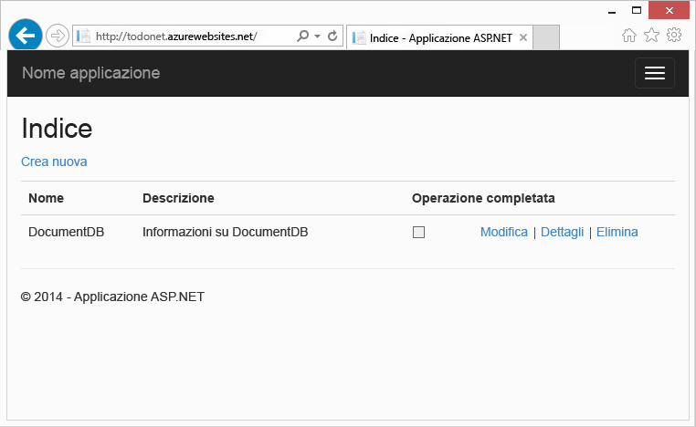

La procedura guidata mostra come usare il servizio DocumentDB fornito da Azure per archiviare i dati e accedervi da un'applicazione Web MCV ASP.NET ospitata in Azure. Se si preferisce un'esercitazione che illustra solo DocumentDB e non i componenti ASP.NET MVC, vedere [Compilare un'applicazione console C# di DocumentDB](documentdb-get-started.md).

> [AZURE.TIP] Questa esercitazione presuppone già una certa esperienza nell'uso di MCV ASP.NET e di Siti Web di Azure. Se non si ha alcuna esperienza con ASP.NET o gli [strumenti richiesti come prerequisiti](#_Toc395637760), è consigliabile scaricare il progetto di esempio completo da [GitHub][] e seguire le relative istruzioni. Una volta creata la soluzione, è possibile leggere questo articolo per approfondire il codice nel contesto del progetto.

## Prerequisiti per questa esercitazione sul database

Prima di seguire le istruzioni di questo articolo, verificare che siano disponibili gli elementi seguenti:

- Un account Azure attivo. Se non si dispone di un account, è possibile creare un account di valutazione gratuita in pochi minuti. Per informazioni dettagliate, vedere la pagina relativa alla [versione di valutazione gratuita di Azure](https://azure.microsoft.com/pricing/free-trial/).
- [Visual Studio 2013](http://www.visualstudio.com/) Update 4 o versioni successive.
- Azure SDK per .NET versione 2.5.1 o successiva, disponibile tramite [Installazione guidata piattaforma Web Microsoft][].

Tutte le schermate presenti in questo articolo sono state acquisite da Visual Studio 2013 con Update 4 applicato e Azure SDK per .NET versione 2.5.1. Se il sistema in uso è configurato con versioni diverse, è probabile che le schermate e le opzioni non siano interamente corrispondenti. Se si soddisfano i prerequisiti precedenti, la soluzione dovrebbe funzionare comunque.

## Passaggio 1: Creare un account di database di DocumentDB

Il primo passaggio consiste nella creazione di un account DocumentDB. Se si dispone già di un account, è possibile passare alla sezione [Creare una nuova applicazione MVC ASP.NET](#_Toc395637762).

[AZURE.INCLUDE [documentdb-create-dbaccount](../../includes/documentdb-create-dbaccount.md)]

[AZURE.INCLUDE [documentdb-keys](../../includes/documentdb-keys.md)]

  Verrà ora illustrata in modo dettagliato la procedura per creare un'applicazione MVC ASP.NET completamente nuova.

## Passaggio 2: Creare una nuova applicazione MVC ASP.NET

A questo punto, dopo aver creato un account, creare il nuovo progetto ASP.NET.

1. Dal menu **File** di Visual Studio scegliere **Nuovo** e quindi fare clic su **Progetto**.

   	Verrà visualizzata la finestra di dialogo **Nuovo progetto**.
2. Nel riquadro **Tipi progetto** espandere **Modelli**, **Visual C#**, **Web** e quindi selezionare **Applicazione Web ASP.NET**.

  	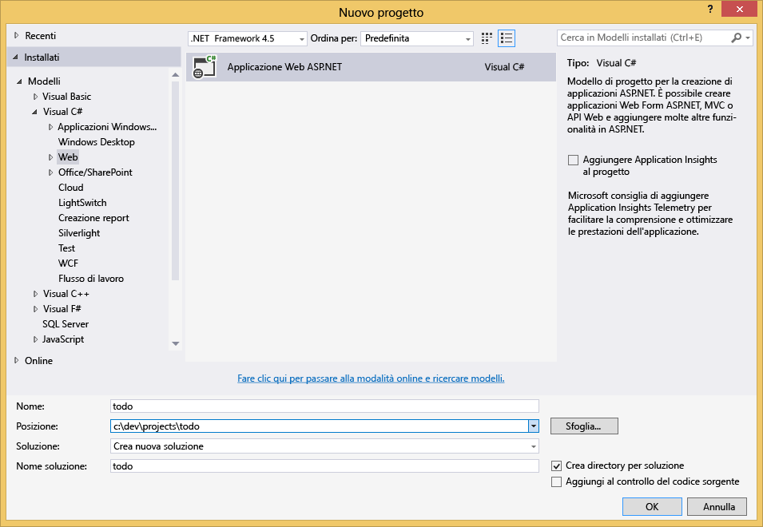

3. Nella casella **Nome** digitare il nome del progetto. Questa esercitazione usa il nome "todo". Se si sceglie di usare un valore diverso da questo, quindi ogni volta che in questa esercitazione viene descritto lo spazio dei nomi todo, è necessario modificare gli esempi di codice forniti per usare il nome assegnato all'applicazione.

4. Fare clic su **Sfoglia** per passare alla cartella in cui si vuole creare il progetto e quindi fare clic su **OK**.

  	Verrà visualizzata la finestra di dialogo **Nuovo progetto ASP.NET**.

  	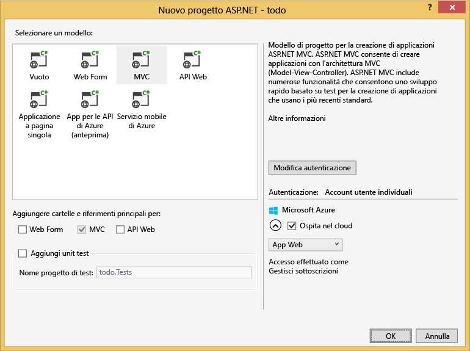

5. Nel riquadro dei modelli selezionare **MVC**.

6. Se si prevede di ospitare l'applicazione in Azure, selezionare **Ospita nel cloud** in basso a destra per impostare questo comportamento. È stato scelto di ospitare l'applicazione nel cloud e di eseguirla in un sito Web di Azure. Se si seleziona questa opzione, verrà eseguito il pre-provisioning di un sito Web di Azure, in modo da semplificare notevolmente la distribuzione dell'applicazione funzionante finale. Se si intende ospitare l'applicazione altrove o non si vuole configurare Azure in anticipo, deselezionare l'opzione **Ospita nel cloud**.

7. Fare clic su **OK** e lasciare che Visual Studio esegua le operazioni necessarie per lo scaffolding del modello MVC ASP.NET vuoto.

8. Se si è scelto di ospitare l'applicazione nel cloud, verrà visualizzata almeno un'altra schermata che richiede di accedere all'account Azure e di specificare alcuni valori per il nuovo sito Web. Specificare tutti i valori aggiuntivi e continuare.

  	Qui non è stato selezionato "Server di database" perché non si intende usare un server di database SQL di Azure, ma verrà creato un nuovo account Azure DocumentDB successivamente nel portale di Azure.

	Per altre informazioni sulla scelta di un **Piano di servizio app** e del **Gruppo di risorse**, vedere [Panoramica approfondita dei piani del servizio app di Azure](../app-service/azure-web-sites-web-hosting-plans-in-depth-overview.md).

  	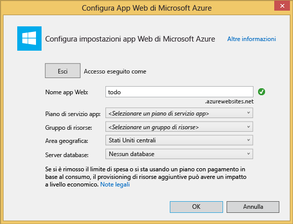

9. Al termine della creazione dell'applicazione MVC standard da parte di Visual Studio, sarà disponibile un'applicazione ASP.NET vuota eseguibile in locale.

	L'esecuzione locale del progetto verrà ignorata perché è già stata mostrata per l'applicazione ASP.NET "Hello World". Si passerà direttamente all'aggiunta di DocumentDB al progetto e alla compilazione dell'applicazione.

## Passaggio 3: Aggiungere DocumentDB al progetto di applicazione Web MVC

Ora che è disponibile la maggior parte del plumbing MVC ASP.NET necessario per questa soluzione, è possibile passare all'aggiunta di Azure DocumentDB all'applicazione Web MVC.

1. DocumentDB .NET SDK è distribuito come pacchetto NuGet. Per ottenere il pacchetto NuGet in Visual Studio, usare Gestione pacchetti NuGet in Visual Studio facendo clic con il pulsante destro del mouse sul progetto in **Esplora soluzioni** e quindi scegliendo **Gestisci pacchetti NuGet**.

  	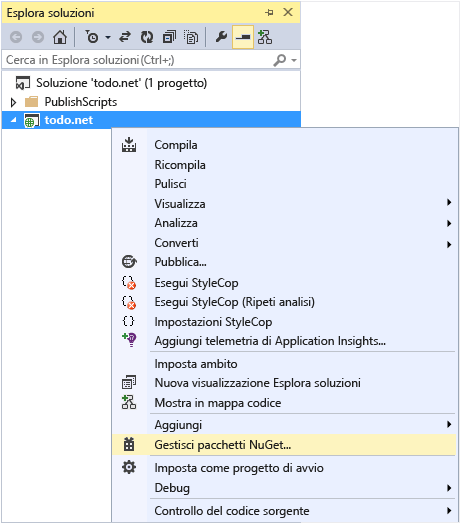

	Viene visualizzata la finestra di dialogo **Gestione pacchetti NuGet**.

2. Nella casella **Sfoglia** di NuGet digitare ***Azure DocumentDB***.
	
	Dai risultati installare il pacchetto delle **librerie client Microsoft Azure DocumentDB**. Il pacchetto DocumentDB verrà scaricato e installato, insieme a tutte le dipendenze, ad esempio Newtonsoft.Json. Fare clic su **OK** nella finestra **Anteprima** e su **Accetto** nella finestra **Accettazione della licenza** per completare l'installazione.

  	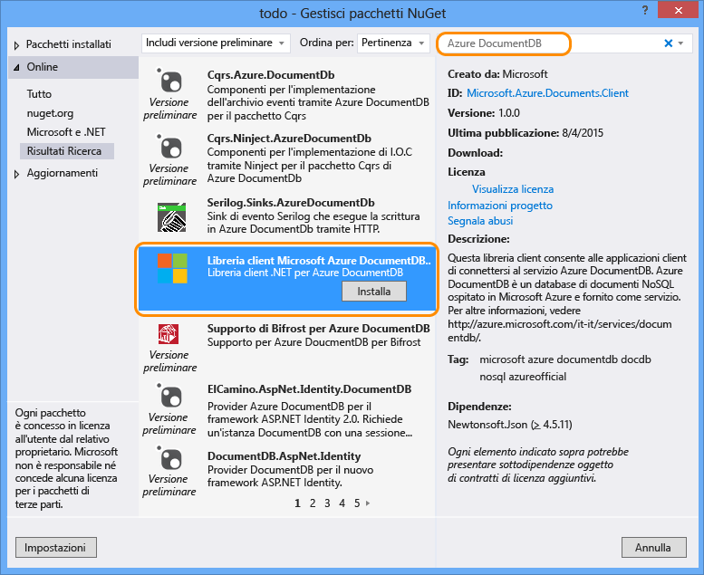

  	In alternativa, è possibile usare la console di Gestione pacchetti per installare il pacchetto. A tale scopo, dal menu **Strumenti** fare clic su **Gestione pacchetti NuGet** e quindi su **Console di Gestione pacchetti**. Al prompt dei comandi, immettere quanto segue.

		Install-Package Microsoft.Azure.DocumentDB

3. Una volta installato il pacchetto, la soluzione di Visual Studio dovrebbe assomigliare alla seguente, con due nuovi riferimenti aggiunti, Microsoft.Azure.Documents.Client e Newtonsoft.Json.

  	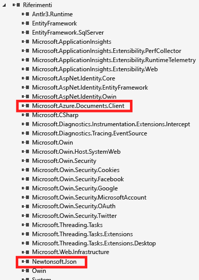

##Passaggio 4: Configurare l'applicazione MVC ASP.NET
 
Vengono ora aggiunti i modelli, le visualizzazioni e i controller all'applicazione MVC:

- [Aggiungere un modello](#_Toc395637764).
- [Aggiungere un controller](#_Toc395637765).
- [Aggiungere visualizzazioni](#_Toc395637766).

### Aggiungere un modello di dati JSON

Creare prima di tutto l'elemento che corrisponde alla lettera **M** in MVC, ovvero il modello.

1. In **Esplora soluzioni** fare clic con il pulsante destro del mouse sulla cartella **Modelli**, scegliere **Aggiungi** e quindi fare clic su **Classe**.

  	Verrà visualizzata la finestra di dialogo **Aggiungi nuovo elemento**.

2. Denominare la nuova classe **Item.cs** e fare clic su **Aggiungi**.

3. In questo nuovo file **Item.cs**, aggiungere quanto segue dopo l'ultima *istruzione using*.
		
		using Newtonsoft.Json;
	
4. A questo punto sostituire il codice
		
		public class Item
		{
		}

	con il codice seguente:

		public class Item
		{
			[JsonProperty(PropertyName = "id")]
			public string Id { get; set; }
			 
			[JsonProperty(PropertyName = "name")]
			public string Name { get; set; }

			[JsonProperty(PropertyName = "description")]
			public string Description { get; set; }

			[JsonProperty(PropertyName = "isComplete")]
			public bool Completed { get; set; }
		}

	Tutti i dati presenti in DocumentDB vengono passati in rete e archiviati come JSON. Per controllare il modo in cui gli oggetti vengono serializzati/deserializzati da JSON.NET, è possibile usare l'attributo **JsonProperty**, come mostrato nella classe **Item** appena creata. Questa operazione **non è necessaria**, ma è utile per verificare che le proprietà seguano le convenzioni di denominazione maiuscole-minuscole JSON.
	
	Non solo è possibile controllare il formato del nome della proprietà quando viene usata in JSON, ma anche rinominare completamente le proprietà .NET, come è stato fatto con la proprietà **Description**.
	

### Aggiungere un controller

Una volta creato il modello **M**, si passa alla creazione di una classe controller **C** in MVC.

1. In **Esplora soluzioni** fare clic con il pulsante destro del mouse sulla cartella **Controller**, scegliere **Aggiungi** e quindi fare clic su **Controller**.

	Verrà visualizzata la finestra di dialogo **Aggiungi scaffolding**.

2. Selezionare **Controller MVC 5 - Vuoto** e quindi fare clic su **Aggiungi**.

	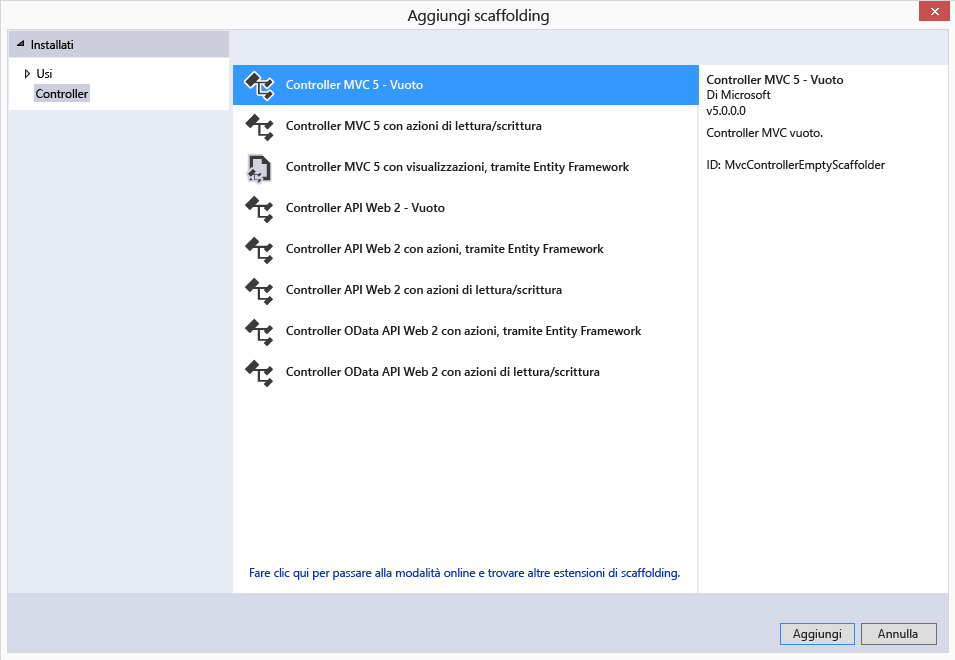

3. Assegnare al controller il nome **ItemController.**

	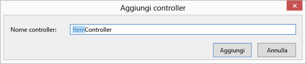

	Una volta creato il file, la soluzione di Visual Studio deve essere simile alla seguente, con il nuovo file ItemController.cs in **Esplora soluzioni**. Viene anche visualizzato il nuovo file Item.cs creato in precedenza.

	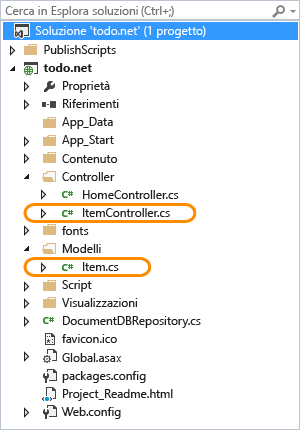

	È possibile chiudere il file ItemController.cs. Si tornerà a questo file in un secondo momento.

### Aggiungere visualizzazioni

A questo punto è necessario creare le visualizzazioni **V** in MVC:

- [Aggiungere una visualizzazione Indice elemento](#AddItemIndexView).
- [Aggiungere una visualizzazione Nuovo elemento](#AddNewIndexView).
- [Aggiungere una visualizzazione Modifica elemento](#_Toc395888515).

#### Aggiungere una visualizzazione Indice elemento

1. In **Esplora soluzioni** espandere la cartella **Visualizzazioni**, fare clic con il pulsante destro del mouse sulla cartella **Item** vuota creata prima da Visual Studio quando è stato aggiunto **ItemController**, scegliere **Aggiungi** e quindi fare clic su **Visualizzazione**.

	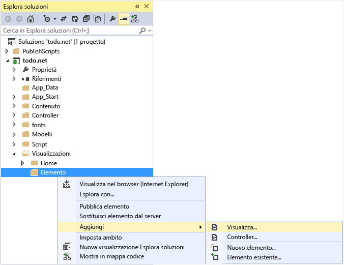

2. Nella finestra di dialogo **Aggiungi visualizzazione** eseguire le operazioni seguenti:
	- Nella casella **Nome visualizzazione** digitare ***Index***.
	- Nella casella **Modello** selezionare ***Elenco***.
	- Nella casella **Classe modello** selezionare ***Item (todo.Models)***.
	- Lasciare vuota la casella **Classe contesto dati**. 
	- Nella casella della pagina di layout digitare ***~/Views/Shared/\_Layout.cshtml***.
	
	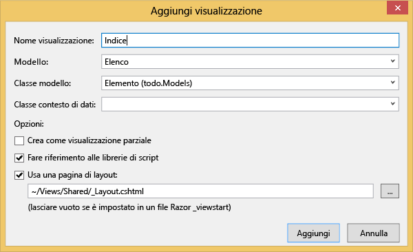

3. Una volta impostati tutti questi valori, fare clic su **Aggiungi**, in modo che venga creata una nuova visualizzazione modello in Visual Studio. Al termine, verrà aperto il file con estensione cshtml creato. È ora possibile chiudere questo file in Visual Studio, perché vi si tornerà di nuovo più avanti.

#### Aggiungere una visualizzazione Nuovo elemento

Viene ora creata una nuova visualizzazione per la creazione di nuovi oggetti **Item** in modo simile a come è stata creata una visualizzazione **Indice elemento**.

1. In **Esplora soluzioni** fare clic con il pulsante destro del mouse sulla cartella **Elemento**, scegliere **Aggiungi** e quindi fare clic su **Visualizzazione**.

2. Nella finestra di dialogo **Aggiungi visualizzazione** eseguire le operazioni seguenti:
	- Nella casella **Nome visualizzazione** digitare ***Create***.
	- Nella casella **Modello** selezionare ***Create***.
	- Nella casella **Classe modello** selezionare ***Item (todo.Models)***.
	- Lasciare vuota la casella **Classe contesto dati**.
	- Nella casella della pagina di layout digitare ***~/Views/Shared/\_Layout.cshtml***.
	- Fare clic su **Aggiungi**.

#### Aggiungere una visualizzazione Modifica elemento

È infine possibile aggiungere un'ultima visualizzazione per la modifica di un oggetto **Item**, allo stesso modo in cui sono state create le altre.

1. In **Esplora soluzioni** fare clic con il pulsante destro del mouse sulla cartella **Elemento**, scegliere **Aggiungi** e quindi fare clic su **Visualizzazione**.

2. Nella finestra di dialogo **Aggiungi visualizzazione** eseguire le operazioni seguenti:
	- Nella casella **Nome visualizzazione** digitare ***Edit***.
	- Nella casella **Modello** selezionare ***Edit***.
	- Nella casella **Classe modello** selezionare ***Item (todo.Models)***.
	- Lasciare vuota la casella **Classe contesto dati**. 
	- Nella casella della pagina di layout digitare ***~/Views/Shared/\_Layout.cshtml***.
	- Fare clic su **Aggiungi**.

Al termine, chiudere tutti i documenti con estensione cshtml in Visual Studio. Si tornerà a queste visualizzazioni in un secondo momento.

## Passaggio 5: Completamento dell'aggiunta di DocumentDB

Ora che le caratteristiche standard di MVC vengono prese in considerazione, è possibile aggiungere il codice per DocumentDB.

In questa sezione viene aggiunto il codice per gestire le operazioni seguenti:

- [Creare un elenco di elementi incompleti](#_Toc395637770).
- [Aggiungere elementi](#_Toc395637771).
- [Modificare elementi](#_Toc395637772).

### Elenco di elementi incompleti in un'applicazione Web MVC

La prima cosa da fare è aggiungere una classe che contenga tutta la logica per connettersi e usare DocumentDB. Per questa esercitazione verrà inclusa tutta questa logica in una classe di tipo archivio denominata DocumentDBRepository.

1. In **Esplora soluzioni** fare clic con il pulsante destro del mouse sul progetto, quindi scegliere **Aggiungi** e quindi fare clic su **Classe**. Assegnare alla nuova classe il nome **DocumentDBRepository** e fare clic su **Aggiungi**.
 
2. Appena creata la classe **DocumentDBRepository** e aggiungere le seguenti *istruzioni using* sopra la dichiarazione dello *spazio dei nomi*
		
		using Microsoft.Azure.Documents; 
		using Microsoft.Azure.Documents.Client; 
		using Microsoft.Azure.Documents.Linq; 
		using System.Configuration;
		using System.Linq.Expressions;
		using System.Threading.Tasks;

	A questo punto sostituire il codice

		public class DocumentDBRepository
		{
		}

	con il codice seguente:

		public static class DocumentDBRepository<T> where T : class
		{
			private static readonly string DatabaseId = ConfigurationManager.AppSettings["database"];
			private static readonly string CollectionId = ConfigurationManager.AppSettings["collection"];
			private static DocumentClient client;
	
			public static void Initialize()
			{
				client = new DocumentClient(new Uri(ConfigurationManager.AppSettings["endpoint"]), ConfigurationManager.AppSettings["authKey"]);
				CreateDatabaseIfNotExistsAsync().Wait();
				CreateCollectionIfNotExistsAsync().Wait();
			}
	
			private static async Task CreateDatabaseIfNotExistsAsync()
			{
				try
				{
					await client.ReadDatabaseAsync(UriFactory.CreateDatabaseUri(DatabaseId));
				}
				catch (DocumentClientException e)
				{
					if (e.StatusCode == System.Net.HttpStatusCode.NotFound)
					{
						await client.CreateDatabaseAsync(new Database { Id = DatabaseId });
					}
					else
					{
						throw;
					}
				}
			}
	
			private static async Task CreateCollectionIfNotExistsAsync()
			{
				try
				{
					await client.ReadDocumentCollectionAsync(UriFactory.CreateDocumentCollectionUri(DatabaseId, CollectionId));
				}
				catch (DocumentClientException e)
				{
					if (e.StatusCode == System.Net.HttpStatusCode.NotFound)
					{
						await client.CreateDocumentCollectionAsync(
							UriFactory.CreateDatabaseUri(DatabaseId),
							new DocumentCollection { Id = CollectionId },
							new RequestOptions { OfferThroughput = 1000 });
					}
					else
					{
						throw;
					}
				}
			}
		}

	> [AZURE.TIP] Quando si crea un nuovo DocumentCollection è possibile fornire un parametro RequestOptions facoltativo di OfferType, che consente di specificare il livello di prestazioni della nuova raccolta. Se questo parametro non viene passato verrà usato il tipo di offerta predefinito. Per altre informazioni sui tipi di offerta DocumentDB vedere [livelli di prestazioni DocumentDB](documentdb-performance-levels.md)

3. Poiché alcuni valori vengono letti dalla configurazione, aprire il file** Web.config** dell'applicazione e aggiungere le righe seguenti dopo la sezione `<AppSettings>`.
	
		<add key="endpoint" value="enter the URI from the Keys blade of the Azure Portal"/>
		<add key="authKey" value="enter the PRIMARY KEY, or the SECONDARY KEY, from the Keys blade of the Azure  Portal"/>
		<add key="database" value="ToDoList"/>
		<add key="collection" value="Items"/>
	
4. A questo punto, aggiornare i valori per *endpoint* e *authKey* usando il pannello Chiavi del portale di Azure. Usare il valore di **URI** dal pannello Chiavi come valore dell'impostazione dell'endpoint e usare **CHIAVE PRIMARIA** oppure **CHIAVE SECONDARIA** dal pannello Chiavi come valore dell'impostazione authKey.

	Che consente di collegare i repository DocumentDB, ora possibile aggiunta la logica dell'applicazione.

5. Un'applicazione per un elenco di azioni deve innanzitutto consentire la visualizzazione degli elementi incompleti. Copiare e incollare il seguente frammento di codice in un punto qualsiasi all'interno della classe **DocumentDBRepository**.

		public static async Task<IEnumerable<T>> GetItemsAsync(Expression<Func<T, bool>> predicate)
		{
			IDocumentQuery<T> query = client.CreateDocumentQuery<T>(
				UriFactory.CreateDocumentCollectionUri(DatabaseId, CollectionId))
				.Where(predicate)
				.AsDocumentQuery();

			List<T> results = new List<T>();
			while (query.HasMoreResults)
			{
				results.AddRange(await query.ExecuteNextAsync<T>());
			}

			return results;
		}

6. Aprire il file **ItemController** aggiunto in precedenza e aggiungere le seguenti *istruzioni using* sopra la dichiarazione dello spazio dei nomi.

		using System.Net;
		using System.Threading.Tasks;
		using todo.Models;

	Se il progetto non è denominato "todo", è quindi necessario eseguire l'aggiornamento usando "todo.Models" per inserire il nome del progetto.

	A questo punto sostituire il codice

		//GET: Item
		public ActionResult Index()
		{
			return View();
		}

	con il codice seguente:

		[ActionName("Index")]
		public async Task<ActionResult> IndexAsync()
		{
			var items = await DocumentDBRepository<Item>.GetItemsAsync(d => !d.Completed);
			return View(items);
		}
	
7. Aprire **Global.asax.cs** e aggiungere la riga seguente al metodo **Application\_Start**.
 
		DocumentDBRepository<todo.Models.Item>.Initialize();
	
A questo punto dovrebbe essere possibile compilare la soluzione senza errori.

Se si eseguisse l'applicazione a questo punto, si passerebbe a **HomeController** e alla visualizzazione **Index** di tale controller. Questo è il comportamento predefinito per il progetto di modello MVC scelto inizialmente, ma è possibile cambiarlo. Per modificare questo comportamento, è possibile cambiare il routing nell'applicazione MVC.

Aprire ***App\\_Start\\RouteConfig.cs***, trovare la riga che inizia con "defaults:" e modificarla in modo che sia analoga a quanto riportato di seguito.

		defaults: new { controller = "Item", action = "Index", id = UrlParameter.Optional }

Questo codice indica a MVC ASP.NET che, se non è stato specificato alcun valore nell'URL per controllare il comportamento di routing, sarà necessario usare **Item** invece di **Home** come controller e **Index** come visualizzazione.

A questo punto se si esegue l'applicazione, verrà eseguita una chiamata in **ItemController** che eseguirà una chiamata alla classe di tipo repository e userà il metodo GetItems per restituire tutti gli elementi incompleti alla visualizzazione **Views**\**Item**\**Index**.

Se compilato ed eseguito ora, il progetto avrà un aspetto simile al seguente.

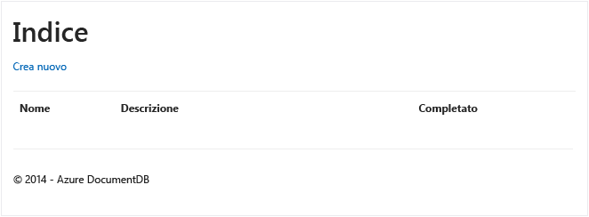

### Aggiungere elementi

Vengono ora inseriti alcuni elementi nel database, in modo che la griglia non sia più vuota.

Sarà ora effettuata l'aggiunta di codice a DocumentDBRepository e ItemController per rendere permanente il record in DocumentDB.

1.  Aggiungere il metodo seguente alla classe **DocumentDBRepository**.

		public static async Task<Document> CreateItemAsync(T item)
		{
			return await client.CreateDocumentAsync(UriFactory.CreateDocumentCollectionUri(DatabaseId, CollectionId), item);
		}

	Questo metodo accetta semplicemente un oggetto passato al metodo stesso e lo rende permanente in DocumentDB.

2. Aprire il file ItemController.cs e aggiungere il seguente frammento di codice all'interno della classe. In tal modo, ASP.NET MVC individua le operazioni da eseguire per l'azione **Create**. In questo caso, eseguire semplicemente il rendering della visualizzazione Create.cshtml associata creata in precedenza.

		[ActionName("Create")]
		public async Task<ActionResult> CreateAsync()
		{
			return View();
		}

	Nel controller è necessario avere più codici, ed il controller stesso accetterà la presentazione dal codice **Crea**visualizzazione.

2. Aggiungere il blocco di codice successivo alla classe ItemController.cs, che indica a MVC ASP.NET le operazioni da eseguire con un POST per i moduli per questo controller.
	
		[HttpPost]
		[ActionName("Create")]
		[ValidateAntiForgeryToken]
		public async Task<ActionResult> CreateAsync([Bind(Include = "Id,Name,Description,Completed")] Item item)
		{
			if (ModelState.IsValid)
			{
				await DocumentDBRepository<Item>.CreateItemAsync(item);
				return RedirectToAction("Index");
			}

			return View(item);
		}

	Tale codice chiama DocumentDBRepository e utilizza il metodo CreateItemAsync per rendere persistente la nuova voce al database.
 
	**Nota sulla sicurezza**: l'attributo **ValidateAntiForgeryToken** viene usato qui per proteggere l'applicazione da attacchi di richiesta intersito falsa. Oltre ad aggiungere questo attributo, è necessario che le visualizzazioni usino questo token antifalsificazione. Per ulteriori informazioni sull'oggetto e sugli esempi di come implementarla correttamente, vedere[impedendo Cross-Site Request Forgery][]. Il codice sorgente fornito in [GitHub][] permette l'implementazione completa.

	**Nota sulla sicurezza**: È possibile utilizzare l’attributo**associare**sul parametro del metodo per proteggersi da attacchi di registrazione eccessiva. Per altri dettagli, vedere l'articolo relativo alle [operazioni CRUD di base in ASP.NET MVC][].

Questo è tutto il codice necessario per aggiungere nuovi elementi al database.

### Modificare elementi

Vi è un'ultima operazione da eseguire ovvero l'aggiunta della possibilità di modificare oggetti **Item** nel database e di contrassegnarli come completi. Poiché questa visualizzazione per la modifica è già stata aggiunta al progetto, è sufficiente aggiungere il codice al controller e di nuovo alla classe **DocumentDBRepository**.

1. Aggiungere il codice seguente alla classe **DocumentDBRepository**.

		public static async Task<Document> UpdateItemAsync(string id, T item)
		{
			return await client.ReplaceDocumentAsync(UriFactory.CreateDocumentUri(DatabaseId, CollectionId, id), item);
		}

		public static async Task<T> GetItemAsync(string id)
		{
			try
			{
				Document document = await client.ReadDocumentAsync(UriFactory.CreateDocumentUri(DatabaseId, CollectionId, id));
				return (T)(dynamic)document;
			}
			catch (DocumentClientException e)
			{
				if (e.StatusCode == HttpStatusCode.NotFound)
				{
					return null;
				}
				else
				{
					throw;
				}
			}
		}
	
	Il primo di questi metodi, **GetItem** recupera un elemento da DocumentDB, che viene passato a **ItemController** e quindi alla visualizzazione **Edit**.
	
	Il secondo metodo appena aggiunto sostituisce il **documento** in DocumentDB con la versione del **documento** passato da **ItemController**.

2. Aggiungere il codice seguente alla classe **ItemController**.

		[HttpPost]
		[ActionName("Edit")]
		[ValidateAntiForgeryToken]
		public async Task<ActionResult> EditAsync([Bind(Include = "Id,Name,Description,Completed")] Item item)
		{
			if (ModelState.IsValid)
			{
				await DocumentDBRepository<Item>.UpdateItemAsync(item.Id, item);
				return RedirectToAction("Index");
			}

			return View(item);
		}

		[ActionName("Edit")]
		public async Task<ActionResult> EditAsync(string id)
		{
			if (id == null)
			{
				return new HttpStatusCodeResult(HttpStatusCode.BadRequest);
			}

			Item item = await DocumentDBRepository<Item>.GetItemAsync(id);
			if (item == null)
			{
				return HttpNotFound();
			}

			return View(item);
		}
	
	Il primo metodo per gestire Http GET che si verifica quando l'utente fa clic sul collegamento**Modifica** dall’**indice**di visualizzazione. Questo metodo recupera un[**documento**](http://msdn.microsoft.com/library/azure/microsoft.azure.documents.document.aspx)da DocumentDB e passa alla visualizzazione **Modifica**.

	La visualizzazione **Edit** esegue quindi un'operazione Http POST in **IndexController**.
	
	Il secondo metodo aggiunto gestisce il passaggio dell'oggetto aggiornato a DocumentDB in modo da renderlo permanente nel database.

A questo punto, queste sono le procedure necessarie per eseguire l'applicazione, elencare oggetti **Item** incompleti, aggiungere nuovi oggetti **Item** e modificarli.

## Passaggio 6: Eseguire l'applicazione in locale

Per testare l'applicazione nel computer locale, eseguire le operazioni seguenti:

1. Premere F5 in Visual Studio per compilare l'applicazione in modalità di debug. L'applicazione verrà compilata e verrà avviato un browser con la pagina di griglia vuota osservata sopra:

	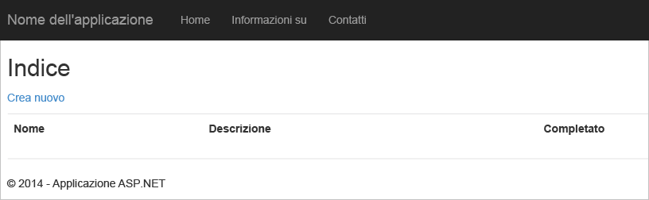

	In caso di errori a questo punto, è possibile confrontare il codice con quello del progetto di esempio in [GitHub][].

2. Fare clic sul collegamento **Crea nuovo** e specificare i valori dei campi **Nome** e **Descrizione**. Lasciare deselezionata la casella di controllo **Completed**. In caso contrario, il nuovo oggetto **Item** verrà aggiunto con uno stato completato e non sarà visualizzato nell'elenco iniziale.

	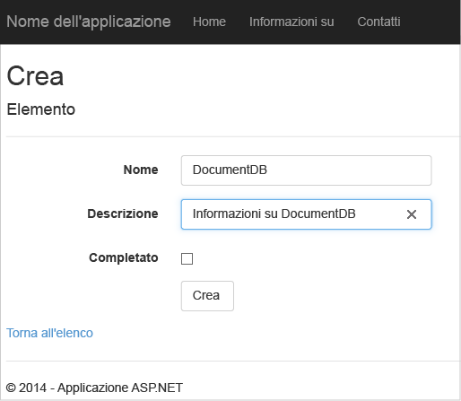

3. Fare clic su **Create** per tornare di nuovo alla visualizzazione **Index** e visualizzare **Item** nell'elenco.

	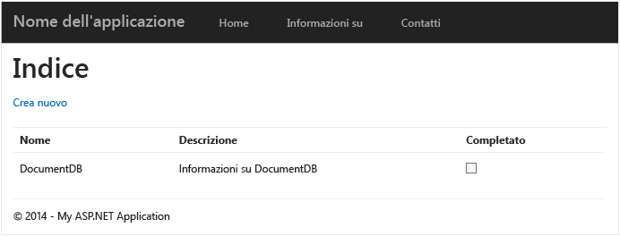

	È possibile aggiungere altri oggetti **Item** all'elenco di azioni.

3. Fare clic su **Edit** accanto a un oggetto **Item** nell'elenco per tornare alla visualizzazione **Edit**, in cui è possibile aggiornare qualsiasi proprietà dell'oggetto, incluso il flag **Completed**. Se si seleziona il flag **Completed** e si fa clic su **Salva**, l'oggetto **Item** viene rimosso dall'elenco degli attività incomplete.

	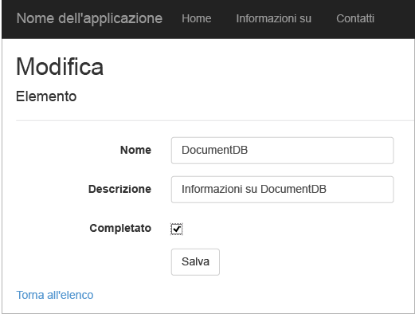

4. Una volta testata l'app, premere CTRL+F5 per arrestarne il debug. È ora possibile distribuire l'app.

##Passaggio 7: Distribuire l'applicazione in Siti Web di Azure

Ora che è completa e funziona correttamente con DocumentDB, è possibile distribuire questa app Web in Siti Web di Azure. Se alla creazione del progetto MVC ASP.NET vuoto si è selezionato **Ospita nel cloud**, Visual Studio semplifica notevolmente le operazioni eseguendo la maggior parte dei passaggi automaticamente.

1. Per pubblicare l'applicazione, è sufficiente fare clic con il pulsante destro del mouse sul progetto in **Esplora soluzioni** e scegliere **Pubblica**.

	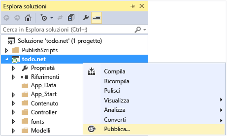

2. Ogni impostazione dovrebbe già essere configurata in base alle credenziali e in effetti il sito Web è già stato creato in Azure secondo il valore specificato in **URL di destinazione** ed è sufficiente fare clic su **Pubblica**.

	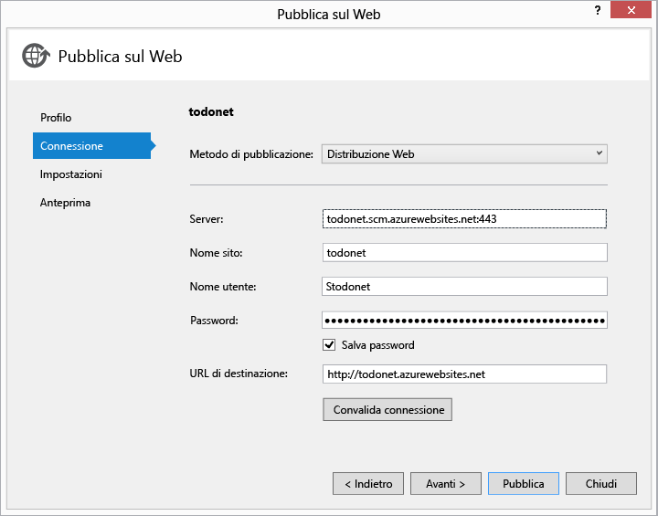

Dopo alcuni secondi, Visual Studio completerà la pubblicazione dell'applicazione Web e avvierà un browser in cui sarà possibile ammirare il proprio lavoro in esecuzione in Azure.

##Passaggi successivi

Congratulazioni. È stata creata la prima applicazione Web MVC ASP.NET con Azure DocumentDB che è stata quindi pubblicata in Siti Web di Azure. Il codice sorgente per l'applicazione completa, insieme alle funzionalità di eliminazione e relative ai dettagli non incluse in questa esercitazione, può essere scaricato o clonato da [GitHub][]. Per aggiungere queste funzionalità all'app, recuperare il codice e aggiungerlo all'app.

Per aggiungere altre funzionalità all'applicazione, esaminare le API disponibili nella raccolta [.NET per DocumentDB](https://msdn.microsoft.com/library/azure/dn948556.aspx), in cui è anche possibile aggiungere il proprio contributo su [GitHub][].

[*]: https://microsoft.sharepoint.com/teams/DocDB/Shared%20Documents/Documentation/Docs.LatestVersions/PicExportError
[Visual Studio Express]: http://www.visualstudio.com/products/visual-studio-express-vs.aspx
[Installazione guidata piattaforma Web Microsoft]: http://www.microsoft.com/web/downloads/platform.aspx
[impedendo Cross-Site Request Forgery]: http://go.microsoft.com/fwlink/?LinkID=517254
[operazioni CRUD di base in ASP.NET MVC]: http://go.microsoft.com/fwlink/?LinkId=317598
[GitHub]: https://github.com/Azure-Samples/documentdb-net-todo-app

<!---HONumber=AcomDC_0518_2016-->