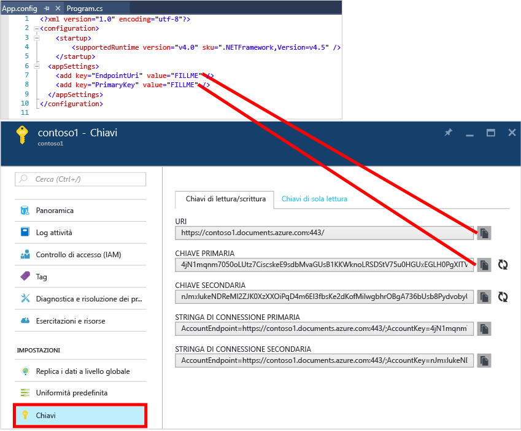

# Esercitazione su NoSQL: Compilare un'applicazione console C# di DocumentDB
> [!div class="op_single_selector"]
> * [.NET](documentdb-get-started.md)
> * [Node.js](documentdb-nodejs-get-started.md)
> 
> 

Esercitazione su NoSQL per Azure DocumentDB .NET SDK Dopo avere ottenuto il progetto di avvio rapido o completato l'esercitazione, si avrà un'applicazione console che consente di creare e ridefinire le query delle risorse DocumentDB.

* **[Quickstart](#quickstart)**: scaricare il progetto di esempio e aggiungere le informazioni di connessione per avere un'app DocumentDB in esecuzione in meno di 10 minuti.
* **[Esercitazione](#tutorial)**: compilare l'app di avvio rapido da zero in 30 minuti.

## Prerequisiti
* Un account Azure attivo. Se non si ha un account, è possibile iscriversi per ottenere un [account gratuito](https://azure.microsoft.com/free/).
* [Visual Studio 2013 o Visual Studio 2015](http://www.visualstudio.com/).
* .NET Framework 4.6

## Quickstart
1. Scaricare il file ZIP del progetto di esempio da [GitHub](https://github.com/Azure-Samples/documentdb-dotnet-getting-started-quickstart/archive/master.zip) oppure clonare il repository [documentdb-dotnet-getting-started-quickstart](https://github.com/Azure-Samples/documentdb-dotnet-getting-started-quickstart).
2. Usare il portale di Azure per [creare un account DocumentDB](documentdb-create-account.md).
3. Nel file App.config sostituire i valori di EndpointUri e PrimaryKey con i valori recuperati dal [portale di Azure](https://portal.azure.com/), passando al pannello **DocumentDB (NoSQL)**, quindi facendo clic su **Nome account** e infine su **Chiavi** nel menu della risorsa.
    
4. Compilare il progetto. La finestra della console mostra le nuove risorse di cui è in corso la creazione, la query e quindi la pulizia.
   
    

## Esercitazione
Questa esercitazione illustra la creazione di un database DocumentDB, di una raccolta DocumentDB e di documenti JSON. Verranno quindi effettuate una query della raccolta e la pulizia e l'eliminazione del database. Questa esercitazione compila un progetto uguale a quello di avvio rapido, ma in modo in modo incrementale, e fornisce una spiegazione del codice che si aggiungerà al progetto.

## Passaggio 1: Creare un account DocumentDB
Creare un account DocumentDB. Se si ha già un account, è possibile ignorare questo passaggio e passare a [Configurare la soluzione Visual Studio](#SetupVS).

[!INCLUDE [documentdb-create-dbaccount](../../includes/documentdb-create-dbaccount.md)]

## Passaggio 2: Configurare la soluzione di Visual Studio
1. Aprire **Visual Studio 2015** nel computer.
2. Scegliere **Nuovo** dal menu **File** e quindi selezionare **Progetto**.
3. Nella finestra di dialogo **Nuovo progetto** selezionare **Modelli** / **Visual C#** / **Applicazione console**, assegnare un nome al progetto e quindi fare clic su **OK**.
   
4. In **Esplora soluzioni**, fare clic sulla nuova applicazione console che si trova nella soluzione di Visual Studio.
5. Scegliere **Gestisci pacchetti NuGet** dal menu.
   
6. Nella scheda **NuGet** fare clic su **Sfoglia** e digitare **azure documentdb** nella casella di ricerca.
7. Nei risultati trovare **Microsoft.Azure.DocumentDB** e fare clic su **Installa**.
   L'ID del pacchetto per la libreria client di DocumentDB è [Microsoft.Azure.DocumentDB](https://www.nuget.org/packages/Microsoft.Azure.DocumentDB)
   

L'installazione è riuscita. Ora che abbiamo completato l'installazione, iniziamo a scrivere il codice. Un progetto di codice completo di questa esercitazione è disponibile in [GitHub](https://github.com/Azure-Samples/documentdb-dotnet-getting-started/blob/master/src/Program.cs).

## Passaggio 3: Connettersi a un account DocumentDB
In primo luogo, aggiungere questi riferimenti all'inizio dell'applicazione c#, nel file Program.cs:

    using System;
    using System.Linq;
    using System.Threading.Tasks;

    // ADD THIS PART TO YOUR CODE
    using System.Net;
    using Microsoft.Azure.Documents;
    using Microsoft.Azure.Documents.Client;
    using Newtonsoft.Json;

> [!IMPORTANT]
> Per completare questa esercitazione su NoSQL, assicurarsi di aggiungere le dipendenze illustrate sopra.
> 
> 

Aggiungere ora queste due costanti e la variabile *client* sotto la classe pubblica *Program*.

    public class Program
    {
        // ADD THIS PART TO YOUR CODE
        private const string EndpointUri = "<your endpoint URI>";
        private const string PrimaryKey = "<your key>";
        private DocumentClient client;

Passare quindi al [portale di Azure](https://portal.azure.com) per recuperare l'URI e la chiave primaria. L'URI e la chiave primaria di DocumentDB sono necessari all'applicazione per conoscere la destinazione della connessione e a DocumentDB per considerare attendibile la connessione dell'applicazione.

Nel portale di Azure passare all'account DocumentDB e quindi fare clic su **Chiavi**.

Copiare l'URI dal portale e incollarlo in `<your endpoint URI>` nel file program.cs. Copiare quindi la CHIAVE PRIMARIA dal portale e incollarla in `<your key>`.

![Screenshot del portale di Azure usato nell'esercitazione su NoSQL per creare un'applicazione console C#. Mostra un account DocumentDB, con l'hub ACTIVE evidenziato, il pulsante CHIAVI evidenziato nel pannello dell'account DocumentDB e i valori di URI, CHIAVE PRIMARIA e CHIAVE SECONDARIA evidenziati nel pannello Chiavi][keys]

Per avviare l'applicazione introduttiva, si creerà una nuova istanza di **DocumentClient**.

Sotto il metodo **Main** aggiungere la nuova attività asincrona denominata **GetStartedDemo** che creerà la nuova istanza di **DocumentClient**.

    static void Main(string[] args)
    {
    }

    // ADD THIS PART TO YOUR CODE
    private async Task GetStartedDemo()
    {
        this.client = new DocumentClient(new Uri(EndpointUri), PrimaryKey);
    }

Aggiungere questo codice per eseguire l'attività asincrona dal metodo **Main** . Il metodo **Main** rileva le eccezioni e le scrive nella console.

    static void Main(string[] args)
    {
            // ADD THIS PART TO YOUR CODE
            try
            {
                    Program p = new Program();
                    p.GetStartedDemo().Wait();
            }
            catch (DocumentClientException de)
            {
                    Exception baseException = de.GetBaseException();
                    Console.WriteLine("{0} error occurred: {1}, Message: {2}", de.StatusCode, de.Message, baseException.Message);
            }
            catch (Exception e)
            {
                    Exception baseException = e.GetBaseException();
                    Console.WriteLine("Error: {0}, Message: {1}", e.Message, baseException.Message);
            }
            finally
            {
                    Console.WriteLine("End of demo, press any key to exit.");
                    Console.ReadKey();
            }

Premere **F5** per eseguire l'applicazione.

Congratulazioni. La connessione a un account DocumentDB è stata stabilita. Ora è possibile veder come utilizzare le risorse di DocumentDB.  

## Passaggio 4: Creare un database
Prima di aggiungere il codice per la creazione di un database, aggiungere un metodo helper per la scrittura nella console.

Copiare e incollare il metodo **WriteToConsoleAndPromptToContinue** sotto il metodo **GetStartedDemo**.

    // ADD THIS PART TO YOUR CODE
    private void WriteToConsoleAndPromptToContinue(string format, params object[] args)
    {
            Console.WriteLine(format, args);
            Console.WriteLine("Press any key to continue ...");
            Console.ReadKey();
    }

È possibile creare un [database](documentdb-resources.md#databases) di DocumentDB usando il metodo [CreateDatabaseAsync](https://msdn.microsoft.com/library/microsoft.azure.documents.client.documentclient.createdatabaseasync.aspx) della classe **DocumentClient**. Un database è il contenitore logico per l'archiviazione di documenti JSON partizionato nelle raccolte.

Copiare e incollare il metodo **CreateDatabaseIfNotExists** sotto il metodo **WriteToConsoleAndPromptToContinue**.

    // ADD THIS PART TO YOUR CODE
    private async Task CreateDatabaseIfNotExists(string databaseName)
    {
            // Check to verify a database with the id=FamilyDB does not exist
            try
            {
                    await this.client.ReadDatabaseAsync(UriFactory.CreateDatabaseUri(databaseName));
                    this.WriteToConsoleAndPromptToContinue("Found {0}", databaseName);
            }
            catch (DocumentClientException de)
            {
                    // If the database does not exist, create a new database
                    if (de.StatusCode == HttpStatusCode.NotFound)
                    {
                            await this.client.CreateDatabaseAsync(new Database { Id = databaseName });
                            this.WriteToConsoleAndPromptToContinue("Created {0}", databaseName);
                    }
                    else
                    {
                            throw;
                    }
            }
    }

Copiare e incollare il codice seguente nel metodo **GetStartedDemo** sotto il codice di creazione del client. Verrà creato un database denominato *FamilyDB*.

    private async Task GetStartedDemo()
    {
        this.client = new DocumentClient(new Uri(EndpointUri), PrimaryKey);

        // ADD THIS PART TO YOUR CODE
        await this.CreateDatabaseIfNotExists("FamilyDB_va");

Premere **F5** per eseguire l'applicazione.

Congratulazioni. La creazione di un database di DocumentDB è stata completata.  

## Passaggio 5: Creare una raccolta
> [!WARNING]
> **CreateDocumentCollectionAsync** crea una nuova raccolta con velocità effettiva riservata, che presenta implicazioni in termini di prezzi. Per altre informazioni, visitare la [pagina relativa ai prezzi](https://azure.microsoft.com/pricing/details/documentdb/).
> 
> 

È possibile creare una [raccolta](documentdb-resources.md#collections) usando il metodo [CreateDocumentCollectionAsync](https://msdn.microsoft.com/library/microsoft.azure.documents.client.documentclient.createdocumentcollectionasync.aspx) della classe **DocumentClient**. Una raccolta è un contenitore di documenti JSON e di logica dell'applicazione JavaScript associata.

Copiare e incollare il metodo **CreateDocumentCollectionIfNotExists** sotto il metodo **CreateDatabaseIfNotExists**.

    // ADD THIS PART TO YOUR CODE
    private async Task CreateDocumentCollectionIfNotExists(string databaseName, string collectionName)
    {
        try
        {
            await this.client.ReadDocumentCollectionAsync(UriFactory.CreateDocumentCollectionUri(databaseName, collectionName));
            this.WriteToConsoleAndPromptToContinue("Found {0}", collectionName);
        }
        catch (DocumentClientException de)
        {
            // If the document collection does not exist, create a new collection
            if (de.StatusCode == HttpStatusCode.NotFound)
            {
                DocumentCollection collectionInfo = new DocumentCollection();
                collectionInfo.Id = collectionName;

                // Configure collections for maximum query flexibility including string range queries.
                collectionInfo.IndexingPolicy = new IndexingPolicy(new RangeIndex(DataType.String) { Precision = -1 });

                // Here we create a collection with 400 RU/s.
                await this.client.CreateDocumentCollectionAsync(
                    UriFactory.CreateDatabaseUri(databaseName),
                    collectionInfo,
                    new RequestOptions { OfferThroughput = 400 });

                this.WriteToConsoleAndPromptToContinue("Created {0}", collectionName);
            }
            else
            {
                throw;
            }
        }
    }

Copiare e incollare il codice seguente nel metodo **GetStartedDemo** sotto il codice di creazione del database. Verrà creata una raccolta di documenti denominata *FamilyCollection_va*.

        this.client = new DocumentClient(new Uri(EndpointUri), PrimaryKey);

        await this.CreateDatabaseIfNotExists("FamilyDB_oa");

        // ADD THIS PART TO YOUR CODE
        await this.CreateDocumentCollectionIfNotExists("FamilyDB_va", "FamilyCollection_va");

Premere **F5** per eseguire l'applicazione.

Congratulazioni. La raccolta di documenti di DocumentDB è stata completata.  

## Passaggio 6: Creare documenti JSON
È possibile creare un [documento](documentdb-resources.md#documents) usando il metodo [CreateDocumentAsync](https://msdn.microsoft.com/library/microsoft.azure.documents.client.documentclient.createdocumentasync.aspx) della classe **DocumentClient**. I documenti sono contenuto JSON definito dall'utente (arbitrario). Ora è possibile inserire uno o più documenti. Se sono già disponibili dati da archiviare nel database, è possibile usare lo [strumento di migrazione dei dati](documentdb-import-data.md)di DocumentDB.

È necessario creare prima una classe **Family** che rappresenterà gli oggetti archiviati in DocumentDB in questo esempio. Verranno create anche le sottoclassi **Parent**, **Child**, **Pet** e **Address** da usare in **Family**. Si noti che i documenti devono avere una proprietà **Id** serializzata come **id** in JSON. Creare queste classi aggiungendo le classi secondarie interne seguenti dopo il metodo **GetStartedDemo** .

Copiare e incollare le classi **Family**, **Parent**, **Child**, **Pet** e **Address** sotto il metodo **WriteToConsoleAndPromptToContinue**.

    private void WriteToConsoleAndPromptToContinue(string format, params object[] args)
    {
        Console.WriteLine(format, args);
        Console.WriteLine("Press any key to continue ...");
        Console.ReadKey();
    }

    // ADD THIS PART TO YOUR CODE
    public class Family
    {
        [JsonProperty(PropertyName = "id")]
        public string Id { get; set; }
        public string LastName { get; set; }
        public Parent[] Parents { get; set; }
        public Child[] Children { get; set; }
        public Address Address { get; set; }
        public bool IsRegistered { get; set; }
        public override string ToString()
        {
                return JsonConvert.SerializeObject(this);
        }
    }

    public class Parent
    {
        public string FamilyName { get; set; }
        public string FirstName { get; set; }
    }

    public class Child
    {
        public string FamilyName { get; set; }
        public string FirstName { get; set; }
        public string Gender { get; set; }
        public int Grade { get; set; }
        public Pet[] Pets { get; set; }
    }

    public class Pet
    {
        public string GivenName { get; set; }
    }

    public class Address
    {
        public string State { get; set; }
        public string County { get; set; }
        public string City { get; set; }
    }

Copiare e incollare il metodo **CreateFamilyDocumentIfNotExists** sotto il metodo **CreateDocumentCollectionIfNotExists**.

    // ADD THIS PART TO YOUR CODE
    private async Task CreateFamilyDocumentIfNotExists(string databaseName, string collectionName, Family family)
    {
        try
        {
            await this.client.ReadDocumentAsync(UriFactory.CreateDocumentUri(databaseName, collectionName, family.Id));
            this.WriteToConsoleAndPromptToContinue("Found {0}", family.Id);
        }
        catch (DocumentClientException de)
        {
            if (de.StatusCode == HttpStatusCode.NotFound)
            {
                await this.client.CreateDocumentAsync(UriFactory.CreateDocumentCollectionUri(databaseName, collectionName), family);
                this.WriteToConsoleAndPromptToContinue("Created Family {0}", family.Id);
            }
            else
            {
                throw;
            }
        }
    }

Inserire anche due documenti, relativi rispettivamente alla famiglia Andersen e alla famiglia Wakefield.

Copiare e incollare il codice seguente nel metodo **GetStartedDemo** sotto il codice di creazione della raccolta di documenti.

    await this.CreateDatabaseIfNotExists("FamilyDB_va");

    await this.CreateDocumentCollectionIfNotExists("FamilyDB_va", "FamilyCollection_va");

    // ADD THIS PART TO YOUR CODE
    Family andersenFamily = new Family
    {
            Id = "Andersen.1",
            LastName = "Andersen",
            Parents = new Parent[]
            {
                    new Parent { FirstName = "Thomas" },
                    new Parent { FirstName = "Mary Kay" }
            },
            Children = new Child[]
            {
                    new Child
                    {
                            FirstName = "Henriette Thaulow",
                            Gender = "female",
                            Grade = 5,
                            Pets = new Pet[]
                            {
                                    new Pet { GivenName = "Fluffy" }
                            }
                    }
            },
            Address = new Address { State = "WA", County = "King", City = "Seattle" },
            IsRegistered = true
    };

    await this.CreateFamilyDocumentIfNotExists("FamilyDB_va", "FamilyCollection_va", andersenFamily);

    Family wakefieldFamily = new Family
    {
            Id = "Wakefield.7",
            LastName = "Wakefield",
            Parents = new Parent[]
            {
                    new Parent { FamilyName = "Wakefield", FirstName = "Robin" },
                    new Parent { FamilyName = "Miller", FirstName = "Ben" }
            },
            Children = new Child[]
            {
                    new Child
                    {
                            FamilyName = "Merriam",
                            FirstName = "Jesse",
                            Gender = "female",
                            Grade = 8,
                            Pets = new Pet[]
                            {
                                    new Pet { GivenName = "Goofy" },
                                    new Pet { GivenName = "Shadow" }
                            }
                    },
                    new Child
                    {
                            FamilyName = "Miller",
                            FirstName = "Lisa",
                            Gender = "female",
                            Grade = 1
                    }
            },
            Address = new Address { State = "NY", County = "Manhattan", City = "NY" },
            IsRegistered = false
    };

    await this.CreateFamilyDocumentIfNotExists("FamilyDB_va", "FamilyCollection_va", wakefieldFamily);

Premere **F5** per eseguire l'applicazione.

Congratulazioni. La creazione di due documenti di DocumentDB è stata completata.  

## Passaggio 7: Eseguire query sulle risorse di DocumentDB
DocumentDB supporta [query](documentdb-sql-query.md) complesse sui documenti JSON archiviati in ogni raccolta.  Il codice di esempio seguente mostra diverse query che usano la sintassi SQL di DocumentDB e LINQ e che è possibile eseguire sui documenti inseriti nel passaggio precedente.

Copiare e incollare il metodo **ExecuteSimpleQuery** sotto il metodo **CreateFamilyDocumentIfNotExists**.

    // ADD THIS PART TO YOUR CODE
    private void ExecuteSimpleQuery(string databaseName, string collectionName)
    {
        // Set some common query options
        FeedOptions queryOptions = new FeedOptions { MaxItemCount = -1 };

            // Here we find the Andersen family via its LastName
            IQueryable<Family> familyQuery = this.client.CreateDocumentQuery<Family>(
                    UriFactory.CreateDocumentCollectionUri(databaseName, collectionName), queryOptions)
                    .Where(f => f.LastName == "Andersen");

            // The query is executed synchronously here, but can also be executed asynchronously via the IDocumentQuery<T> interface
            Console.WriteLine("Running LINQ query...");
            foreach (Family family in familyQuery)
            {
                    Console.WriteLine("\tRead {0}", family);
            }

            // Now execute the same query via direct SQL
            IQueryable<Family> familyQueryInSql = this.client.CreateDocumentQuery<Family>(
                    UriFactory.CreateDocumentCollectionUri(databaseName, collectionName),
                    "SELECT * FROM Family WHERE Family.LastName = 'Andersen'",
                    queryOptions);

            Console.WriteLine("Running direct SQL query...");
            foreach (Family family in familyQueryInSql)
            {
                    Console.WriteLine("\tRead {0}", family);
            }

            Console.WriteLine("Press any key to continue ...");
            Console.ReadKey();
    }

Copiare e incollare il codice seguente nel metodo **GetStartedDemo** sotto il codice di creazione del secondo documento.

    await this.CreateFamilyDocumentIfNotExists("FamilyDB_va", "FamilyCollection_va", wakefieldFamily);

    // ADD THIS PART TO YOUR CODE
    this.ExecuteSimpleQuery("FamilyDB_va", "FamilyCollection_va");

Premere **F5** per eseguire l'applicazione.

Congratulazioni. L'esecuzione di una query in una raccolta di DocumentDB è stata completata.

Nel diagramma seguente viene illustrato come la sintassi di query di SQL DocumentDB viene chiamata sulla raccolta creata e la stessa logica viene applicata alla query di LINQ.

La parola chiave [FROM](documentdb-sql-query.md#from-clause) è facoltativa nella query perché le query di DocumentDB sono già limitate a una singola raccolta. Di conseguenza, "FROM Families f" può essere scambiata con "FROM root r" o con il nome di qualsiasi altra variabile scelta. DocumentDB dedurrà che Families, root o il nome della variabile scelta, si riferisce per impostazione predefinita alla raccolta attuale.

## Passaggio 8: Sostituire un documento JSON
DocumentDB supporta la sostituzione di documenti JSON.  

Copiare e incollare il metodo **ReplaceFamilyDocument** sotto il metodo **ExecuteSimpleQuery**.

    // ADD THIS PART TO YOUR CODE
    private async Task ReplaceFamilyDocument(string databaseName, string collectionName, string familyName, Family updatedFamily)
    {
        try
        {
            await this.client.ReplaceDocumentAsync(UriFactory.CreateDocumentUri(databaseName, collectionName, familyName), updatedFamily);
            this.WriteToConsoleAndPromptToContinue("Replaced Family {0}", familyName);
        }
        catch (DocumentClientException de)
        {
            throw;
        }
    }

Copiare e incollare il codice seguente nel metodo **GetStartedDemo** sotto il codice di esecuzione della query. Dopo aver sostituito il documento, verrà eseguita di nuovo la stessa query per visualizzare il documento modificato.

    await this.CreateFamilyDocumentIfNotExists("FamilyDB_va", "FamilyCollection_va", wakefieldFamily);

    this.ExecuteSimpleQuery("FamilyDB_va", "FamilyCollection_va");

    // ADD THIS PART TO YOUR CODE
    // Update the Grade of the Andersen Family child
    andersenFamily.Children[0].Grade = 6;

    await this.ReplaceFamilyDocument("FamilyDB_va", "FamilyCollection_va", "Andersen.1", andersenFamily);

    this.ExecuteSimpleQuery("FamilyDB_va", "FamilyCollection_va");

Premere **F5** per eseguire l'applicazione.

Congratulazioni. La sostituzione di un documento di DocumentDB è stata completata.

## Passaggio 9: Eliminare un documento JSON
DocumentDB supporta l'eliminazione di documenti JSON.  

Copiare e incollare il metodo **DeleteFamilyDocument** sotto il metodo **ReplaceFamilyDocument**.

    // ADD THIS PART TO YOUR CODE
    private async Task DeleteFamilyDocument(string databaseName, string collectionName, string documentName)
    {
        try
        {
            await this.client.DeleteDocumentAsync(UriFactory.CreateDocumentUri(databaseName, collectionName, documentName));
            Console.WriteLine("Deleted Family {0}", documentName);
        }
        catch (DocumentClientException de)
        {
            throw;
        }
    }

Copiare e incollare il codice seguente nel metodo **GetStartedDemo** sotto il codice di esecuzione della seconda query.

    await this.ReplaceFamilyDocument("FamilyDB_va", "FamilyCollection_va", "Andersen.1", andersenFamily);

    this.ExecuteSimpleQuery("FamilyDB_va", "FamilyCollection_va");

    // ADD THIS PART TO CODE
    await this.DeleteFamilyDocument("FamilyDB_va", "FamilyCollection_va", "Andersen.1");

Premere **F5** per eseguire l'applicazione.

Congratulazioni. L'eliminazione di un documento di DocumentDB è stata completata.

## Passaggio 10: Eliminare il database
Se si elimina il database creato, verrà rimosso il database e tutte le risorse figlio (raccolte, documenti e così via).

Copiare e incollare il codice seguente nel metodo **GetStartedDemo** sotto il codice di eliminazione del documento per eliminare l'intero database e tutte le risorse figlio.

    this.ExecuteSimpleQuery("FamilyDB_va", "FamilyCollection_va");

    await this.DeleteFamilyDocument("FamilyDB_va", "FamilyCollection_va", "Andersen.1");

    // ADD THIS PART TO CODE
    // Clean up/delete the database
    await this.client.DeleteDatabaseAsync(UriFactory.CreateDatabaseUri("FamilyDB_va"));

Premere **F5** per eseguire l'applicazione.

Congratulazioni. L'eliminazione di un database di DocumentDB è stata completata.

## Passaggio 11: Eseguire l'intera applicazione console C#
Premere F5 in Visual Studio per compilare l'applicazione in modalità di debug.

Verrà visualizzato l'output dell'app introduttiva. L'output visualizzerà i risultati delle query aggiunte e dovrà corrispondere al testo di esempio riportato di seguito.

    Created FamilyDB_va
    Press any key to continue ...
    Created FamilyCollection_va
    Press any key to continue ...
    Created Family Andersen.1
    Press any key to continue ...
    Created Family Wakefield.7
    Press any key to continue ...
    Running LINQ query...
        Read {"id":"Andersen.1","LastName":"Andersen","District":"WA5","Parents":[{"FamilyName":null,"FirstName":"Thomas"},{"FamilyName":null,"FirstName":"Mary Kay"}],"Children":[{"FamilyName":null,"FirstName":"Henriette Thaulow","Gender":"female","Grade":5,"Pets":[{"GivenName":"Fluffy"}]}],"Address":{"State":"WA","County":"King","City":"Seattle"},"IsRegistered":true}
    Running direct SQL query...
        Read {"id":"Andersen.1","LastName":"Andersen","District":"WA5","Parents":[{"FamilyName":null,"FirstName":"Thomas"},{"FamilyName":null,"FirstName":"Mary Kay"}],"Children":[{"FamilyName":null,"FirstName":"Henriette Thaulow","Gender":"female","Grade":5,"Pets":[{"GivenName":"Fluffy"}]}],"Address":{"State":"WA","County":"King","City":"Seattle"},"IsRegistered":true}
    Replaced Family Andersen.1
    Press any key to continue ...
    Running LINQ query...
        Read {"id":"Andersen.1","LastName":"Andersen","District":"WA5","Parents":[{"FamilyName":null,"FirstName":"Thomas"},{"FamilyName":null,"FirstName":"Mary Kay"}],"Children":[{"FamilyName":null,"FirstName":"Henriette Thaulow","Gender":"female","Grade":6,"Pets":[{"GivenName":"Fluffy"}]}],"Address":{"State":"WA","County":"King","City":"Seattle"},"IsRegistered":true}
    Running direct SQL query...
        Read {"id":"Andersen.1","LastName":"Andersen","District":"WA5","Parents":[{"FamilyName":null,"FirstName":"Thomas"},{"FamilyName":null,"FirstName":"Mary Kay"}],"Children":[{"FamilyName":null,"FirstName":"Henriette Thaulow","Gender":"female","Grade":6,"Pets":[{"GivenName":"Fluffy"}]}],"Address":{"State":"WA","County":"King","City":"Seattle"},"IsRegistered":true}
    Deleted Family Andersen.1
    End of demo, press any key to exit.

Congratulazioni. L'esercitazione su NoSQL è stata completata ed è stata creata un'applicazione console C# funzionante.

## Passaggi successivi
* Si preferisce un'esercitazione su NoSQL MVC ASP.NET più complessa? Vedere [Creare un'applicazione Web con MVC ASP.NET usando DocumentDB](documentdb-dotnet-application.md).
* Si vuole eseguire il test della scalabilità e delle prestazioni con DocumentDB? Vedere [Test delle prestazioni e della scalabilità con Azure DocumentDB](documentdb-performance-testing.md)
* Informazioni su come [monitorare un account DocumentDB](documentdb-monitor-accounts.md).
* Eseguire query sul set di dati di esempio illustrato nella pagina [Query Playground](https://www.documentdb.com/sql/demo).
* Per altre informazioni sul modello di programmazione, vedere la sezione relativa allo sviluppo nella pagina [Documentazione di DocumentDB](https://azure.microsoft.com/documentation/services/documentdb/).

[documentdb-create-account]: documentdb-create-account.md
[keys]: media/documentdb-get-started-quickstart/nosql-tutorial-keys.png

<!--HONumber=Jan17_HO3-->

