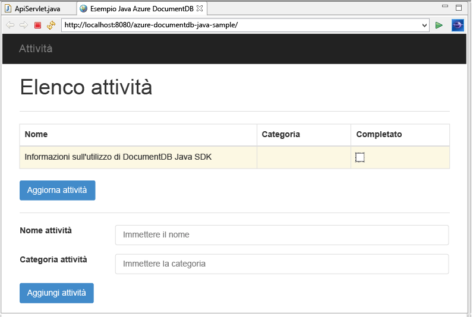
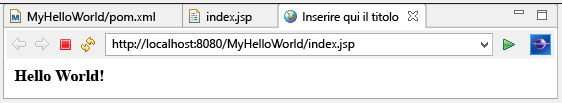

<properties 
	pageTitle="Esercitazione sullo sviluppo di un'applicazione Java usando DocumentDB | Microsoft Azure"
	description="Questa esercitazione sull’applicazione web Java illustra come usare il servizio Microsoft Azure DocumentDB per archiviare e accedere ai dati da un'applicazione Java ospitata in siti Web di Azure."
	keywords="Sviluppo di applicazioni, esercitazione sul database, applicazione Java, esercitazione sull'applicazione Web Java, DocumentDB, Azure, Microsoft Azure"
	services="documentdb" 
	documentationCenter="java" 
	authors="aliuy" 
	manager="jhubbard" 
	editor="monicar"/>

<tags 
	ms.service="documentdb" 
	ms.devlang="java" 
	ms.topic="hero-article" 
	ms.tgt_pltfrm="NA" 
	ms.workload="data-services" 
	ms.date="10/20/2015" 
	ms.author="andrl"/>

# Creazione di un'applicazione Web Java con DocumentDB

> [AZURE.SELECTOR]
- [.NET](documentdb-dotnet-application.md)
- [Node.js](documentdb-nodejs-application.md)
- [Java](documentdb-java-application.md)
- [Python](documentdb-python-application.md)

Questa esercitazione sull'applicazione Web Java illustra come usare il servizio [Microsoft Azure DocumentDB](https://portal.azure.com/#gallery/Microsoft.DocumentDB) per archiviare i dati e accedervi da un'applicazione Java ospitata in Siti Web di Azure. In questo argomento, si apprenderà:

- Come creare un'applicazione JSP di base in Eclipse.
- Come usare il servizio Azure DocumentDB mediante [DocumentDB Java SDK](https://github.com/Azure/azure-documentdb-java).

Questa esercitazione illustra come creare un'applicazione di gestione delle attività basata su Web che consente di creare, recuperare e contrassegnare le attività come completate, come illustrato nella figura seguente. Ciascuna attività nell'elenco attività vengono memorizzati come documenti JSON in Azure DocumentDB.

> [AZURE.TIP]Questa esercitazione sullo sviluppo dell’applicazione presuppone che l'utente abbia già acquisito familiarità con l'uso di Java. Se non si ha alcuna esperienza riguardo a Java o agli [strumenti richiesti come prerequisiti](#Prerequisites), è consigliabile scaricare il progetto [todo](https://github.com/Azure-Samples/documentdb-java-todo-app) completo da GitHub e creare l'applicazione usando le [istruzioni alla fine di questo articolo](#GetProject). Una volta creata la soluzione, è possibile leggere l'articolo per approfondire il codice nel contesto del progetto.

##Prerequisiti per questa esercitazione sull'applicazione Web Java
Prima di iniziare questa esercitazione sullo sviluppo dell’applicazione, è necessario disporre di quanto segue:

- Un account Azure attivo. Se non si dispone di un account, è possibile creare un account di valutazione gratuita in pochi minuti. Per informazioni dettagliate, vedere la pagina relativa alla [versione di valutazione gratuita di Azure](https://azure.microsoft.com/pricing/free-trial/).
- [Java Development Kit (JDK) 7+](http://www.oracle.com/technetwork/java/javase/downloads/index.html).
- [Eclipse IDE per sviluppatori Java EE.](http://www.eclipse.org/downloads/packages/eclipse-ide-java-ee-developers/lunasr1)
- [Un sito Web di Azure con Java Runtime Environment (ad esempio Tomcat o Jetty) abilitato.](../app-service-web/web-sites-java-get-started.md)

Se questi strumenti vengono installati per la prima volta, coreservlets.com fornisce una procedura dettagliata del processo di installazione nella sezione introduttiva dell'articolo relativo all'[esercitazione sull'installazione di TomCat7 e il relativo uso con Eclipse](http://www.coreservlets.com/Apache-Tomcat-Tutorial/tomcat-7-with-eclipse.html).

##Passaggio 1: Creare un account del database DocumentDB
Per eseguire il provisioning di un account di database DocumentDB in Azure:

1. Se non si ha già un account di database, crearne uno seguendo le istruzioni in [Creazione di un account di database](documentdb-create-account.md). Se si ha già un account, procedere al passaggio 2.
2. Usando il pannello **Chiavi** mostrato nell'illustrazione seguente, copiare l'**URI** dell'endpoint e la **CHIAVE PRIMARIA** negli Appunti e tenerli a portata di mano, poiché questi valori verranno usati nell'applicazione Web creata in seguito.

![Come creare un account DocumentDB - Esercitazione sul database Schermata del portale di Azure, che mostra un account DocumentDB, con l'hub ACTIVE evidenziato, il pulsante Chiavi evidenziato nel pannello dell'account DocumentDB e i valori di URI, CHIAVE PRIMARIA e CHIAVE SECONDARIA evidenziati nel pannello Chiavi][1]

##Passaggio 2: Creare l'applicazione Java JSP

Per creare l'applicazione JSP:

1. Iniziare innanzitutto con la creazione di un progetto Java. Avviare Eclipse, quindi fare clic su **File**, **New** e quindi su **Dynamic Web Project**. Se **Dynamic Web Project** non è presente nell'elenco dei progetti disponibili, seguire questa procedura: fare clic su **File**, **New** e **Project**..., espandere **Web**, fare clic su **Dynamic Web Project**, quindi selezionare **Next**. 

	

2. Immettere un nome di progetto nella casella **Project name** e dal menu a discesa **Target Runtime** selezionare facoltativamente un valore (ad esempio, versione Apache Tomcat v7.0) e quindi fare clic su **Finish**. Se si seleziona un runtime di destinazione, sarà possibile eseguire il progetto in locale tramite Eclipse.
3. Nella vista Project Explorer di Eclipse espandere il progetto. Fare clic con il pulsante destro del mouse su **WebContent**, scegliere **New** e quindi fare clic su **JSP File**.
4. Nella finestra di dialogo **New JSP File** assegnare al file il nome **index.jsp**. Mantenere il nome **WebContent** per la cartella padre, come illustrato di seguito, e quindi fare clic su **Next**.

	

5. Per le finalità di questa esercitazione, nella finestra di dialogo **Select JSP Template** selezionare **New JSP File (html)** e quindi fare clic su **Finish**.

6. Quando in Eclipse viene aperto il file index.jsp, aggiungere il testo in modo da visualizzare **Hello World!** nell'elemento <body> esistente. Il contenuto <body> aggiornato dovrebbe avere un aspetto analogo al seguente:
    
	    <body>
	        <% out.println("Hello World!"); %>
	    </body>

8. Salvare il file index.jsp.
9. Se nel passaggio 2 è stato impostato un runtime di destinazione, è possibile fare clic su **Project**, quindi su **Run** per eseguire l'applicazione JSP in locale:

	

##Passaggio 3: Installazione di DocumentDB Java SDK ##

Il modo più semplice per inserire DocumentDB Java SDK e le relative dipendenze è tramite [Apache Maven](http://maven.apache.org/).

A tale scopo, sarà necessario convertire il progetto in un progetto Maven completando i passaggi seguenti:

1. Fare clic con il pulsante destro del mouse sul progetto in Project Explorer, selezionare **Configure** e quindi fare clic su **Convert to Maven Project**.
2. Nella finestra **Create new POM** accettare le impostazioni predefinite e fare clic su **Finish**.
3. In **Project Explorer**, aprire il file pom.xml. 
4. Nel riquadro **Dependencies** della scheda **Dependencies**, fare clic su **Add**.
4. Nella finestra **Select Dependency** eseguire le operazioni seguenti:
 - Nella casella **GroupId** immettere com.microsoft.azure.
 - Nella casella **Artifact Id** immettere azure-documentdb.
 - Nella casella **Version** immettere 1.4.0.

	

	Oppure aggiungere l'XML della dipendenza per GroupId e ArtifactId direttamente nel file pom.xml mediante un editor di testo:

	    <dependency>
		    <groupId>com.microsoft.azure</groupId>
		    <artifactId>azure-documentdb</artifactId>
		    <version>1.4.0</version>
	    </dependency>

5. Fare clic su **OK** e Maven installerà DocumentDB Java SDK.
6. Salvare il file pom.xml.

##Passaggio 4: Uso del servizio DocumentDB in un'applicazione Java 

1. Definire innanzitutto l'oggetto TodoItem:

	    @Data
	    @Builder
	    public class TodoItem {
		    private String category;
		    private boolean complete;
		    private String id;
		    private String name;
	    }

	In questo progetto viene usato [Project Lombok](http://projectlombok.org/) per generare il costruttore, getter, setter e un generatore. In alternativa, è possibile scrivere il codice manualmente o farlo generare da IDE.

2. Per richiamare il servizio DocumentDB, è necessario creare un'istanza di un nuovo client **DocumentClient**. È in genere preferibile riutilizzare il client **DocumentClient** anziché creare un nuovo client per ogni richiesta successiva. È possibile riutilizzare il client eseguendo il wrapping del client in una factory **DocumentClientFactory**. Questo è anche il punto in cui è necessario incollare i valori URI e CHIAVE PRIMARIA salvati negli Appunti al [passaggio 1](#CreateDB). Sostituire [YOUR\_ENDPOINT\_HERE] con l'URI e sostituire [YOUR\_KEY\_HERE] con la CHIAVE PRIMARIA.

	    private static final String HOST = "[YOUR_ENDPOINT_HERE]";
	    private static final String MASTER_KEY = "[YOUR_KEY_HERE]";
	
	    private static DocumentClient documentClient;
	
	    public static DocumentClient getDocumentClient() {
	        if (documentClient == null) {
	            documentClient = new DocumentClient(HOST, MASTER_KEY,
	                    ConnectionPolicy.GetDefault(), ConsistencyLevel.Session);
	        }
	
	        return documentClient;
	    }

3. Creare a questo punto un oggetto DAO (Data Access Object) per astrarre in modo permanente gli elementi ToDo in DocumentDB.

	Per salvare gli elementi ToDo in una raccolta, il client deve conoscere i database e le raccolte da rendere permanenti (in base al riferimento dei collegamenti automatici). È in genere preferibile memorizzare nella cache database e raccolte appena possibile, in modo da evitare episodi di round trip del database.

	Il codice seguente illustra come recuperare il database e la raccolta, se esistenti, o crearne di nuovi se non esistenti:

		public class DocDbDao implements TodoDao {
		    // The name of our database.
		    private static final String DATABASE_ID = "TodoDB";
		
		    // The name of our collection.
		    private static final String COLLECTION_ID = "TodoCollection";
		
		    // The DocumentDB Client
		    private static DocumentClient documentClient = DocumentClientFactory
		            .getDocumentClient();
		
		    // Cache for the database object, so we don't have to query for it to
		    // retrieve self links.
		    private static Database databaseCache;
		
		    // Cache for the collection object, so we don't have to query for it to
		    // retrieve self links.
		    private static DocumentCollection collectionCache;
		
		    private Database getTodoDatabase() {
		        if (databaseCache == null) {
		            // Get the database if it exists
		            List<Database> databaseList = documentClient
		                    .queryDatabases(
		                            "SELECT * FROM root r WHERE r.id='" + DATABASE_ID
		                                    + "'", null).getQueryIterable().toList();
		
		            if (databaseList.size() > 0) {
		                // Cache the database object so we won't have to query for it
		                // later to retrieve the selfLink.
		                databaseCache = databaseList.get(0);
		            } else {
		                // Create the database if it doesn't exist.
		                try {
		                    Database databaseDefinition = new Database();
		                    databaseDefinition.setId(DATABASE_ID);
		
		                    databaseCache = documentClient.createDatabase(
		                            databaseDefinition, null).getResource();
		                } catch (DocumentClientException e) {
		                    // TODO: Something has gone terribly wrong - the app wasn't
		                    // able to query or create the collection.
		                    // Verify your connection, endpoint, and key.
		                    e.printStackTrace();
		                }
		            }
		        }
		
		        return databaseCache;
		    }
		
		    private DocumentCollection getTodoCollection() {
		        if (collectionCache == null) {
		            // Get the collection if it exists.
		            List<DocumentCollection> collectionList = documentClient
		                    .queryCollections(
		                            getTodoDatabase().getSelfLink(),
		                            "SELECT * FROM root r WHERE r.id='" + COLLECTION_ID
		                                    + "'", null).getQueryIterable().toList();
		
		            if (collectionList.size() > 0) {
		                // Cache the collection object so we won't have to query for it
		                // later to retrieve the selfLink.
		                collectionCache = collectionList.get(0);
		            } else {
		                // Create the collection if it doesn't exist.
		                try {
		                    DocumentCollection collectionDefinition = new DocumentCollection();
		                    collectionDefinition.setId(COLLECTION_ID);

		                    // Configure the new collection performance tier to S1.
		                    RequestOptions requestOptions = new RequestOptions();
		                    requestOptions.setOfferType("S1");
		
		                    collectionCache = documentClient.createCollection(
		                            getTodoDatabase().getSelfLink(),
		                            collectionDefinition, requestOptions).getResource();
		                } catch (DocumentClientException e) {
		                    // TODO: Something has gone terribly wrong - the app wasn't
		                    // able to query or create the collection.
		                    // Verify your connection, endpoint, and key.
		                    e.printStackTrace();
		                }
		            }
		        }
		
		        return collectionCache;
		    }
		}

4. Il passaggio successivo consiste nella scrittura di codice per rendere permanenti gli elementi TodoItems nella raccolta. In questo esempio verrà usato [Gson](https://code.google.com/p/google-gson/) per serializzare e deserializzare gli oggetti POJO (Plain Old Java Object) dell'elemento TodoItem nei documenti JSON. Per la serializzazione degli oggetti POJO è anche possibile usare [Jackson](http://jackson.codehaus.org/) o un serializzatore personalizzato.

	    // We'll use Gson for POJO <=> JSON serialization for this example.
	    private static Gson gson = new Gson();

	    @Override
	    public TodoItem createTodoItem(TodoItem todoItem) {
	        // Serialize the TodoItem as a JSON Document.
	        Document todoItemDocument = new Document(gson.toJson(todoItem));
	
	        // Annotate the document as a TodoItem for retrieval (so that we can
	        // store multiple entity types in the collection).
	        todoItemDocument.set("entityType", "todoItem");
	
	        try {
	            // Persist the document using the DocumentClient.
	            todoItemDocument = documentClient.createDocument(
	                    getTodoCollection().getSelfLink(), todoItemDocument, null,
	                    false).getResource();
	        } catch (DocumentClientException e) {
	            e.printStackTrace();
	            return null;
	        }
	
	        return gson.fromJson(todoItemDocument.toString(), TodoItem.class);
	    }

5. Come nel caso dei database e delle raccolte di DocumentDB, anche per fare riferimento ai documenti vengono usati collegamenti automatici. La funzione di supporto seguente consente di recuperare documenti da un altro attributo, ad esempio "ID", piuttosto che da un collegamento automatico:

	    private Document getDocumentById(String id) {
	        // Retrieve the document using the DocumentClient.
	        List<Document> documentList = documentClient
	                .queryDocuments(getTodoCollection().getSelfLink(),
	                        "SELECT * FROM root r WHERE r.id='" + id + "'", null)
	                .getQueryIterable().toList();
	
	        if (documentList.size() > 0) {
	            return documentList.get(0);
	        } else {
	            return null;
	        }
	    }

6. Il metodo di supporto al passaggio 5 consente di recuperare un documento JSON dell'elemento TodoItem in base all'ID e di deserializzarlo in un oggetto POJO:

	    @Override
	    public TodoItem readTodoItem(String id) {
	        // Retrieve the document by id using our helper method.
	        Document todoItemDocument = getDocumentById(id);
	
	        if (todoItemDocument != null) {
	            // De-serialize the document in to a TodoItem.
	            return gson.fromJson(todoItemDocument.toString(), TodoItem.class);
	        } else {
	            return null;
	        }
	    }

7. È inoltre possibile usare il client DocumentClient per ottenere una raccolta o un elenco di elementi TodoItems mediante DocumentDB SQL:
	
	    @Override
	    public List<TodoItem> readTodoItems() {
	        List<TodoItem> todoItems = new ArrayList<TodoItem>();
	
	        // Retrieve the TodoItem documents
	        List<Document> documentList = documentClient
	                .queryDocuments(getTodoCollection().getSelfLink(),
	                        "SELECT * FROM root r WHERE r.entityType = 'todoItem'",
	                        null).getQueryIterable().toList();
	
	        // De-serialize the documents in to TodoItems.
	        for (Document todoItemDocument : documentList) {
	            todoItems.add(gson.fromJson(todoItemDocument.toString(),
	                    TodoItem.class));
	        }
	
	        return todoItems;
	    }

8. Sono disponibili diversi metodi per aggiornare un documento con il client DocumentClient. Nell'applicazione dell'elenco Todo, può essere utile disporre di un'opzione da attivare o disattivare in caso di completamento di un elemento TodoItem. A tale scopo, è necessario aggiornare l'attributo "complete" nel documento:
	
	    @Override
	    public TodoItem updateTodoItem(String id, boolean isComplete) {
	        // Retrieve the document from the database
	        Document todoItemDocument = getDocumentById(id);
	
	        // You can update the document as a JSON document directly.
	        // For more complex operations - you could de-serialize the document in
	        // to a POJO, update the POJO, and then re-serialize the POJO back in to
	        // a document.
	        todoItemDocument.set("complete", isComplete);
	
	        try {
	            // Persist/replace the updated document.
	            todoItemDocument = documentClient.replaceDocument(todoItemDocument,
	                    null).getResource();
	        } catch (DocumentClientException e) {
	            e.printStackTrace();
	            return null;
	        }
	
	        return gson.fromJson(todoItemDocument.toString(), TodoItem.class);
	    }

9. Infine, può essere utile disporre di un'opzione che consenta di eliminare un elemento TodoItem dall'elenco. A tale scopo, è possibile usare il metodo di supporto scritto in precedenza per recuperare il collegamento automatico e quindi indicare al client di eliminarlo:
	
	    @Override
	    public boolean deleteTodoItem(String id) {
	        // DocumentDB refers to documents by self link rather than id.
	
	        // Query for the document to retrieve the self link.
	        Document todoItemDocument = getDocumentById(id);
	
	        try {
	            // Delete the document by self link.
	            documentClient.deleteDocument(todoItemDocument.getSelfLink(), null);
	        } catch (DocumentClientException e) {
	            e.printStackTrace();
	            return false;
	        }
	
	        return true;
	    }

##Passaggio 5: Collegare il resto del progetto di sviluppo dell'applicazione Java

Dopo aver completato questi passaggi, è necessario creare un'interfaccia utente intuitiva e collegarla all'oggetto DAO.

1. Creare innanzitutto un controller per la chiamata dell'oggetto DAO:

		public class TodoItemController {
		    public static TodoItemController getInstance() {
		        if (todoItemController == null) {
		            todoItemController = new TodoItemController(TodoDaoFactory.getDao());
		        }
		        return todoItemController;
		    }
		
		    private static TodoItemController todoItemController;
		
		    private final TodoDao todoDao;
		
		    TodoItemController(TodoDao todoDao) {
		        this.todoDao = todoDao;
		    }
		
		    public TodoItem createTodoItem(@NonNull String name,
		            @NonNull String category, boolean isComplete) {
		        TodoItem todoItem = TodoItem.builder().name(name).category(category)
		                .complete(isComplete).build();
		        return todoDao.createTodoItem(todoItem);
		    }
		
		    public boolean deleteTodoItem(@NonNull String id) {
		        return todoDao.deleteTodoItem(id);
		    }
		
		    public TodoItem getTodoItemById(@NonNull String id) {
		        return todoDao.readTodoItem(id);
		    }
		
		    public List<TodoItem> getTodoItems() {
		        return todoDao.readTodoItems();
		    }
		
		    public TodoItem updateTodoItem(@NonNull String id, boolean isComplete) {
		        return todoDao.updateTodoItem(id, isComplete);
		    }
		}

	In un'applicazione più complessa il controller può ospitare una logica di business articolata nell'oggetto DAO.

2. Creare in seguito un oggetto servlet per l'indirizzamento delle richieste HTTP al controller:

		public class TodoServlet extends HttpServlet {
			// API Keys
			public static final String API_METHOD = "method";
		
			// API Methods
			public static final String CREATE_TODO_ITEM = "createTodoItem";
			public static final String GET_TODO_ITEMS = "getTodoItems";
			public static final String UPDATE_TODO_ITEM = "updateTodoItem";
		
			// API Parameters
			public static final String TODO_ITEM_ID = "todoItemId";
			public static final String TODO_ITEM_NAME = "todoItemName";
			public static final String TODO_ITEM_CATEGORY = "todoItemCategory";
			public static final String TODO_ITEM_COMPLETE = "todoItemComplete";
		
			public static final String MESSAGE_ERROR_INVALID_METHOD = "{'error': 'Invalid method'}";
		
			private static final long serialVersionUID = 1L;
			private static final Gson gson = new Gson();
		
			@Override
			protected void doGet(HttpServletRequest request,
					HttpServletResponse response) throws ServletException, IOException {
		
				String apiResponse = MESSAGE_ERROR_INVALID_METHOD;
		
				TodoItemController todoItemController = TodoItemController
						.getInstance();
		
				String id = request.getParameter(TODO_ITEM_ID);
				String name = request.getParameter(TODO_ITEM_NAME);
				String category = request.getParameter(TODO_ITEM_CATEGORY);
				boolean isComplete = StringUtils.equalsIgnoreCase("true",
						request.getParameter(TODO_ITEM_COMPLETE)) ? true : false;
		
				switch (request.getParameter(API_METHOD)) {
				case CREATE_TODO_ITEM:
					apiResponse = gson.toJson(todoItemController.createTodoItem(name,
							category, isComplete));
					break;
				case GET_TODO_ITEMS:
					apiResponse = gson.toJson(todoItemController.getTodoItems());
					break;
				case UPDATE_TODO_ITEM:
					apiResponse = gson.toJson(todoItemController.updateTodoItem(id,
							isComplete));
					break;
				default:
					break;
				}
		
				response.getWriter().println(apiResponse);
			}
	
			@Override
			protected void doPost(HttpServletRequest request,
					HttpServletResponse response) throws ServletException, IOException {
				doGet(request, response);
			}
		}

3. Sarà necessaria un'interfaccia utente Web per la visualizzazione dell'utente. A tale scopo, riscrivere il file index.jsp creato in precedenza:

		<html>
		<head>
		  <meta http-equiv="Content-Type" content="text/html; charset=ISO-8859-1">
          <meta http-equiv="X-UA-Compatible" content="IE=edge;" />
		  <title>Azure DocumentDB Java Sample</title>
		
		  <!-- Bootstrap -->
		  <link href="//ajax.aspnetcdn.com/ajax/bootstrap/3.2.0/css/bootstrap.min.css" rel="stylesheet">
		
		  
		</head>
		<body>
		  <!-- Nav Bar -->
		  

		    

		      

		        <a class="navbar-brand" href="#">My Tasks</a>
		      

		    

		  

		
		  <!-- Body -->
		  

		    <h1>My ToDo List</h1>
		
		    

		
		    <!-- The ToDo List -->
		    

		      <table class="table table-bordered table-striped" id="todoItems">
		        <thead>
		          <tr>
		            <th>Name</th>
		            <th>Category</th>
		            <th>Complete</th>
		          </tr>
		        </thead>
		        <tbody>
		        </tbody>
		      </table>
		
		      <!-- Update Button -->
		      

		        <form class="form-horizontal" role="form">
		          <button type="button" class="btn btn-primary">Update Tasks</button>
		        </form>
		      

		
		    

		
		    

		
		    <!-- Item Input Form -->
		    

		      <form class="form-horizontal" role="form">
		        

		          <label for="inputItemName" class="col-sm-2">Task Name</label>
		          

		            <input type="text" class="form-control" id="inputItemName" placeholder="Enter name">
		          

		        

		
		        

		          <label for="inputItemCategory" class="col-sm-2">Task Category</label>
		          

		            <input type="text" class="form-control" id="inputItemCategory" placeholder="Enter category">
		          

		        

		
		        <button type="button" class="btn btn-primary">Add Task</button>
		      </form>
		    

		
		  

		
		  <!-- Placed at the end of the document so the pages load faster -->
		  
		  
		  
		</body>
		</html>

4. Scrivere infine codice Javascript sul lato client per il collegamento dell'interfaccia utente Web e dell'oggetto servlet:
	
		var todoApp = {
		  /*
		   * API methods to call Java backend.
		   */
		  apiEndpoint: "api",
		
		  createTodoItem: function(name, category, isComplete) {
		    $.post(todoApp.apiEndpoint, {
		        "method": "createTodoItem",
		        "todoItemName": name,
		        "todoItemCategory": category,
		        "todoItemComplete": isComplete
		      },
		      function(data) {
		        var todoItem = data;
		        todoApp.addTodoItemToTable(todoItem.id, todoItem.name, todoItem.category, todoItem.complete);
		      },
		      "json");
		  },
		
		  getTodoItems: function() {
		    $.post(todoApp.apiEndpoint, {
		        "method": "getTodoItems"
		      },
		      function(data) {
		        var todoItemArr = data;
		        $.each(todoItemArr, function(index, value) {
		          todoApp.addTodoItemToTable(value.id, value.name, value.category, value.complete);
		        });
		      },
		      "json");
		  },
		
		  updateTodoItem: function(id, isComplete) {
		    $.post(todoApp.apiEndpoint, {
		        "method": "updateTodoItem",
		        "todoItemId": id,
		        "todoItemComplete": isComplete
		      },
		      function(data) {},
		      "json");
		  },
		
		  /*
		   * UI Methods
		   */
		  addTodoItemToTable: function(id, name, category, isComplete) {
		    var rowColor = isComplete ? "active" : "warning";
		
		    todoApp.ui_table().append($("<tr>")
		      .append($("<td>").text(name))
		      .append($("<td>").text(category))
		      .append($("<td>")
		        .append($("<input>")
		          .attr("type", "checkbox")
		          .attr("id", id)
		          .attr("checked", isComplete)
		          .attr("class", "isComplete")
		        ))
		      .addClass(rowColor)
		    );
		  },
		
		  /*
		   * UI Bindings
		   */
		  bindCreateButton: function() {
		    todoApp.ui_createButton().click(function() {
		      todoApp.createTodoItem(todoApp.ui_createNameInput().val(), todoApp.ui_createCategoryInput().val(), false);
		      todoApp.ui_createNameInput().val("");
		      todoApp.ui_createCategoryInput().val("");
		    });
		  },
		
		  bindUpdateButton: function() {
		    todoApp.ui_updateButton().click(function() {
		      // Disable button temporarily.
		      var myButton = $(this);
		      var originalText = myButton.text();
		      $(this).text("Updating...");
		      $(this).prop("disabled", true);
		
		      // Call api to update todo items.
		      $.each(todoApp.ui_updateId(), function(index, value) {
		        todoApp.updateTodoItem(value.name, value.value);
		        $(value).remove();
		      });
		
		      // Re-enable button.
		      setTimeout(function() {
		        myButton.prop("disabled", false);
		        myButton.text(originalText);
		      }, 500);
		    });
		  },
		
		  bindUpdateCheckboxes: function() {
		    todoApp.ui_table().on("click", ".isComplete", function(event) {
		      var checkboxElement = $(event.currentTarget);
		      var rowElement = $(event.currentTarget).parents('tr');
		      var id = checkboxElement.attr('id');
		      var isComplete = checkboxElement.is(':checked');
		
		      // Toggle table row color
		      if (isComplete) {
		        rowElement.addClass("active");
		        rowElement.removeClass("warning");
		      } else {
		        rowElement.removeClass("active");
		        rowElement.addClass("warning");
		      }
		
		      // Update hidden inputs for update panel.
		      todoApp.ui_updateForm().children("input[name='" + id + "']").remove();
		
		      todoApp.ui_updateForm().append($("<input>")
		        .attr("type", "hidden")
		        .attr("class", "updateComplete")
		        .attr("name", id)
		        .attr("value", isComplete));
		
		    });
		  },
		
		  /*
		   * UI Elements
		   */
		  ui_createNameInput: function() {
		    return $(".todoForm #inputItemName");
		  },
		
		  ui_createCategoryInput: function() {
		    return $(".todoForm #inputItemCategory");
		  },
		
		  ui_createButton: function() {
		    return $(".todoForm button");
		  },
		
		  ui_table: function() {
		    return $(".todoList table tbody");
		  },
		
		  ui_updateButton: function() {
		    return $(".todoUpdatePanel button");
		  },
		
		  ui_updateForm: function() {
		    return $(".todoUpdatePanel form");
		  },
		
		  ui_updateId: function() {
		    return $(".todoUpdatePanel .updateComplete");
		  },
		
		  /*
		   * Install the TodoApp
		   */
		  install: function() {
		    todoApp.bindCreateButton();
		    todoApp.bindUpdateButton();
		    todoApp.bindUpdateCheckboxes();
		
		    todoApp.getTodoItems();
		  }
		};
		
		$(document).ready(function() {
		  todoApp.install();
		});

5. A questo punto, è necessario testare l'applicazione. Eseguire l'applicazione in locale e aggiungere alcuni elementi Todo specificando i valori relativi al nome e alla categoria dell'elemento e selezionando **Add Task**.

6. Quando l'elemento viene visualizzato, è possibile aggiornarne lo stato attivando o disattivando la relativa casella di controllo e facendo clic su **Update Tasks**.

##Passaggio 6: Distribuire l'applicazione Java in Siti Web di Azure

Con Siti Web di Azure la procedura di distribuzione di applicazioni Java è molto semplice e consiste nell'esportazione di un'applicazione come file con estensione war e nel relativo caricamento tramite controllo del codice sorgente, ad esempio GIT, o FTP.

1. Per esportare l'applicazione come un file WAR, fare clic con il pulsante destro del mouse sul progetto in **Project Explorer**, fare clic su **Export** e quindi su **WAR File**. 
2. Nella finestra **WAR Export** eseguire le operazioni seguenti:
 - Nella casella Web project immettere azure-documentdb-java-sample.
 - Nella casella Destination scegliere una destinazione in cui salvare il file WAR.
 - Fare clic su **Finish**.

3. A questo punto, è sufficiente caricare il file nella directory **webapps** di Siti Web di Azure. Per istruzioni sul caricamento del file, vedere [Aggiunta di un'applicazione a un sito Web Java in Azure](../app-service-web/web-sites-java-add-app.md).

	Dopo aver caricato il file con estensione war nella directory webapps, l'ambiente di runtime identificherà il file aggiunto e lo caricherà automaticamente.
4. Per visualizzare il prodotto finito, passare a http://YOUR\_SITE\_NAME.azurewebsites.net/azure-documentdb-java-sample/ e iniziare ad aggiungere le attività.

##Ottenere il progetto da GitHub

Tutti gli esempi in questa esercitazione sono inclusi nel progetto [todo](https://github.com/Azure-Samples/documentdb-java-todo-app) su GitHub. Per importare il progetto todo in Eclipse, assicurarsi di avere il software e le risorse elencate nella sezione [Prerequisiti](#Prerequisites), quindi eseguire le operazioni seguenti:

1. Installare [Project Lombok](http://projectlombok.org/). Lombok viene usato per generare costruttori, getter e setter nel progetto. Dopo aver scaricato il file lombok.jar, fare doppio clic per installarlo o eseguire l'installazione dalla riga di comando. 
2. Se Eclipse è aperto, chiuderlo e riavviarlo per caricare Lombok.
3. In Eclipse, nel menu **File**, fare clic su **Import**.
4. Nella finestra **Import** fare clic su **Git**, fare clic su **Projects from Git** e quindi fare clic su **Next**. 
5. Nella schermata **Select Repository Source** fare clic su **Clone URI**.
6. Nella schermata **Source Git Repository** nella casella **URI**, immettere https://github.com/Azure-Samples/documentdb-java-todo-app.git e quindi fare clic su **Next**.
7. Nella schermata **Branch Selection** assicurarsi che sia selezionata l'opzione **master** e quindi fare clic su **Next**.
8. Nella schermata **Local Destination** fare clic su click **Browse** per selezionare una cartella in cui sia possibile copiare il repository e quindi fare clic su **Next**.
9. Nella schermata **Select a wizard to use for importing projects** assicurarsi che l'opzione **Import existing projects** sia selezionata e quindi fare clic su **Next**.
10. Nella schermata **Import Projects** deselezionare il progetto **DocumentDB** e quindi fare clic su **Finish**. Il progetto DocumentDB contiene DocumentDB Java SDK, che verrà aggiunto invece come dipendenza.
11. In **Project Explorer**, passare a azure-documentdb-java-sample\\src\\com.microsoft.azure.documentdb.sample.dao\\DocumentClientFactory.java e sostituire i valori HOST e MASTER\_KEY con i valori URI e CHIAVE PRIMARIA dell'account DocumentDB, quindi salvare il file. Per altre informazioni, vedere il [passaggio 1. Creare un account di database di DocumentDB](#CreateDB).
12. In **Project Explorer**, fare clic con il pulsante destro del mouse su** azure-documentdb-java-sample**, fare clic su **Build Path** e quindi su **Configure Build Path**.
13. Nella schermata **Java Build Path**, nel riquadro a destra, selezionare la scheda **Libraries** e quindi fare clic su **Add External JARs**. Passare al percorso del file lombok.jar e fare clic su **Open** e quindi su **OK**.
14. Usare il passaggio 12 per aprire nuovamente la finestra **Properties** e quindi, nel riquadro a sinistra, fare clic su **Targeted Runtimes**.
15. Nella schermata **Targeted Runtimes** fare clic su **New**, selezionare **Apache Tomcat v7.0** e quindi fare clic su **OK**.
16. Usare il passaggio 12 per aprire nuovamente la finestra **Properties** e quindi, nel riquadro a sinistra, fare clic su **Project Facets**.
17. Nella schermata **Project Facets** selezionare **Dynamic Web Module** e **Java** e quindi fare clic su **OK**.
18. Nella scheda **Servers** nella parte inferiore della schermata, fare clic con il pulsante destro del mouse su **Tomcat v7.0 Server at localhost** e quindi fare clic su **Add and Remove**.
19. Nella finestra **Add and Remove** spostare **azure-documentdb-java-sample** nella casella **Configured** e quindi fare clic su **Finish**. 
20. Nella scheda **Server** fare clic con il pulsante destro del mouse su **Tomcat v7.0 Server at localhost** e quindi fare clic su **Restart**.
21. In un browser passare a http://localhost:8080/azure-documentdb-java-sample/ e iniziare ad aggiungere all'elenco attività. Si noti che se sono stati modificati i valori di porta predefiniti, è necessario modificare la porta 8080 con il valore selezionato.
22. Per distribuire il progetto in un sito web di Azure, vedere il [passaggio 6. Distribuire l'applicazione in Siti Web di Azure](#Deploy). 

[1]: media/documentdb-java-application/keys.png
 

<!---HONumber=AcomDC_0107_2016-->