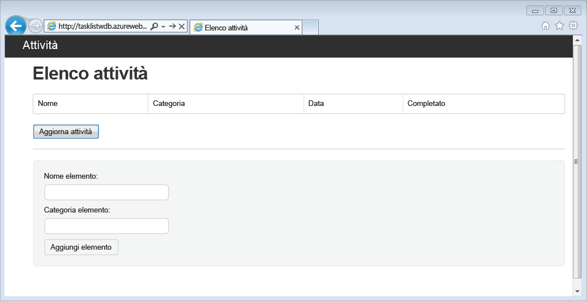
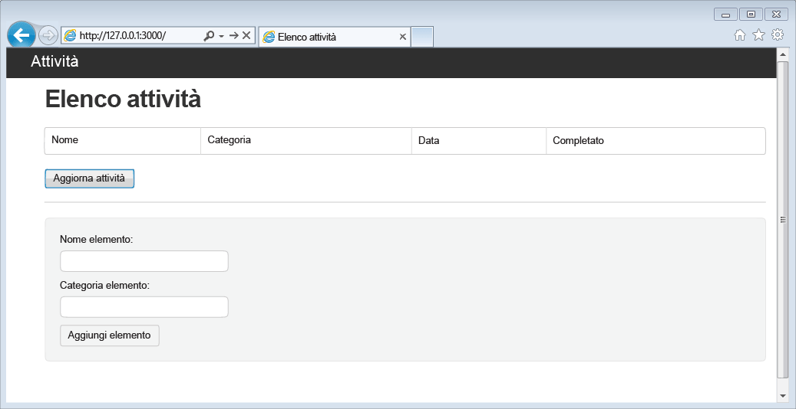
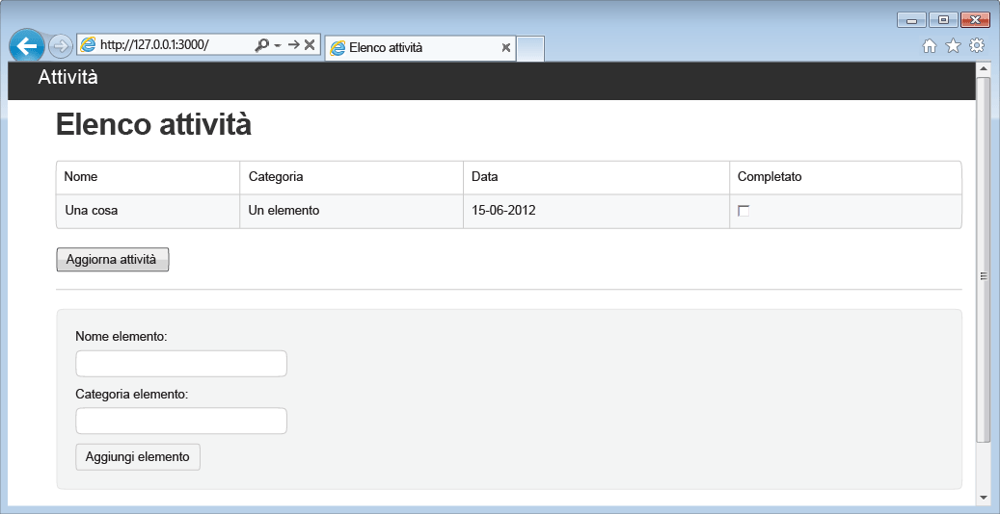

<properties 
	pageTitle="Informazioni su Node.js - esercitazione Node.js di DocumentDB | Microsoft Azure" 
	description="Informazioni su Node.js. Questa esercitazione illustra come usare il servizio Microsoft Azure DocumentDB per archiviare e accedere ai dati da un'applicazione web Node.js Express ospitata in Siti Web di Azure." 
	keywords="Application development, database tutorial, learn node.js, node.js tutorial, documentdb, azure, Microsoft azure"
	services="documentdb" 
	documentationCenter="nodejs" 
	authors="ryancrawcour" 
	manager="jhubbard" 
	editor="cgronlun"/>

<tags 
	ms.service="documentdb" 
	ms.workload="data-services" 
	ms.tgt_pltfrm="na" 
	ms.devlang="nodejs" 
	ms.topic="hero-article" 
	ms.date="07/24/2015" 
	ms.author="ryancraw"/>

# Creare un'applicazione Web Node.js con DocumentDB

> [AZURE.SELECTOR]
- [.NET](documentdb-dotnet-application.md)
- [Node.js](documentdb-nodejs-application.md)
- [Java](documentdb-java-application.md)
- [Python](documentdb-python-application.md)

Questa esercitazione Node.js illustra come usare il servizio Azure DocumentDB per archiviare e accedere ai dati da un'applicazione Node.js Express ospitata in Siti Web di Azure.

Si consiglia di iniziare guardando il video seguente, in cui viene illustrato come eseguire il provisioning di un account del database di Azure DocumentDB e archiviare documenti JSON nell'applicazione Node.js.

> [AZURE.VIDEO azure-demo-getting-started-with-azure-documentdb-on-nodejs-in-linux]

Quindi, tornare quindi a questa esercitazione Node.js, che fornisce risposte alle domande seguenti:

- Come si usa DocumentDB con il modulo npm di documentdb?
- Come si distribuisce un'applicazione Web in Sito Web di Azure?

In questa esercitazione del database verrà compilata una semplice applicazione di gestione delle attività basata su Web che consente di creare, recuperare e completare le attività. Le attività verranno memorizzate come documenti JSON in Azure DocumentDB.

Non si ha tempo di completare l'esercitazione e si preferisce ottenere semplicemente la soluzione completa. Non è un problema, è possibile ottenere la soluzione di esempio completo da [GitHub][].

## Prerequisiti

> [AZURE.TIP]Questa esercitazione Node.js presuppone già una certa esperienza nell'uso di Node.js e di Siti Web di Azure.

Prima di seguire le istruzioni di questo articolo, verificare che siano disponibili gli elementi seguenti:

- Un account Azure attivo. Se non si dispone di un account, è possibile creare un account di valutazione gratuita in pochi minuti. Per informazioni dettagliate, vedere la pagina relativa alla [versione di prova gratuita di Azure](../../pricing/free-trial/).
- [Node.js][] v0.10.29 o versioni successive.
- [Generatore di Express](http://www.expressjs.com/starter/generator.html) (è possibile installarlo tramite `npm install express-generator -g`)
- [Git][].

## Passaggio 1: Creare un account di database di DocumentDB

Il primo passaggio consiste nella creazione di un account DocumentDB. Se si dispone già di un account, è possibile passare alla sezione [Passaggio 2: Creare una nuova applicazione Node.js](#_Toc395783178).

[AZURE.INCLUDE [documentdb-create-dbaccount](../../includes/documentdb-create-dbaccount.md)]

[AZURE.INCLUDE [documentdb-keys](../../includes/documentdb-keys.md)]

## Passaggio 2: Informazioni su come creare una nuova applicazione Node.js

A questo punto si creerà un progetto base Node.js Hello World usando il framework [Express](http://expressjs.com/).

1. Aprire il terminale preferito.

2. Usare il generatore di Express per generare una nuova applicazione denominata **todo**.

		express todo

3. Aprire la nuova directory **todo** e installare le dipendenze.

		cd todo
		npm install

4. Eseguire la nuova applicazione.

		npm start

5. È possibile visualizzare la nuova applicazione passando con il browser all'indirizzo [http://localhost:3000](http://localhost:3000).

	

## Passaggio 3: Installare moduli aggiuntivi

Il file **package.json** è uno di quelli creati nella radice del progetto. Questo file contiene un elenco di moduli aggiuntivi necessari per l'applicazione Node.js. In seguito, quando si distribuirà questa applicazione in un sito Web di Azure, il file verrà usato per determinare quali moduli devono essere installati in Azure per supportare l'applicazione. Per l'esercitazione, è necessario installare altri due pacchetti.

1. Tornare al terminale e installare il modulo **async** tramite npm.

		npm install async --save

1. Installare il modulo **documentdb** tramite npm. Questo è il modulo in cui risiedono tutte le funzionalità avanzate di DocumentDB.

		npm install documentdb --save

3. Con un rapido controllo del file **package.json** dell'applicazione si dovrebbero notare i moduli aggiuntivi. Questo file indica ad Azure quali pacchetti scaricare e installare durante l'esecuzione dell'applicazione. Dovrebbe essere simile all'esempio seguente.

	

       Ciò indicherà a Node (e più avanti ad Azure) che l'applicazione dipende da questi moduli aggiuntivi.

## Passaggio 4: Uso del servizio DocumentDB in un'applicazione Node

Una volta completate le operazioni iniziali di installazione e configurazione, si può passare allo scopo effettivo di questa esercitazione, che consiste nello scrivere qualche riga di codice usando Azure DocumentDB.

### Creare il modello

1. Nella directory del progetto creare una nuova directory denominata **models**.
2. Nella directory **models** creare un nuovo file denominato **taskDao.js**. Questo file conterrà il modello per le attività create dall'applicazione.
3. Nella stessa directory **models** creare un altro nuovo file denominato **docdbUtils.js**. Questo file conterrà porzioni di codice utile e riutilizzabile, che verrà usato nell'applicazione. 
4. Copiare il codice seguente in **docdbUtils.js**

		var DocumentDBClient = require('documentdb').DocumentClient;
			
		var DocDBUtils = {
		    getOrCreateDatabase: function (client, databaseId, callback) {
		        var querySpec = {
		            query: 'SELECT * FROM root r WHERE r.id=@id',
		            parameters: [{
		                name: '@id',
		                value: databaseId
		            }]
		        };
		
		        client.queryDatabases(querySpec).toArray(function (err, results) {
		            if (err) {
		                callback(err);
		
		            } else {
		                if (results.length === 0) {
		                    var databaseSpec = {
		                        id: databaseId
		                    };
		
		                    client.createDatabase(databaseSpec, function (err, created) {
		                        callback(null, created);
		                    });
		
		                } else {
		                    callback(null, results[0]);
		                }
		            }
		        });
		    },
		
		    getOrCreateCollection: function (client, databaseLink, collectionId, callback) {
		        var querySpec = {
		            query: 'SELECT * FROM root r WHERE r.id=@id',
		            parameters: [{
		                name: '@id',
		                value: collectionId
		            }]
		        };		       
				
		        client.queryCollections(databaseLink, querySpec).toArray(function (err, results) {
		            if (err) {
		                callback(err);
		
		            } else {		
		                if (results.length === 0) {
		                    var collectionSpec = {
		                        id: collectionId
		                    };
							
				 			var requestOptions = {
								offerType: 'S1'
							};
							
		                    client.createCollection(databaseLink, collectionSpec, requestOptions, function (err, created) {
		                        callback(null, created);
		                    });
		
		                } else {
		                    callback(null, results[0]);
		                }
		            }
		        });
		    }
		};
				
		module.exports = DocDBUtils;

> [AZURE.TIP]createCollection accetta un parametro requestOptions facoltativo che può essere usato per specificare il tipo di offerta per la raccolta. Se non viene specificato alcun valore requestOptions.offerType, la raccolta verrà creata usando il tipo di offerta predefinito. Per altre informazioni sui tipi di offerta di DocumentDB, vedere [Livelli di prestazioni in DocumentDB](documentdb-performance-levels.md)
		
3. Salvare e chiudere il file **docdbUtils.js**.

4. All'inizio del file **taskDao.js** aggiungere il codice seguente per fare riferimento a **DocumentDBClient** e **docdbUtils.js** creati in precedenza:

        var DocumentDBClient = require('documentdb').DocumentClient;
		var docdbUtils = require('./docdbUtils');

4. Quindi, aggiungere il codice per definire ed esportare l'oggetto Task. Si occupa dell'inizializzazione dell'oggetto Task e della configurazione del database e della raccolta documenti che verranno usati.

		function TaskDao(documentDBClient, databaseId, collectionId) {
		  this.client = documentDBClient;
		  this.databaseId = databaseId;
		  this.collectionId = collectionId;
		
		  this.database = null;
		  this.collection = null;
		}
		
		module.exports = TaskDao;

5. Aggiungere quindi il codice seguente per definire metodi aggiuntivi nell'oggetto Task che consentano l'interazione con i dati archiviati in DocumentDB.

		TaskDao.prototype = {
		    init: function (callback) {
		        var self = this;
		
		        docdbUtils.getOrCreateDatabase(self.client, self.databaseId, function (err, db) {
		            if (err) {
		                callback(err);

		            } else {
		                self.database = db;
		                docdbUtils.getOrCreateCollection(self.client, self.database._self, self.collectionId, function (err, coll) {
		                    if (err) {
		                        callback(err);
		
		                    } else {
		                        self.collection = coll;
		                    }
		                });
		            }
		        });
		    },
		
		    find: function (querySpec, callback) {
		        var self = this;
		
		        self.client.queryDocuments(self.collection._self, querySpec).toArray(function (err, results) {
		            if (err) {
		                callback(err);
		
		            } else {
		                callback(null, results);
		            }
		        });
		    },
		
		    addItem: function (item, callback) {
		        var self = this;
		
		        item.date = Date.now();
		        item.completed = false;
		
		        self.client.createDocument(self.collection._self, item, function (err, doc) {
		            if (err) {
		                callback(err);
		
		            } else {
		                callback(null, doc);
		            }
		        });
		    },
		
		    updateItem: function (itemId, callback) {
		        var self = this;
		
		        self.getItem(itemId, function (err, doc) {
		            if (err) {
		                callback(err);
		
		            } else {
		                doc.completed = true;
		
		                self.client.replaceDocument(doc._self, doc, function (err, replaced) {
		                    if (err) {
		                        callback(err);
		
		                    } else {
		                        callback(null, replaced);
		                    }
		                });
		            }
		        });
		    },
		
		    getItem: function (itemId, callback) {
		        var self = this;
		
		        var querySpec = {
		            query: 'SELECT * FROM root r WHERE r.id=@id',
		            parameters: [{
		                name: '@id',
		                value: itemId
		            }]
		        };
		
		        self.client.queryDocuments(self.collection._self, querySpec).toArray(function (err, results) {
		            if (err) {
		                callback(err);
		
		            } else {
		                callback(null, results[0]);
		            }
		        });
		    }
		};

6. Salvare e chiudere il file **taskDao.js**.

### Creare il controller

1. Nella directory **routes** del progetto creare un nuovo file denominato **tasklist.js**. 
2. Aggiungere il seguente codice al file **tasklist.js**. In questo modo vengono caricati i moduli DocumentDBClient e asincroni usati da **tasklist.js**. È stata anche definita la funzione **TaskList** a cui viene passata un'istanza dell'oggetto **Task** definito in precedenza:

		var DocumentDBClient = require('documentdb').DocumentClient;
		var async = require('async');
		
		function TaskList(taskDao) {
		  this.taskDao = taskDao;
		}
		
		module.exports = TaskList;

3. Continuare ad aggiungere codice al file **tasklist.js** aggiungendo i metodi **showTasks, addTask** e **completeTasks**:
		
		TaskList.prototype = {
		    showTasks: function (req, res) {
		        var self = this;
		
		        var querySpec = {
		            query: 'SELECT * FROM root r WHERE r.completed=@completed',
		            parameters: [{
		                name: '@completed',
		                value: false
		            }]
		        };
		
		        self.taskDao.find(querySpec, function (err, items) {
		            if (err) {
		                throw (err);
		            }
		
		            res.render('index', {
		                title: 'My ToDo List ',
		                tasks: items
		            });
		        });
		    },
		
		    addTask: function (req, res) {
		        var self = this;
		        var item = req.body;
		
		        self.taskDao.addItem(item, function (err) {
		            if (err) {
		                throw (err);
		            }
		
		            res.redirect('/');
		        });
		    },
		
		    completeTask: function (req, res) {
		        var self = this;
		        var completedTasks = Object.keys(req.body);
		
		        async.forEach(completedTasks, function taskIterator(completedTask, callback) {
		            self.taskDao.updateItem(completedTask, function (err) {
		                if (err) {
		                    callback(err);
		                } else {
		                    callback(null);
		                }
		            });
		        }, function goHome(err) {
		            if (err) {
		                throw err;
		            } else {
		                res.redirect('/');
		            }
		        });
		    }
		};

4. Salvare e chiudere il file **tasklist.js**.
 
### Aggiungere config.json

1. Nella directory del progetto creare un nuovo file denominato **config.js**.
2. Aggiungere quanto segue a **config.json**. Definisce le impostazioni e i valori di configurazione necessari per l'applicazione.

		var config = {}
		
		config.host = process.env.HOST || "[the URI value from the DocumentDB Keys blade on http://portal.azure.com]";
		config.authKey = process.env.AUTH_KEY || "[the PRIMARY KEY value from the DocumentDB Keys blade on http://portal.azure.com]";
		config.databaseId = "ToDoList";
		config.collectionId = "Items";
		
		module.exports = config;

3. Nel file **config.js** aggiornare i valori HOST e AUTH\_KEY usando i valori presenti nel pannello Chiavi del proprio account DocumentDB nel [portale di anteprima di Microsoft Azure](http://portal.azure.com):

4. Salvare e chiudere il file **config.js**.
 
### Modificare il file app.js

1. Nella directory del progetto aprire il file **app.js**. Questo file è stato creato in precedenza quando è stata creata l'applicazione Web Express.
2. Aggiungere il codice seguente all'inizio del file **app.js**
	
		var DocumentDBClient = require('documentdb').DocumentClient;
		var config = require('./config');
		var TaskList = require('./routes/tasklist');
		var TaskDao = require('./models/taskDao');

3. Questo codice definisce il file di configurazione da usare e procede con la lettura dei valori da questo file in alcune variabili che si useranno a breve.
4. Sostituire le due righe seguenti nel file **app.js**:

		app.use('/', routes);
		app.use('/users', users); 

      con il frammento seguente:

		var docDbClient = new DocumentDBClient(config.host, {
		    masterKey: config.authKey
		});
		var taskDao = new TaskDao(docDbClient, config.databaseId, config.collectionId);
		var taskList = new TaskList(taskDao);
		taskDao.init();
		
		app.get('/', taskList.showTasks.bind(taskList));
		app.post('/addtask', taskList.addTask.bind(taskList));
		app.post('/completetask', taskList.completeTask.bind(taskList));

6. Queste righe definiscono una nuova istanza dell'oggetto **TaskDao**, con una nuova connessione a DocumentDB (usando i valori letti dal file **config.js**), inizializzano l'oggetto task e quindi associano le azioni modulo ai metodi nel controller **TaskList**.

7. Infine, salvare e chiudere il file **app.js**. La procedura è quasi terminata.
 
## Passaggio 5: Creare un'interfaccia utente

È ora possibile passare alla realizzazione di un'interfaccia utente che consenta a un utente di interagire con l'applicazione. L'applicazione Express creata usa **Jade** come motore di visualizzazione. Per altre informazioni su Jade, vedere [http://jade-lang.com/](http://jade-lang.com/).

1. Il file **layout.jade** della directory **views** viene usato come modello globale per altri file **.jade**. In questo passaggio verrà modificato in modo da usare [Twitter Bootstrap](https://github.com/twbs/bootstrap), un toolkit che semplifica la progettazione di un sito Web di aspetto gradevole. 
2. Aprire il file **layout.jade** nella cartella **views** e sostituire il contenuto con quanto segue:
	
		doctype html
		html
		  head
		    title= title
		    link(rel='stylesheet', href='//ajax.aspnetcdn.com/ajax/bootstrap/3.3.2/css/bootstrap.min.css')
		    link(rel='stylesheet', href='/stylesheets/style.css')
		  body
		    nav.navbar.navbar-inverse.navbar-fixed-top
		      div.navbar-header
		        a.navbar-brand(href='#') My Tasks
		    block content
		    script(src='//ajax.aspnetcdn.com/ajax/jQuery/jquery-1.11.2.min.js')
		    script(src='//ajax.aspnetcdn.com/ajax/bootstrap/3.3.2/bootstrap.min.js')

	Ciò in effetti comunica al motore **Jade** di eseguire il rendering di una parte di HTML per l'applicazione e crea un **blocco** denominato **content** tramite cui è possibile fornire il layout per le pagine di contenuto. Salvare e chiudere questo file **layout.jade**.

4. Aprire il file **index.jade**, la visualizzazione che sarà usata dall'applicazione, quindi sostituire il contenuto del file con quanto segue:

		extends layout
		
		block content
		  h1 #{title}
		  br
		
		  form(action="/completetask", method="post")
		    table.table.table-striped.table-bordered
		      tr
		        td Name
		        td Category
		        td Date
		        td Complete
		      if (typeof tasks === "undefined")
		        tr
		          td
		      else
		        each task in tasks
		          tr
		            td #{task.name}
		            td #{task.category}
		            - var date  = new Date(task.date);
		            - var day   = date.getDate();
		            - var month = date.getMonth() + 1;
		            - var year  = date.getFullYear();
		            td #{month + "/" + day + "/" + year}
		            td
		              input(type="checkbox", name="#{task.id}", value="#{!task.completed}", checked=task.completed)
		    button.btn(type="submit") Update tasks
		  hr
		  form.well(action="/addtask", method="post")
		    label Item Name:
		    input(name="name", type="textbox")
		    label Item Category:
		    input(name="category", type="textbox")
		    br
		    button.btn(type="submit") Add item

	Ciò estende il layout e fornisce contenuto per il segnaposto **content** già visto in precedenza nel file **layout.jade**.
	
	In questo layout sono stati creati due moduli HTML. Il primo modulo contiene una tabella per i dati e un pulsante che consente di aggiornare gli elementi mediante la pubblicazione nel metodo **/completetask** del controller. Il secondo modulo contiene due campi di input e un pulsante che consente di creare un nuovo elemento tramite la pubblicazione nel metodo **/addtask** del controller.
	
	Ciò è tutto quanto è necessario per il funzionamento dell'applicazione.

5. Aprire il file **style.css** nella directory **public\\stylesheets** e sostituire il codice con quanto segue:

		body {
		  padding: 50px;
		  font: 14px "Lucida Grande", Helvetica, Arial, sans-serif;
		}
		a {
		  color: #00B7FF;
		}
		.well label {
		  display: block;
		}
		.well input {
		  margin-bottom: 5px;
		}
		.btn {
		  margin-top: 5px;
		  border: outset 1px #C8C8C8;
		}

	Salvare e chiudere questo file **style.css**.

## Passaggio 6: Esecuzione dell'applicazione in locale

1. Per testare l'applicazione sul computer locale, eseguire `npm start` in un terminale per avviare l'applicazione, quindi avviare un browser con una pagina simile all'immagine seguente:

	

2. Usare i campi forniti per Item, Item Name e Category per immettere le informazioni e quindi fare clic su **Add Item**.

3. La pagina verrà aggiornata e verrà visualizzato il nuovo elemento creato nell'elenco ToDo.

	

4. Per completare un'attività, è sufficiente selezionare la casella di controllo nella colonna Complete e quindi fare clic su **Update tasks**.

## Passaggio 7: Distribuire il progetto di sviluppo dell'applicazione in Siti Web di Azure

1. Se non è ancora stato fatto, abilitare un repository Git per il sito Web di Azure. Le istruzioni su come eseguire questa operazione sono disponibili [qui](../web-sites-publish-source-control-git.md#step4).

2. Aggiungere il sito Web di Azure come Git remoto.

		git remote add azure https://username@your-azure-website.scm.azurewebsites.net:443/your-azure-website.git

3. Distribuire mediante push al sito remoto.

		git push azure master

4. Dopo alcuni secondi, Git completerà la pubblicazione dell'applicazione Web e avvierà un browser in cui sarà possibile ammirare il proprio lavoro in esecuzione in Azure.

## Passaggi successivi

Congratulazioni. Si è creata la prima applicazione Web Express Node.js usando Azure DocumentDB e la si è pubblicata in Siti Web di Azure.

Il codice sorgente per l'applicazione di riferimento completa è disponibile per il download da [GitHub][].

Per altre informazioni, vedere il [Centro per sviluppatori di Node. js](/develop/nodejs/).

[Node.js]: http://nodejs.org/
[Git]: http://git-scm.com/
[Github]: https://github.com/Azure-Samples/documentdb-node-todo-app
 

<!---HONumber=Oct15_HO3-->