<properties
    pageTitle="Creare un'app Web con Python e Flask usando DocumentDB | Microsoft Azure"
    description="Informazioni sull'uso di DocumentDB per archiviare e accedere ai dati da un'applicazione Web Python e Flask (MVC) ospitata in Azure."
    services="documentdb"
    documentationCenter="python"
    authors="ryancrawcour"
    manager="jhubbard"
    editor="cgronlun"/>

<tags
    ms.service="documentdb"
    ms.workload="data-management"
    ms.tgt_pltfrm="na"
    ms.devlang="python"
    ms.topic="hero-article"
    ms.date="07/07/2015"
    ms.author="ryancraw"/>

# Creare un'applicazione Web con Python e Flask (MVC) usando DocumentDB

Per evidenziare il modo in cui i clienti possono sfruttare efficientemente Azure DocumentDB per archiviare ed eseguire query su documenti JSON, questo argomento fornisce un'esercitazione end-to-end che mostra come creare un'applicazione Web di voto usando Azure Document DB.

Questa esercitazione mostra come usare il servizio DocumentDB fornito da Azure per archiviare e accedere ai dati forniti da un'applicazione Web Python ospitata in Azure e presuppone che si siano già usati Python e Siti Web di Azure.

Contenuto dell'esercitazione:

1. Creare ed eseguire il provisioning di un account DocumentDB.
2. Creare un'applicazione MVC Python.
3. Connettersi e usare Azure DocumentDB dall'applicazione Web.
4. Distribuire l'applicazione Web in Siti Web di Azure.

Seguendo questa esercitazione, si creerà una semplice applicazione di voto che consente di votare per un sondaggio.

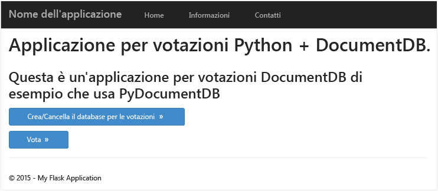

## Prerequisiti

Prima di seguire le istruzioni di questo articolo, verificare che siano disponibili i seguenti elementi:

- [Visual Studio 2013](http://www.visualstudio.com/) o una versione successiva oppure Visual Studio Express, che è la versione gratuita.
- Python Tools per Visual Studio, disponibile [qui][].
- Azure SDK per Visual Studio 2013, versione 2.4 o successiva, disponibile [qui][1].
- Python 2.7, disponibile [qui][2].
- Compilatore Microsoft Visual C++ per Python 2.7, disponibile [qui][3].

## Passaggio 1: Creare un account di database di DocumentDB

Il primo passaggio consiste nella creazione di un account DocumentDB. Se si dispone già di un account, è possibile passare alla sezione [Passaggio 2: Creare una nuova applicazione web Python Flask](#Step-2:-Create-a-new-Python-Flask-Web-Application).

[AZURE.INCLUDE [documentdb-create-dbaccount](../../includes/documentdb-create-dbaccount.md)]

[AZURE.INCLUDE [documentdb-keys](../../includes/documentdb-keys.md)]

  Verrà ora illustrata in modo dettagliato la procedura per creare un'applicazione Web Python Flask completamente nuova.

## Passaggio 2: Creare una nuova applicazione Web Python Flask

1. Aprire Visual Studio, quindi fare clic su **File** -> **Nuovo progetto** -> **Python** ->, **Flask Web Project**, e creare un nuovo progetto con il nome **esercitazione**.

	Se è la prima volta che si usa Flask, si tratta di un framework Web che consente di creare applicazioni Web in Python più velocemente. [Fare clic qui per accedere alle esercitazioni per Flask][].

	

2. Verrà chiesto se si vogliono installare pacchetti esterni. Selezionare **Installa in un ambiente virtuale**. Assicurarsi di usare Python 2.7 come ambiente di base, poiché PyDocumentDB attualmente non supporta Python 3.x. Questo configurerà l'ambiente virtuale Python per il progetto.

	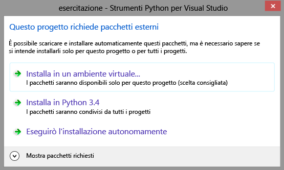

## Passaggio 3: Modificare l'applicazione Web Python Flask

### Aggiungere i pacchetti Flask al progetto

Dopo la configurazione del progetto sarà necessario aggiungere alcuni pacchetti Flask necessari per il progetto, compreso pydocumentdb, il pacchetto python per DocumentDB.

1. Aprire il file denominato **requirements.txt** e sostituire il contenuto esistente con quello riportato di seguito:

    	flask==0.9
    	flask-mail==0.7.6
    	sqlalchemy==0.7.9
    	flask-sqlalchemy==0.16
    	sqlalchemy-migrate==0.7.2
    	flask-whooshalchemy==0.55a
    	flask-wtf==0.8.4
    	pytz==2013b
    	flask-babel==0.8
    	flup
    	pydocumentdb>=1.0.0

2. Fare clic con il pulsante destro del mouse su **env**, quindi fare clic su **installa da requirements.txt**.

	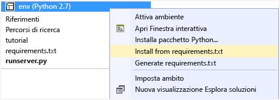

> [AZURE.NOTE]In rari casi è possibile che venga visualizzato un errore nella finestra di output. In un'eventualità di questo tipo, verificare se l'errore è correlato alla pulizia. Talvolta la pulizia può avere esito negativo, ma l'installazione viene comunque completata correttamente (scorrere verso l'alto nella finestra di output per verificarlo).  Se si verifica questa situazione, è possibile continuare senza problemi.

### Verifica dell'ambiente virtuale

È importante verificare che tutto sia installato correttamente.

- Avviare il sito Web premendo **F5**; verrà avviato il server di sviluppo Flask e il browser Web. Dovrebbe essere visualizzata la pagina seguente:

	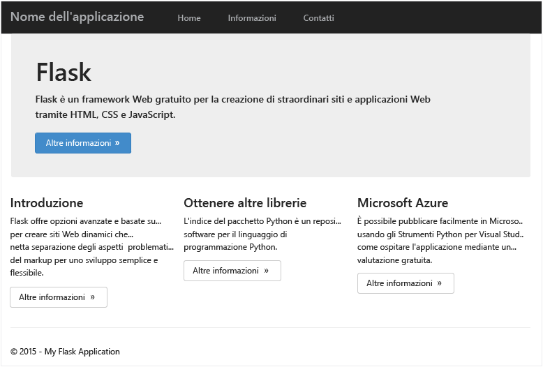

### Creare definizioni di database, raccolta e documento

Verrà ora creata l'applicazione di polling.

- Aggiungere un file Python facendo clic con il pulsante destro del mouse sulla cartella denominata **tutorial** in Esplora soluzioni. Denominare il file **forms.py**.  

    	from flask.ext.wtf import Form
    	from wtforms import RadioField

    	class VoteForm(Form):
        	deploy_preference  = RadioField('Deployment Preference', choices=[
            	('Web Site', 'Web Site'),
            	('Cloud Service', 'Cloud Service'),
            	('Virtual Machine', 'Virtual Machine')], default='Web Site')

### Aggiungere le importazioni necessarie a views.py

- Aggiungere le istruzioni import seguenti all'inizio del file **views.py**. Queste importano i pacchetti PythonSDK e Flask di DocumentDB.

    	from forms import VoteForm
    	import config
    	import pydocumentdb.document_client as document_client

### Create database, raccolta e documento

- Aggiungere il codice seguente al file **views.py**. Verrà creato il database usato dal form. Non eliminare nessuna porzione del codice esistente dal file **views.py**. Aggiungere semplicemente la parte nuova alla fine del file.

    	@app.route('/create')
    	def create():
        	"""Renders the contact page."""
        	client = document_client.DocumentClient(config.DOCUMENTDB_HOST, {'masterKey': config.DOCUMENTDB_KEY})

        	# Attempt to delete the database.  This allows this to be used to recreate as well as create
        	try:
            	db = next((data for data in client.ReadDatabases() if data['id'] == config.DOCUMENTDB_DATABASE))
            	client.DeleteDatabase(db['_self'])
        	except:
            	pass

       		# Create database
        	db = client.CreateDatabase({ 'id': config.DOCUMENTDB_DATABASE })
        	# Create collection
        	collection = client.CreateCollection(db['_self'],{ 'id': config.DOCUMENTDB_COLLECTION }, { 'offerType': 'S1' })
        	# Create document
        	document = client.CreateDocument(collection['_self'],
            	{ 'id': config.DOCUMENTDB_DOCUMENT,
            	'Web Site': 0,
            	'Cloud Service': 0,
            	'Virtual Machine': 0,
            	'name': config.DOCUMENTDB_DOCUMENT })

        	return render_template(
            	'create.html',
            	title='Create Page',
            	year=datetime.now().year,
            	message='You just created a new database, collection, and document.  Your old votes have been deleted')

> [AZURE.TIP]Il metodo **CreateCollection** accetta un **RequestOptions** facoltativo come 3° parametro. Consente di specificare il tipo di offerta per la raccolta. Se non viene specificato alcun valore offerType, la raccolta verrà creata usando il tipo di offerta predefinito. Per altre informazioni sui tipi di offerta di DocumentDB, vedere [Livelli di prestazioni in DocumentDB](documentdb-performance-levels.md).
>
### Leggere database, raccolta, documento e inviare il form

- Aggiungere il codice seguente al file **views.py**. Verrà configurato il form e verranno letti il database, la raccolta e il documento. Non eliminare nessuna porzione del codice esistente dal file **views.py**. Aggiungere semplicemente la parte nuova alla fine del file.

    	@app.route('/vote', methods=['GET', 'POST'])
    	def vote():
        	form = VoteForm()
        	replaced_document ={}
        	if form.validate_on_submit(): # is user submitted vote  
            	client = document_client.DocumentClient(config.DOCUMENTDB_HOST, {'masterKey': config.DOCUMENTDB_KEY})

            	# Read databases and take the first since the id should not be duplicated.
            	db = next((data for data in client.ReadDatabases() if data['id'] == config.DOCUMENTDB_DATABASE))

            	# Read collections and take the first since the id should not be duplicated.
            	coll = next((coll for coll in client.ReadCollections(db['_self']) if coll['id'] == config.DOCUMENTDB_COLLECTION))

            	# Read documents and take the first since the id should not be duplicated.
            	doc = next((doc for doc in client.ReadDocuments(coll['_self']) if doc['id'] == config.DOCUMENTDB_DOCUMENT))

            	# Take the data from the deploy_preference and increment your database
            	doc[form.deploy_preference.data] = doc[form.deploy_preference.data] + 1
            	replaced_document = client.ReplaceDocument(doc['_self'], doc)

            	# Create a model to pass to results.html
            	class VoteObject:
                	choices = dict()
                	total_votes = 0

            	vote_object = VoteObject()
            	vote_object.choices = {
                	"Web Site" : doc['Web Site'],
                	"Cloud Service" : doc['Cloud Service'],
                	"Virtual Machine" : doc['Virtual Machine']
            	}
            	vote_object.total_votes = sum(vote_object.choices.values())

            	return render_template(
                	'results.html',
                	year=datetime.now().year,
                	vote_object = vote_object)

        	else :
            	return render_template(
                	'vote.html',
                	title = 'Vote',
                	year=datetime.now().year,
                	form = form)

### Creare i file HTML

Aggiungere i seguenti file HTML nella cartella templates: create.html, results.html, vote.html.

1. Aggiungere il codice seguente al file **create.html**. Questa operazione consente di visualizzare un messaggio che comunica l'avvenuta creazione di un nuovo database, di una raccolta e di un documento.

    	
    	
    	<h2>{{ title }}.</h2>
    	<h3>{{ message }}</h3>
    	
<a href="{{ url_for('vote') }}" class="btn btn-primary btn-large">Vote &raquo;</a>

    	

2. Aggiungere il codice seguente a **results.html**. Questa operazione consente di visualizzare i risultati del sondaggio.

    	
    	
    	<h2>Results of the vote</h2>
   	 	 

    	
    	

        	
{{choice}}

        	

            	

                	

                    	{{vote_object.choices[choice]}}
                	

            	

        	

    	

    	

    	 
    	<a class="btn btn-primary" href="{{ url_for('vote') }}">Vote again?</a>
    	

3. Aggiungere il codice seguente a **vote.html**. Questa operazione consente di visualizzare il sondaggio e accettare i voti. Alla registrazione dei voti il controllo viene passato a views.py che riconoscerà il voto espresso e ne effettuerà l'aggiunta al documento.

    	
    	
    	<h2>What is your favorite way to host an application on Azure?</h2>
    	<form action="" method="post" name="vote">
        	{{form.hidden_tag()}}
        	{{form.deploy_preference}}
        	<button class="btn btn-primary" type="submit">Vote</button>
    	</form>
    	

4. Sostituire il contenuto del file **index.html** con il codice seguente. Questo fungerà da pagina di destinazione per l'applicazione.

    	
    	
    	<h2>Python + DocumentDB Voting Application.</h2>
    	<h3>This is a sample DocumentDB voting application using PyDocumentDB</h3>
    	
<a href="{{ url_for('create') }}" class="btn btn-primary btn-large">Create/Clear the Voting Database &raquo;</a>

    	
<a href="{{ url_for('vote') }}" class="btn btn-primary btn-large">Vote &raquo;</a>

    	

### Aggiungere un file di configurazione e modificare \_\_init\_\_.py

1. Fare clic con il pulsante destro del mouse sull'esercitazione relativa al nome di progetto e aggiungere un file: **config.py**. Questo file config è richiesto per i moduli in Flask. È possibile usarlo anche per fornire una chiave privata. Tale chiave non sarà tuttavia necessaria per questa esercitazione.

2. Aggiungere il codice seguente al file config.py Modificare i valori di **DOCUMENTDB\_HOST** e **DOCUMENTDB\_KEY**.

    	CSRF_ENABLED = True
    	SECRET_KEY = 'you-will-never-guess'

    	DOCUMENTDB_HOST = 'https://YOUR_DOCUMENTDB_NAME.documents.azure.com:443/'
    	DOCUMENTDB_KEY = 'YOUR_SECRET_KEY_ENDING_IN_=='

    	DOCUMENTDB_DATABASE = 'voting database'
    	DOCUMENTDB_COLLECTION = 'voting collection'
    	DOCUMENTDB_DOCUMENT = 'voting document'

3. Analogamente, sostituire il contenuto di **\_\_init\_\_.py** con il codice seguente.

    	from flask import Flask
    	app = Flask(__name__)
    	app.config.from_object('config')
    	import tutorial.views

4. Dopo avere eseguito i passaggi illustrati sopra, l'aspetto previsto di Esplora soluzioni sarà simile al seguente.

	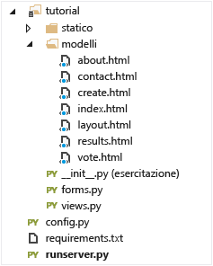

## Passaggio 4: Esecuzione dell'applicazione in locale

1. Premere F5 o il pulsante **Esegui** in Visual Studio. Sullo schermo verrà visualizzato quanto segue.

	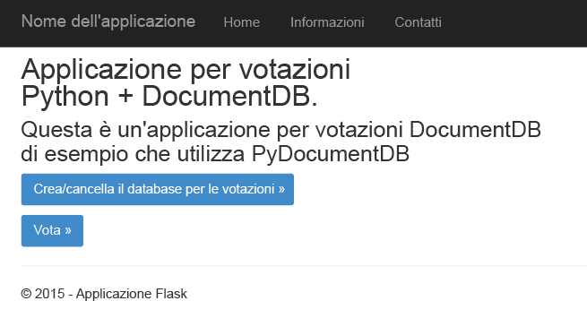

2. Fare clic su **Creare o deselezionare il Database di voto** per generare il database.

	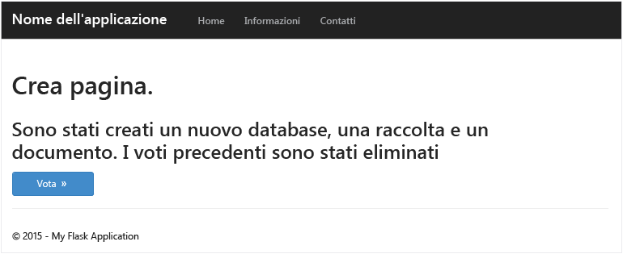

3. Fare quindi clic su **Voto** e selezionare un'opzione.

	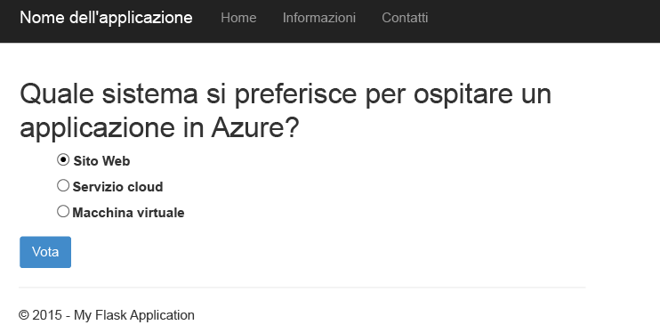

4. Ogni voto espresso va a incrementare il contatore appropriato.

	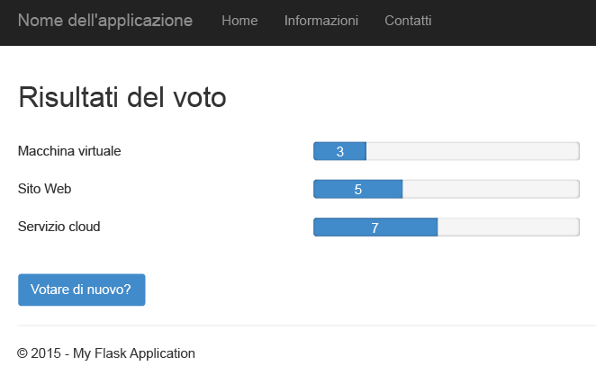

## Passaggio 5: Distribuire l'applicazione nei siti web di Azure

Ora che l'applicazione completa funziona correttamente con DocumentDB, sarà possibile distribuirla in Siti Web di Azure.

1. Fare clic con il pulsante destro del mouse sul progetto in Esplora soluzioni (assicurarsi che il progetto non sia ancora in esecuzione localmente) quindi selezionare **Pubblica**. Selezionare quindi **Siti Web di Microsoft Azure**.

 	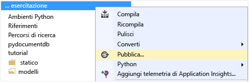

2. Configurare il sito Web di Azure fornendo le credenziali e fare clic su **Pubblica**.

	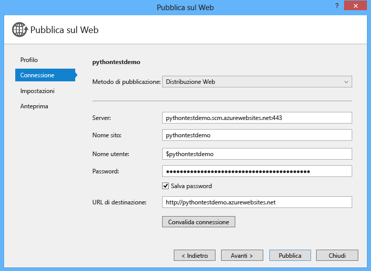

3. Dopo alcuni secondi, Visual Studio completerà la pubblicazione dell'applicazione Web e avvierà un browser in cui sarà possibile ammirare il proprio lavoro in esecuzione in Azure.

## Passaggi successivi

Congratulazioni. Si è creata la prima applicazione Python usando Azure DocumentDB e la si è pubblicata in Siti Web di Azure.

Per aggiungere altre funzionalità all'applicazione, esaminare le API disponibili nell'[SDK per Python di DocumentDB](https://pypi.python.org/pypi/pydocumentdb).

  [Fare clic qui per accedere alle esercitazioni per Flask]: http://blog.miguelgrinberg.com/post/the-flask-mega-tutorial-part-i-hello-world
  [Visual Studio Express]: http://www.visualstudio.com/products/visual-studio-express-vs.aspx
  [qui]: http://aka.ms/ptvs
  [1]: http://go.microsoft.com/fwlink/?linkid=254281&clcid=0x409
  [2]: https://www.python.org/downloads/windows/
  [3]: http://aka.ms/vcpython27
  [Microsoft Web Platform Installer]: http://www.microsoft.com/web/downloads/platform.aspx
  [Azure portal]: http://portal.azure.com

<!---HONumber=August15_HO7-->