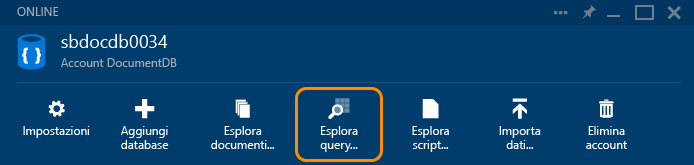
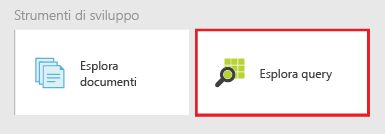
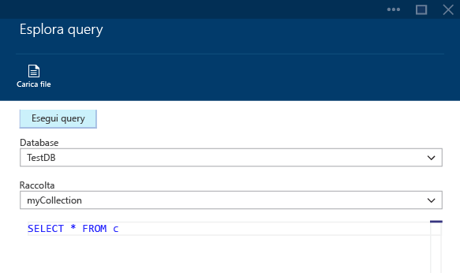
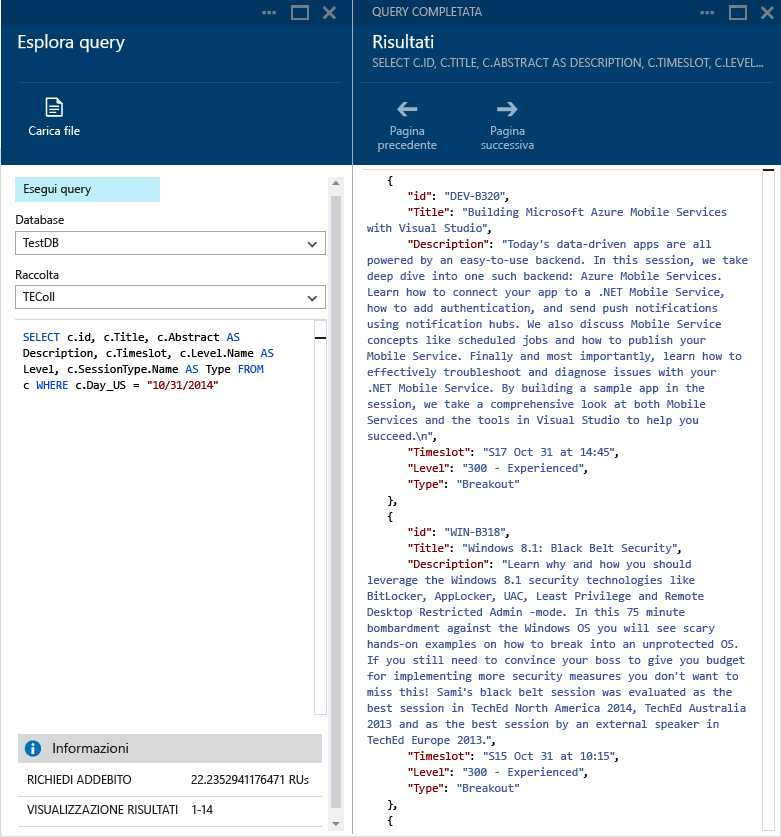
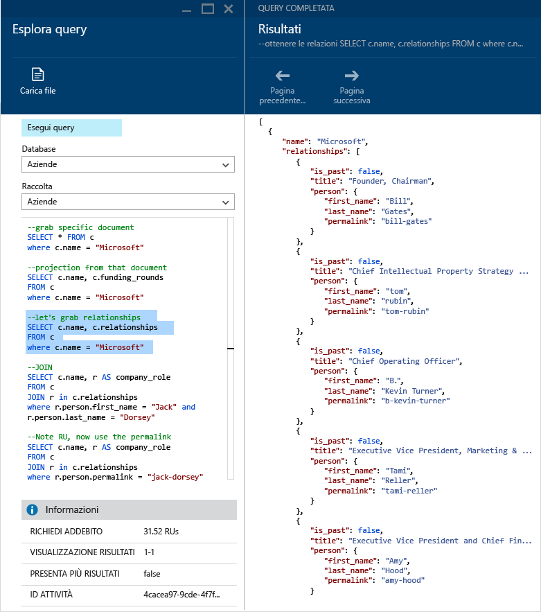
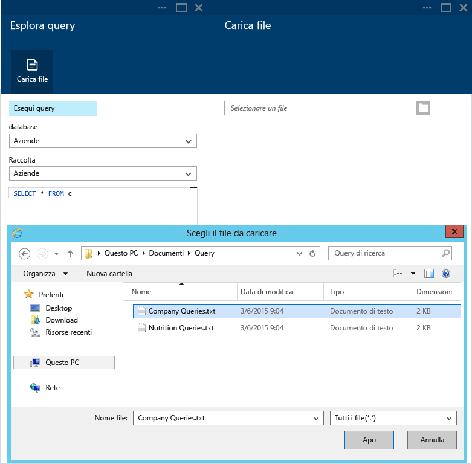
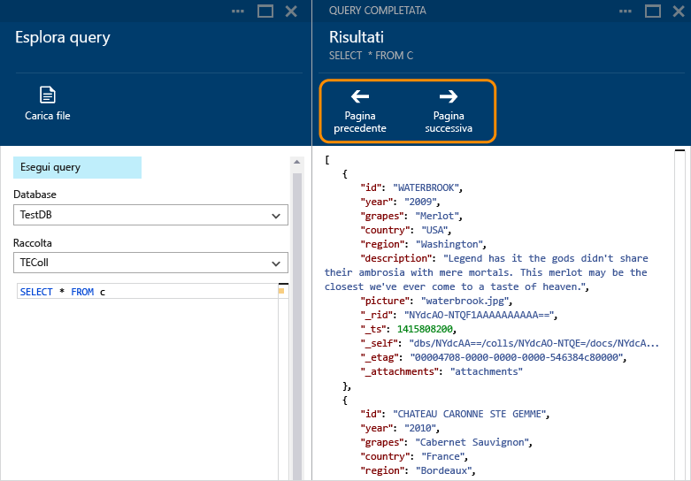
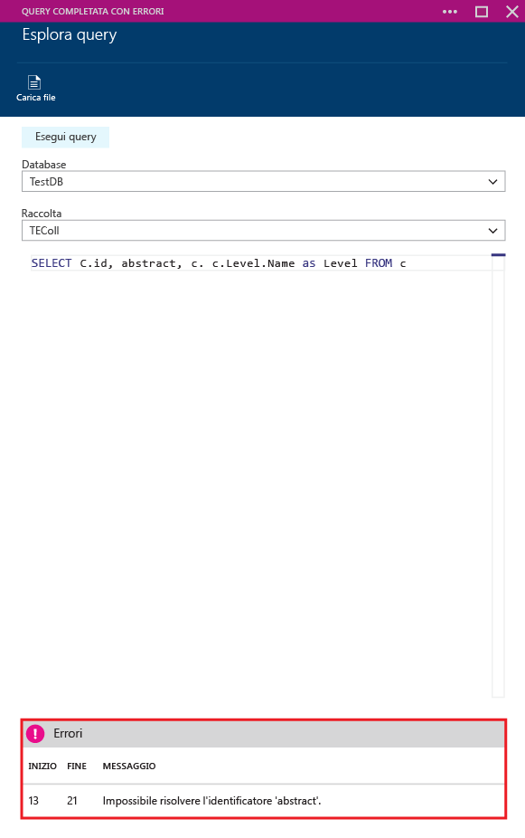

<properties 
	pageTitle="Creare, modificare ed eseguire query SQL in una raccolta di DocumentDB tramite Esplora query | Microsoft Azure" 
	description="Informazioni su Esplora query di DocumentDB, uno strumento del portale di Azure per creare, modificare ed eseguire query SQL in una raccolta di DocumentDB." 
	services="documentdb" 
	authors="AndrewHoh" 
	manager="jhubbard" 
	editor="monicar" 
	documentationCenter=""/>

<tags 
	ms.service="documentdb" 
	ms.workload="data-services" 
	ms.tgt_pltfrm="na" 
	ms.devlang="na" 
	ms.topic="get-started-article"
	ms.date="12/01/2015" 
	ms.author="anhoh"/>

# Creare, modificare ed eseguire query SQL in una raccolta di DocumentDB tramite Esplora query #

Questo articolo offre una panoramica di Esplora query per [Microsoft Azure DocumentDB](https://azure.microsoft.com/services/documentdb/), uno strumento del portale di Microsoft Azure che consente di creare, modificare ed eseguire query in una raccolta di DocumentDB.

Dopo aver completato questa esercitazione, si potrà rispondere alle domande seguenti:

-	Come è possibile creare, modificare ed eseguire query con facilità in una raccolta di DocumentDB tramite un Web browser?
-	Come è possibile spostarsi facilmente tra le pagine dei risultati delle query in DocumentDB tramite un Web browser?
-	Come è possibile risolvere errori di sintassi delle query per DocumentDB? 

##Avviare e spostarsi in Esplora query##

Esplora query può essere avviato da qualsiasi account, database e pannelli di raccolte di DocumentDB.
  
1. Nella parte superiore del pannello di database o account di DocumentDB, fare semplicemente clic sul comando **Esplora query**.

	

2. In alternativa, nella parte inferiore di ogni pannello è presente una sezione **Strumenti di sviluppo** che contiene il riquadro **Esplora query**.
	
	

2. Fare clic su questa sezione per avviare Esplora query.

	Gli elenchi a discesa **Database** e **Raccolta** vengono precompilati a seconda del contesto in cui viene avviato Esplora query. Ad esempio, se viene avviato da un pannello di database, viene prepopolato il database corrente. Se viene avviato da un pannello della raccolta, viene prepopolata la raccolta corrente.

	

##Creare, modificare ed eseguire query tramite Esplora query##

Esplora query consente di creare, modificare ed eseguire query in modo semplice su una raccolta di DocumentDB e offre l'evidenziazione delle parole chiave e dei valori principali per migliorare l'esperienza di creazione delle query.

- Quando si apre inizialmente Esplora query, viene fornita una query predefinita SELECT * FROM c. È possibile accettare la query predefinita oppure crearne una propria e quindi usare il pulsante **Esegui query** per visualizzare i risultati. Esplora query supporta il linguaggio di query SQL DocumentDB come descritto in [Eseguire query con DocumentDB](documentdb-sql-query.md).

	

- È inoltre possibile immettere più query, evidenziare quella che si vuole eseguire e quindi scegliere il pulsante **Eseguire query** per visualizzare i risultati.

	

- È possibile caricare il contenuto di un file esistente tramite il comando **Carica file**.

	

- Per impostazione predefinita, Esplora query restituisce risultati in set di 100. Se la query produce più di 100 risultati, usare semplicemente i comandi **Pagina successiva** e **Pagina precedente** per spostarsi all'interno del set di risultati.

	

- Le query completate forniscono informazioni quali l'addebito di richiesta, il set di risultati attualmente visualizzato e se sono presenti altri risultati, nel qual caso è possibile accedervi tramite il comando **Pagina successiva**, come descritto in precedenza.

	

- Analogamente, se una query viene completata con errori, Esplora query visualizza un elenco di errori che possono facilitare la risoluzione dei problemi.

	

##Passaggi successivi

- Per altre informazioni su DocumentDB, vedere [qui](http://azure.com/docdb).
- Per altre informazioni sulla grammatica SQL DocumentDB supportata in Esplora query, fare clic [qui](documentdb-sql-query.md).
 

<!---HONumber=AcomDC_0128_2016-->