<properties
	pageTitle="Visualizzare, modificare, creare e caricare documenti JSON tramite Esplora documenti di DocumentDB | Microsoft Azure"
	description="Informazioni su Esplora documenti di DocumentDB, uno strumento del portale di Azure per visualizzare, modificare, creare e caricare documenti JSON con DocumentDB."
	services="documentdb"
	authors="AndrewHoh"
	manager="jhubbard"
	editor="monicar"
	documentationCenter=""/>

<tags
	ms.service="documentdb"
	ms.workload="data-services"
	ms.tgt_pltfrm="na"
	ms.devlang="na"
	ms.topic="get-started-article" 
	ms.date="10/26/2015"
	ms.author="anhoh"/>

# Visualizzare, modificare, creare e caricare documenti JSON tramite Esplora documenti di DocumentDB #

Questo articolo offre una panoramica di Esplora documenti di [Microsoft Azure DocumentDB](http://azure.microsoft.com/services/documentdb/), uno strumento del portale di Azure che consente di visualizzare, modificare, creare e caricare documenti JSON con DocumentDB.

Dopo aver completato questa esercitazione, si potrà rispondere alle domande seguenti:

-	In che modo è possibile creare, visualizzare, modificare ed eliminare facilmente singoli documenti di DocumentDB tramite un Web browser?
-	In che modo è possibile visualizzare facilmente le proprietà di sistema di un documento di DocumentDB tramite un Web browser?
-	In che modo è possibile eseguire facilmente l'inserimento in blocco di documenti in DocumentDB tramite un Web browser?

##Avviare Esplora documenti##

Esplora documenti può essere avviato da qualsiasi account, database e pannelli di raccolte di DocumentDB.

1. Nella parte superiore del pannello di database o account di DocumentDB, fare semplicemente clic sul comando **Esplora documenti**.

	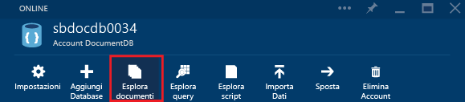
 
2. In alternativa, nella parte inferiore di ogni pannello si trova un filtro **Strumenti di sviluppo** che contiene la parte **Esplora documenti**.

	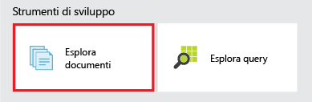

2. Fare semplicemente clic sul riquadro per avviare Esplora documenti.

	
Gli elenchi a discesa **Database** e **Raccolta** vengono precompilati a seconda del contesto in cui si avvia Esplora documenti. Ad esempio, se viene avviato da un pannello di database, viene prepopolato il database corrente. Se viene avviato da un pannello della raccolta, viene prepopolata la raccolta corrente.

	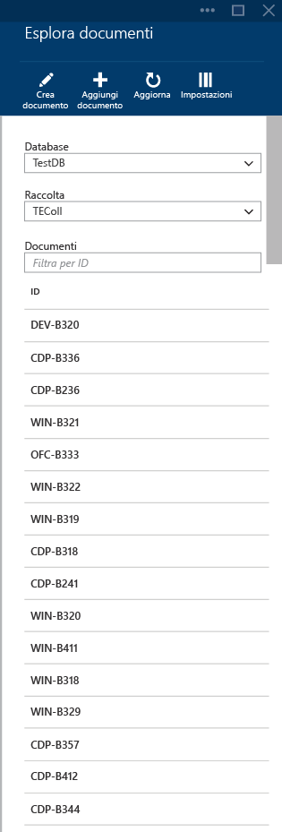

##Visualizzare, creare e modificare i documenti con Esplora documenti##

Esplora documenti consente di creare, modificare ed eliminare facilmente i documenti.

- Per creare un documento, fare semplicemente clic sul comando **Crea documento**. Verrà fornito un frammento di codice JSON minimo.

	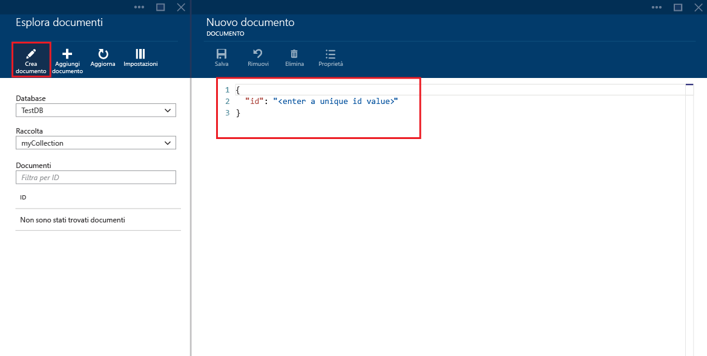

- Digitare o incollare semplicemente il contenuto JSON del documento che si desidera creare e quindi fare clic sul comando **Salva** per eseguire il commit del documento.

	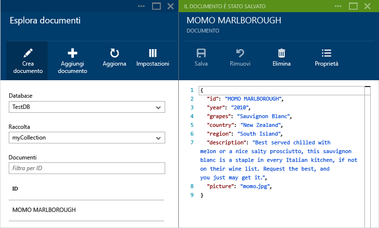

	> [AZURE.NOTE]Se non si specifica una proprietà "ID", Esplora documenti aggiunge automaticamente una proprietà ID e genera un GUID come valore ID.

- Se si dispone già di dati di file JSON, MongoDB, SQL Server, file CSV, archiviazione tabelle di Azure, Amazon DynamoDB, HBase o di altre raccolte di DocumentDB, è possibile usare lo [strumento di migrazione dati](documentdb-import-data.md) di DocumentDB per importare rapidamente i dati.

- Per modificare un documento esistente, è sufficiente selezionarlo in Esplora documenti, modificarlo nel modo che si preferisce, quindi fare clic sul comando **Salva**.

	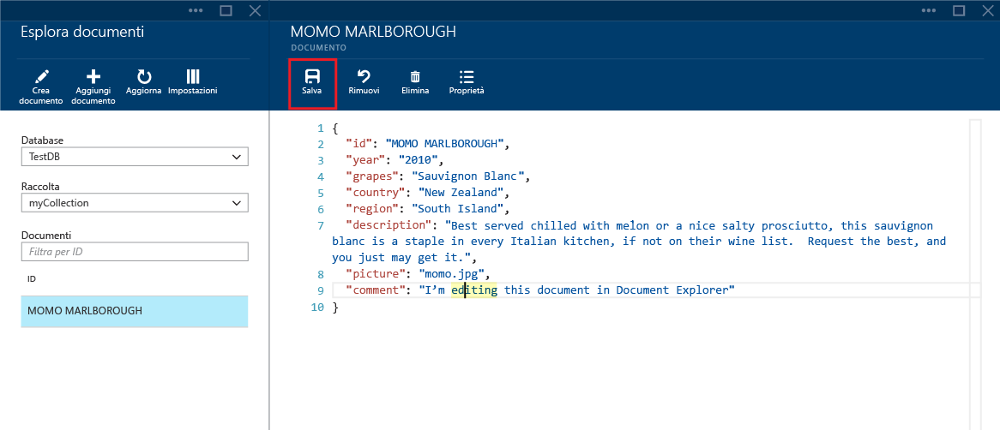

- Se si modifica un documento e si decide di eliminare il set di modifiche corrente, fare semplicemente clic sul comando Annulla e confermare l'azione. Verrà ricaricato lo stato precedente del documento.

	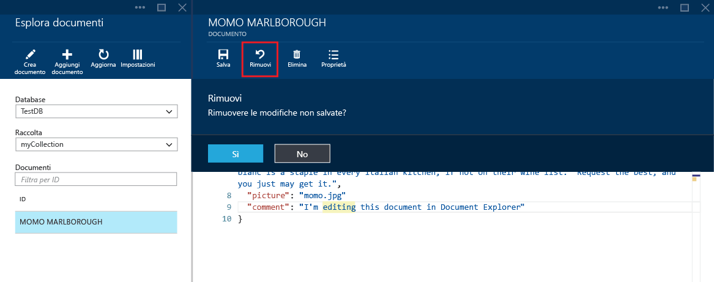

- Per eliminare un documento, selezionarlo, fare clic sul comando **Elimina** e quindi confermare l'eliminazione. Dopo la conferma, il documento viene immediatamente rimosso dall'elenco di Esplora documenti:

	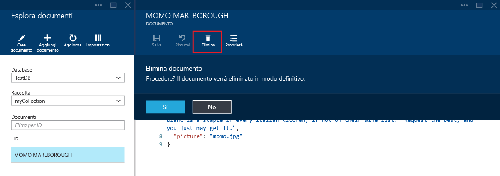

- Si noti che Esplora documenti verifica che un documento nuovo o modificato includa contenuto JSON valido. È anche possibile passare il puntatore sopra la sezione non corretta per ottenere informazioni dettagliate sull'errore di convalida.

	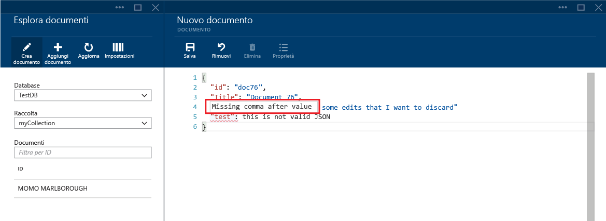

- Esplora documenti impedisce anche di salvare un documento con contenuto JSON non valido.

	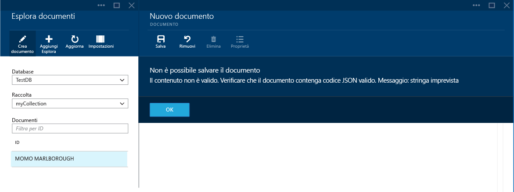

- Infine, Esplora documenti consente di visualizzare facilmente le proprietà di sistema del documento attualmente caricato facendo clic sul comando **Proprietà**.

	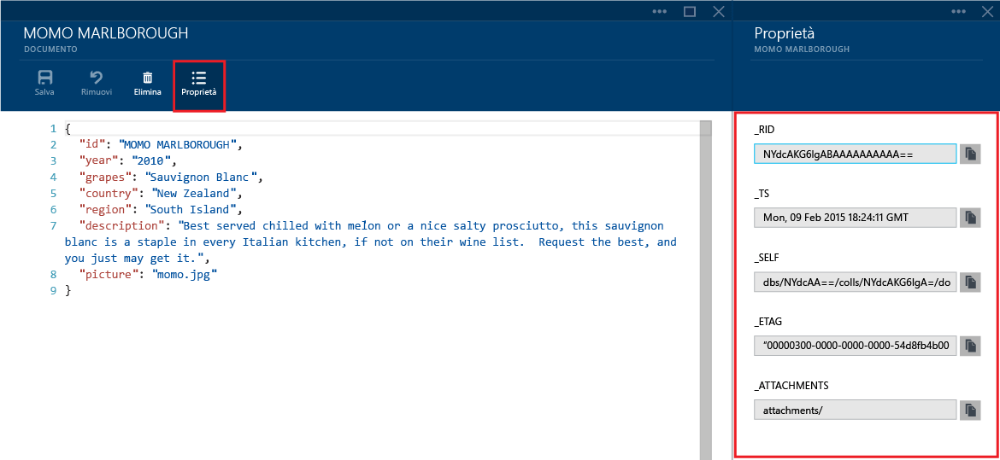

	> [AZURE.NOTE]La proprietà timestamp (\_ts) viene rappresentata internamente come periodo, ma Esplora documenti consente di visualizzare il valore in un formato GMT leggibile.

##Le opzioni di navigazione di Esplora documenti e le impostazioni avanzate##

Esplora documenti supporta numerose opzioni di navigazione e impostazioni avanzate.

1. Per impostazione predefinita, Esplora documenti carica i primi 100 documenti della raccolta selezionata, dal meno recente al più recente, in base alla data di creazione. È possibile caricare altri documenti (in batch di 100) selezionando l'opzione **Carica altro** nella parte inferiore del pannello di Esplora documenti. Il comportamento predefinito può essere modificato scegliendo il comando Impostazioni nella parte superiore del pannello di Esplora documenti.

	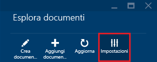

2. Nel pannello Impostazioni, è possibile modificare il numero di elementi da restituire per pagina, nonché fornire una clausola WHERE per caricare i documenti corrispondenti nella griglia di Esplora documenti. Ulteriori informazioni sulla grammatica SQL di DocumentDB sono disponibili [qui](documentdb-sql-query.md).

	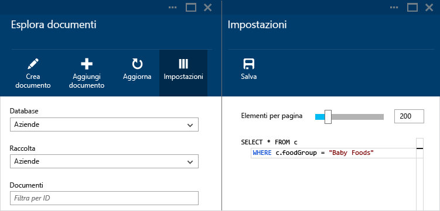

	> [AZURE.NOTE]Dopo aver modificato le impostazioni di Esplora documenti, è necessario scegliere il comando **Aggiorna** per applicare le nuove impostazioni. Le impostazioni verranno mantenute solo nella sessione del browser corrente.
	
3. Gli elenchi a discesa **Database** e **Raccolta** possono essere usati per modificare facilmente la raccolta da cui sono attualmente visualizzati i documenti senza dover chiudere e riavviare Esplora documenti.

4. Esplora documenti supporta anche l'applicazione di filtri al set di documenti attualmente caricato in base alla relativa proprietà ID. È sufficiente digitare nella casella del filtro.

	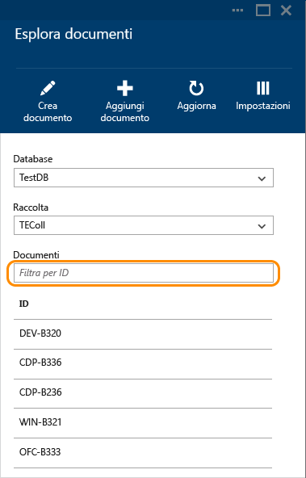

	I risultati nell'elenco di Esplora documenti vengono filtrati in base ai criteri forniti.

	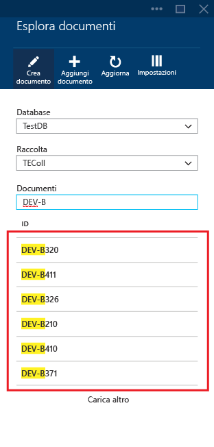

	> [AZURE.IMPORTANT]La funzionalità di filtro di Esplora documenti consente di filtrare solo dal set di documenti caricati ***attualmente*** e non esegue una query sulla raccolta attualmente selezionata.

5. Per aggiornare l'elenco dei documenti caricati da Esplora documenti, fare semplicemente clic sul comando **Aggiorna** nella parte superiore del pannello.

	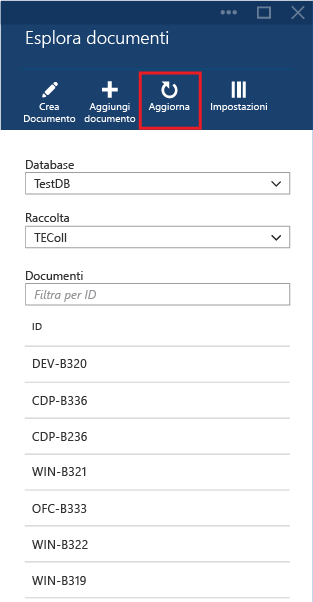

##Aggiungere documenti in blocco con Esplora documenti##

Esplora documenti supporta l'inserimento in blocco di uno o più documenti JSON esistenti.

1. Per avviare il processo di caricamento, fare clic sul comando **Aggiungi documento**.

	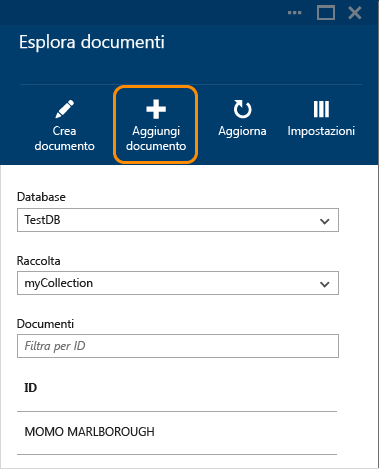

2. Viene visualizzato un nuovo pannello. Fare clic sul pulsante Sfoglia per aprire una finestra di Esplora file e selezionare uno o più documenti JSON da caricare.

	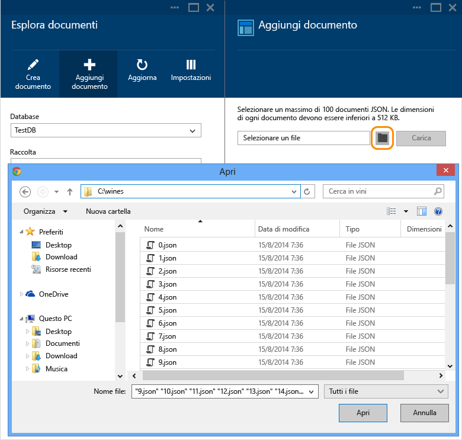

	> [AZURE.NOTE]Esplora documenti supporta attualmente fino a 100 documenti JSON per singola operazione di caricamento.

3. Dopo aver completato la selezione, fare clic sul pulsante **Carica**. I documenti vengono aggiunti automaticamente alla griglia di Esplora documenti e i risultati del caricamento vengono visualizzati con l'avanzare dell'operazione. Gli errori di importazione vengono segnalati per i singoli file.

	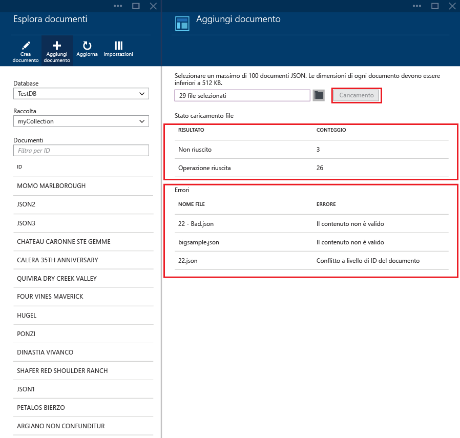

4. Dopo aver completato l'operazione, è possibile selezionare un massimo di altri 100 documenti da caricare.

##Passaggi successivi

- Per altre informazioni su DocumentDB, vedere [qui](http://azure.com/docdb).
- Per iniziare a usare codice, fare clic [qui](documentdb-get-started.md).

 

<!---HONumber=AcomDC_1203_2015-->