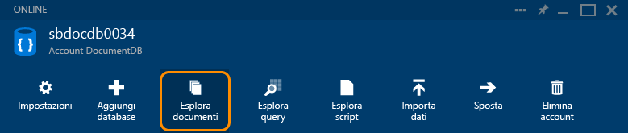
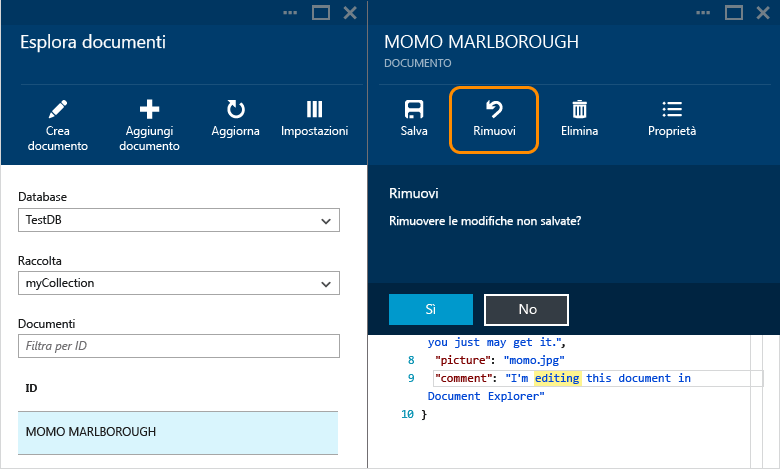
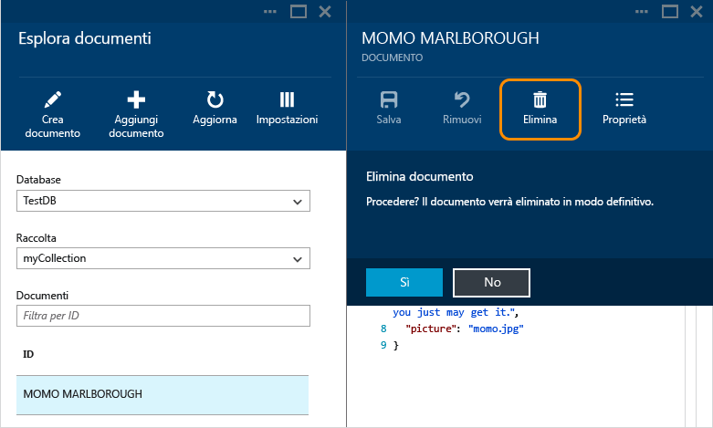
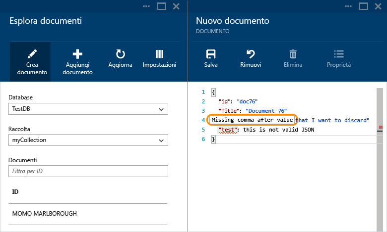
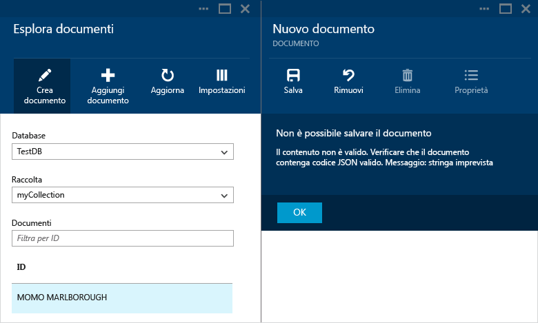

<properties
	pageTitle="Esplora documenti di DocumentDB per visualizzare codice JSON | Microsoft Azure"
	description="Informazioni su Esplora documenti di DocumentDB, uno strumento del portale di Azure per visualizzare codice JSON, modificare, creare e caricare documenti JSON con il database di documenti NoSQL DocumentDB."
    keywords="visualizzare json"
	services="documentdb"
	authors="AndrewHoh"
	manager="jhubbard"
	editor="monicar"
	documentationCenter=""/>

<tags
	ms.service="documentdb"
	ms.workload="data-services"
	ms.tgt_pltfrm="na"
	ms.devlang="na"
	ms.topic="article"
	ms.date="03/30/2016"
	ms.author="anhoh"/>

# Visualizzare, modificare, creare e caricare documenti JSON con Esplora documenti di DocumentDB

Questo articolo offre una panoramica di Esplora documenti di [Microsoft Azure DocumentDB](https://azure.microsoft.com/services/documentdb/), uno strumento del portale di Azure che consente di visualizzare, modificare, creare, caricare e filtrare documenti JSON con DocumentDB.

## Avviare Esplora documenti

1. Nell'indice del portale di Azure fare clic su **Account DocumentDB**. Se **Account DocumentDB** non è visibile, fare clic su **Sfoglia** e quindi su **Account DocumentDB**.

2. Nella parte superiore del pannello **Account DocumentDB** fare clic su **Esplora documenti**.
 
	

 	>[AZURE.NOTE] Esplora query viene visualizzato anche nei pannelli di database e raccolte.

    Nel pannello **Esplora documenti** gli elenchi a discesa **Database** e **Raccolte** vengono precompilati a seconda del contesto in cui viene avviato Esplora documenti.

	

## Creare un documento

1. [Avviare Esplora documenti](#launch-document-explorer).

2. Nel pannello **Esplora documenti** fare clic su **Crea documento**.

    Nel pannello **Documento** è disponibile un frammento di codice JSON minimo.

	

2. Nel pannello **Documento** digitare o incollare il contenuto del documento JSON da creare e quindi fare clic su **Salva** per eseguire il commit del documento nel database e nella raccolta specificati nel pannello **Esplora documenti**.

	

	> [AZURE.NOTE] Se non si specifica una proprietà "ID", Esplora documenti aggiunge automaticamente una proprietà ID e genera un GUID come valore ID.

    Se si dispone già di dati di file JSON, MongoDB, SQL Server, file CSV, archiviazione tabelle di Azure, Amazon DynamoDB, HBase o di altre raccolte di DocumentDB, è possibile usare lo [strumento di migrazione dati](documentdb-import-data.md) di DocumentDB per importare rapidamente i dati.

## Modificare un documento

1. [Avviare Esplora documenti](#launch-document-explorer).

2. Per modificare un documento esistente, selezionarlo nel pannello **Esplora documenti**, modificarlo nel pannello **Documento** e quindi fare clic su **Salva**.

    

    Se si modifica un documento e si decide di eliminare il set di modifiche corrente, è sufficiente fare clic su **Annulla** nel pannello **Documento** e confermare l'azione. Verrà ricaricato lo stato precedente del documento.

    

## Eliminare un documento

1. [Avviare Esplora documenti](#launch-document-explorer).

2. Selezionare il documento in **Esplora documenti**, fare clic su **Elimina** e quindi confermare l'eliminazione. Dopo la conferma, il documento viene immediatamente rimosso dall'elenco di Esplora documenti.

	

## Usare documenti JSON

Esplora documenti verifica che qualsiasi documento nuovo o modificato includa contenuto JSON valido. È possibile visualizzare gli errori JSON anche passando il puntatore sulla sezione non corretta per ottenere informazioni dettagliate sull'errore di convalida.

Esplora documenti impedisce anche di salvare un documento con contenuto JSON non valido.

Infine, Esplora documenti consente di visualizzare facilmente le proprietà di sistema del documento attualmente caricato facendo clic sul comando **Proprietà**.

> [AZURE.NOTE] La proprietà timestamp (\_ts) viene rappresentata internamente come periodo, ma Esplora documenti consente di visualizzare il valore in un formato GMT leggibile.

## Filtrare documenti
Esplora documenti supporta numerose opzioni di navigazione e impostazioni avanzate.

Per impostazione predefinita, Esplora documenti carica i primi 100 documenti della raccolta selezionata, dal meno recente al più recente, in base alla data di creazione. È possibile caricare altri documenti (in batch di 100) selezionando l'opzione **Carica altro** nella parte inferiore del pannello di Esplora documenti. È possibile scegliere i documenti da caricare usando il **Filtro** comando.

1. [Avviare Esplora documenti](#launch-document-explorer).

2. Nella parte superiore del pannello **Esplora documenti** fare clic su **Filtro**.

    
  
3.  Le impostazioni del filtro vengono visualizzate sotto la barra dei comandi. Nelle impostazioni del filtro fornire una clausola WHERE e/o una clausola ORDER BY e quindi fare clic su **Filtro**.

	

	Esplora documenti aggiorna automaticamente i risultati con i documenti corrispondenti alla query del filtro. Per altre informazioni sulla grammatica SQL di DocumentDB, vedere l'articolo [Query e sintassi SQL in DocumentDB](documentdb-sql-query.md) o stampare una copia del [foglio informativo sulle query SQL](documentdb-sql-query-cheat-sheet.md).

    Gli elenchi a discesa **Database** e **Raccolta** possono essere usati per modificare facilmente la raccolta da cui sono attualmente visualizzati i documenti senza dover chiudere e riavviare Esplora documenti.

    Esplora documenti supporta anche l'applicazione di filtri al set di documenti attualmente caricato in base alla relativa proprietà ID. È sufficiente digitare Filtra per ID nella casella Documenti.

	

	I risultati nell'elenco di Esplora documenti vengono filtrati in base ai criteri forniti.

	

	> [AZURE.IMPORTANT] La funzionalità di filtro di Esplora documenti consente di filtrare solo dal set di documenti caricati ***attualmente*** e non esegue una query sulla raccolta attualmente selezionata.

4. Per aggiornare l'elenco dei documenti caricati da Esplora documenti, fare clic su **Aggiorna** nella parte superiore del pannello.

	

## Aggiungere documenti in blocco

Esplora documenti supporta l'inserimento in blocco di uno o più documenti JSON esistenti, fino a 100 file JSON per operazione di caricamento.

1. [Avviare Esplora documenti](#launch-document-explorer).

2. Per avviare il processo di caricamento, fare clic su **Carica documento**.

	

    Verrà visualizzato il pannello **Carica documento**.

2. Fare clic sul pulsante Sfoglia per aprire una finestra di Esplora file, selezionare uno o più documenti JSON da caricare e quindi fare clic su **Apri**.

	

	> [AZURE.NOTE] Esplora documenti supporta attualmente fino a 100 documenti JSON per singola operazione di caricamento.

3. Dopo aver completato la selezione, fare clic sul pulsante **Carica**. I documenti vengono aggiunti automaticamente alla griglia di Esplora documenti e i risultati del caricamento vengono visualizzati con l'avanzare dell'operazione. Gli errori di importazione vengono segnalati per i singoli file.

	

4. Al termine dell'operazione, è possibile selezionare un massimo di altri 100 documenti da caricare.

## Usare documenti JSON all'esterno del portale

Esplora documenti nel portale di Azure è soltanto uno dei modi in cui è possibile usare i documenti in DocumentDB. Per lavorare con i documenti è anche possibile usare l'[API REST](https://msdn.microsoft.com/library/azure/mt489082.aspx) o gli [SDK client](documentdb-sdk-dotnet.md). Per un codice di esempio, vedere gli [esempi di documento .NET SDK](documentdb-dotnet-samples.md#document-examples) e gli [esempi di documento Node.js SDK](documentdb-nodejs-samples.md#document-examples).

Per eseguire la migrazione o importare file da un'altra origine, ad esempio file JSON, MongoDB, SQL Server, file CSV, archivio tabelle di Azure, Amazon DynamoDB o HBase, è possibile usare lo [strumento di migrazione dati](documentdb-import-data.md) di DocumentDB per importare rapidamente i dati in DocumentDB.

## Passaggi successivi

Per altre informazioni sulla grammatica SQL di DocumentDB supportata in Esplora documenti, vedere l'articolo [Query e sintassi SQL in DocumentDB](documentdb-sql-query.md) o stampare una copia del [foglio informativo sulle query SQL](documentdb-sql-query-cheat-sheet.md).

Anche il [percorso di apprendimento](https://azure.microsoft.com/documentation/learning-paths/documentdb/) è una risorsa utile che assiste l'utente nell'apprendimento di DocumentDB.

<!---HONumber=AcomDC_0413_2016-->
