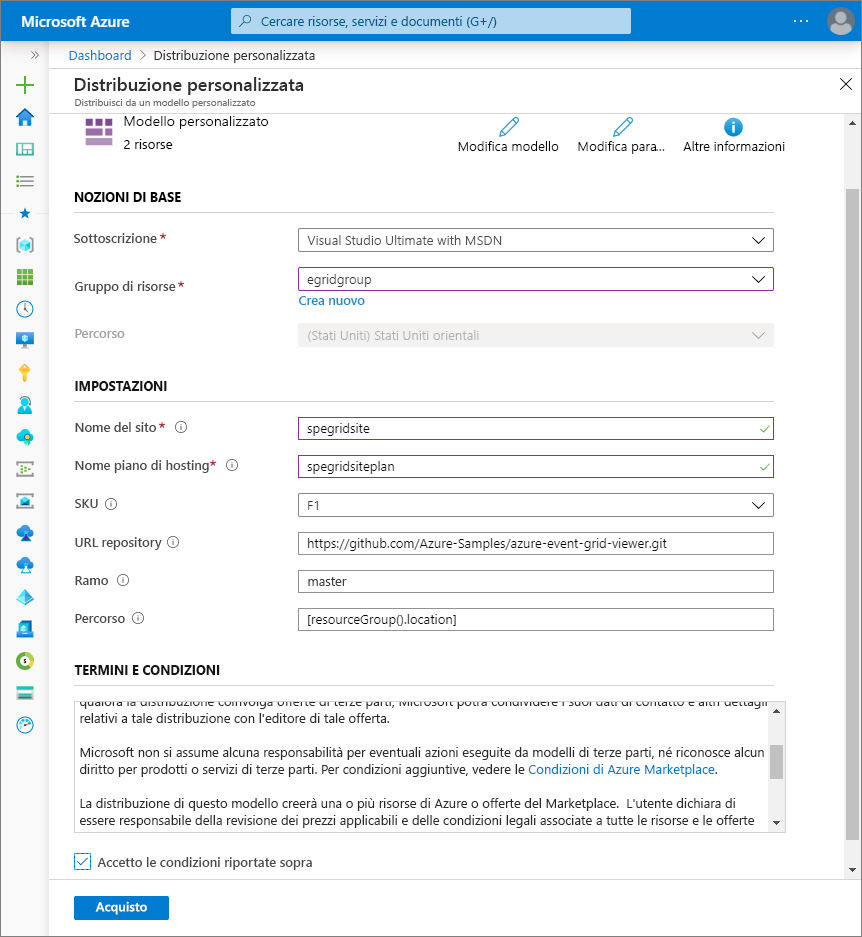
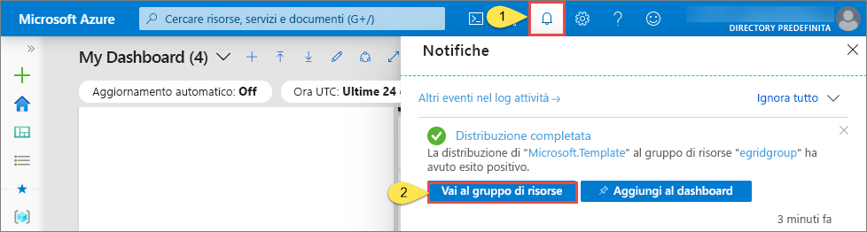
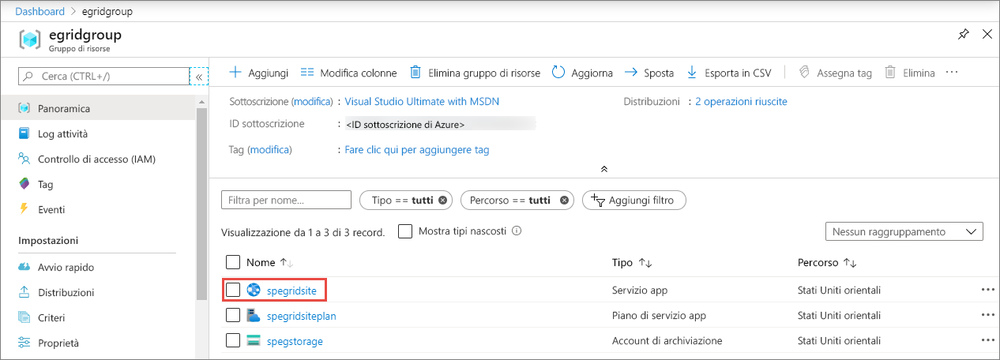
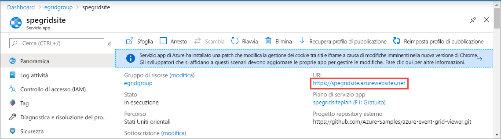
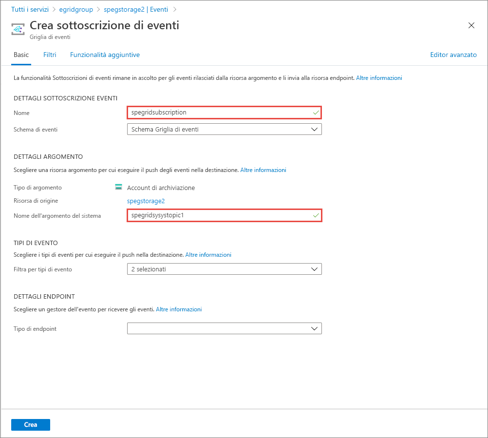
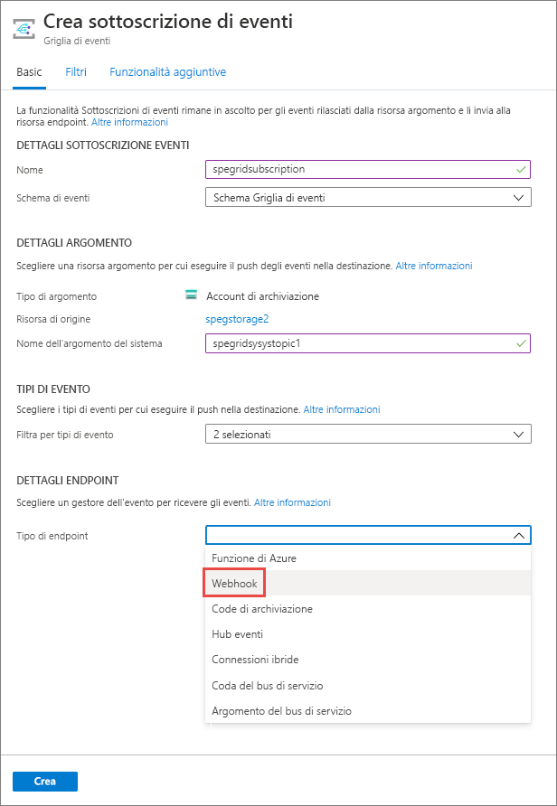
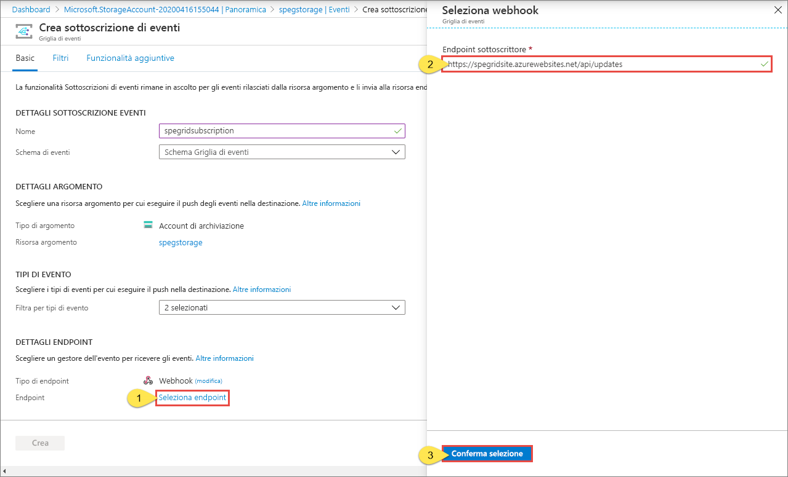
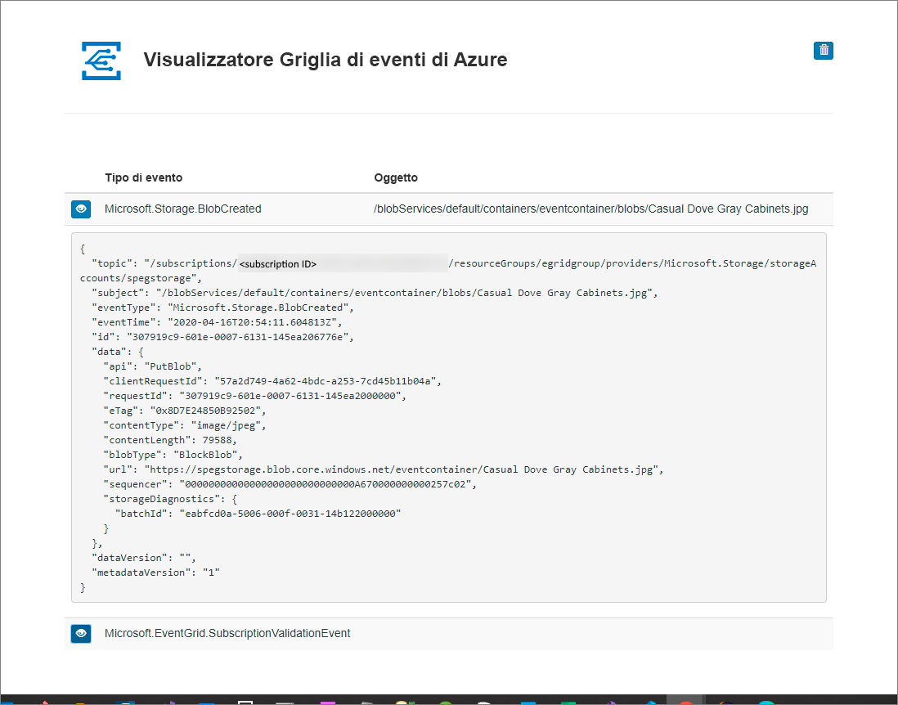

# Avvio rapido: Indirizzare gli eventi di archiviazione BLOB a un endpoint Web con il portale di Azure

La griglia di eventi di Azure è un servizio di gestione degli eventi per il cloud. In questo articolo si usa il portale di Azure per creare un account di archiviazione BLOB, sottoscrivere gli eventi per l'archiviazione BLOB e attivare un evento per visualizzare il risultato. In genere, si inviano eventi a un endpoint che elabora i dati dell'evento e intraprende azioni. Per maggiore semplicità, tuttavia, in questo articolo gli eventi vengono inviati a un'app Web che raccoglie e visualizza i messaggi.

[!INCLUDE [quickstarts-free-trial-note.md](../../includes/quickstarts-free-trial-note.md)]

Al termine, i dati degli eventi saranno stati inviati all'app Web.

## Creare un account di archiviazione

1. Accedere al [portale di Azure](https://portal.azure.com/).

1. Per creare un account di archiviazione BLOB, selezionare **Crea una risorsa**. 

1. Selezionare **Archiviazione** per filtrare le opzioni disponibili e selezionare **Account di archiviazione: BLOB, File, Tabelle, Code**.

   

   Per sottoscrivere gli eventi, è necessario creare un account di archiviazione per utilizzo generico v2 o un account di archiviazione BLOB.
   
1. Nella pagina **Crea account di archiviazione** eseguire la procedura seguente:
    1. Selezionare la sottoscrizione di Azure. 
    2. In **Gruppo di risorse** creare un nuovo gruppo di risorse o selezionarne uno esistente. 
    3. Immettere il nome dell'account di archiviazione. 
    4. Selezionare **Rivedi e crea**. 

           
    5. Nella pagina **Rivedi e crea** controllare le impostazioni e selezionare **Crea**. 

        >[!NOTE]
        > Solo gli account di archiviazione di tipo **archiviazione V2 (utilizzo generico v2)** e **BlobStorage** supportano l'integrazione degli eventi. Il tipo **Archiviazione (utilizzo generico V1)** *non* supporta l'integrazione con Griglia di eventi.

## Creare un endpoint del messaggio

Prima di sottoscrivere gli eventi per l'account di archiviazione BLOB, creare l'endpoint per il messaggio dell'evento. L'endpoint richiede in genere azioni basate sui dati degli eventi. Per semplificare questa guida introduttiva, si distribuisce un'[app Web preesistente](https://github.com/Azure-Samples/azure-event-grid-viewer) che visualizza i messaggi di evento. La soluzione distribuita include un piano di servizio app, un'app Web del servizio app e codice sorgente da GitHub.

1. Selezionare **Distribuisci in Azure** per distribuire la soluzione nella sottoscrizione. 

   
2. Nella pagina **Distribuzione personalizzata** procedere come segue: 
    1. Per **Gruppo di risorse** selezionare il gruppo di risorse creato durante la creazione dell'account di archiviazione. Eliminando il gruppo di risorse, sarà più facile eseguire la pulizia dopo aver completato l'esercitazione.  
    2. Per **Nome sito** immettere un nome per l'app Web.
    3. Per **Nome piano di hosting** immettere un nome per il piano del servizio app da usare per l'hosting dell'app Web.
    4. Selezionare la casella di controllo **Accetto le condizioni riportate sopra**. 
    5. Selezionare **Acquisto**. 

       
1. Per il completamento della distribuzione possono essere necessari alcuni minuti. Selezionare Avvisi (icona della campana) nel portale e quindi **Vai al gruppo di risorse**. 

    
4. Nell'elenco di risorse della pagina **Gruppo di risorse** selezionare l'app Web creata. Questo elenco include anche il piano di servizio app e l'account di archiviazione. 

    
5. Nella pagina **Servizio app** per l'app Web selezionare l'URL per passare al sito Web. Il file deve essere nel formato `https://<your-site-name>.azurewebsites.net`.
    
    

6. Verificare che venga visualizzato il sito ma che al suo interno non sono stati ancora pubblicati eventi.

   

[!INCLUDE [event-grid-register-provider-portal.md](../../includes/event-grid-register-provider-portal.md)]

## Sottoscrivere l'account di archiviazione BLOB

Si sottoscrive un argomento per indicare a Griglia di eventi gli eventi di cui si vuole tenere traccia e dove inviare tali eventi.

1. Nel portale passare all'account di archiviazione di Azure creato in precedenza. Nel menu sinistro selezionare **Tutte le risorse** e quindi l'account di archiviazione. 
2. Nel menu sinistro della pagina **Account di archiviazione** selezionare **Eventi**. 
1. Selezionare **Altre opzioni** e **Webhook**. Vengono inviati eventi all'app di visualizzazione tramite un webhook per l'endpoint. 

   
3. Nella pagina **Crea sottoscrizione di eventi** seguire questa procedura: 
    1. Specificare un **nome** per la sottoscrizione di eventi.
    2. Immettere un **nome** per l'**argomento di sistema**. Per informazioni sugli argomenti di sistema, vedere [Panoramica degli argomenti di sistema](system-topics.md).

       
    2. Selezionare **Webhook** per **Tipo di endpoint**. 

       
4. Per **Endpoint**, fare clic su **Seleziona endpoint**, immettere l'URL dell'app Web e aggiungere `api/updates` all'URL della home page, ad esempio `https://spegridsite.azurewebsites.net/api/updates`, quindi selezionare **Conferma selezione**.

   
5. A questo punto, nella pagina **Crea sottoscrizione di eventi** selezionare **Crea** per creare la sottoscrizione di eventi. 

   

1. Visualizzare nuovamente l'app Web e notare che all'app è stato inviato un evento di convalida della sottoscrizione. Selezionare l'icona a forma di occhio per espandere i dati dell'evento. Griglia di eventi invia l'evento di convalida in modo che l'endpoint possa verificare che voglia ricevere i dati dell'evento. L'app Web include il codice per convalidare la sottoscrizione.

   

A questo punto, attivare un evento per vedere come la griglia di eventi distribuisce il messaggio nell'endpoint.

## Inviare un evento all'endpoint

Per attivare un evento per l'account di archiviazione BLOB, caricare un file. Non sono necessari contenuti specifici per il file. Gli articoli presuppongono che si abbia un file denominato testfile.txt, ma è possibile usare qualsiasi file.

1. Nel portale di Azure passare all'account di archiviazione BLOB e selezionare **Contenitori** nella pagina **Panoramica**.

   

1. Selezionare **+ Contenitore**. Assegnare un nome al contenitore e usare qualsiasi livello di accesso, quindi selezionare **Crea**. 

   

1. Selezionare il nuovo contenitore.

   

1. Per caricare un file, selezionare **Carica**. Nella pagina **Carica BLOB** individuare e selezionare il file da caricare per i test, quindi selezionare **Carica** in tale pagina. 

   

1. Passare al file di test e caricarlo.

1. È stato attivato l'evento e Griglia di eventi ha inviato il messaggio all'endpoint configurato al momento della sottoscrizione. Il messaggio è in formato JSON e contiene una matrice con uno o più eventi. Nell'esempio seguente il messaggio JSON contiene una matrice con un solo evento. Visualizzare l'app Web. Si noterà che è stato ricevuto un evento **creato da un BLOB**. 

   

## Pulire le risorse

Se si intende continuare a usare questo evento, non è necessario pulire le risorse create con questo articolo. In caso contrario, eliminare le risorse create in questo articolo.

Selezionare il gruppo di risorse e quindi fare clic su **Elimina gruppo di risorse**.

## Passaggi successivi

Ora che si è appreso come creare argomenti personalizzati e sottoscrizioni di eventi, è possibile approfondire le operazioni possibili con Griglia di eventi:

- [Informazioni sulla griglia di eventi](overview.md)
- [Indirizzare gli eventi di archiviazione BLOB a un endpoint Web personalizzato (anteprima)](../storage/blobs/storage-blob-event-quickstart.md?toc=%2fazure%2fevent-grid%2ftoc.json)
- [Monitorare le modifiche alla macchina virtuale con la griglia di eventi di Azure e le app per la logica](monitor-virtual-machine-changes-event-grid-logic-app.md)
- [Trasmettere Big Data a un data warehouse](event-grid-event-hubs-integration.md)
