# <a name="quickstart-route-blob-storage-events-to-web-endpoint-with-the-azure-portal"></a>Guida introduttiva: Indirizzare gli eventi di archiviazione BLOB a un endpoint Web con il portale di Azure

La griglia di eventi di Azure è un servizio di gestione degli eventi per il cloud. In questo articolo si usa il portale di Azure per creare un account di archiviazione BLOB, sottoscrivere gli eventi per l'archiviazione BLOB e attivare un evento per visualizzare il risultato. In genere, si inviano eventi a un endpoint che elabora i dati dell'evento e intraprende azioni. Per maggiore semplicità, tuttavia, in questo articolo gli eventi vengono inviati a un'app Web che raccoglie e visualizza i messaggi.

[!INCLUDE [quickstarts-free-trial-note.md](../../includes/quickstarts-free-trial-note.md)]

Al termine, i dati degli eventi saranno stati inviati all'app Web.

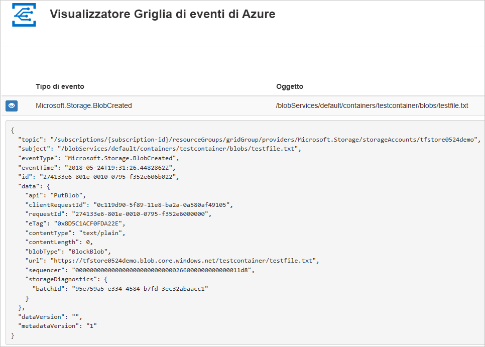

## <a name="create-a-storage-account"></a>Creare un account di archiviazione

1. Accedere al [portale di Azure](https://portal.azure.com/).

1. Per creare un account di archiviazione BLOB, selezionare **Crea una risorsa**. 

   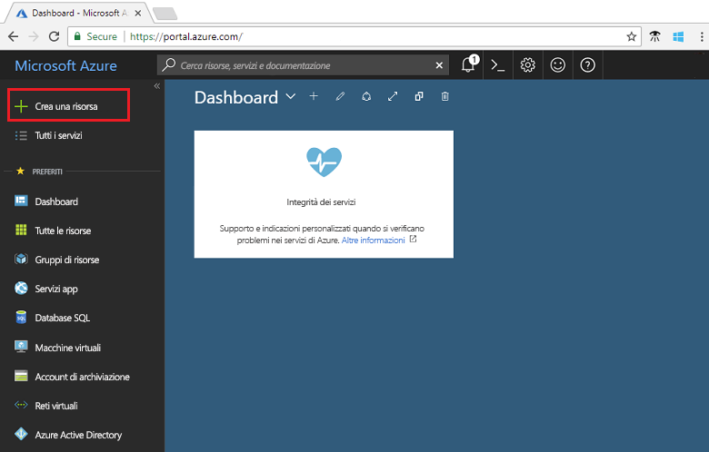

1. Selezionare **Archiviazione** per filtrare le opzioni disponibili e selezionare **Account di archiviazione: BLOB, File, Tabelle, Code**.

   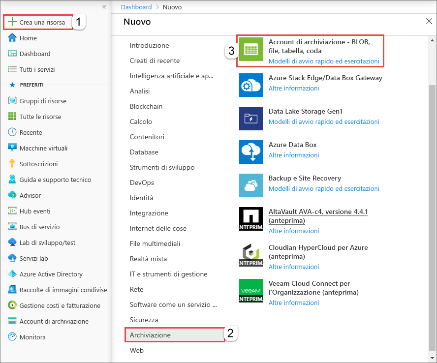

1. Per sottoscrivere gli eventi, è necessario creare un account di archiviazione per utilizzo generico v2 o un account di archiviazione BLOB. Per altre informazioni, vedere [Creare un account di archiviazione](../storage/common/storage-quickstart-create-account.md).

   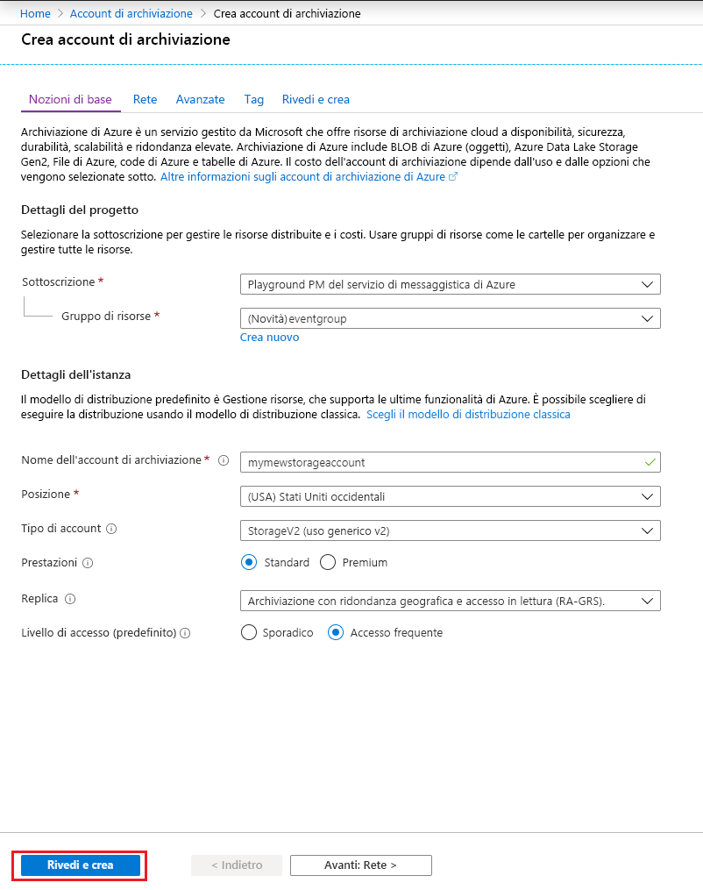

## <a name="create-a-message-endpoint"></a>Creare un endpoint del messaggio

Prima di sottoscrivere gli eventi per l'account di archiviazione BLOB, creare l'endpoint per il messaggio dell'evento. L'endpoint richiede in genere azioni basate sui dati degli eventi. Per semplificare questa guida introduttiva, si distribuisce un'[app Web preesistente](https://github.com/Azure-Samples/azure-event-grid-viewer) che visualizza i messaggi di evento. La soluzione distribuita include un piano di servizio app, un'app Web del servizio app e codice sorgente da GitHub.

1. Selezionare **Distribuisci in Azure** per distribuire la soluzione nella sottoscrizione. Nel portale di Azure specificare i valori per i parametri.

   <a href="https://portal.azure.com/#create/Microsoft.Template/uri/https%3A%2F%2Fraw.githubusercontent.com%2FAzure-Samples%2Fazure-event-grid-viewer%2Fmaster%2Fazuredeploy.json" target="_blank"></a>

1. Per il completamento della distribuzione possono essere necessari alcuni minuti. Dopo il completamento della distribuzione, visualizzare l'app Web per assicurarsi che sia in esecuzione. In un Web browser passare a: `https://<your-site-name>.azurewebsites.net`

1. Viene visualizzato il sito, ma nessun evento è ancora stato pubblicato.

   

[!INCLUDE [event-grid-register-provider-portal.md](../../includes/event-grid-register-provider-portal.md)]

## <a name="subscribe-to-the-blob-storage"></a>Sottoscrivere l'account di archiviazione BLOB

Si sottoscrive un argomento per indicare a Griglia di eventi gli eventi di cui si vuole tenere traccia e dove inviare tali eventi.

1. Nel portale selezionare l'account di archiviazione BLOB e selezionare **Eventi**.

   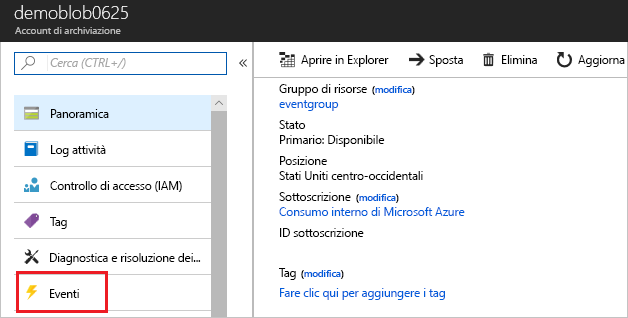

1. Per inviare gli eventi all'app per visualizzarli, usare un webhook per l'endpoint. Selezionare **Altre opzioni** e **Webhook**.

   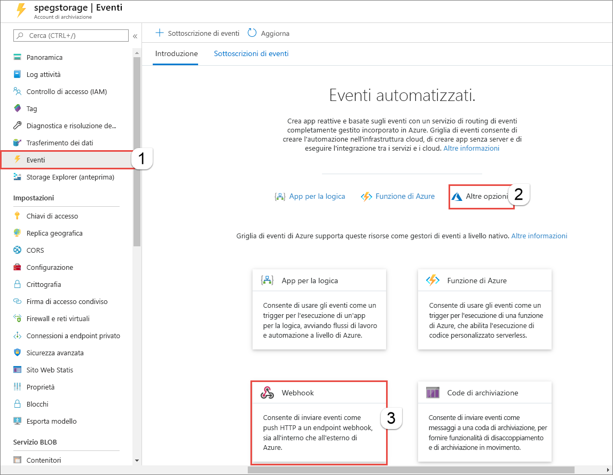

1. La sottoscrizione dell'evento è precompilata con i valori dell'account di archiviazione BLOB. Per l'endpoint del webhook, specificare l'URL dell'app Web e aggiungere `api/updates` all'URL della home page. Specificare un nome per la sottoscrizione. Al termine, scegliere **Crea**.

   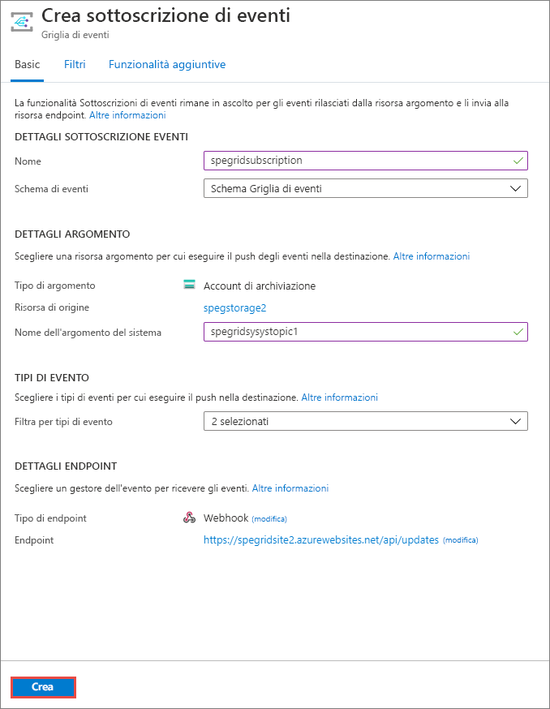

1. Visualizzare nuovamente l'app Web e notare che all'app è stato inviato un evento di convalida della sottoscrizione. Selezionare l'icona a forma di occhio per espandere i dati dell'evento. Griglia di eventi invia l'evento di convalida in modo che l'endpoint possa verificare che voglia ricevere i dati dell'evento. L'app Web include il codice per convalidare la sottoscrizione.

   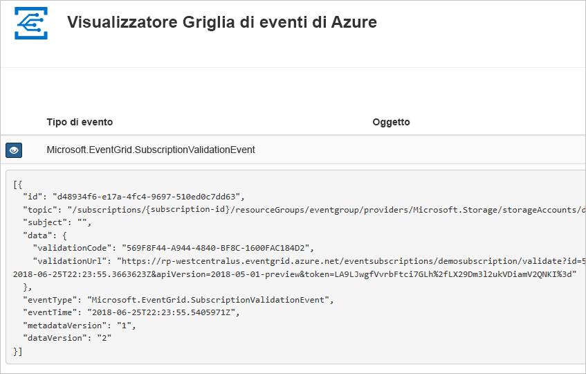

A questo punto, attivare un evento per vedere come la griglia di eventi distribuisce il messaggio nell'endpoint.

## <a name="send-an-event-to-your-endpoint"></a>Inviare un evento all'endpoint

Per attivare un evento per l'account di archiviazione BLOB, caricare un file. Non sono necessari contenuti specifici per il file. Gli articoli presuppongono che si abbia un file denominato testfile.txt, ma è possibile usare qualsiasi file.

1. Per l'account di archiviazione BLOB, selezionare **BLOB**.

   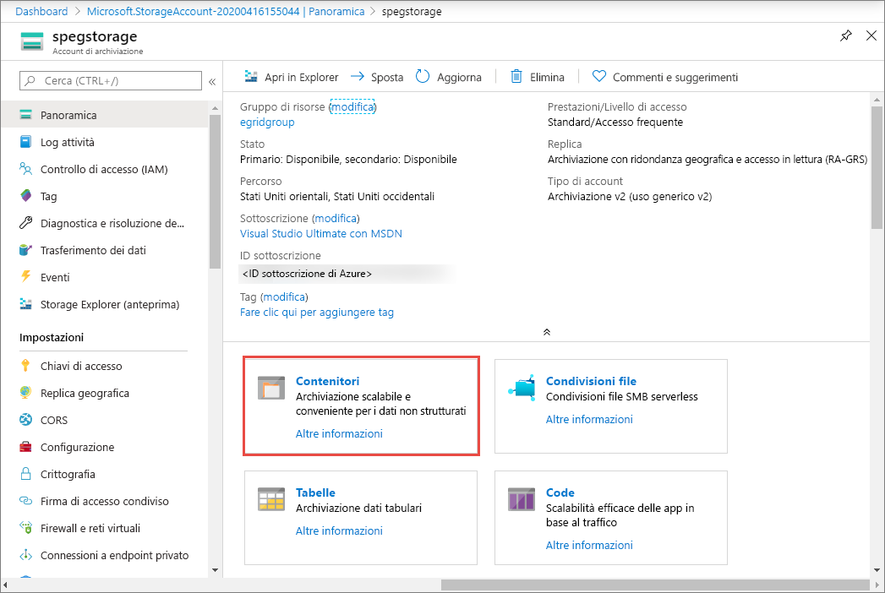

1. Selezionare **+ Contenitore**. Assegnare un nome al contenitore e usare qualsiasi livello di accesso.

   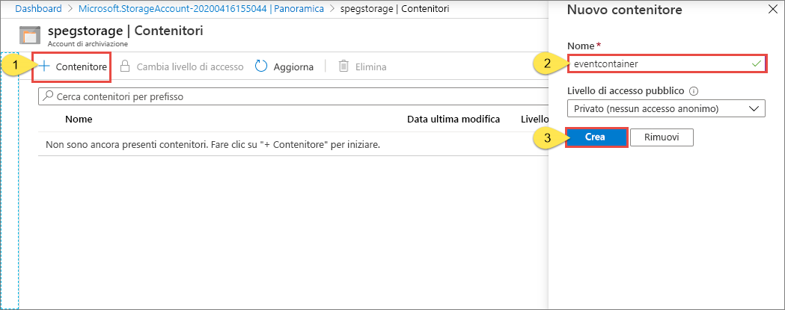

1. Selezionare il nuovo contenitore.

   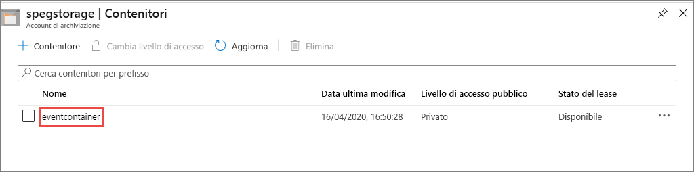

1. Per caricare un file, selezionare **Carica**.

   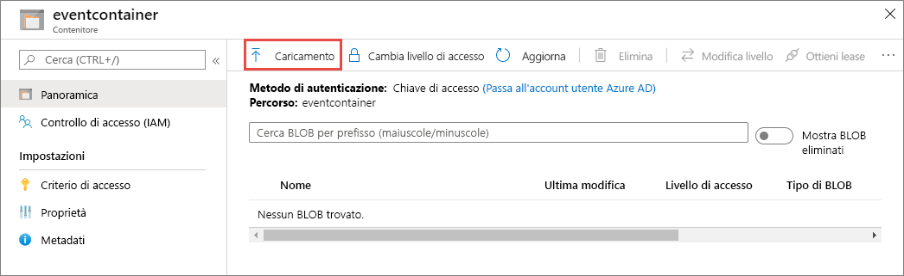

1. Passare al file di test e caricarlo.

1. È stato attivato l'evento e Griglia di eventi ha inviato il messaggio all'endpoint configurato al momento della sottoscrizione. Visualizzare l'app Web. Si noterà che è stato ricevuto un evento creato da un BLOB. 

   ```json
   {
    "topic": "/subscriptions/{subscription-id}/resourceGroups/eventgroup/providers/Microsoft.Storage/storageAccounts/demoblob0625",
    "subject": "/blobServices/default/containers/eventcontainer/blobs/testfile.txt",
    "eventType": "Microsoft.Storage.BlobCreated",
    "eventTime": "2018-06-25T22:50:41.1823131Z",
    "id": "89a2f9da-c01e-00bb-13d6-0c599506e4e3",
    "data": {
      "api": "PutBlockList",
      "clientRequestId": "41341a9b-e977-4a91-9000-c64125039047",
      "requestId": "89a2f9da-c01e-00bb-13d6-0c5995000000",
      "eTag": "0x8D5DAEE13C8F9ED",
      "contentType": "text/plain",
      "contentLength": 4,
      "blobType": "BlockBlob",
      "url": "https://demoblob0625.blob.core.windows.net/eventcontainer/testfile.txt",
      "sequencer": "00000000000000000000000000001C24000000000004712b",
      "storageDiagnostics": {
        "batchId": "ef633252-32fd-464b-8f5a-0d10d68885e6"
      }
    },
    "dataVersion": "",
    "metadataVersion": "1"
   }
   ```

## <a name="clean-up-resources"></a>Pulire le risorse

Se si intende continuare a usare questo evento, non è necessario pulire le risorse create con questo articolo. In caso contrario, eliminare le risorse create in questo articolo.

Selezionare il gruppo di risorse e quindi fare clic su **Elimina gruppo di risorse**.

## <a name="next-steps"></a>Passaggi successivi

Ora che si è appreso come creare argomenti personalizzati e sottoscrizioni di eventi, è possibile approfondire le operazioni possibili con Griglia di eventi:

- [Informazioni sulla griglia di eventi](overview.md)
- [Indirizzare gli eventi di archiviazione BLOB a un endpoint Web personalizzato (anteprima)](../storage/blobs/storage-blob-event-quickstart.md?toc=%2fazure%2fevent-grid%2ftoc.json)
- [Monitorare le modifiche alla macchina virtuale con la griglia di eventi di Azure e le app per la logica](monitor-virtual-machine-changes-event-grid-logic-app.md)
- [Trasmettere Big Data a un data warehouse](event-grid-event-hubs-integration.md)
