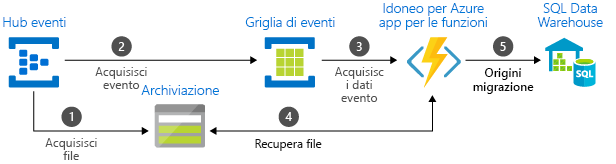

# Scegliere tra i servizi di Azure che recapitano messaggi

Azure offre tre servizi che agevolano il recapito di messaggi di eventi tramite una soluzione. Questi servizi sono:

* [Griglia di eventi](/azure/event-grid/)
* [Hub eventi](/azure/event-hubs/)
* [Bus di servizio](/azure/service-bus-messaging/)

Nonostante alcune analogie, ogni servizio è progettato per determinati scenari. Questo articolo descrive le differenze tra i servizi e consente di scegliere quello più adatto all'applicazione. In molti casi, i servizi di messaggistica sono complementari e possono essere usati insieme.

## Servizi di eventi e di messaggi

È importante tenere presente la differenza tra servizi che recapitano un evento e servizi che recapitano un messaggio.

### Evento

Un evento è una notifica leggera di un'azione o di una modifica di stato. I dati dell'evento contengono informazioni su ciò che è accaduto, ma non includono i dati che hanno attivato l'evento. Un evento ad esempio notifica ai sottoscrittori che è stato creato un file. Può contenere informazioni generali sul file, ma non il file stesso. Gli eventi attivano in genere gestori di eventi per agire in tempo reale.

### Message

I messaggi sono dati non elaborati generati da un servizio da utilizzare o archiviare altrove. Il messaggio contiene i dati che hanno attivato la pipeline del messaggio. Questo messaggio può essere costituito ad esempio da un ordine di e-commerce o da dati di telemetria utente. Diversamente da una notifica degli eventi, l'autore di un messaggio può prevedere una risposta. Un messaggio contiene ad esempio i dati non elaborati, ma prevede che la parte successiva del sistema crei un file da tali dati.

## Confronto dei servizi

| Service | Scopo | Tipo | Quando usare le autorizzazioni |
| ------- | ------- | ---- | ----------- |
| Griglia di eventi | Programmazione reattiva | Distribuzione di eventi | Reazione alle modifiche di stato |
| Hub eventi | Pipeline di Big Data | Streaming di eventi | Flusso dei dati di telemetria e distribuiti |
| Bus di servizio | Messaggistica aziendale di alto valore | Message | Elaborazione di ordini e transazioni finanziarie |

### Griglia di eventi

Griglia di eventi è un backplane eventi che abilita la programmazione reattiva basata su eventi. Usa un modello di pubblicazione-sottoscrizione. Gli autori emettono gli eventi, ma non hanno aspettative sugli eventi che vengono gestiti. I sottoscrittori decidono quali eventi vogliono gestire.

Griglia di eventi è strettamente integrato con i servizi di Azure e può essere integrato con i servizi di terze parti. Semplifica l'utilizzo degli eventi e riduce i costi eliminando la necessità di polling costante. Griglia di eventi instrada in modo efficiente e affidabile gli eventi dalle risorse di Azure e non di Azure. Distribuisce gli eventi agli endpoint dei sottoscrittori registrati. Il messaggio dell'evento contiene le informazioni necessarie per reagire alle modifiche apportate ai servizi e alle applicazioni. Griglia di eventi non è una pipeline di dati e non recapita l'oggetto effettivo aggiornato.

Presenta le caratteristiche seguenti:

* scalabile dinamicamente
* basso costo
* senza server

### Hub eventi

Hub eventi di Azure è una pipeline di Big Data. Semplifica l'acquisizione, la conservazione e la riproduzione dei dati dei flussi di eventi e di telemetria. I dati possono provenire da molte origini simultanee. Hub eventi consente di rendere disponibili i dati di telemetria e degli eventi per svariate infrastrutture di elaborazione di flussi e servizi di analisi. È disponibile come flusso dei dati o batch di eventi in bundle. Questo servizio offre un'unica soluzione che consente di recuperare rapidamente i dati per l'elaborazione in tempo reale oltre che per la riproduzione ripetuta dei dati non elaborati archiviati. Consente di acquisire i dati di streaming in un file per l'elaborazione e l'analisi.

Presenta le caratteristiche seguenti:

* bassa latenza
* possibilità di ricevere ed elaborare milioni di eventi al secondo

### Bus di servizio

Il bus di servizio è adatto alle tradizionali applicazioni aziendali. Queste applicazioni aziendali richiedono transazioni, ordinamento, rilevamento duplicati e coerenza immediata. Il bus di servizio consente alle applicazioni native del cloud di offrire una gestione delle transizioni di stato affidabile per i processi aziendali. Quando si gestiscono messaggi di alto valore che non devono andare persi o essere duplicati, usare il bus di servizio di Azure. Il bus di servizio agevola anche la comunicazione a sicurezza elevata tra soluzioni di cloud ibrido e può connettere i sistemi locali esistenti alle soluzioni cloud.

Il bus di servizio è un sistema di messaggistica negoziata. Archivia i messaggi in un "broker", ad esempio una coda, fino a quando il consumer non è pronto a riceverli.

Presenta le caratteristiche seguenti:

* recapito dei messaggi asincrono affidabile (messaggistica aziendale come servizio) che richiede il polling
* funzionalità di messaggistica avanzate, ad esempio FIFO, invio in batch/sessioni, transazioni, messaggi non recapitabili, controllo temporale, routing e filtri e rilevamento duplicati

## Usare i servizi insieme

In alcuni casi, è possibile usare i servizi affiancati per ricoprire ruoli distinti. Un sito di e-commerce ad esempio può usare il bus di servizio per elaborare l'ordine, Hub eventi per acquisire i dati di telemetria del sito e Griglia di eventi per rispondere a eventi come la spedizione di un articolo.

In altri casi, è possibile collegarli per formare una pipeline di eventi e dati. Si usa Griglia di eventi per rispondere agli eventi negli altri servizi. Per un esempio di uso di Griglia di eventi con Hub eventi per eseguire la migrazione dei dati a una data warehouse, vedere [Trasmettere Big Data a una data warehouse](event-grid-event-hubs-integration.md). L'immagine seguente illustra il flusso di lavoro per lo streaming dei dati.

## Passaggi successivi

* Per altre informazioni sui servizi di messaggistica di Azure, vedere il post di blog [Events, Data Points, and Messages - Choosing the right Azure messaging service for your data (Eventi, punti dati e messaggi: scelta del servizio di messaggistica di Azure appropriato per i dati)](https://azure.microsoft.com/blog/events-data-points-and-messages-choosing-the-right-azure-messaging-service-for-your-data/).
* Per un'introduzione a Griglia di eventi, vedere [Informazioni su Griglia di eventi](overview.md).
* Per iniziare a usare Griglia di eventi, vedere [Creare e instradare eventi personalizzati con Griglia di eventi di Azure](custom-event-quickstart.md).
* Per iniziare a usare Hub eventi, vedere [Creare uno spazio dei nomi di Hub eventi e un hub eventi usando il portale di Azure](../event-hubs/event-hubs-create.md).
* Per iniziare a usare il bus di servizio, vedere [Creare uno spazio dei nomi del bus di servizio usando il portale di Azure](../service-bus-messaging/service-bus-create-namespace-portal.md).