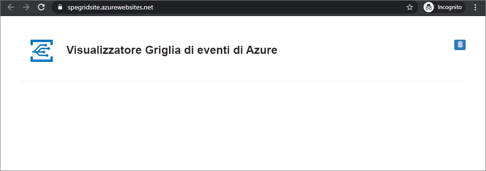

# <a name="build-your-own-disaster-recovery-for-custom-topics-in-event-grid"></a>Creare soluzioni personalizzate di ripristino di emergenza per gli Argomenti personalizzati nella Griglia di eventi

Il ripristino di emergenza consiste nel recupero da una grave perdita di funzionalità delle applicazioni. Questa esercitazione illustrerà come configurare l'architettura di gestione degli eventi per il ripristino se il servizio Griglia di eventi diventa non integro in una determinata area.

In questa esercitazione si apprenderà come creare un'architettura di failover attivo-passivo per gli argomenti personalizzati nella Griglia di eventi. Si otterrà il failover eseguendo il mirroring degli argomenti e delle sottoscrizioni tra due aree e quindi gestendo un failover quando un argomento diventa non integro. L'architettura in questa esercitazione esegue il failover di tutto il nuovo traffico. È importante sapere che, con questa configurazione, gli eventi già in corso non verranno ripristinati finché l'area compromessa non sarà di nuovo integra.

## <a name="create-a-message-endpoint"></a>Creare un endpoint del messaggio

Per testare la configurazione del failover, è necessario un endpoint sul quale ricevere gli eventi. L'endpoint non fa parte dell'infrastruttura di failover, ma fungerà da gestore eventi per semplificare l'esecuzione del test.

Per semplificare il test, distribuire un'[app Web preesistente](https://github.com/Azure-Samples/azure-event-grid-viewer) che visualizza i messaggi di evento. La soluzione distribuita include un piano di servizio app, un'app Web del servizio app e codice sorgente da GitHub.

1. Selezionare **Distribuisci in Azure** per distribuire la soluzione nella sottoscrizione. Nel portale di Azure specificare i valori per i parametri.

   <a href="https://portal.azure.com/#create/Microsoft.Template/uri/https%3A%2F%2Fraw.githubusercontent.com%2FAzure-Samples%2Fazure-event-grid-viewer%2Fmaster%2Fazuredeploy.json" target="_blank"></a>

1. Per il completamento della distribuzione possono essere necessari alcuni minuti. Dopo il completamento della distribuzione, visualizzare l'app Web per assicurarsi che sia in esecuzione. In un Web browser passare a: `https://<your-site-name>.azurewebsites.net`
Annotare questo URL perché sarà necessario in un secondo momento.

1. Viene visualizzato il sito, ma nessun evento è ancora stato pubblicato.

   

[!INCLUDE [event-grid-register-provider-portal.md](../../includes/event-grid-register-provider-portal.md)]


## <a name="create-your-primary-and-secondary-topics"></a>Creare gli argomenti primario e secondario

Prima di tutto, creare due argomenti di Griglia di eventi. Questi fungeranno da argomento primario e secondario. Per impostazione predefinita, gli eventi passeranno attraverso l'argomento primario. Se si verifica un'interruzione del servizio nell'area primaria, l'area secondaria prenderà il suo posto.

1. Accedere al [portale di Azure](https://portal.azure.com). 

1. Dall'angolo in alto a sinistra del menu principale di Azure, scegliere **Tutti i servizi** > cercare **Griglia di eventi** > selezionare **Argomenti di Griglia di eventi**.

   

    Selezionare la stella accanto a Argomenti di Griglia di eventi in modo da aggiungere la voce al menu delle risorse, per semplificare l'accesso in futuro.

1. Nel menu Argomenti di Griglia di eventi, selezionare **+AGGIUNGI** per creare l'argomento primario.

   * Assegnare un nome logico all'argomento e aggiungere "-primario" come suffisso per tenerne traccia in modo più semplice.
   * Quest'area dell'argomento sarà quella primaria.

     

1. Dopo aver creato l'argomento, passare a esso e copiare l'**Endpoint argomento**. L'URI sarà necessario in seguito.

    

1. Ottenere la chiave di accesso per l'argomento, anch'essa necessaria in un secondo momento. Fare clic su **Chiavi di accesso** nel menu delle risorse e copiare la Chiave 1.

    

1. Nel pannello dell'argomento, fare clic su **+ Sottoscrizione di eventi** per creare una sottoscrizione per la connessione alla sottoscrizione del sito Web del ricevitore di eventi creata nei prerequisiti dell'esercitazione.

   * Assegnare un nome logico alla sottoscrizione di eventi e aggiungere "-primario" come suffisso per tenerne traccia in modo più semplice.
   * Selezionare il webhook come tipo di endpoint.
   * Impostare l'endpoint sull'URL evento del ricevitore di eventi, che dovrebbe essere simile a: `https://<your-event-reciever>.azurewebsites.net/api/updates`

     

1. Ripetere lo stesso flusso per creare l'argomento e la sottoscrizione secondari. Questa volta, sostituire il suffisso "-primario" con "-secondario" per tenerne traccia più facilmente. Infine, verificare di inserirlo in un'altra area di Azure. Anche se è possibile inserirlo in qualsiasi area desiderata, è consigliabile usare le [aree abbinate di Azure](../best-practices-availability-paired-regions.md). Inserire l'argomento e la sottoscrizione secondari in un'area diversa garantisce la trasmissione dei nuovi eventi anche se l'area primaria smette di funzionare.

A questo punto si avranno:

   * Un sito Web del ricevitore di eventi per il test.
   * Un argomento primario nell'area primaria.
   * Una sottoscrizione di eventi primaria che connette l'argomento primario al sito Web del ricevitore di eventi.
   * Un argomento secondario nell'area secondaria.
   * Una sottoscrizione di eventi secondaria che connette l'argomento primario al sito Web del ricevitore di eventi.

## <a name="implement-client-side-failover"></a>Implementare il failover lato client

Ora che è stata configurata una coppia di argomenti e sottoscrizioni ridondante a livello di area, è possibile implementare il failover lato client. Esistono diversi modi per ottenere questo risultato, ma tutte le implementazioni di failover avranno una caratteristica comune: se un argomento non è più integro, il traffico verrà reindirizzato all'altro argomento.

### <a name="basic-client-side-implementation"></a>Implementazione di base lato client

Il codice di esempio seguente è un semplice server di pubblicazione con estensione net che prima prova sempre a pubblicare nell'argomento primario. Se non ci riesce, eseguirà il failover nell'argomento secondario. In entrambi i casi, verifica anche l'API Integrità dell'altro argomento eseguendo un'operazione GET su `https://<topic-name>.<topic-region>.eventgrid.azure.net/api/health`. Un argomento integro deve sempre rispondere con **200 OK** quando viene effettuata un'operazione GET sull'endpoint **/api/integrità**.

```csharp
using System;
using System.Net.Http;
using System.Collections.Generic;
using Microsoft.Azure.EventGrid;
using Microsoft.Azure.EventGrid.Models;
using Newtonsoft.Json;

namespace EventGridFailoverPublisher
{
    // This captures the "Data" portion of an EventGridEvent on a custom topic
    class FailoverEventData
    {
        [JsonProperty(PropertyName = "teststatus")]
        public string TestStatus { get; set; }
    }

    class Program
    {
        static void Main(string[] args)
        {
            // TODO: Enter the endpoint each topic. You can find this topic endpoint value
            // in the "Overview" section in the "Event Grid Topics" blade in Azure Portal..
            string primaryTopic = "https://<primary-topic-name>.<primary-topic-region>.eventgrid.azure.net/api/events";
            string secondaryTopic = "https://<secondary-topic-name>.<secondary-topic-region>.eventgrid.azure.net/api/events";

            // TODO: Enter topic key for each topic. You can find this in the "Access Keys" section in the
            // "Event Grid Topics" blade in Azure Portal.
            string primaryTopicKey = "<your-primary-topic-key>";
            string secondaryTopicKey = "<your-secondary-topic-key>";

            string primaryTopicHostname = new Uri( primaryTopic).Host;
            string secondaryTopicHostname = new Uri(secondaryTopic).Host;

            Uri primaryTopicHealthProbe = new Uri("https://" + primaryTopicHostname + "/api/health");
            Uri secondaryTopicHealthProbe = new Uri("https://" + secondaryTopicHostname + "/api/health");

            var httpClient = new HttpClient();

            try
            {
                TopicCredentials topicCredentials = new TopicCredentials(primaryTopicKey);
                EventGridClient client = new EventGridClient(topicCredentials);

                client.PublishEventsAsync(primaryTopicHostname, GetEventsList()).GetAwaiter().GetResult();
                Console.Write("Published events to primary Event Grid topic.");

                HttpResponseMessage health = httpClient.GetAsync(secondaryTopicHealthProbe).Result;
                Console.Write("\n\nSecondary Topic health " + health);
            }
            catch (Microsoft.Rest.Azure.CloudException e)
            {
                TopicCredentials topicCredentials = new TopicCredentials(secondaryTopicKey);
                EventGridClient client = new EventGridClient(topicCredentials);

                client.PublishEventsAsync(secondaryTopicHostname, GetEventsList()).GetAwaiter().GetResult();
                Console.Write("Published events to secondary Event Grid topic. Reason for primary topic failure:\n\n" + e);

                HttpResponseMessage health = httpClient.GetAsync(primaryTopicHealthProbe).Result;
                Console.Write("\n\nPrimary Topic health " + health);
            }

            Console.ReadLine();
        }

        static IList<EventGridEvent> GetEventsList()
        {
            List<EventGridEvent> eventsList = new List<EventGridEvent>();

            for (int i = 0; i < 5; i++)
            {
                eventsList.Add(new EventGridEvent()
                {
                    Id = Guid.NewGuid().ToString(),
                    EventType = "Contoso.Failover.Test",
                    Data = new FailoverEventData()
                    {
                        TestStatus = "success"
                    },
                    EventTime = DateTime.Now,
                    Subject = "test" + i,
                    DataVersion = "2.0"
                });
            }

            return eventsList;
        }
    }
}
```

### <a name="try-it-out"></a>Provare il servizio

Dopo aver creato tutti i componenti, è possibile testare l'implementazione di failover. Eseguire l'esempio precedente nel codice di Visual Studio o nell'ambiente preferito. Sostituire i quattro valori seguenti con gli endpoint e le chiavi dagli argomenti:

   * primaryTopic: l'endpoint dell'argomento primario.
   * secondaryTopic: l'endpoint dell'argomento secondario.
   * primaryTopicKey: la chiave dell'argomento primario.
   * secondaryTopicKey: la chiave dell'argomento secondario.

Provare a eseguire il server di pubblicazione di eventi. Gli eventi di test dovrebbero essere visualizzati nella Griglia di eventi come di seguito.


Per assicurarsi che il failover funzioni, è possibile modificare alcuni caratteri nella chiave dell'argomento primario per invalidarla. Provare a eseguire di nuovo il server di pubblicazione. I nuovi eventi dovrebbero essere visualizzati nella Griglia di eventi; tuttavia, osservando la console si noterà che ora sono pubblicati tramite l'argomento secondario.

### <a name="possible-extensions"></a>Estensioni possibili

Esistono molti modi per estendere questo esempio in base alle esigenze. Per scenari con volumi elevati, è consigliabile controllare regolarmente l'API integrità dell'argomento in modo indipendente. In questo modo, se un argomento smette di funzionare, non sarà necessario controllarlo a ogni singola pubblicazione. Dopo aver stabilito che un argomento non è integro, si può configurare la pubblicazione dell'argomento secondario per impostazione predefinita.

Analogamente, è possibile implementare la logica di failback in base alle specifiche esigenze. Se la pubblicazione nel data center più vicino è fondamentale per ridurre la latenza, si può verificare periodicamente l'API integrità di un argomento per cui si è verificato il failover. Quando sarà di nuovo integro, sarà possibile eseguire in tutta sicurezza il failback nel data center più vicino.

## <a name="next-steps"></a>Passaggi successivi

- Informazioni su come [ricevere eventi in un endpoint http](./receive-events.md)
- Informazioni su come [instradare gli eventi alle Connessioni ibride](./custom-event-to-hybrid-connection.md)
- Informazioni su come effettuare il [ripristino di emergenza con DNS di Azure e Gestione traffico](https://docs.microsoft.com/azure/networking/disaster-recovery-dns-traffic-manager)
