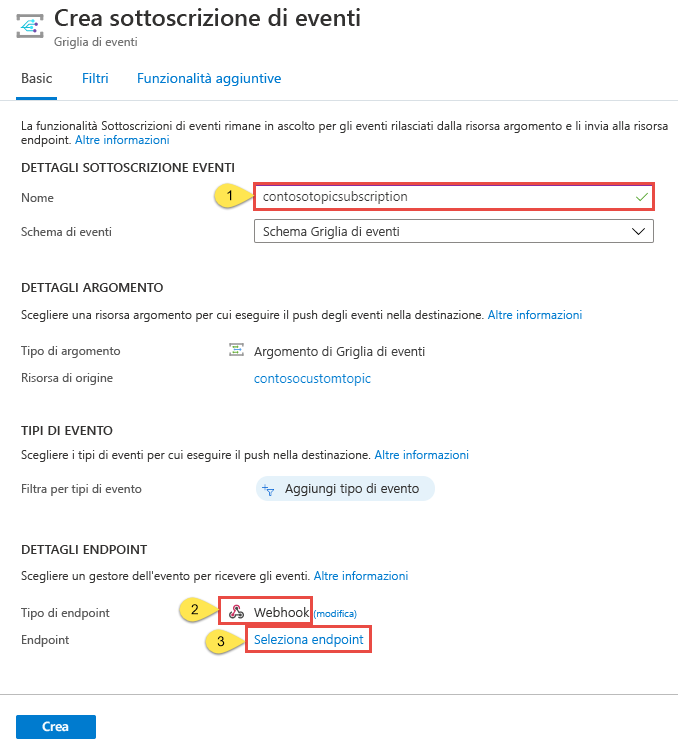

# <a name="create-and-route-custom-events-with-the-azure-portal-and-event-grid"></a>Creare e instradare eventi personalizzati con il portale di Azure e Griglia di eventi

La griglia di eventi di Azure è un servizio di gestione degli eventi per il cloud. In questo articolo viene usato il portale di Azure per creare un argomento personalizzato, sottoscrivere l'argomento e attivare l'evento per visualizzare il risultato. In genere, si inviano eventi a un endpoint che risponde all'evento, ad esempio un webhook o una funzione di Azure. Per maggiore semplicità, tuttavia, in questo articolo gli eventi vengono inviati a un URL che si limita a raccoglie i messaggi. È possibile creare questo URL usando strumenti di terze parti da [RequestBin](https://requestb.in/) o [Hookbin](https://hookbin.com/).

>[!NOTE]
>**RequestBin** e **Hookbin** non sono destinati all'utilizzo con velocità effettiva elevata. Questi strumenti vengono usati esclusivamente per scopi dimostrativi. Se si esegue il push di più di un evento alla volta, è possibile che non vengano visualizzati tutti gli eventi nello strumento.

Al termine, i dati dell'evento vengono inviati a un endpoint.


[!INCLUDE [quickstarts-free-trial-note.md](../../includes/quickstarts-free-trial-note.md)]

## <a name="create-a-resource-group"></a>Creare un gruppo di risorse

Gli argomenti della griglia di eventi sono risorse di Azure e devono essere inseriti in un gruppo di risorse di Azure. Un gruppo di risorse è una raccolta logica in cui le risorse di Azure vengono distribuite e gestite.

1. Nel riquadro di spostamento a sinistra selezionare **Gruppi di risorse**. Quindi selezionare **Aggiungi**.

   

1. Impostare il nome del gruppo di risorse su *gridResourceGroup* e la posizione su *westus2*. Selezionare **Create**.

   

## <a name="create-a-custom-topic"></a>Creare un argomento personalizzato

Un argomento fornisce un endpoint definito dall'utente in cui vengono pubblicati gli eventi. 

1. Per creare un argomento nel gruppo di risorse, selezionare **Tutti i servizi** e cercare *Griglia di eventi*. Selezionare **Argomenti di Griglia di eventi** tra le opzioni disponibili.

   

1. Selezionare **Aggiungi**.

   

1. Specificare un nome per l'argomento. Il nome dell'argomento deve essere univoco perché è rappresentato da una voce DNS. Selezionare una delle [aree supportate](overview.md). Selezionare il gruppo di risorse creato in precedenza. Selezionare **Create**.

   

1. Dopo aver creato l'argomento, selezionare **Aggiorna** per visualizzarlo.

   

## <a name="create-a-message-endpoint"></a>Creare un endpoint del messaggio

Prima di sottoscrivere l'argomento, creare l'endpoint per il messaggio dell'evento. Anziché scrivere codice per rispondere all'evento, creare un endpoint che raccoglie i messaggi per poterli visualizzare. RequestBin e Hookbin sono strumenti di terze parti che consentono di creare un endpoint e visualizzare le richieste inviate a questo endpoint. Passare a [RequestBin](https://requestb.in/) e fare clic su **Create a RequestBin** (Crea RequestBin) oppure passare a [Hookbin](https://hookbin.com/) e fare clic su **Create New Endpoint** (Crea nuovo endpoint).  Copiare l'URL del contenitore, necessario per sottoscrivere l'argomento.

## <a name="subscribe-to-a-topic"></a>Sottoscrivere un argomento

Si sottoscrive un argomento per indicare alla griglia di eventi gli eventi di cui si vuole tenere traccia. 

1. Per creare una sottoscrizione di Griglia di eventi, selezionare di nuovo **Tutti i servizi** e cercare *Griglia di eventi*. Selezionare **Sottoscrizioni di Griglia di eventi** tra le opzioni disponibili.

   

1. Selezionare **+ Sottoscrizione di eventi**.

   

1. Specificare un nome univoco per la sottoscrizione di eventi. Per il tipo di argomento, selezionare **Argomenti di Griglia di eventi**. Per l'istanza, selezionare l'argomento personalizzato creato. Specificare l'URL di RequestBin o Hookbin come endpoint per la notifica degli eventi. Dopo avere specificato i valori, selezionare **Crea**.

   

A questo punto, attivare un evento per vedere come la griglia di eventi distribuisce il messaggio nell'endpoint. Per semplificare questo articolo, viene usato Cloud Shell per inviare dati di esempio dell'evento all'argomento. In genere, i dati dell'evento vengono inviati da un'applicazione o un servizio di Azure.

[!INCLUDE [cloud-shell-try-it.md](../../includes/cloud-shell-try-it.md)]

## <a name="send-an-event-to-your-topic"></a>Inviare un evento all'argomento

Ottenere prima di tutto l'URL e la chiave per l'argomento. Usare il nome dell'argomento per `<topic_name>`.

```azurecli-interactive
endpoint=$(az eventgrid topic show --name <topic_name> -g gridResourceGroup --query "endpoint" --output tsv)
key=$(az eventgrid topic key list --name <topic_name> -g gridResourceGroup --query "key1" --output tsv)
```

L'esempio seguente ottiene i dati di esempio dell'evento:

```azurecli-interactive
body=$(eval echo "'$(curl https://raw.githubusercontent.com/Azure/azure-docs-json-samples/master/event-grid/customevent.json)'")
```

Eseguendo `echo "$body"` è possibile visualizzare l'evento completo. L'elemento `data` del JSON è il payload dell'evento. Questo campo accetta qualsiasi JSON ben formato. È anche possibile usare il campo oggetto per il filtro e il routing avanzato.

CURL è una utilità che esegue richieste HTTP. In questo articolo CURL viene usato per inviare un evento all'argomento. 

```azurecli-interactive
curl -X POST -H "aeg-sas-key: $key" -d "$body" $endpoint
```

È stato attivato l'evento e la griglia di eventi ha inviato il messaggio all'endpoint configurato al momento della sottoscrizione. Passare all'URL dell'endpoint creato in precedenza. In alternativa, fare clic su Aggiorna nel browser aperto. Verrà visualizzato l'evento appena inviato.

```json
[{
  "id": "1807",
  "eventType": "recordInserted",
  "subject": "myapp/vehicles/motorcycles",
  "eventTime": "2017-08-10T21:03:07+00:00",
  "data": {
    "make": "Ducati",
    "model": "Monster"
  },
  "dataVersion": "1.0",
  "metadataVersion": "1",
  "topic": "/subscriptions/{subscription-id}/resourceGroups/{resource-group}/providers/Microsoft.EventGrid/topics/{topic}"
}]
```

## <a name="clean-up-resources"></a>Pulire le risorse

Se si intende continuare a usare questo evento, non è necessario pulire le risorse create con questo articolo. Se non si intende continuare, eliminare le risorse create in questo articolo.

Selezionare il gruppo di risorse e quindi fare clic su **Elimina gruppo di risorse**.

## <a name="next-steps"></a>Passaggi successivi

Ora che si è appreso come creare argomenti e sottoscrizioni di eventi, è possibile approfondire le operazioni possibili con la griglia di eventi:

- [Informazioni sulla griglia di eventi](overview.md)
- [Indirizzare gli eventi di archiviazione BLOB a un endpoint Web personalizzato (anteprima)](../storage/blobs/storage-blob-event-quickstart.md?toc=%2fazure%2fevent-grid%2ftoc.json)
- [Monitorare le modifiche alla macchina virtuale con la griglia di eventi di Azure e le app per la logica](monitor-virtual-machine-changes-event-grid-logic-app.md)
- [Trasmettere Big Data a un data warehouse](event-grid-event-hubs-integration.md)
