# <a name="create-and-route-custom-events-with-the-azure-portal-and-event-grid"></a>Creare e instradare eventi personalizzati con il portale di Azure e Griglia di eventi

La griglia di eventi di Azure è un servizio di gestione degli eventi per il cloud. In questo articolo viene usato il portale di Azure per creare un argomento personalizzato, sottoscrivere l'argomento e attivare l'evento per visualizzare il risultato. Si invia l'evento a una funzione di Azure che registra i dati dell'evento. Al termine, i dati dell'evento vengono inviati a un endpoint e registrati.

[!INCLUDE [quickstarts-free-trial-note.md](../../includes/quickstarts-free-trial-note.md)]

## <a name="create-a-custom-topic"></a>Creare un argomento personalizzato

Un argomento di Griglia di eventi fornisce un endpoint definito dall'utente in cui vengono pubblicati gli eventi. 

1. Accedere al [portale di Azure](https://portal.azure.com/).

1. Per creare un argomento personalizzato, selezionare **Crea una risorsa**. 

   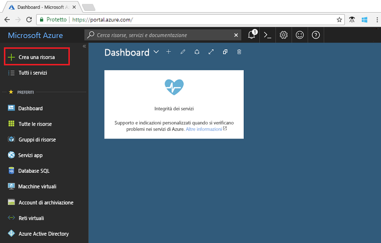

1. Cercare *Argomento di Griglia di eventi* e selezionare tale voce nelle opzioni disponibili.

   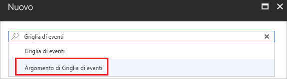

1. Selezionare **Create**.

   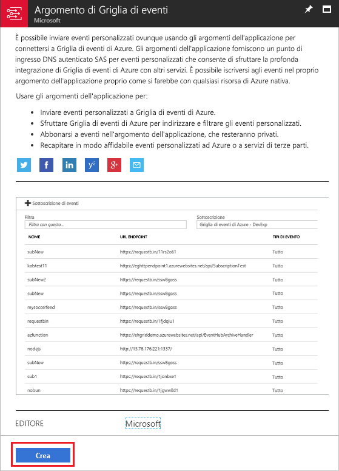

1. Specificare un nome univoco per l'argomento personalizzato. Il nome dell'argomento deve essere univoco perché è rappresentato da una voce DNS. Non usare il nome visualizzato nell'immagine, ma crearne uno personalizzato. Selezionare una delle [aree supportate](overview.md). Specificare un nome per il gruppo di risorse. Selezionare **Create**.

   

1. Dopo che l'argomento personalizzato è stato creato, viene visualizzata una notifica dell'operazione riuscita.

   

   Se la distribuzione non è riuscita, individuare la causa dell'errore. Selezionare **La distribuzione non è riuscita**.

   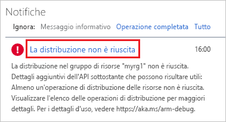

   Selezionare il messaggio di errore.

   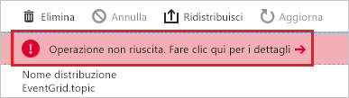

   Nella figura seguente viene illustrata una distribuzione che non è riuscita perché il nome dell'argomento personalizzato è già in uso. Se viene visualizzato questo errore, riprovare la distribuzione con un nome diverso.

   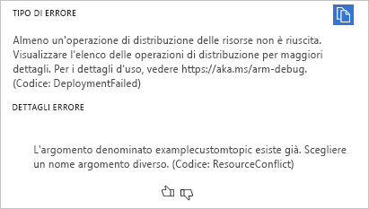

## <a name="create-an-azure-function"></a>Creare una funzione di Azure

Prima di sottoscrivere l'argomento, creare l'endpoint per il messaggio dell'evento. In questo articolo Funzioni di Azure viene usato per creare un'app per le funzioni per l'endpoint.

1. Per creare una funzione, selezionare **Crea una risorsa**.

   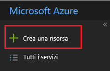

1. Selezionare **Calcolo** e **App per le funzioni**.

   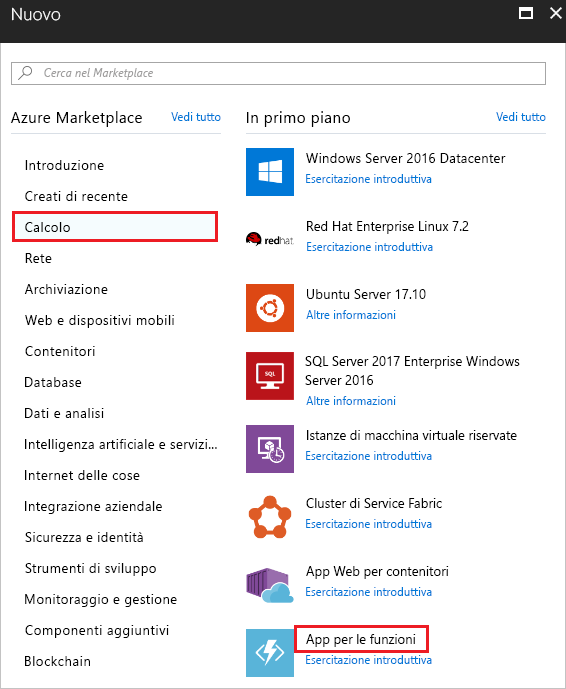

1. Specificare un nome univoco per la funzione di Azure. Non usare il nome visualizzato nell'immagine. Selezionare il gruppo di risorse creato in questo articolo. Per il piano di hosting, usare **Piano a consumo**. Usare il nuovo account di archiviazione suggerito. Dopo avere specificato i valori, selezionare **Crea**.

   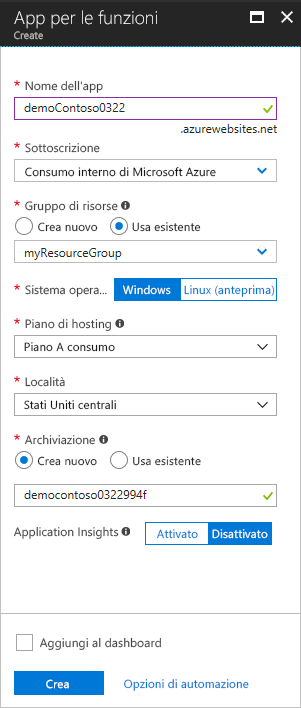

1. Al termine della distribuzione, selezionare **Vai alla risorsa**.

   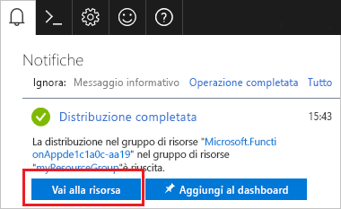

1. Accanto a **Funzioni** selezionare **+**.

   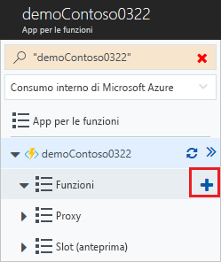

1. Selezionare **Funzione personalizzata** tra le opzioni disponibili.

   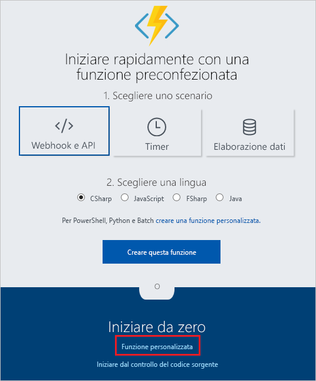

1. Scorrere verso il basso fino a individuare **Trigger griglia di eventi**. Selezionare **C#**.

   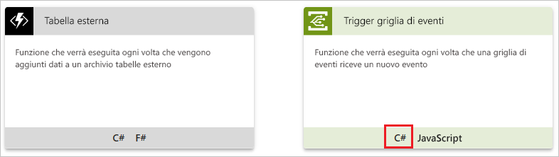

1. Accettare i valori predefiniti e selezionare **Crea**.

   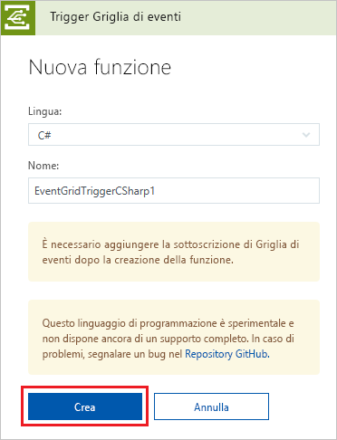

La funzione è ora pronta a ricevere gli eventi.

## <a name="subscribe-to-a-topic"></a>Sottoscrivere un argomento

Si sottoscrive un argomento per indicare a Griglia di eventi gli eventi di cui si vuole tenere traccia e dove inviare tali eventi.

1. Nella funzione di Azure selezionare **Aggiungi sottoscrizione di Griglia di eventi**.

   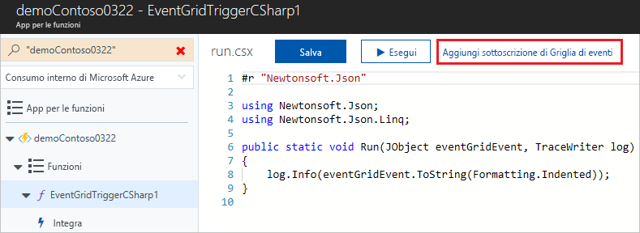

1. Fornire i valori per la sottoscrizione. Selezionare **Argomenti di Griglia di eventi** per il tipo di argomento. Per la sottoscrizione e il gruppo di risorse, selezionare la sottoscrizione e il gruppo di risorse in cui è stato creato l'argomento personalizzato. Ad esempio, selezionare il nome dell'argomento personalizzato. L'endpoint del sottoscrittore viene prepopolato con l'URL per la funzione.

   

1. Prima di attivare l'evento, aprire i log per la funzione in modo da visualizzare i dati dell'evento quando viene inviato. Nella parte inferiore della funzione di Azure, selezionare **Log**.

   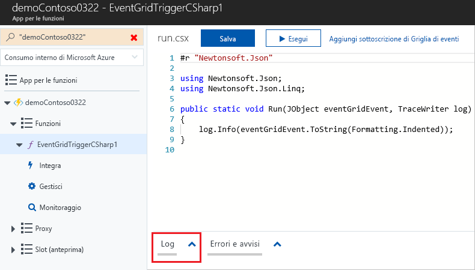

A questo punto, attivare un evento per vedere come la griglia di eventi distribuisce il messaggio nell'endpoint. Per semplificare questo articolo, viene usato Cloud Shell per inviare dati di esempio dell'evento all'argomento personalizzato. In genere, i dati dell'evento vengono inviati da un'applicazione o un servizio di Azure.

[!INCLUDE [cloud-shell-try-it.md](../../includes/cloud-shell-try-it.md)]

## <a name="send-an-event-to-your-topic"></a>Inviare un evento all'argomento

Ottenere prima di tutto l'URL e la chiave per l'argomento. Usare il nome dell'argomento per `<topic_name>`.

```azurecli-interactive
endpoint=$(az eventgrid topic show --name <topic_name> -g myResourceGroup --query "endpoint" --output tsv)
key=$(az eventgrid topic key list --name <topic_name> -g myResourceGroup --query "key1" --output tsv)
```

L'esempio seguente ottiene i dati di esempio dell'evento:

```azurecli-interactive
body=$(eval echo "'$(curl https://raw.githubusercontent.com/Azure/azure-docs-json-samples/master/event-grid/customevent.json)'")
```

Per visualizzare l'evento completo, usare `echo "$body"`. L'elemento `data` del JSON è il payload dell'evento. Questo campo accetta qualsiasi JSON ben formato. È anche possibile usare il campo oggetto per il filtro e il routing avanzato.

CURL è un'utilità che invia richieste HTTP. In questo articolo CURL viene usato per inviare un evento all'argomento personalizzato. 

```azurecli-interactive
curl -X POST -H "aeg-sas-key: $key" -d "$body" $endpoint
```

È stato attivato l'evento e Griglia di eventi ha inviato il messaggio all'endpoint configurato al momento della sottoscrizione. Analizzare i log per visualizzare i dati dell'evento.

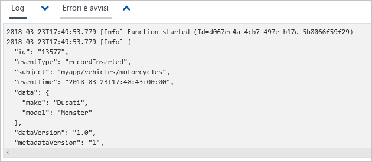

## <a name="clean-up-resources"></a>Pulire le risorse

Se si intende continuare a usare questo evento, non è necessario pulire le risorse create con questo articolo. In caso contrario, eliminare le risorse create in questo articolo.

Selezionare il gruppo di risorse e quindi fare clic su **Elimina gruppo di risorse**.

## <a name="next-steps"></a>Passaggi successivi

Ora che si è appreso come creare argomenti personalizzati e sottoscrizioni di eventi, è possibile approfondire le operazioni possibili con Griglia di eventi:

- [Informazioni sulla griglia di eventi](overview.md)
- [Indirizzare gli eventi di archiviazione BLOB a un endpoint Web personalizzato (anteprima)](../storage/blobs/storage-blob-event-quickstart.md?toc=%2fazure%2fevent-grid%2ftoc.json)
- [Monitorare le modifiche alla macchina virtuale con la griglia di eventi di Azure e le app per la logica](monitor-virtual-machine-changes-event-grid-logic-app.md)
- [Trasmettere Big Data a un data warehouse](event-grid-event-hubs-integration.md)
