# <a name="quickstart-route-custom-events-to-web-endpoint-with-the-azure-portal-and-event-grid"></a>Guida introduttiva: Instradare eventi personalizzati all'endpoint Web con il portale di Azure e Griglia di eventi

La griglia di eventi di Azure è un servizio di gestione degli eventi per il cloud. In questo articolo viene usato il portale di Azure per creare un argomento personalizzato, sottoscriverlo e attivare l'evento per visualizzare il risultato. In genere, si inviano eventi a un endpoint che elabora i dati dell'evento e intraprende azioni. Per maggiore semplicità, tuttavia, in questo articolo gli eventi vengono inviati a un'app Web che raccoglie e visualizza i messaggi.

Al termine, i dati degli eventi saranno stati inviati all'app Web.

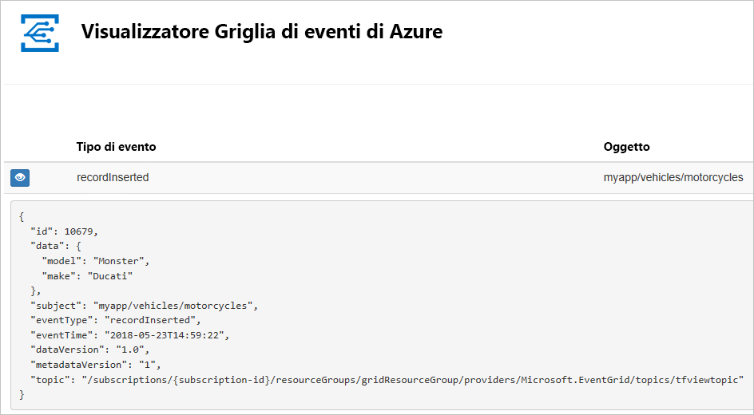

[!INCLUDE [updated-for-az](../../includes/updated-for-az.md)]

[!INCLUDE [quickstarts-free-trial-note.md](../../includes/quickstarts-free-trial-note.md)]

[!INCLUDE [event-grid-register-provider-portal.md](../../includes/event-grid-register-provider-portal.md)]

## <a name="create-a-custom-topic"></a>Creare un argomento personalizzato

Un argomento di Griglia di eventi fornisce un endpoint definito dall'utente in cui vengono pubblicati gli eventi. 

1. Accedere al [portale di Azure](https://portal.azure.com/).
2. Selezionare **Tutti i servizi** nel menu di spostamento sinistro, cercare **Griglia di eventi** e selezionare **Argomenti di Griglia di eventi**. 

    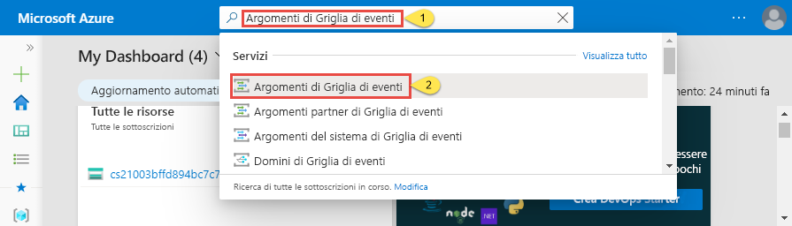
3. Nella pagina **Argomenti di Griglia di eventi** selezionare **+Aggiungi** sulla barra degli strumenti. 

    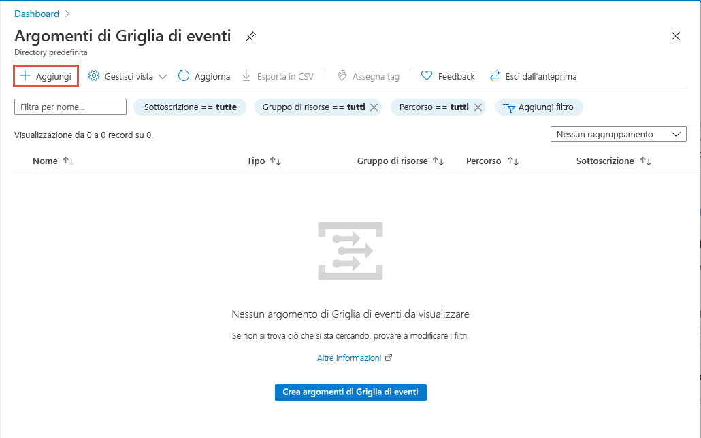
4. Nella pagina **Crea argomento** procedere come segue:
    1. Specificare un **nome** univoco per l'argomento personalizzato. Il nome dell'argomento deve essere univoco perché è rappresentato da una voce DNS. Non usare il nome visualizzato nell'immagine In alternativa, creare un nome personalizzato di lunghezza compresa tra 3 e 50 caratteri e contenente solo valori compresi tra a e z, A e Z, 0 e 9 e "-".
    2. Selezionare la **sottoscrizione**di Azure.
    3. Selezionare un gruppo di risorse esistente oppure selezionare **Crea nuovo** e immettere un **nome** per il **gruppo di risorse**.
    4. Selezionare una **posizione** per l'argomento di Griglia di eventi.
    5. Mantenere il valore predefinito **Schema griglia di eventi** per il campo **Schema evento**. 

       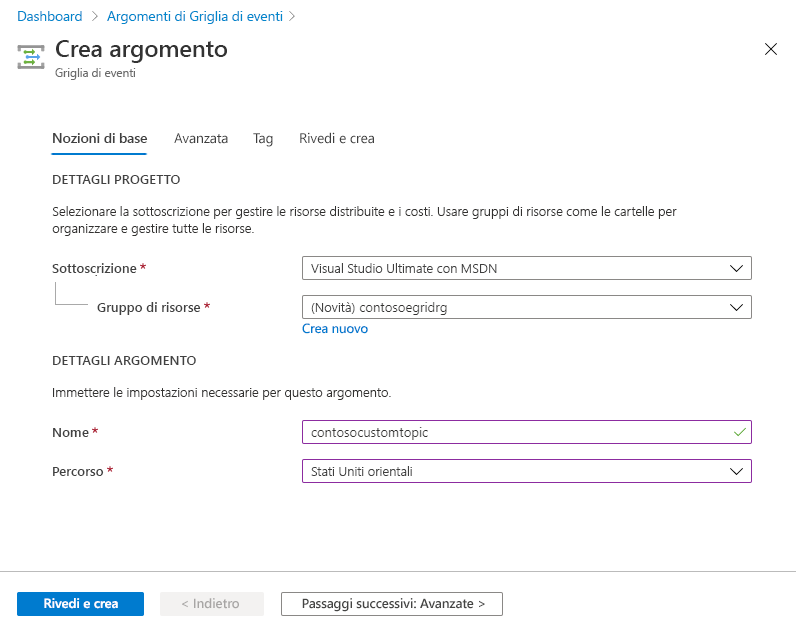
    6. Selezionare **Create** (Crea). 
5. Dopo che l'argomento personalizzato è stato creato, viene visualizzata una notifica dell'operazione riuscita. Selezionare **Vai al gruppo di risorse**. 

   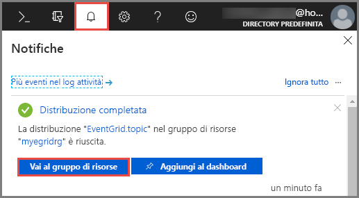
6. Nella pagina **Gruppo di risorse** selezionare l'argomento di Griglia di eventi. 

   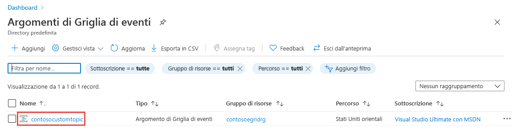
7. Verrà visualizzata la pagina **Argomento di Griglia di eventi** relativa alla griglia di eventi. Tenere aperta questa pagina. Verrà usata in seguito nell'argomento di avvio rapido. 

    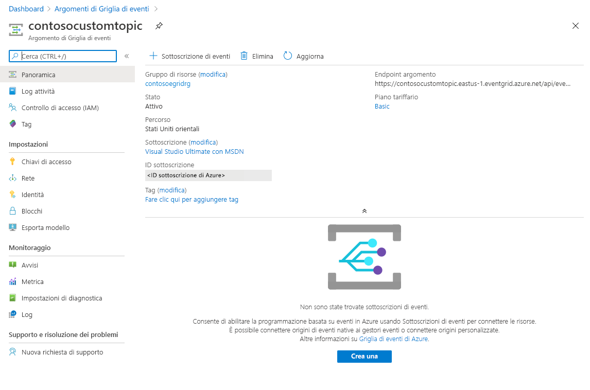

## <a name="create-a-message-endpoint"></a>Creare un endpoint del messaggio
Prima di creare una sottoscrizione per l'argomento personalizzato, creare un endpoint per il messaggio dell'evento. L'endpoint richiede in genere azioni basate sui dati degli eventi. Per semplificare questa guida introduttiva, si distribuisce un'[app Web preesistente](https://github.com/Azure-Samples/azure-event-grid-viewer) che visualizza i messaggi di evento. La soluzione distribuita include un piano di servizio app, un'app Web del servizio app e codice sorgente da GitHub.

1. Nella pagina dell'articolo selezionare **Distribuisci in Azure** per distribuire la soluzione nella sottoscrizione. Nel portale di Azure specificare i valori per i parametri.

   <a href="https://portal.azure.com/#create/Microsoft.Template/uri/https%3A%2F%2Fraw.githubusercontent.com%2FAzure-Samples%2Fazure-event-grid-viewer%2Fmaster%2Fazuredeploy.json" target="_blank"></a>
1. Per il completamento della distribuzione possono essere necessari alcuni minuti. Dopo il completamento della distribuzione, visualizzare l'app Web per assicurarsi che sia in esecuzione. In un Web browser passare a: `https://<your-site-name>.azurewebsites.net`
1. Viene visualizzato il sito, ma nessun evento è ancora stato pubblicato.

   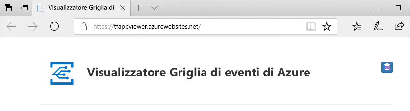

## <a name="subscribe-to-custom-topic"></a>Sottoscrivere eventi per un argomento personalizzato

Si sottoscrive un argomento di Griglia di eventi per indicare di quali eventi si vuole tenere traccia e dove inviarli.

1. Nella pagina **Argomento di Griglia di eventi** relativa all'argomento personalizzato selezionare **+ Sottoscrizione di eventi** sulla barra degli strumenti.

   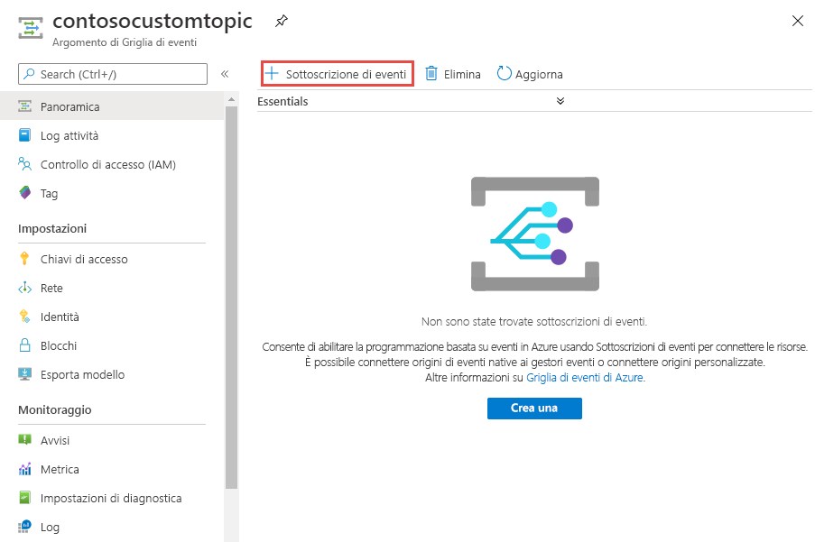
2. Nella pagina **Crea sottoscrizione di eventi** procedere come segue:
    1. Specificare un **nome** per la sottoscrizione di eventi.
    3. Selezionare **Webhook** per **Tipo di endpoint**. 
    4. Scegliere **Seleziona endpoint**. 

       
    5. Per l'endpoint del webhook, specificare l'URL dell'app Web e aggiungere `api/updates` all'URL della home page. Selezionare **Confermare la selezione**.

       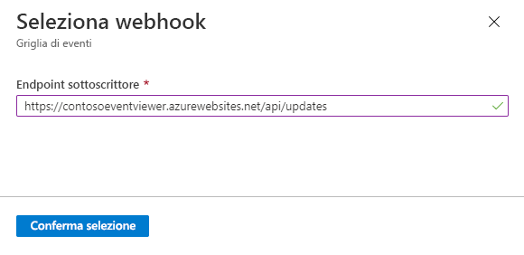
    6. Nella pagina **Crea sottoscrizione di eventi** selezionare **Crea**.

3. Visualizzare nuovamente l'app Web e notare che all'app è stato inviato un evento di convalida della sottoscrizione. Selezionare l'icona a forma di occhio per espandere i dati dell'evento. Griglia di eventi invia l'evento di convalida in modo che l'endpoint possa verificare che voglia ricevere i dati dell'evento. L'app Web include il codice per convalidare la sottoscrizione.

    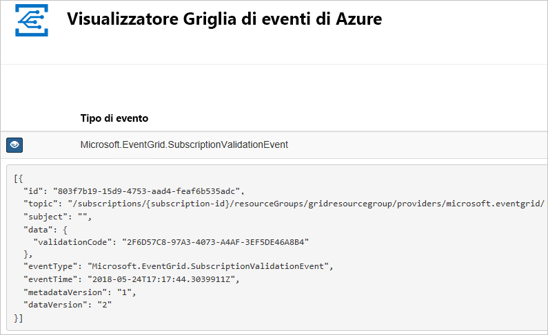

## <a name="send-an-event-to-your-topic"></a>Inviare un evento all'argomento

A questo punto, attivare un evento per vedere come la griglia di eventi distribuisce il messaggio nell'endpoint. Usare l'interfaccia della riga di comando di Azure o PowerShell per inviare un evento di test all'argomento personalizzato. In genere, i dati dell'evento vengono inviati da un'applicazione o un servizio di Azure.

Il primo esempio usa l'interfaccia della riga di comando di Azure. Ottiene l'URL e la chiave per l'argomento personalizzato e i dati dell'evento di esempio. Usare il nome dell'argomento personalizzato per `<topic name>`. Verranno creati i dati dell'evento di esempio. L'elemento `data` del JSON è il payload dell'evento. Questo campo accetta qualsiasi JSON ben formato. È anche possibile usare il campo oggetto per il filtro e il routing avanzato. CURL è un'utilità che invia richieste HTTP.


### <a name="azure-cli"></a>Interfaccia della riga di comando di Azure
1. Nel portale di Azure selezionare **Cloud Shell**. Selezionare **Bash** nell'angolo in alto a sinistra della finestra Cloud Shell. 

    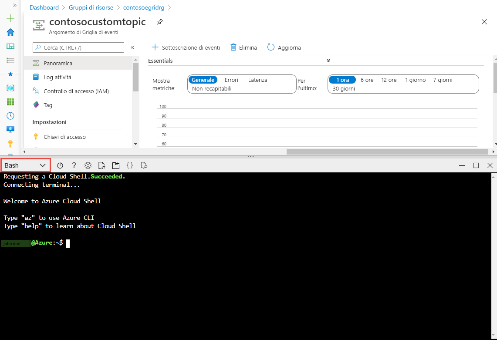
1. Eseguire il comando seguente per ottenere l'**endpoint** per l'argomento: Dopo aver copiato e incollato il comando, aggiornare il **nome dell'argomento** e il **nome del gruppo di risorse** prima di eseguirlo. 

    ```azurecli
    endpoint=$(az eventgrid topic show --name <topic name> -g <resource group name> --query "endpoint" --output tsv)
    ```
2. Eseguire il comando seguente per ottenere la **chiave** per l'argomento personalizzato: Dopo aver copiato e incollato il comando, aggiornare il **nome dell'argomento** e il nome del **gruppo di risorse** prima di eseguirlo. 

    ```azurecli
    key=$(az eventgrid topic key list --name <topic name> -g <resource group name> --query "key1" --output tsv)
    ```
3. Copiare l'istruzione seguente con la definizione di evento e premere **INVIO**. 

    ```json
    event='[ {"id": "'"$RANDOM"'", "eventType": "recordInserted", "subject": "myapp/vehicles/motorcycles", "eventTime": "'`date +%Y-%m-%dT%H:%M:%S%z`'", "data":{ "make": "Ducati", "model": "Monster"},"dataVersion": "1.0"} ]'
    ```
4. Eseguire il comando **Curl** seguente per pubblicare l'evento:

    ```
    curl -X POST -H "aeg-sas-key: $key" -d "$event" $endpoint
    ```

### <a name="azure-powershell"></a>Azure PowerShell
Il secondo esempio usa PowerShell per eseguire passaggi simili.

1. Nel portale di Azure selezionare **Cloud Shell** (in alternativa, passare a https://shell.azure.com/). Selezionare **PowerShell** nell'angolo in alto a sinistra della finestra Cloud Shell. Vedere l'esempio di immagine di finestra **Cloud Shell** nella sezione sull'interfaccia della riga di comando di Azure.
2. Impostare le variabili seguenti. Dopo aver copiato e incollato ogni singolo comando, aggiornare il **nome dell'argomento** e il **nome del gruppo di risorse** prima di eseguirlo:

    ```powershell
    $resourceGroupName = <resource group name>
    $topicName = <topic name>
    ```
3. Eseguire i comandi seguenti per ottenere l'**endpoint** e le **chiavi** per l'argomento:

    ```powershell
    $endpoint = (Get-AzEventGridTopic -ResourceGroupName $resourceGroupName -Name $topicName).Endpoint
    $keys = Get-AzEventGridTopicKey -ResourceGroupName $resourceGroupName -Name $topicName
    ```
4. Preparare l'evento. Copiare ed eseguire le istruzioni nella finestra Cloud Shell. 

    ```powershell
    $eventID = Get-Random 99999

    #Date format should be SortableDateTimePattern (ISO 8601)
    $eventDate = Get-Date -Format s

    #Construct body using Hashtable
    $htbody = @{
        id= $eventID
        eventType="recordInserted"
        subject="myapp/vehicles/motorcycles"
        eventTime= $eventDate   
        data= @{
            make="Ducati"
            model="Monster"
        }
        dataVersion="1.0"
    }
    
    #Use ConvertTo-Json to convert event body from Hashtable to JSON Object
    #Append square brackets to the converted JSON payload since they are expected in the event's JSON payload syntax
    $body = "["+(ConvertTo-Json $htbody)+"]"
    ```
5. Usare il cmdlet **Invoke-WebRequest** per inviare l'evento. 

    ```powershell
    Invoke-WebRequest -Uri $endpoint -Method POST -Body $body -Headers @{"aeg-sas-key" = $keys.Key1}
    ```

### <a name="verify-in-the-event-grid-viewer"></a>Verificare nel visualizzatore Griglia di eventi
È stato attivato l'evento e Griglia di eventi ha inviato il messaggio all'endpoint configurato al momento della sottoscrizione. Visualizzare l'app Web per vedere l'evento appena inviato.

```json
{
  "id": "974",
  "eventType": "recordInserted",
  "subject": "myapp/vehicles/motorcycles",
  "eventTime": "2019-03-28T01:11:59+00:00",
  "data": {
    "make": "Ducati",
    "model": "Monster"
  },
  "dataVersion": "1.0",
  "metadataVersion": "1",
  "topic": "/subscriptions/11111111-1111-1111-1111-111111111111/resourceGroups/myegridrg/providers/Microsoft.EventGrid/topics/myegridtopic"
}
```

## <a name="clean-up-resources"></a>Pulire le risorse
Se si intende continuare a usare questo evento, non è necessario pulire le risorse create con questo articolo. In caso contrario, eliminare le risorse create in questo articolo.

1. Selezionare **Gruppi di risorse** nel menu sinistro. Se l'opzione non viene visualizzata nel menu sinistro, selezionare **Tutti i servizi** nel menu sinistro e quindi **Gruppi di risorse**. 
2. Selezionare il gruppo di risorse per avviare la pagina **Gruppo di risorse**. 
3. Selezionare **Elimina gruppo di risorse** sulla barra degli strumenti. 
4. Confermare l'eliminazione immettendo il nome del gruppo di risorse e selezionare **Elimina**. 

    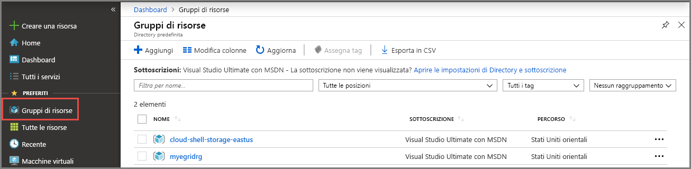

    L'altro gruppo di risorse visualizzato nella pagina è stato creato e usato dalla finestra Cloud Shell. Eliminarlo se non si prevede di usare la finestra Cloud Shell in seguito. 

## <a name="next-steps"></a>Passaggi successivi

Ora che si è appreso come creare argomenti personalizzati e sottoscrizioni di eventi, è possibile approfondire le operazioni possibili con Griglia di eventi:

- [Informazioni sulla griglia di eventi](overview.md)
- [Indirizzare gli eventi di archiviazione BLOB a un endpoint Web personalizzato (anteprima)](../storage/blobs/storage-blob-event-quickstart.md?toc=%2fazure%2fevent-grid%2ftoc.json)
- [Monitorare le modifiche alla macchina virtuale con la griglia di eventi di Azure e le app per la logica](monitor-virtual-machine-changes-event-grid-logic-app.md)
- [Trasmettere Big Data a un data warehouse](event-grid-event-hubs-integration.md)
