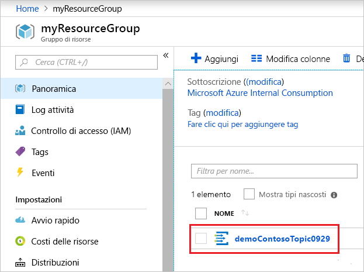

# <a name="quickstart-route-custom-events-to-web-endpoint-with-the-azure-portal-and-event-grid"></a>Guida introduttiva: Instradare eventi personalizzati all'endpoint Web con il portale di Azure e Griglia di eventi

La griglia di eventi di Azure è un servizio di gestione degli eventi per il cloud. In questo articolo viene usato il portale di Azure per creare un argomento personalizzato, sottoscriverlo e attivare l'evento per visualizzare il risultato. In genere, si inviano eventi a un endpoint che elabora i dati dell'evento e intraprende azioni. Per maggiore semplicità, tuttavia, in questo articolo gli eventi vengono inviati a un'app Web che raccoglie e visualizza i messaggi.

Al termine, i dati degli eventi saranno stati inviati all'app Web.


[!INCLUDE [updated-for-az](../../includes/updated-for-az.md)]

[!INCLUDE [quickstarts-free-trial-note.md](../../includes/quickstarts-free-trial-note.md)]

[!INCLUDE [event-grid-register-provider-portal.md](../../includes/event-grid-register-provider-portal.md)]

## <a name="create-a-custom-topic"></a>Creare un argomento personalizzato

Un argomento di Griglia di eventi fornisce un endpoint definito dall'utente in cui vengono pubblicati gli eventi. 

1. Accedere al [portale di Azure](https://portal.azure.com/).

1. Per creare un argomento personalizzato, selezionare **Crea una risorsa**. 

   

1. Cercare *Argomento di Griglia di eventi* e selezionare tale voce nelle opzioni disponibili.

   

1. Selezionare **Create**.

   

1. Specificare un nome univoco per l'argomento personalizzato. Il nome dell'argomento deve essere univoco perché è rappresentato da una voce DNS. Non usare il nome visualizzato nell'immagine In alternativa, creare un nome personalizzato di lunghezza compresa tra 3 e 50 caratteri e contenente solo valori compresi tra a e z, A e Z, 0 e 9 e "-". Specificare un nome per il gruppo di risorse. Selezionare **Create**.

   

1. Dopo che l'argomento personalizzato è stato creato, viene visualizzata una notifica dell'operazione riuscita.

   

   Se la distribuzione non è riuscita, individuare la causa dell'errore. Selezionare **La distribuzione non è riuscita**.

   

   Selezionare il messaggio di errore.

   

   Nella figura seguente viene illustrata una distribuzione che non è riuscita perché il nome dell'argomento personalizzato è già in uso. Se viene visualizzato questo errore, riprovare la distribuzione con un nome diverso.

   

## <a name="create-a-message-endpoint"></a>Creare un endpoint del messaggio

Prima di sottoscrivere l'argomento personalizzato, creare l'endpoint per il messaggio dell'evento. L'endpoint richiede in genere azioni basate sui dati degli eventi. Per semplificare questa guida introduttiva, si distribuisce un'[app Web preesistente](https://github.com/Azure-Samples/azure-event-grid-viewer) che visualizza i messaggi di evento. La soluzione distribuita include un piano di servizio app, un'app Web del servizio app e codice sorgente da GitHub.

1. Selezionare **Distribuisci in Azure** per distribuire la soluzione nella sottoscrizione. Nel portale di Azure specificare i valori per i parametri.

   <a href="https://portal.azure.com/#create/Microsoft.Template/uri/https%3A%2F%2Fraw.githubusercontent.com%2FAzure-Samples%2Fazure-event-grid-viewer%2Fmaster%2Fazuredeploy.json" target="_blank"></a>

1. Per il completamento della distribuzione possono essere necessari alcuni minuti. Dopo il completamento della distribuzione, visualizzare l'app Web per assicurarsi che sia in esecuzione. In un Web browser passare a: `https://<your-site-name>.azurewebsites.net`

1. Viene visualizzato il sito, ma nessun evento è ancora stato pubblicato.

   

## <a name="subscribe-to-custom-topic"></a>Sottoscrivere eventi per un argomento personalizzato

Si sottoscrive un argomento di Griglia di eventi per indicare di quali eventi si vuole tenere traccia e dove inviarli.

1. Nel portale selezionare l'argomento personalizzato.

   

1. Selezionare **+ Sottoscrizione di eventi**.

   

1. Selezionare **Webhook** come tipo di endpoint. Specificare un nome per la sottoscrizione di eventi.

   

1. Fare clic su **Seleziona endpoint**. 

1. Per l'endpoint del webhook, specificare l'URL dell'app Web e aggiungere `api/updates` all'URL della home page. Selezionare **Confermare la selezione**.

   

1. Dopo avere specificato i valori della sottoscrizione di eventi, selezionare **Crea**.

Visualizzare nuovamente l'app Web e notare che all'app è stato inviato un evento di convalida della sottoscrizione. Selezionare l'icona a forma di occhio per espandere i dati dell'evento. Griglia di eventi invia l'evento di convalida in modo che l'endpoint possa verificare che voglia ricevere i dati dell'evento. L'app Web include il codice per convalidare la sottoscrizione.


## <a name="send-an-event-to-your-topic"></a>Inviare un evento all'argomento

A questo punto, attivare un evento per vedere come la griglia di eventi distribuisce il messaggio nell'endpoint. Usare l'interfaccia della riga di comando di Azure o PowerShell per inviare un evento di test all'argomento personalizzato. In genere, i dati dell'evento vengono inviati da un'applicazione o un servizio di Azure.

Il primo esempio usa l'interfaccia della riga di comando di Azure. Ottiene l'URL e la chiave per l'argomento personalizzato e i dati dell'evento di esempio. Usare il nome dell'argomento personalizzato per `<topic_name>`. Verranno creati i dati dell'evento di esempio. L'elemento `data` del JSON è il payload dell'evento. Questo campo accetta qualsiasi JSON ben formato. È anche possibile usare il campo oggetto per il filtro e il routing avanzato. CURL è un'utilità che invia richieste HTTP.

```azurecli-interactive
endpoint=$(az eventgrid topic show --name <topic_name> -g myResourceGroup --query "endpoint" --output tsv)
key=$(az eventgrid topic key list --name <topic_name> -g myResourceGroup --query "key1" --output tsv)

event='[ {"id": "'"$RANDOM"'", "eventType": "recordInserted", "subject": "myapp/vehicles/motorcycles", "eventTime": "'`date +%Y-%m-%dT%H:%M:%S%z`'", "data":{ "make": "Ducati", "model": "Monster"},"dataVersion": "1.0"} ]'

curl -X POST -H "aeg-sas-key: $key" -d "$event" $endpoint
```

Il secondo esempio usa PowerShell per eseguire passaggi simili.

```azurepowershell-interactive
$endpoint = (Get-AzEventGridTopic -ResourceGroupName gridResourceGroup -Name <topic-name>).Endpoint
$keys = Get-AzEventGridTopicKey -ResourceGroupName gridResourceGroup -Name <topic-name>

$eventID = Get-Random 99999

#Date format should be SortableDateTimePattern (ISO 8601)
$eventDate = Get-Date -Format s

#Construct body using Hashtable
$htbody = @{
    id= $eventID
    eventType="recordInserted"
    subject="myapp/vehicles/motorcycles"
    eventTime= $eventDate   
    data= @{
        make="Ducati"
        model="Monster"
    }
    dataVersion="1.0"
}

#Use ConvertTo-Json to convert event body from Hashtable to JSON Object
#Append square brackets to the converted JSON payload since they are expected in the event's JSON payload syntax
$body = "["+(ConvertTo-Json $htbody)+"]"

Invoke-WebRequest -Uri $endpoint -Method POST -Body $body -Headers @{"aeg-sas-key" = $keys.Key1}
```

È stato attivato l'evento e Griglia di eventi ha inviato il messaggio all'endpoint configurato al momento della sottoscrizione. Visualizzare l'app Web per vedere l'evento appena inviato.

```json
[{
  "id": "1807",
  "eventType": "recordInserted",
  "subject": "myapp/vehicles/motorcycles",
  "eventTime": "2017-08-10T21:03:07+00:00",
  "data": {
    "make": "Ducati",
    "model": "Monster"
  },
  "dataVersion": "1.0",
  "metadataVersion": "1",
  "topic": "/subscriptions/{subscription-id}/resourceGroups/{resource-group}/providers/Microsoft.EventGrid/topics/{topic}"
}]
```


## <a name="clean-up-resources"></a>Pulire le risorse

Se si intende continuare a usare questo evento, non è necessario pulire le risorse create con questo articolo. In caso contrario, eliminare le risorse create in questo articolo.

Selezionare il gruppo di risorse e quindi fare clic su **Elimina gruppo di risorse**.

## <a name="next-steps"></a>Passaggi successivi

Ora che si è appreso come creare argomenti personalizzati e sottoscrizioni di eventi, è possibile approfondire le operazioni possibili con Griglia di eventi:

- [Informazioni sulla griglia di eventi](overview.md)
- [Indirizzare gli eventi di archiviazione BLOB a un endpoint Web personalizzato (anteprima)](../storage/blobs/storage-blob-event-quickstart.md?toc=%2fazure%2fevent-grid%2ftoc.json)
- [Monitorare le modifiche alla macchina virtuale con la griglia di eventi di Azure e le app per la logica](monitor-virtual-machine-changes-event-grid-logic-app.md)
- [Trasmettere Big Data a un data warehouse](event-grid-event-hubs-integration.md)
