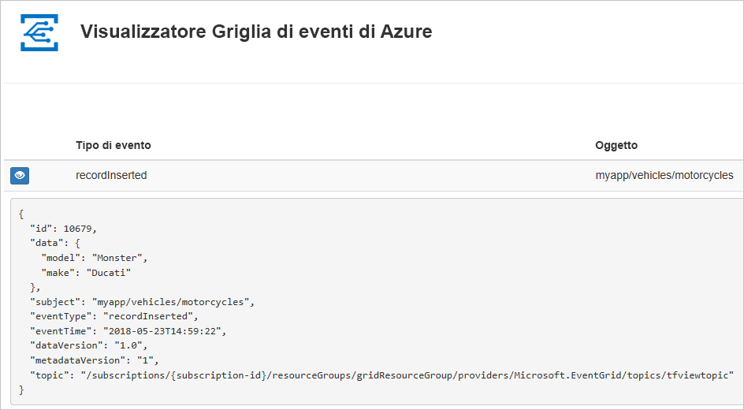
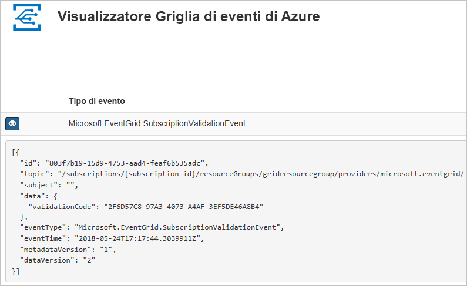

# <a name="create-and-route-custom-events-with-azure-powershell-and-event-grid"></a>Creare e instradare eventi personalizzati con Azure PowerShell e Griglia di eventi

La griglia di eventi di Azure è un servizio di gestione degli eventi per il cloud. In questo articolo viene usato Azure PowerShell per creare un argomento personalizzato, sottoscrivere l'argomento e attivare l'evento per visualizzare il risultato. In genere, si inviano eventi a un endpoint che elabora i dati dell'evento e intraprende azioni. Per maggiore semplicità, tuttavia, in questo articolo gli eventi vengono inviati a un'app Web che raccoglie e visualizza i messaggi.

Al termine, i dati degli eventi saranno stati inviati all'app Web.



[!INCLUDE [quickstarts-free-trial-note.md](../../includes/quickstarts-free-trial-note.md)]

Ai fini di questo articolo, è necessario eseguire la versione più recente di Azure PowerShell. Se è necessario eseguire l'installazione o l'aggiornamento, vedere [Installare e configurare Azure PowerShell](/powershell/azure/install-azurerm-ps).

## <a name="create-a-resource-group"></a>Creare un gruppo di risorse

Gli argomenti della griglia di eventi sono risorse di Azure e devono essere inseriti in un gruppo di risorse di Azure. Un gruppo di risorse è una raccolta logica in cui le risorse di Azure vengono distribuite e gestite.

Creare un gruppo di risorse con comando [New-AzureRmResourceGroup](/powershell/module/azurerm.resources/new-azurermresourcegroup).

L'esempio seguente crea un gruppo di risorse denominato *gridResourceGroup* nella località *westus2*.

```powershell-interactive
New-AzureRmResourceGroup -Name gridResourceGroup -Location westus2
```

[!INCLUDE [event-grid-register-provider-powershell.md](../../includes/event-grid-register-provider-powershell.md)]

## <a name="create-a-custom-topic"></a>Creare un argomento personalizzato

Un argomento di Griglia di eventi fornisce un endpoint definito dall'utente in cui vengono pubblicati gli eventi. L'esempio seguente crea l'argomento personalizzato nel gruppo di risorse. Sostituire `<your-topic-name>` con un nome univoco per l'argomento. Il nome dell'argomento deve essere univoco perché fa parte della voce DNS.

```powershell-interactive
$topicname="<your-topic-name>"

New-AzureRmEventGridTopic -ResourceGroupName gridResourceGroup -Location westus2 -Name $topicname
```

## <a name="create-a-message-endpoint"></a>Creare un endpoint del messaggio

Prima di sottoscrivere l'argomento, creare l'endpoint per il messaggio dell'evento. L'endpoint richiede in genere azioni basate sui dati degli eventi. Per semplificare questa guida introduttiva, si distribuisce un'[app Web preesistente](https://github.com/dbarkol/azure-event-grid-viewer) che visualizza i messaggi di evento. La soluzione distribuita include un piano di servizio app, un'app Web del servizio app e codice sorgente da GitHub.

Sostituire `<your-site-name>` con un nome univoco per l'app Web. Il nome dell'app Web deve essere univoco perché fa parte della voce DNS.

```powershell-interactive
$sitename="<your-site-name>"

New-AzureRmResourceGroupDeployment `
  -ResourceGroupName gridResourceGroup `
  -TemplateUri "https://raw.githubusercontent.com/dbarkol/azure-event-grid-viewer/master/azuredeploy.json" `
  -siteName $sitename `
  -hostingPlanName viewerhost
```

Per il completamento della distribuzione possono essere necessari alcuni minuti. Dopo il completamento della distribuzione, visualizzare l'app Web per assicurarsi che sia in esecuzione. In un Web browser passare a: `https://<your-site-name>.azurewebsites.net`

Il sito dovrebbe essere visibile senza messaggi attualmente visualizzati.

## <a name="subscribe-to-a-topic"></a>Sottoscrivere un argomento

Si sottoscrive un argomento per indicare a Griglia di eventi gli eventi di cui si vuole tenere traccia e dove inviare tali eventi. L'esempio seguente sottoscrive l'argomento creato e passa l'URL dall'app Web come endpoint per la notifica dell'evento.

L'endpoint per l'app Web deve includere il suffisso `/api/updates/`.

```powershell-interactive
$endpoint="https://$sitename.azurewebsites.net/api/updates"

New-AzureRmEventGridSubscription `
  -EventSubscriptionName demoViewerSub `
  -Endpoint $endpoint `
  -ResourceGroupName gridResourceGroup `
  -TopicName $topicname
```

Visualizzare nuovamente l'app Web e notare che all'app è stato inviato un evento di convalida della sottoscrizione. Selezionare l'icona a forma di occhio per espandere i dati dell'evento. Griglia di eventi invia l'evento di convalida in modo che l'endpoint possa verificare che voglia ricevere i dati dell'evento. L'app Web include il codice per convalidare la sottoscrizione.



## <a name="send-an-event-to-your-topic"></a>Inviare un evento all'argomento

Attivare un evento per vedere come la Griglia di eventi distribuisce il messaggio nell'endpoint. Ottenere prima di tutto l'URL e la chiave per l'argomento.

```powershell-interactive
$endpoint = (Get-AzureRmEventGridTopic -ResourceGroupName gridResourceGroup -Name $topicname).Endpoint
$keys = Get-AzureRmEventGridTopicKey -ResourceGroupName gridResourceGroup -Name $topicname
```

Per semplificare questo articolo, configurare dati di esempio dell'evento da inviare all'argomento personalizzato. In genere, i dati dell'evento vengono inviati da un'applicazione o un servizio di Azure. L'esempio seguente usa HashTable per creare i dati dell'evento `htbody` e quindi li converte in un oggetto `$body` del payload JSON ben formato:

```powershell-interactive
$eventID = Get-Random 99999

#Date format should be SortableDateTimePattern (ISO 8601)
$eventDate = Get-Date -Format s

#Construct body using Hashtable
$htbody = @{
    id= $eventID
    eventType="recordInserted"
    subject="myapp/vehicles/motorcycles"
    eventTime= $eventDate   
    data= @{
        make="Ducati"
        model="Monster"
    }
    dataVersion="1.0"
}

#Use ConvertTo-Json to convert event body from Hashtable to JSON Object
#Append square brackets to the converted JSON payload since they are expected in the event's JSON payload syntax
$body = "["+(ConvertTo-Json $htbody)+"]"
```

Visualizzando `$body`, è possibile visualizzare l'evento completo. L'elemento `data` del JSON è il payload dell'evento. Questo campo accetta qualsiasi JSON ben formato. È anche possibile usare il campo oggetto per il filtro e il routing avanzato.

Inviare ora un evento all'argomento.

```powershell-interactive
Invoke-WebRequest -Uri $endpoint -Method POST -Body $body -Headers @{"aeg-sas-key" = $keys.Key1}
```

È stato attivato l'evento e Griglia di eventi ha inviato il messaggio all'endpoint configurato al momento della sottoscrizione. Visualizzare l'app Web per vedere l'evento appena inviato.

```json
[{
  "id": "1807",
  "eventType": "recordInserted",
  "subject": "myapp/vehicles/motorcycles",
  "eventTime": "2018-01-25T15:58:13",
  "data": {
    "make": "Ducati",
    "model": "Monster"
  },
  "dataVersion": "1.0",
  "metadataVersion": "1",
  "topic": "/subscriptions/{subscription-id}/resourceGroups/{resource-group}/providers/Microsoft.EventGrid/topics/{topic}"
}]
```

## <a name="clean-up-resources"></a>Pulire le risorse

Se si intende continuare a usare questo evento o l'app per visualizzare gli eventi, non è necessario pulire le risorse create in questo articolo. In caso contrario, usare il comando seguente per eliminare le risorse create con questo articolo.

```powershell
Remove-AzureRmResourceGroup -Name gridResourceGroup
```

## <a name="next-steps"></a>Passaggi successivi

Ora che si è appreso come creare argomenti e sottoscrizioni di eventi, è possibile approfondire le operazioni possibili con la griglia di eventi:

- [Informazioni sulla griglia di eventi](overview.md)
- [Indirizzare gli eventi di archiviazione BLOB a un endpoint Web personalizzato (anteprima)](../storage/blobs/storage-blob-event-quickstart.md?toc=%2fazure%2fevent-grid%2ftoc.json)
- [Monitorare le modifiche alla macchina virtuale con la griglia di eventi di Azure e le app per la logica](monitor-virtual-machine-changes-event-grid-logic-app.md)
- [Trasmettere Big Data a un data warehouse](event-grid-event-hubs-integration.md)
