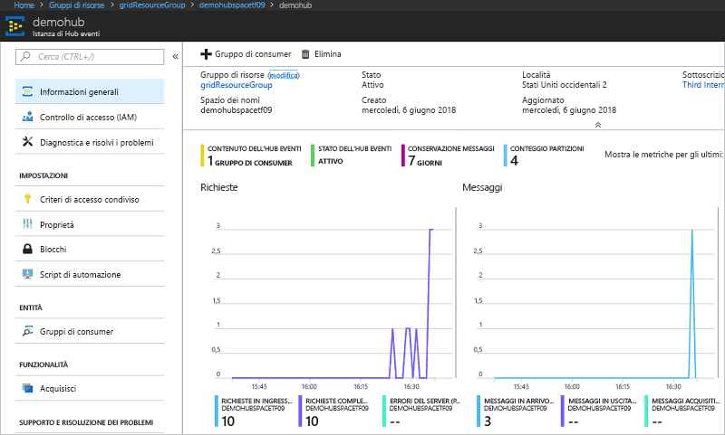

# <a name="quickstart-route-custom-events-to-azure-event-hubs-with-azure-cli-and-event-grid"></a>Avvio rapido: Instradare eventi personalizzati a Hub eventi di Azure con l'interfaccia della riga di comando di Azure e Griglia di eventi

La griglia di eventi di Azure è un servizio di gestione degli eventi per il cloud. Hub eventi di Azure è uno dei gestori eventi supportati. Questo articolo illustra come usare l'interfaccia della riga di comando di Azure per creare un argomento personalizzato, sottoscrivere l'argomento e attivare l'evento per visualizzare il risultato. Gli eventi vengono inviati a un hub eventi.

[!INCLUDE [quickstarts-free-trial-note.md](../../includes/quickstarts-free-trial-note.md)]

## <a name="create-a-resource-group"></a>Creare un gruppo di risorse

Gli argomenti della griglia di eventi sono risorse di Azure e devono essere inseriti in un gruppo di risorse di Azure. Un gruppo di risorse è una raccolta logica in cui le risorse di Azure vengono distribuite e gestite.

Creare un gruppo di risorse con il comando [az group create](/cli/azure/group#az-group-create). 

L'esempio seguente crea un gruppo di risorse denominato *gridResourceGroup* nella località *westus2*.

```azurecli-interactive
az group create --name gridResourceGroup --location westus2
```

[!INCLUDE [event-grid-register-provider-cli.md](../../includes/event-grid-register-provider-cli.md)]

## <a name="create-a-custom-topic"></a>Creare un argomento personalizzato

Un argomento di Griglia di eventi fornisce un endpoint definito dall'utente in cui vengono pubblicati gli eventi. L'esempio seguente crea l'argomento personalizzato nel gruppo di risorse. Sostituire `<your-topic-name>` con un nome univoco per l'argomento personalizzato. Il nome dell'argomento personalizzato deve essere univoco perché è rappresentato da una voce DNS.

```azurecli-interactive
topicname=<your-topic-name>
az eventgrid topic create --name $topicname -l westus2 -g gridResourceGroup
```

## <a name="create-event-hub"></a>Creare un hub eventi

Prima di sottoscrivere l'argomento personalizzato, creare l'endpoint per il messaggio dell'evento. Si crea un hub eventi per la raccolta degli eventi.

```azurecli-interactive
namespace=<unique-namespace-name>
hubname=demohub

az eventhubs namespace create --name $namespace --resource-group gridResourceGroup
az eventhubs eventhub create --name $hubname --namespace-name $namespace --resource-group gridResourceGroup
```

## <a name="subscribe-to-a-custom-topic"></a>Sottoscrivere un argomento personalizzato

Si sottoscrive un argomento della griglia di eventi per indicare alla griglia di eventi quali sono gli eventi di cui si vuole tenere traccia. L'esempio seguente sottoscrive l'argomento personalizzato creato e passa l'ID risorsa dell'hub eventi per l'endpoint. L'endpoint è nel formato:

`/subscriptions/<subscription-id>/resourceGroups/<resource-group-name>/providers/Microsoft.EventHub/namespaces/<namespace-name>/eventhubs/<hub-name>`

Lo script seguente ottiene l'ID risorsa per l'hub eventi e sottoscrive un argomento della griglia di eventi. Imposta il tipo di endpoint su `eventhub` e usa l'ID dell'hub eventi per l'endpoint.

```azurecli-interactive
hubid=$(az eventhubs eventhub show --name $hubname --namespace-name $namespace --resource-group gridResourceGroup --query id --output tsv)

az eventgrid event-subscription create \
  --topic-name $topicname \
  -g gridResourceGroup \
  --name subtoeventhub \
  --endpoint-type eventhub \
  --endpoint $hubid
```

L'account che crea la sottoscrizione dell'evento deve avere accesso in scrittura all'hub eventi.

## <a name="send-an-event-to-your-custom-topic"></a>Inviare un evento all'argomento personalizzato

Attivare un evento per vedere come la Griglia di eventi distribuisce il messaggio nell'endpoint. Ottenere prima di tutto l'URL e la chiave per l'argomento personalizzato.

```azurecli-interactive
endpoint=$(az eventgrid topic show --name $topicname -g gridResourceGroup --query "endpoint" --output tsv)
key=$(az eventgrid topic key list --name $topicname -g gridResourceGroup --query "key1" --output tsv)
```

Per semplificare questo articolo, si useranno dati di evento di esempio da inviare all'argomento personalizzato. In genere, i dati dell'evento vengono inviati da un'applicazione o un servizio di Azure. CURL è un'utilità che invia richieste HTTP. In questo articolo CURL viene usato per inviare l'evento all'argomento personalizzato.  L'esempio seguente invia tre eventi all'argomento della griglia di eventi:

```azurecli-interactive
for i in 1 2 3
do
   event='[ {"id": "'"$RANDOM"'", "eventType": "recordInserted", "subject": "myapp/vehicles/motorcycles", "eventTime": "'`date +%Y-%m-%dT%H:%M:%S%z`'", "data":{ "make": "Ducati", "model": "Monster"},"dataVersion": "1.0"} ]'
   curl -X POST -H "aeg-sas-key: $key" -d "$event" $endpoint
done
```

Passare all'hub eventi nel portale e notare che Griglia di eventi ha inviato i tre eventi all'hub eventi.



In genere, si crea un'applicazione che recupera gli eventi dall'hub eventi. Per creare un'applicazione che riceve i messaggi da un hub eventi, vedere:

* [Guida introduttiva alla ricezione di messaggi con Event Processor Host in .NET Standard](../event-hubs/event-hubs-dotnet-standard-getstarted-receive-eph.md)
* [Ricevere eventi da Hub eventi di Azure usando Java](../event-hubs/event-hubs-java-get-started-receive-eph.md)
* [Ricevere eventi da Hub eventi di Azure usando Apache Storm](../event-hubs/event-hubs-storm-getstarted-receive.md)

## <a name="clean-up-resources"></a>Pulire le risorse
Se si intende continuare a usare questo evento, non è necessario pulire le risorse create con questo articolo. In caso contrario, usare il comando seguente per eliminare le risorse create con questo articolo.

```azurecli-interactive
az group delete --name gridResourceGroup
```

## <a name="next-steps"></a>Passaggi successivi

Ora che si è appreso come creare argomenti e sottoscrizioni di eventi, è possibile approfondire le operazioni possibili con la griglia di eventi:

- [Informazioni sulla griglia di eventi](overview.md)
- [Indirizzare gli eventi di archiviazione BLOB a un endpoint Web personalizzato (anteprima)](../storage/blobs/storage-blob-event-quickstart.md?toc=%2fazure%2fevent-grid%2ftoc.json)
- [Monitorare le modifiche alla macchina virtuale con la griglia di eventi di Azure e le app per la logica](monitor-virtual-machine-changes-event-grid-logic-app.md)
- [Trasmettere Big Data a un data warehouse](event-grid-event-hubs-integration.md)
