# <a name="quickstart-route-custom-events-to-an-azure-function-with-event-grid"></a>Guida introduttiva: Indirizzare eventi personalizzati a una funzione di Azure con Griglia di eventi

La griglia di eventi di Azure è un servizio di gestione degli eventi per il cloud. Funzioni di Azure è uno dei gestori eventi supportati. In questo articolo viene usato il portale di Azure per creare un argomento personalizzato, sottoscriverlo e attivare l'evento per visualizzare il risultato. Gli eventi vengono inviati a una funzione di Azure.

[!INCLUDE [quickstarts-free-trial-note.md](../../includes/quickstarts-free-trial-note.md)]

## <a name="create-azure-function"></a>Creare la funzione di Azure

Prima di sottoscrivere l'argomento personalizzato, creare una funzione per gestire gli eventi. Nel portale di Azure fare clic su"Crea una risorsa", digitare "funzioni" e quindi scegliere "App per le funzioni" e fare clic su Crea. Selezionare "Crea nuovo" per il gruppo di risorse e assegnare un nome. Verrà usato per il resto dell'esercitazione. Assegnare un nome all'app per le funzioni, lasciare l'interruttore "Pubblica" impostato su "Codice", selezionare qualsiasi runtime e area e quindi fare clic su Crea.

Quando è pronta, passare all'app per le funzioni e fare clic su "+ Nuova funzione". Selezionare "Nel portale" come ambiente di sviluppo e fare clic su Continua. In Crea una funzione scegliere "Altri modelli" per visualizzare altri modelli e quindi cercare e selezionare il trigger di Griglia di eventi di Azure. Se si usa questo trigger per la prima volta, potrebbe essere necessario fare clic su "Installa" per installare l'estensione.

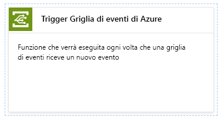

Dopo aver installato l'estensione, fare clic su Continua, assegnare un nome alla funzione e quindi fare clic su Crea.

[!INCLUDE [event-grid-register-provider-portal.md](../../includes/event-grid-register-provider-portal.md)]

## <a name="create-a-custom-topic"></a>Creare un argomento personalizzato

Un argomento di Griglia di eventi fornisce un endpoint definito dall'utente in cui vengono pubblicati gli eventi. 

1. Accedere al [portale di Azure](https://portal.azure.com/).
2. Selezionare **Tutti i servizi** nel menu di spostamento sinistro, cercare **Griglia di eventi** e selezionare **Argomenti di Griglia di eventi**. 

    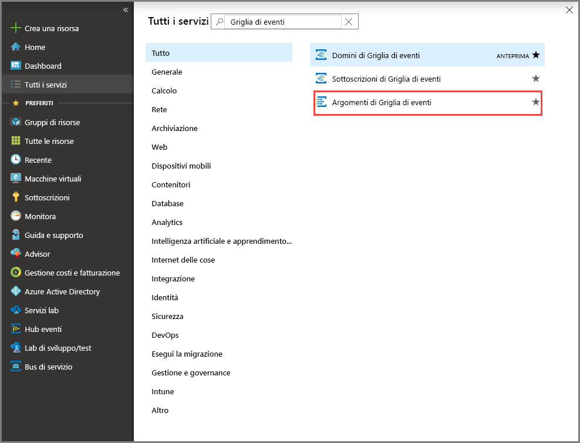
3. Nella pagina **Argomenti di Griglia di eventi** selezionare **+Aggiungi** sulla barra degli strumenti. 

    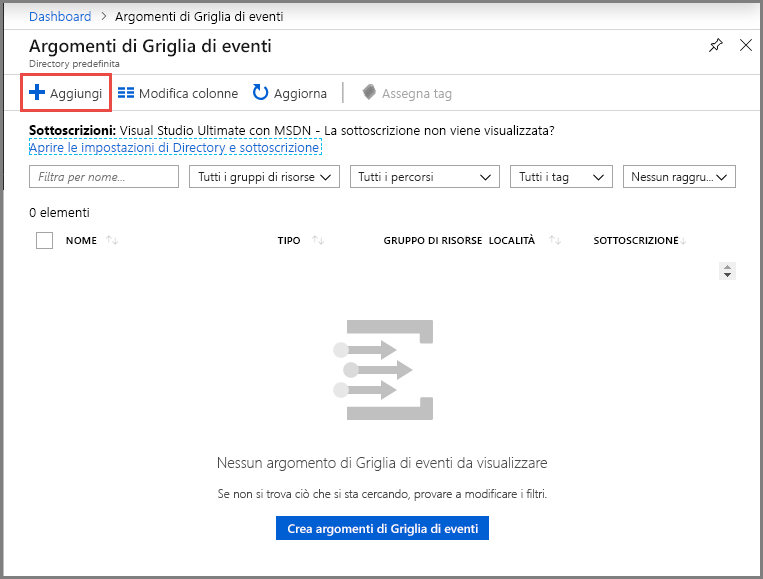

4. Nella pagina **Crea argomento** procedere come segue:

    1. Specificare un **nome** univoco per l'argomento personalizzato. Il nome dell'argomento deve essere univoco perché è rappresentato da una voce DNS. Non usare il nome visualizzato nell'immagine In alternativa, creare un nome personalizzato di lunghezza compresa tra 3 e 50 caratteri e contenente solo valori compresi tra a e z, A e Z, 0 e 9 e "-".
    2. Selezionare la **sottoscrizione**di Azure.
    3. Selezionare lo stesso gruppo di risorse dei passaggi precedenti.
    4. Selezionare una **posizione** per l'argomento di Griglia di eventi.
    5. Mantenere il valore predefinito **Schema griglia di eventi** per il campo **Schema evento**. 

       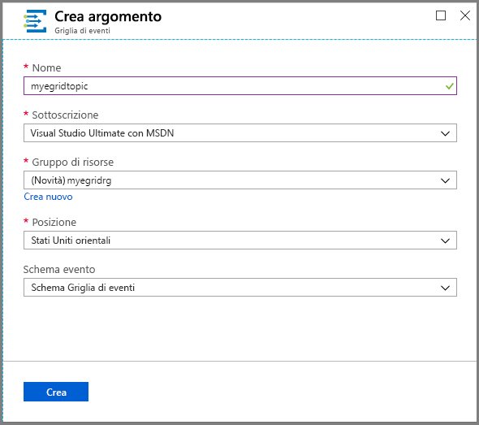
    6. Selezionare **Create** (Crea). 

5. Dopo che l'argomento personalizzato è stato creato, viene visualizzata una notifica dell'operazione riuscita. Selezionare **Vai al gruppo di risorse**. 

   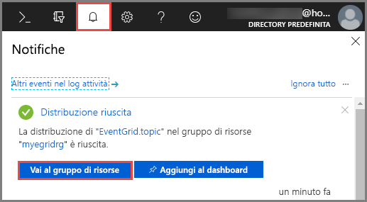

6. Nella pagina **Gruppo di risorse** selezionare l'argomento di Griglia di eventi. 

   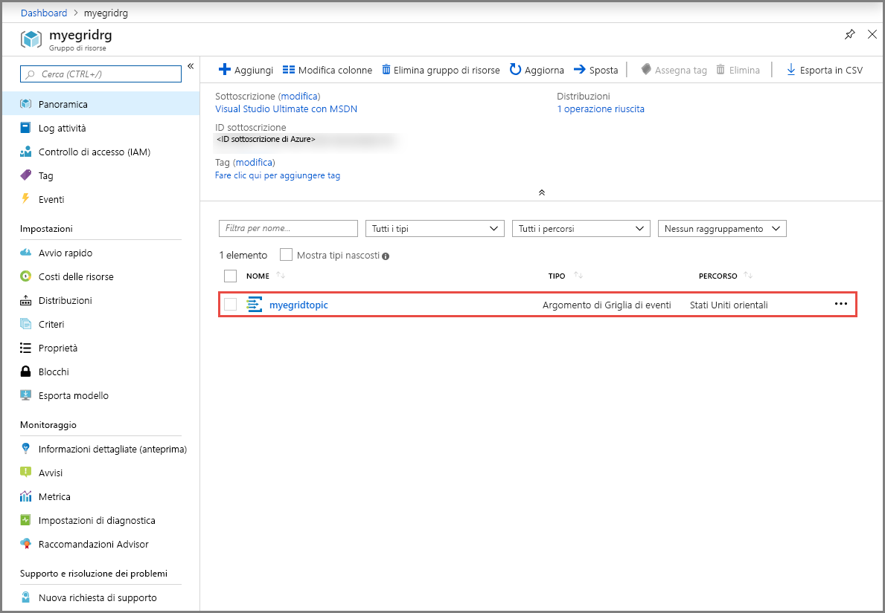

7. Verrà visualizzata la pagina **Argomento di Griglia di eventi** relativa alla griglia di eventi. Tenere aperta questa pagina. Verrà usata in seguito nell'argomento di avvio rapido. 

    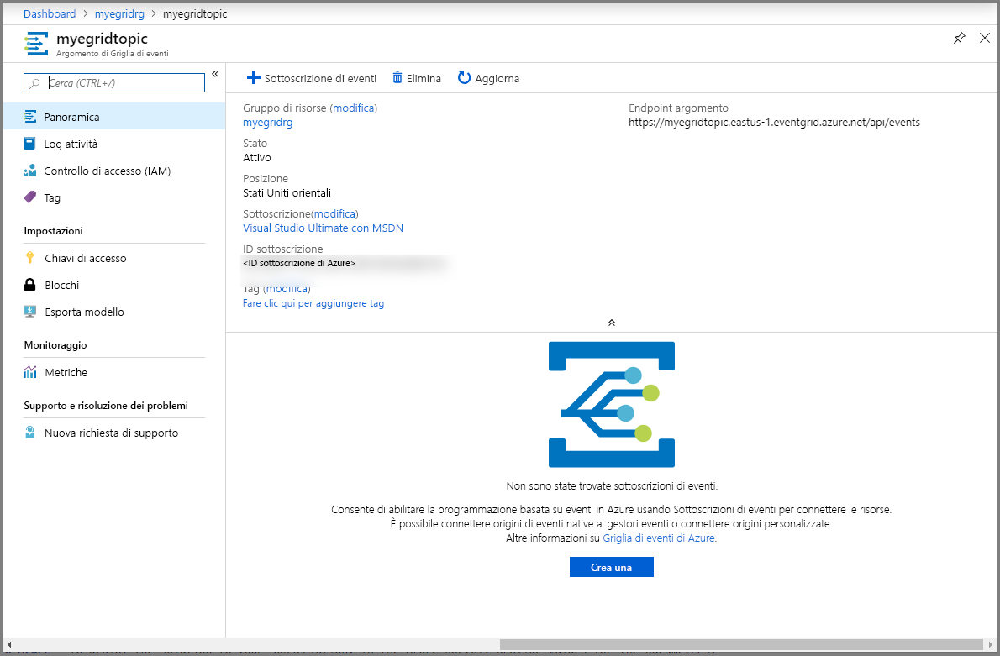

## <a name="subscribe-to-custom-topic"></a>Sottoscrivere eventi per un argomento personalizzato

Si sottoscrive un argomento di Griglia di eventi per indicare di quali eventi si vuole tenere traccia e dove inviarli.

1. Nella pagina **Argomento di Griglia di eventi** relativa all'argomento personalizzato selezionare **+ Sottoscrizione di eventi** sulla barra degli strumenti.

   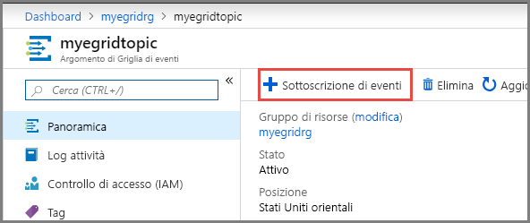

2. Nella pagina **Crea sottoscrizione di eventi** procedere come segue:
    1. Specificare un **nome** per la sottoscrizione di eventi.
    3. Selezionare **Funzione di Azure** per **Tipo di endpoint**. 
    4. Scegliere **Seleziona endpoint**. 

       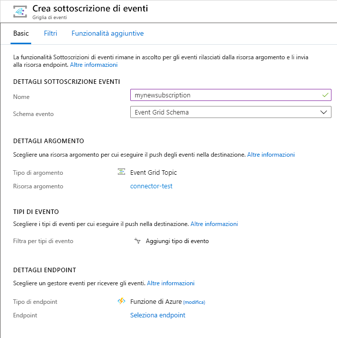

    5. Per l'endpoint funzione selezionare la sottoscrizione di Azure e il gruppo di risorse in cui si trova l'app per le funzioni e quindi l'app per le funzioni e la funzione create in precedenza. Selezionare **Confermare la selezione**.

       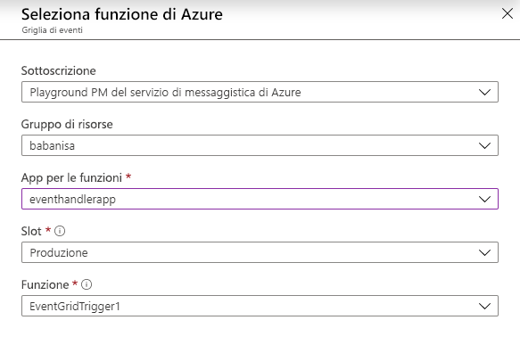

    6. Nella pagina **Crea sottoscrizione di eventi** selezionare **Crea**.

## <a name="send-an-event-to-your-topic"></a>Inviare un evento all'argomento

A questo punto, attivare un evento per vedere come la griglia di eventi distribuisce il messaggio nell'endpoint. Usare l'interfaccia della riga di comando di Azure o PowerShell per inviare un evento di test all'argomento personalizzato. In genere, i dati dell'evento vengono inviati da un'applicazione o un servizio di Azure.

Il primo esempio usa l'interfaccia della riga di comando di Azure. Ottiene l'URL e la chiave per l'argomento personalizzato e i dati dell'evento di esempio. Usare il nome dell'argomento personalizzato per `<topic name>`. Verranno creati i dati dell'evento di esempio. L'elemento `data` del JSON è il payload dell'evento. Questo campo accetta qualsiasi JSON ben formato. È anche possibile usare il campo oggetto per il filtro e il routing avanzato. CURL è un'utilità che invia richieste HTTP.


### <a name="azure-cli"></a>Interfaccia della riga di comando di Azure
1. Nel portale di Azure selezionare **Cloud Shell**. Selezionare **Bash** nell'angolo in alto a sinistra della finestra Cloud Shell. 

    
1. Eseguire il comando seguente per ottenere l'**endpoint** per l'argomento: Dopo aver copiato e incollato il comando, aggiornare il **nome dell'argomento** e il **nome del gruppo di risorse** prima di eseguirlo. 

    ```azurecli
    endpoint=$(az eventgrid topic show --name <topic name> -g <resource group name> --query "endpoint" --output tsv)
    ```
2. Eseguire il comando seguente per ottenere la **chiave** per l'argomento personalizzato: Dopo aver copiato e incollato il comando, aggiornare il **nome dell'argomento** e il nome del **gruppo di risorse** prima di eseguirlo. 

    ```azurecli
    key=$(az eventgrid topic key list --name <topic name> -g <resource group name> --query "key1" --output tsv)
    ```
3. Copiare l'istruzione seguente con la definizione di evento e premere **INVIO**. 

    ```json
    event='[ {"id": "'"$RANDOM"'", "eventType": "recordInserted", "subject": "myapp/vehicles/motorcycles", "eventTime": "'`date +%Y-%m-%dT%H:%M:%S%z`'", "data":{ "make": "Ducati", "model": "Monster"},"dataVersion": "1.0"} ]'
    ```
4. Eseguire il comando **Curl** seguente per pubblicare l'evento:

    ```
    curl -X POST -H "aeg-sas-key: $key" -d "$event" $endpoint
    ```

### <a name="azure-powershell"></a>Azure PowerShell
Il secondo esempio usa PowerShell per eseguire passaggi simili.

1. Nel portale di Azure selezionare **Cloud Shell** (in alternativa, passare a https://shell.azure.com/). Selezionare **PowerShell** nell'angolo in alto a sinistra della finestra Cloud Shell. Vedere l'esempio di immagine di finestra **Cloud Shell** nella sezione sull'interfaccia della riga di comando di Azure.
2. Impostare le variabili seguenti. Dopo aver copiato e incollato ogni singolo comando, aggiornare il **nome dell'argomento** e il **nome del gruppo di risorse** prima di eseguirlo:

    ```powershell
    $resourceGroupName = <resource group name>
    $topicName = <topic name>
    ```
3. Eseguire i comandi seguenti per ottenere l'**endpoint** e le **chiavi** per l'argomento:

    ```powershell
    $endpoint = (Get-AzEventGridTopic -ResourceGroupName $resourceGroupName -Name $topicName).Endpoint
    $keys = Get-AzEventGridTopicKey -ResourceGroupName $resourceGroupName -Name $topicName
    ```
4. Preparare l'evento. Copiare ed eseguire le istruzioni nella finestra Cloud Shell. 

    ```powershell
    $eventID = Get-Random 99999

    #Date format should be SortableDateTimePattern (ISO 8601)
    $eventDate = Get-Date -Format s

    #Construct body using Hashtable
    $htbody = @{
        id= $eventID
        eventType="recordInserted"
        subject="myapp/vehicles/motorcycles"
        eventTime= $eventDate   
        data= @{
            make="Ducati"
            model="Monster"
        }
        dataVersion="1.0"
    }
    
    #Use ConvertTo-Json to convert event body from Hashtable to JSON Object
    #Append square brackets to the converted JSON payload since they are expected in the event's JSON payload syntax
    $body = "["+(ConvertTo-Json $htbody)+"]"
    ```
5. Usare il cmdlet **Invoke-WebRequest** per inviare l'evento. 

    ```powershell
    Invoke-WebRequest -Uri $endpoint -Method POST -Body $body -Headers @{"aeg-sas-key" = $keys.Key1}
    ```

### <a name="verify-in-the-event-grid-viewer"></a>Verificare nel visualizzatore Griglia di eventi
È stato attivato l'evento e Griglia di eventi ha inviato il messaggio all'endpoint configurato al momento della sottoscrizione. Passare alla funzione attivata in Griglia di eventi e aprire i log. Nei log verrà visualizzata una copia del payload dei dati dell'evento. In caso contrario, assicurarsi di aprire prima la finestra dei log oppure riconnettersi e quindi provare a inviare di nuovo un evento di test.

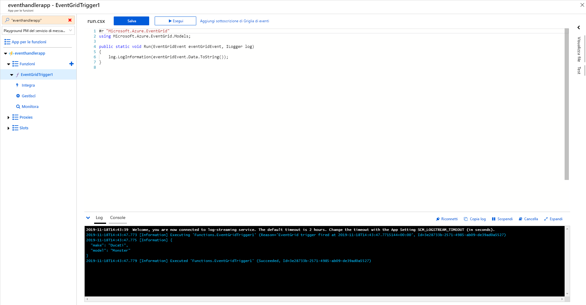

## <a name="clean-up-resources"></a>Pulire le risorse
Se si intende continuare a usare questo evento, non è necessario pulire le risorse create con questo articolo. In caso contrario, eliminare le risorse create in questo articolo.

1. Selezionare **Gruppi di risorse** nel menu sinistro. Se l'opzione non viene visualizzata nel menu sinistro, selezionare **Tutti i servizi** nel menu sinistro e quindi **Gruppi di risorse**. 
2. Selezionare il gruppo di risorse per avviare la pagina **Gruppo di risorse**. 
3. Selezionare **Elimina gruppo di risorse** sulla barra degli strumenti. 
4. Confermare l'eliminazione immettendo il nome del gruppo di risorse e selezionare **Elimina**. 

    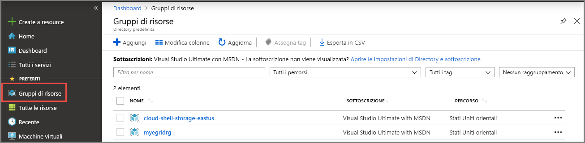

    L'altro gruppo di risorse visualizzato nella pagina è stato creato e usato dalla finestra Cloud Shell. Eliminarlo se non si prevede di usare la finestra Cloud Shell in seguito. 
```

## Next steps

Now that you know how to create topics and event subscriptions, learn more about what Event Grid can help you do:

- [About Event Grid](overview.md)
- [Route Blob storage events to a custom web endpoint](../storage/blobs/storage-blob-event-quickstart.md?toc=%2fazure%2fevent-grid%2ftoc.json)
- [Monitor virtual machine changes with Azure Event Grid and Logic Apps](monitor-virtual-machine-changes-event-grid-logic-app.md)
- [Stream big data into a data warehouse](event-grid-event-hubs-integration.md)
