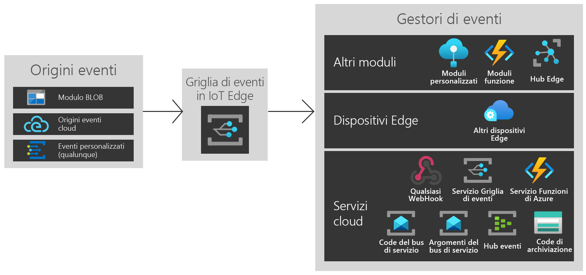

# Che cos'è Griglia di eventi di Azure in Azure IoT Edge?
Griglia di eventi su IoT Edge consente di sfruttare la potenza e la flessibilità di Griglia di eventi di Azure in Edge. È possibile creare argomenti, pubblicare eventi e sottoscrivere più destinazioni, sia che si tratti di moduli nello stesso dispositivo, altri dispositivi Edge o servizi nel cloud.

Come nel cloud, Griglia di eventi nel modulo IoT Edge gestisce il routing, il filtro e il recapito affidabile di eventi su larga scala. È possibile filtrare gli eventi per assicurarsi che solo gli eventi rilevanti vengano inviati a gestori eventi diversi usando filtri stringa, numerici e booleani avanzati. La logica di ripetizione dei tentativi garantisce che l'evento raggiunga la destinazione anche se non è disponibile al momento della pubblicazione. Consente di usare Griglia di eventi in IoT Edge come un potente meccanismo di archiviazione e inoltro.

Griglia di eventi in IoT Edge supporta CloudEvents v 1.0 e schemi di eventi personalizzati, Supporta anche la stessa semantica di pubblicazione/sottoscrizione di Griglia di eventi nel cloud per semplificare l'interoperabilità.

Questo articolo offre una panoramica di Griglia di eventi di Azure in IoT Edge. Per istruzioni dettagliate sull'uso di questo modulo in Edge, vedere [Pubblicare e sottoscrivere eventi in locale](pub-sub-events-webhook-local.md). 

Questa immagine illustra solo alcuni dei modi in cui è possibile usare Griglia di eventi in IoT Edge e non costituisce un elenco esaustivo delle funzionalità supportate.

## Quando usare Griglia di eventi in IoT Edge

Griglia di eventi su IoT Edge fornisce un modello di eventi facile da usare e affidabile tra Edge e il cloud.

Griglia di eventi in IoT Edge è stata creata con una superficie di attacco del runtime simmetrica al servizio cloud di Azure, di conseguenza è possibile usare gli stessi eventi e le stesse chiamate API ovunque sia necessario. Se si esegue la pubblicazione o la sottoscrizione nel cloud, in Edge o tra queste due destinazioni, Griglia di eventi in IoT Edge ora può essere la soluzione ideale.

Usare Griglia di eventi in IoT Edge per attivare flussi di lavoro semplici tra i moduli. Ad esempio, è possibile creare un argomento e pubblicare gli eventi "BLOB di archiviazione creati" dal modulo di archiviazione all'argomento. È ora possibile sottoscrivere una o più funzioni o moduli personalizzati a tali argomenti.

È anche possibile estendere la funzionalità tra dispositivi Edge. Se si pubblicano eventi del modulo BLOB e si vuole usare la potenza di calcolo di più dispositivi Edge circostanti, creare sottoscrizioni tra dispositivi.

È infine possibile connettersi al cloud. Se gli eventi del modulo BLOB devono essere sincronizzati periodicamente con il cloud, usare il maggior numero di risorse di calcolo disponibili nel cloud o inviare dati elaborati e creare sottoscrizioni del servizio cloud aggiuntive.

Griglia di eventi in IoT Edge offre un'architettura di gestione eventi disaccoppiata flessibile e affidabile.

## Origini eventi

In modo analogo al cloud, Griglia di eventi in IoT Edge permette l'integrazione diretta tra i moduli per creare architetture basate su eventi. Attualmente è possibile inviare eventi a Griglia di eventi in IoT Edge da:

* Archiviazione BLOB di Azure in IoT Edge
* Origini CloudEvents
* Moduli e contenitori personalizzati tramite HTTP POST

## Gestori eventi

Griglia di eventi in IoT Edge consente di inviare eventi ovunque. Al momento, sono supportate le destinazioni seguenti:

* Altri moduli, tra cui l'hub IoT, funzioni e moduli personalizzati
* Altri dispositivi Edge
* Webhook
* Servizio cloud Griglia di eventi di Azure
* Hub eventi
* Code del bus di servizio
* Argomenti del bus di servizio
* Code di archiviazione

## Ambienti supportati
Al momento sono supportati gli ambienti Windows a 64 bit, Linux a 64 bit e ARM a 32 bit.

## Concetti

Per iniziare, è opportuno tenere presenti cinque concetti relativi a Griglia di eventi di Azure:

* **Eventi**: cosa che successo.
* **Origini di eventi**: dove si è verificato l'evento.
* **Argomenti**: l'endpoint a cui gli autori inviano gli eventi.
* **Sottoscrizioni di eventi**: l'endpoint o il meccanismo predefinito per instradare gli eventi, talvolta a più gestori. Le sottoscrizioni vengono usate dai gestori anche per filtrare in modo intelligente gli eventi in ingresso.
* **Gestori eventi**: l'app o il servizio che reagisce all'evento.

## Costi

Griglia di eventi in IoT Edge è gratuito durante la fase di anteprima pubblica.

## Problemi
Segnalare eventuali problemi durante l'uso di Griglia di eventi in IoT Edge all'indirizzo [https://github.com/Azure/event-grid-iot-edge/issues](https://github.com/Azure/event-grid-iot-edge/issues).

## Passaggi successivi

* [Pubblicare e sottoscrivere eventi in locale](pub-sub-events-webhook-local.md)
* [Pubblicare e sottoscrivere eventi nel cloud](pub-sub-events-webhook-cloud.md)
* [Inoltrare eventi al cloud di Griglia di eventi](forward-events-event-grid-cloud.md)
* [Inoltrare eventi all'hub IoT](forward-events-iothub.md)
* [Rispondere a eventi di Archiviazione BLOB in locale](react-blob-storage-events-locally.md)