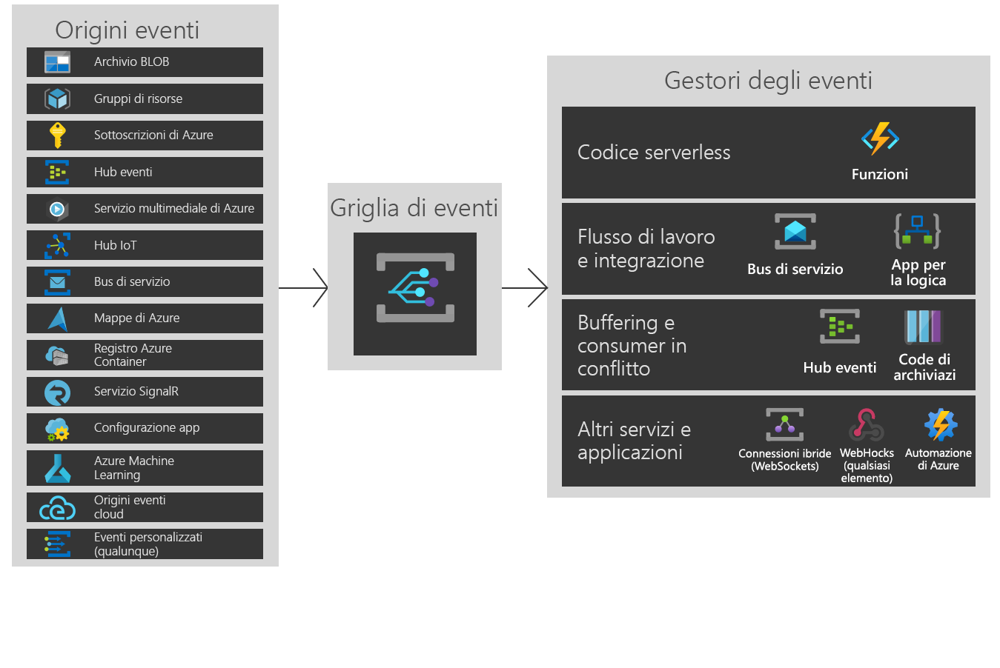

# Informazioni su Griglia di eventi di Azure

Griglia di eventi di Azure consente di compilare facilmente applicazioni con architetture basate su eventi. Selezionare prima la risorsa di Azure da sottoscrivere e quindi specificare il gestore dell'evento o l'endpoint del webhook a cui inviare l'evento. Griglia di eventi offre il supporto predefinito per gli eventi generati dai servizi di Azure, ad esempio BLOB di archiviazione e gruppi di risorse. Griglia di eventi offre anche supporto per gli eventi personalizzati, tramite argomenti personalizzati. 

È possibile usare i filtri per instradare eventi specifici a endpoint diversi, trasmetterli a più endpoint e verificare che gli eventi vengano recapitati in modo affidabile.

Griglia di eventi di Azure viene distribuito per ottimizzare la disponibilità tramite la distribuzione nativa in più domini di errore in ogni area e nelle zone di disponibilità (nelle aree che le supportano). Per un elenco delle aree supportate da Griglia di eventi, vedere [Prodotti disponibili in base all'area](https://azure.microsoft.com/global-infrastructure/services/?products=event-grid&regions=all).

Questo articolo offre una panoramica di Griglia di eventi di Azure. Per iniziare a usare Griglia di eventi, vedere [Create and route custom events with Azure Event Grid](custom-event-quickstart.md) (Creare e instradare eventi personalizzati con Griglia di eventi di Azure). 

Questa immagine illustra in che modo Griglia di eventi collega origini e gestori, ma non costituisce un elenco completo delle integrazioni supportate.

## Origini eventi

Per informazioni dettagliate complete sulle funzionalità di ogni origine, con articoli correlati, vedere [Origini evento](event-sources.md). Attualmente i servizi di Azure seguenti supportano l'invio degli eventi a Griglia di eventi:

* [Sottoscrizioni di Azure (operazioni di gestione)](event-sources.md#azure-subscriptions)
* [Registro Container](event-sources.md#container-registry)
* [Argomenti personalizzati](event-sources.md#custom-topics)
* [Hub eventi](event-sources.md#event-hubs)
* [Hub IoT](event-sources.md#iot-hub)
* [Servizi multimediali](event-sources.md#media-services)
* [Gruppi di risorse (operazioni di gestione)](event-sources.md#resource-groups)
* [Bus di servizio](event-sources.md#service-bus)
* [Archiviazione BLOB](event-sources.md#storage)
* [Mappe di Azure](event-sources.md#maps)

## Gestori eventi

Per informazioni dettagliate complete sulle funzionalità di ogni gestore, con articoli correlati, vedere [Gestori eventi](event-handlers.md). Attualmente i servizi di Azure seguenti supportano la gestione degli eventi da Griglia di eventi: 

* [Automazione di Azure](event-handlers.md#azure-automation)
* [Funzioni di Azure](event-handlers.md#azure-functions)
* [Hub eventi](event-handlers.md#event-hubs)
* [Connessioni ibride](event-handlers.md#hybrid-connections)
* [App per la logica](event-handlers.md#logic-apps)
* [Power Automate (noto in precedenza come Microsoft Flow)](https://preview.flow.microsoft.com/connectors/shared_azureeventgrid/azure-event-grid/)
* [Archiviazione code](event-handlers.md#queue-storage)
* [Bus di servizio](event-handlers.md#service-bus)
* [Webhook](event-handlers.md#webhooks)

## Concetti

Per iniziare, è opportuno tenere presenti cinque concetti relativi a Griglia di eventi di Azure:

* **Eventi**: ciò che successo.
* **Origini di eventi**: dove si è verificato l'evento.
* **Argomenti**: l'endpoint a cui gli autori inviano gli eventi.
* **Sottoscrizioni agli eventi**: l'endpoint o il meccanismo predefinito per instradare gli eventi, a volte a più gestori. Le sottoscrizioni vengono usate dai gestori anche per filtrare in modo intelligente gli eventi in ingresso.
* **Gestori di eventi**: l'app o il servizio che reagisce all'evento.

Per altre informazioni su questi concetti, vedere [Concepts in Azure Event Grid](concepts.md) (Concetti relativi a Griglia di eventi di Azure).

## Capabilities

Ecco alcune delle principali funzionalità di Griglia di eventi di Azure:

* **Semplicità**: consente di indirizzare facilmente gli eventi dalla risorsa di Azure a un gestore dell'evento o a un endpoint.
* **Filtro avanzato**: consente di filtrare per tipo di evento o per percorso di pubblicazione di un evento per assicurarsi che i gestori di eventi ricevano solo gli eventi pertinenti.
* **Fan-out**: consente di sottoscrivere più endpoint allo stesso evento per inviare copie dell'evento a tutte le posizioni necessarie.
* **Affidabilità**: consente di ripetere i tentativi per 24 ore con backoff esponenziale per assicurarsi che gli eventi vengano recapitati.
* **Pagamento per evento** consente di pagare solo in base all'uso di Griglia di eventi.
* **Velocità effettiva elevata**: consente di creare carichi di lavoro con volumi elevati in Griglia di eventi con il supporto per milioni di eventi al secondo.
* **Eventi predefiniti**: consentono di essere operativi rapidamente con gli eventi predefiniti a livello di risorse.
* **Eventi personalizzati**: consentono di usare la route di Griglia di eventi, di filtrare e recapitare in modo affidabile gli eventi personalizzati nell'app.

Per un confronto tra Griglia di eventi, Hub eventi e Bus di servizio, vedere [Choose between Azure services that deliver messages](compare-messaging-services.md) (Scegliere tra i servizi di Azure che recapitano i messaggi).

## Quali operazioni si possono eseguire con Griglia di eventi?

Griglia di eventi di Azure offre diverse funzionalità che migliorano considerevolmente le attività senza server, di automazione delle operazioni e di [integrazione](https://azure.com/integration): 

### Architetture di applicazioni senza server

Griglia di eventi connette le origini dati e i gestori di eventi. Usare, ad esempio, Griglia di eventi per attivare una funzione senza server che analizza le immagini quando vengono aggiunte a un contenitore di archiviazione BLOB. 

### Automazione delle operazioni

Griglia di eventi consente di velocizzare l'automazione e semplificare l'applicazione dei criteri. Usare, ad esempio, Griglia di eventi, per notificare ad Automazione di Azure la creazione di una macchina virtuale o un database SQL. Usare gli eventi per controllare automaticamente che le configurazioni dei servizi siano conformi, inserire i metadati negli strumenti per le operazioni, contrassegnare le macchine virtuali o archiviare gli elementi di lavoro.

### Integrazione di applicazioni

Griglia di eventi connette l'app con altri servizi. Creare, ad esempio, un argomento personalizzato per inviare i dati dell'evento dell'app a Griglia di eventi e sfruttare il recapito affidabile, il routing avanzato e l'integrazione diretta con Azure. In alternativa è possibile usare Griglia di eventi con App per la logica per elaborare i dati ovunque, senza scrivere codice. 

## Costi di Griglia di eventi

Griglia di eventi di Azure usa un modello di determinazione prezzi basato sul pagamento per evento, quindi si paga solo per le risorse usate. Le prime 100.000 operazioni al mese sono gratuite. Le operazioni sono definite come eventi in ingresso, tentativi di recapito sottoscrizione, chiamate di gestione e filtro in base a suffisso soggetto. Per informazioni dettagliate, vedere la [pagina dei prezzi](https://azure.microsoft.com/pricing/details/event-grid/).

## Passaggi successivi

* [Indirizzare gli eventi BLOB di archiviazione](../storage/blobs/storage-blob-event-quickstart.md?toc=%2fazure%2fevent-grid%2ftoc.json)  
  Rispondere agli eventi BLOB di archiviazione con Griglia di eventi.
* [Create and subscribe to custom events](custom-event-quickstart.md) (Creare e sottoscrivere eventi personalizzati)  
  È possibile iniziare subito a inviare gli eventi personalizzati agli endpoint usando l'avvio rapido della Griglia di eventi di Azure.
* [Uso di App per la logica come gestore dell'evento](monitor-virtual-machine-changes-event-grid-logic-app.md)  
  Esercitazione sulla compilazione di un'app con App per la logica per rispondere agli eventi di cui viene eseguito il push da Griglia di eventi.
* [Trasmettere Big Data a un data warehouse](event-grid-event-hubs-integration.md)  
  Un'esercitazione che usa Funzioni di Azure per eseguire il flusso di dati da Hub eventi a SQL Data Warehouse.
* [Event Grid REST API reference (Informazioni di riferimento sulle API REST di Griglia di eventi)](/rest/api/eventgrid)  
  Offre contenuto di riferimento per la gestione di sottoscrizioni agli eventi, routing e filtri.
