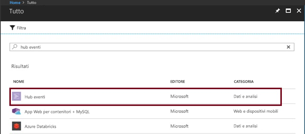
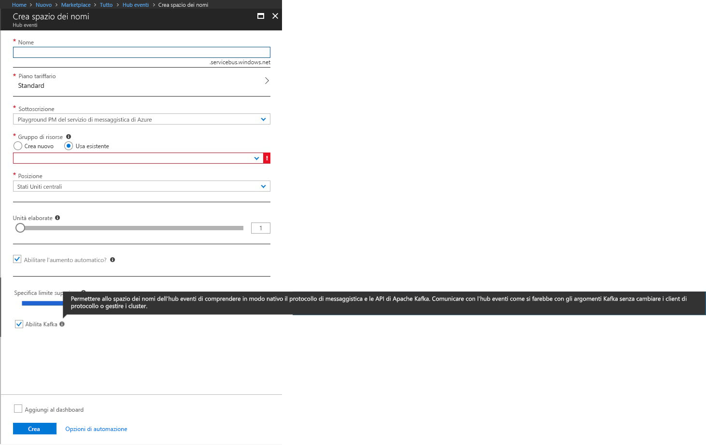

# Creare Hub eventi con supporto per Apache Kafka

Hub eventi di Azure è una piattaforma come servizio (PaaS, Platform as a Service) di streaming di Big Data che inserisce milioni di eventi al secondo e fornisce bassa latenza e velocità effettiva elevata per l'analisi e la visualizzazione in tempo reale.

Hub eventi di Azure fornisce un endpoint Kafka. che consente allo spazio dei nomi di Hub eventi di comprendere in modo nativo il protocollo del messaggio e le API [Apache Kafka](https://kafka.apache.org/intro). Con questa funzionalità è possibile comunicare con gli Hub eventi come si farebbe con gli argomenti Kafka senza modificare i client del protocollo o eseguire i propri cluster. Hub eventi supporta [Apache Kafka 1.0](https://kafka.apache.org/10/documentation.html) e versioni successive.

Questo articolo descrive come creare uno spazio dei nomi di Hub eventi e ottenere la stringa di connessione necessaria per connettere le applicazioni Kafka agli Hub eventi con supporto per Kafka.

## Prerequisiti

Se non si ha una sottoscrizione di Azure, creare un [account gratuito](https://azure.microsoft.com/free/?ref=microsoft.com&utm_source=microsoft.com&utm_medium=docs&utm_campaign=visualstudio) prima di iniziare.

## Creare uno spazio dei nomi di Hub eventi con supporto per Kafka

1. Accedere al [portale di Azure][Azure portal] e fare clic su **Crea una risorsa** nella parte superiore sinistra della schermata.

2. Eseguire la ricerca per gli Hub eventi e selezionare le opzioni illustrate di seguito:
    
    
 
3. Specificare un nome univoco e abilitare Kafka nello spazio dei nomi. Fare clic su **Create**(Crea).
    
    
 
4. Dopo aver creato lo spazio dei nomi, nella scheda **Impostazioni** fare clic su **Criteri di accesso condivisi** per ottenere la stringa di connessione.

    

5. È possibile scegliere il valore predefinito **RootManageSharedAccessKey**, oppure aggiungere un nuovo criterio. Fare clic sul nome del criterio e copiare la stringa di connessione. 
    
    
 
6. Aggiungere questa stringa di connessione alla configurazione dell'applicazione Kafka.

È ora possibile trasmettere gli eventi dalle applicazioni che usano il protocollo Kafka negli Hub eventi.

## Passaggi successivi

Per altre informazioni sugli Hub eventi, visitare i collegamenti seguenti:

* [Trasmettere in Hub eventi dalle applicazioni Kafka](event-hubs-quickstart-kafka-enabled-event-hubs.md)
* [Leggere le informazioni su Hub eventi per Kafka](event-hubs-for-kafka-ecosystem-overview.md)
* [Leggere le informazioni su Hub eventi](event-hubs-what-is-event-hubs.md)

[Azure portal]: https://portal.azure.com/
