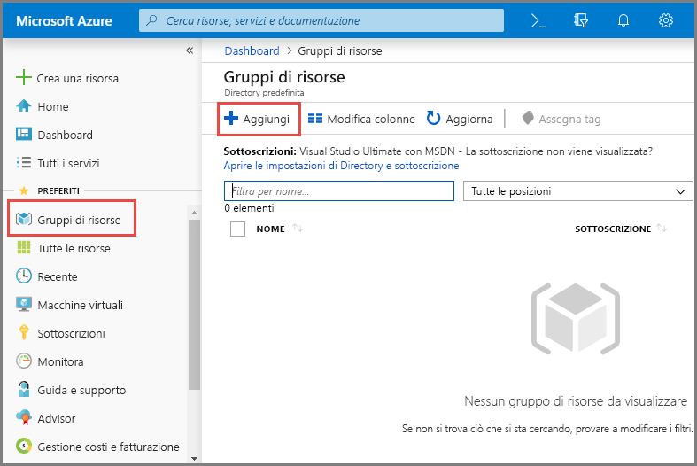
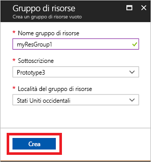
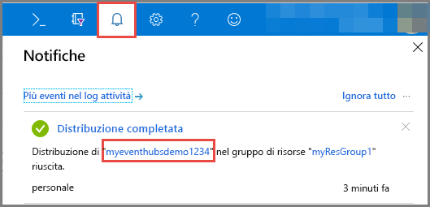
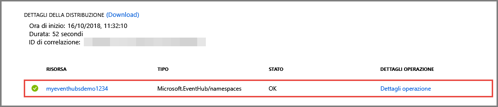
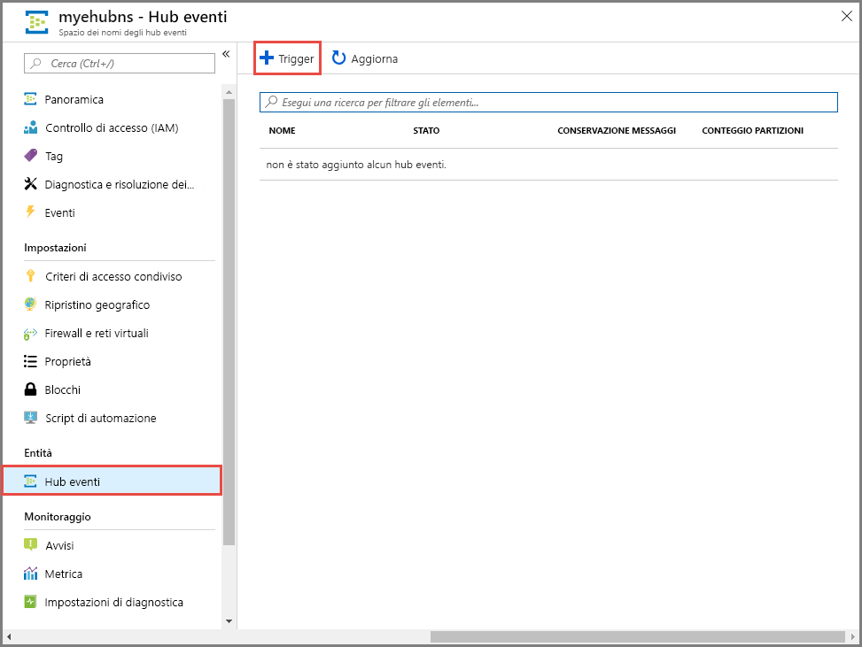
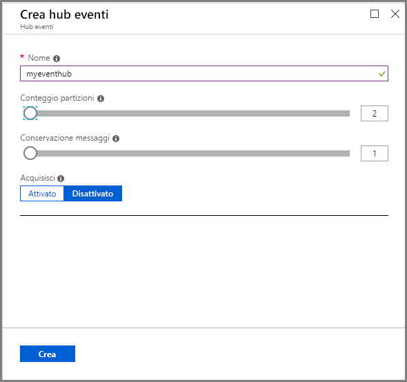

# Guida introduttiva: Creare un hub eventi con il portale di Azure
Hub eventi di Azure è una piattaforma di Big Data streaming e un servizio di inserimento di eventi che consente di ricevere ed elaborare milioni di eventi al secondo. Hub eventi consente di elaborare e archiviare eventi, dati o dati di telemetria generati dal software distribuito e dai dispositivi. I dati inviati a un hub eventi possono essere trasformati e archiviati usando qualsiasi provider di analisi in tempo reale o adattatori di invio in batch/archiviazione. Per una panoramica dettagliata di Hub eventi, vedere [Panoramica di Hub eventi](event-hubs-about.md) e [Funzionalità di Hub eventi](event-hubs-features.md).

In questa guida introduttiva viene creato un hub eventi usando il [portale di Azure](https://portal.azure.com).

## Prerequisiti

Per completare questa guida introduttiva, assicurarsi di disporre di quanto segue:

- Sottoscrizione di Azure. Se non se ne ha una, [creare un account gratuito](https://azure.microsoft.com/free/) prima di iniziare.
- [Visual Studio 2017 Update 3 (versione 15.3, 26730.01)](https://www.visualstudio.com/vs) o versioni successive.
- [NET Standard SDK](https://www.microsoft.com/net/download/windows) versione 2.0 o successiva.

## Creare un gruppo di risorse

Un gruppo di risorse è una raccolta logica per le risorse di Azure. Tutte le risorse vengono distribuite e gestite in un gruppo di risorse. Per creare un gruppo di risorse, seguire questa procedura:

1. Accedere al [portale di Azure](https://portal.azure.com).
2. Nel riquadro di spostamento a sinistra fare clic su **Gruppi di risorse**. Fare quindi clic su **Aggiungi**.

   

2. Digitare un nome univoco per il gruppo di risorse. Il sistema verifica immediatamente se il nome è disponibile nella sottoscrizione di Azure attualmente selezionata.

3. In **Sottoscrizione** fare clic sul nome della sottoscrizione di Azure in cui si vuole creare il gruppo di risorse.

4. Selezionare un'area geografica per il gruppo di risorse.

5. Fare clic su **Create**(Crea).

   

## Creare uno spazio dei nomi di Hub eventi

Uno spazio dei nomi di Hub eventi specifica un contenitore di ambito univoco, a cui fa riferimento il nome di dominio completo, in cui si crea uno o più hub eventi. Per creare uno spazio dei nomi nel gruppo di risorse usando il portale, eseguire le azioni seguenti:

1. Nel portale di Azure fare clic su **Crea una risorsa** nella parte superiore sinistra della schermata.

2. Fare clic su **Internet delle cose** e quindi su **Hub eventi**.

3. Nel pannello **Crea spazio dei nomi** immettere un nome per lo spazio dei nomi. Verrà effettuato immediatamente un controllo sulla disponibilità del nome.

   

4. Dopo aver verificato che il nome dello spazio dei nomi sia disponibile, scegliere il piano tariffario (Basic o Standard). Scegliere anche una sottoscrizione, un gruppo di risorse e una località di Azure in cui creare la risorsa.
 
5. Fare clic su **Crea** per creare lo spazio dei nomi. Per il provisioning completo delle risorse da parte del sistema, potrebbero essere necessari alcuni minuti.
6. Selezionare **Avvisi** e quindi selezionare la **distribuzione** con lo stesso nome dello spazio dei nomi dell'hub eventi. 

   
6. Selezionare lo spazio dei nomi dell'hub eventi nell'elenco delle risorse create nella distribuzione. 

   
7. Nella pagina **Spazio dei nomi di Hub eventi** selezionare **Criteri di accesso condivisi** e quindi fare clic su **RootManageSharedAccessKey**.
    
8. Fare clic sul pulsante di copia per copiare la stringa di connessione **RootManageSharedAccessKey** negli Appunti. Salvare la stringa di connessione in una posizione temporanea, ad esempio il Blocco note, per usarla in seguito.
    
## Creare un hub eventi

Per creare un hub eventi all'interno dello spazio dei nomi, eseguire le azioni seguenti:

1. Nella pagina Spazio dei nomi di Hub eventi fare clic su **Hub eventi**.
   
    

1. Nella parte superiore della finestra fare clic su **+ Hub eventi**.
   
    
1. Digitare un nome per l'hub eventi e quindi fare clic su **Crea**.
   
    

Congratulazioni! È stato usato il portale per creare uno spazio dei nomi di Hub eventi e un hub eventi nello spazio dei nomi. 

## Passaggi successivi

In questo articolo è stato creato un gruppo di risorse, uno spazio dei nomi Hub eventi e un hub eventi. Per istruzioni dettagliate relative all'invio o alla ricezione di eventi da un hub eventi, vedere le esercitazioni seguenti:  

- **Inviare eventi a un hub eventi**: [.NET Standard](event-hubs-dotnet-standard-getstarted-send.md), [.NET Framework](event-hubs-dotnet-framework-getstarted-send.md), [Java](event-hubs-java-get-started-send.md), [Python](event-hubs-python-get-started-send.md), [Node.js](event-hubs-node-get-started-send.md), [Go](event-hubs-go-get-started-send.md), [C](event-hubs-c-getstarted-send.md)
- **Ricevere eventi da un hub eventi**: [.NET Standard](event-hubs-dotnet-standard-getstarted-receive-eph.md), [.NET Framework](event-hubs-dotnet-framework-getstarted-receive-eph.md), [Java](event-hubs-java-get-started-receive-eph.md), [Python](event-hubs-python-get-started-receive.md), [Node.js](event-hubs-node-get-started-receive.md), [Go](event-hubs-go-get-started-receive-eph.md), [Apache Storm](event-hubs-storm-getstarted-receive.md)

[Azure portal]: https://portal.azure.com/
[3]: ./media/event-hubs-quickstart-portal/sender1.png
[4]: ./media/event-hubs-quickstart-portal/receiver1.png
