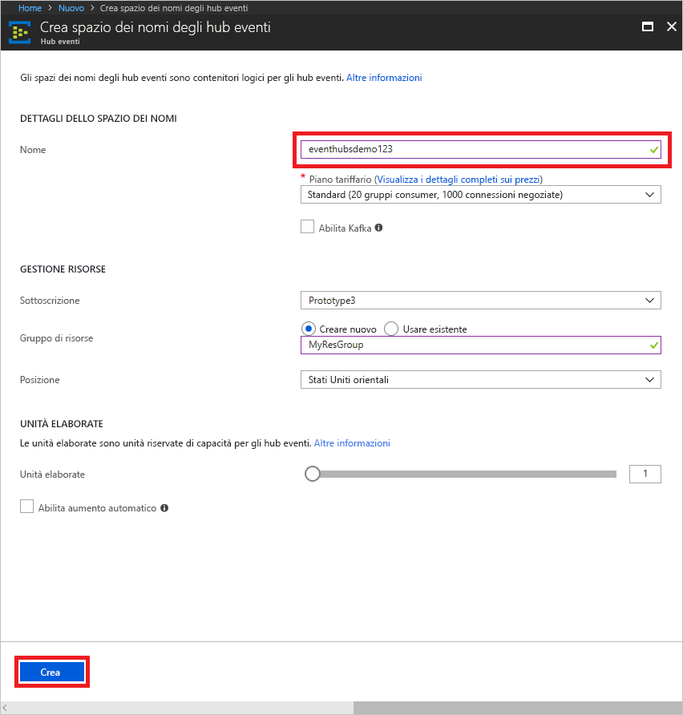
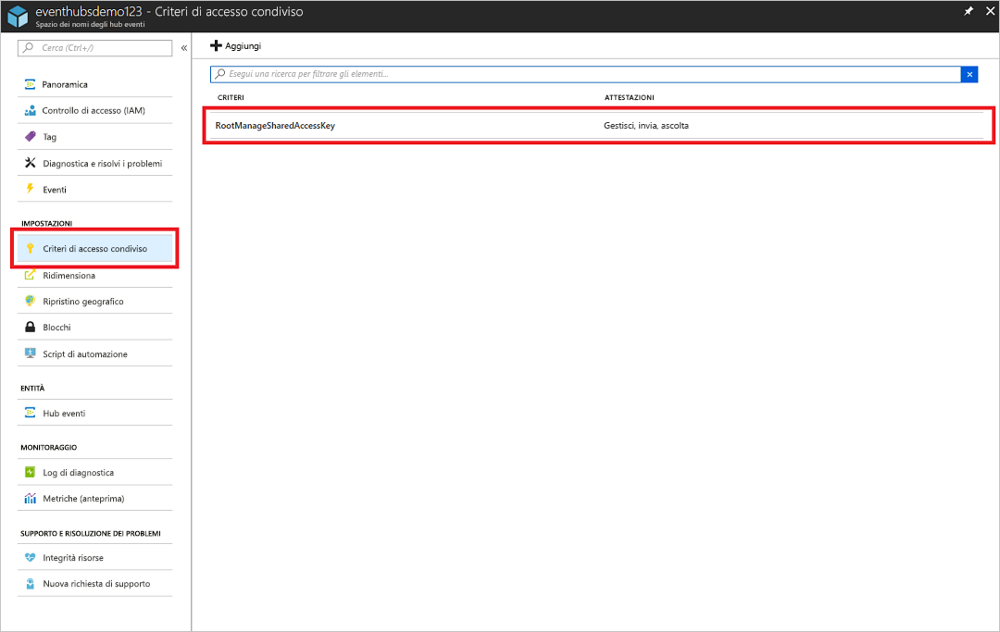
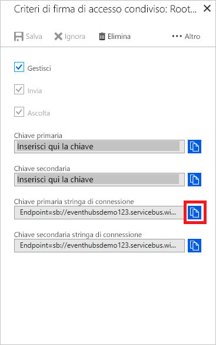

# Creare uno spazio dei nomi di Hub eventi e un hub eventi usando il Portale di Azure

## Creare uno spazio dei nomi di Hub eventi
1. Accedere al [portale di Azure][Azure portal] e fare clic su **Crea una risorsa** nella parte superiore sinistra della schermata.
1. Fare clic su **Internet delle cose** e quindi su **Hub eventi**.
   
    
1. Nel pannello **Crea spazio dei nomi** immettere un nome per lo spazio dei nomi. Verrà effettuato immediatamente un controllo sulla disponibilità del nome.
   
    
1. Dopo aver verificato che il nome dello spazio dei nomi sia disponibile, scegliere il piano tariffario (Basic o Standard). Scegliere anche una sottoscrizione, un gruppo di risorse e una località di Azure in cui creare la risorsa. 
1. Fare clic su **Crea** per creare lo spazio dei nomi. Per il provisioning completo delle risorse da parte del sistema, potrebbero essere necessari alcuni minuti.
2. Nell'elenco di spazi dei nomi del portale fare clic sullo spazio dei nomi appena creato.
2. Fare clic su **Criteri di accesso condivisi** e quindi su **RootManageSharedAccessKey**.
    
    

3. Fare clic sul pulsante di copia per copiare la stringa di connessione **RootManageSharedAccessKey** negli Appunti. Salvare la stringa di connessione in una posizione temporanea, ad esempio il Blocco note, per usarla in seguito.
    
    

## Creare un hub eventi

1. Nell'elenco di spazi dei nomi di Hub eventi fare clic sullo spazio dei nomi appena creato.      
   
     

2. Nel pannello dello spazio dei nomi fare clic su **Hub eventi**.
   
    

1. Nella parte superiore del pannello fare clic su **Aggiungi hub eventi**.
   
    
1. Digitare un nome per l'hub eventi e quindi fare clic su **Crea**.
   
    

L'hub eventi è stato creato e sono disponibili le stringhe di connessione necessarie per inviare e ricevere eventi.

## Passaggi successivi
Per altre informazioni sugli Hub eventi, visitare i collegamenti seguenti:

* [Panoramica di Hub eventi](event-hubs-what-is-event-hubs.md)
* [Panoramica dell'API di Hub eventi](event-hubs-api-overview.md)

[Azure portal]: https://portal.azure.com/