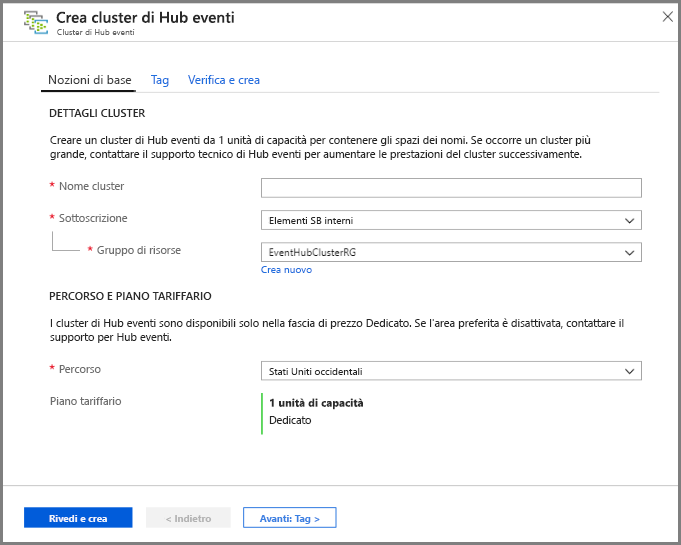
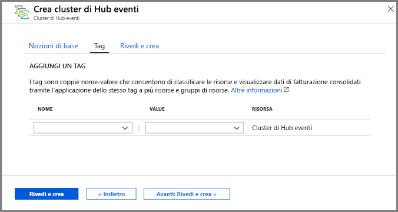
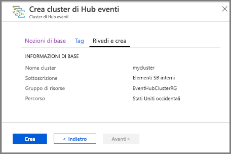
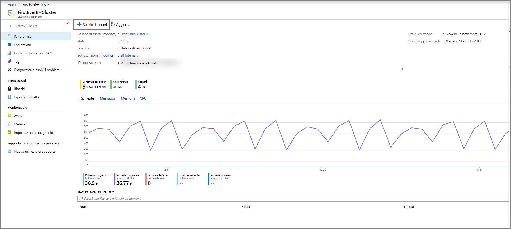
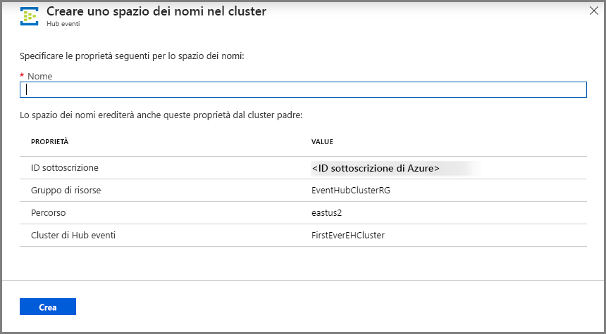
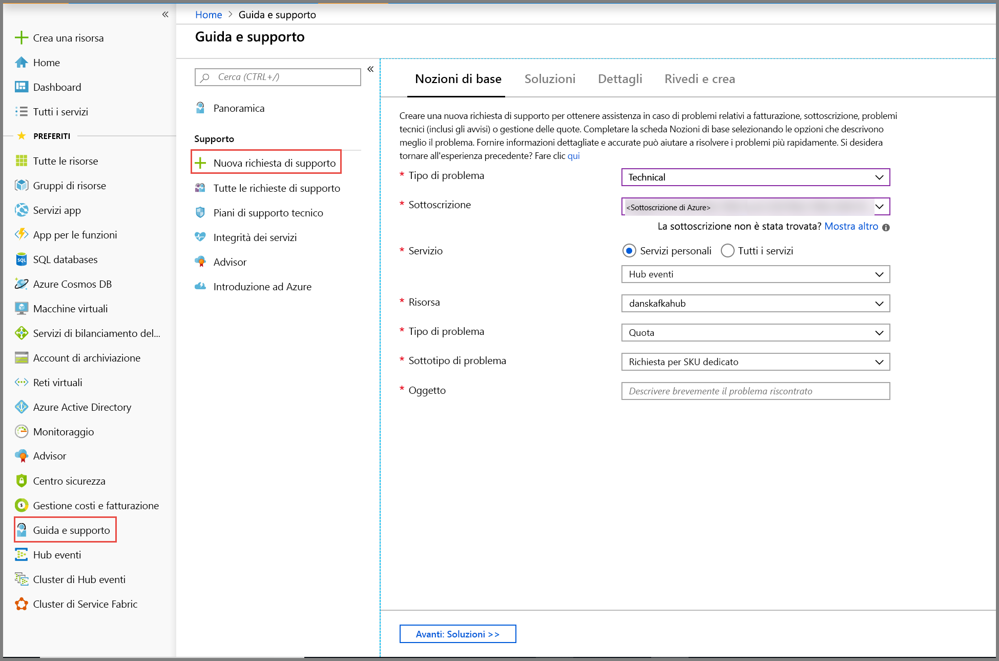
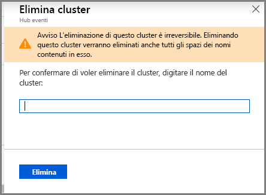

# Guida introduttiva: Creare un cluster di Hub eventi dedicato tramite il portale di Azure 
I cluster Hub eventi offrono distribuzioni a tenant singolo per i clienti con i requisiti di streaming più rigorosi. Questa offerta ha un contratto di servizio garantito del 99,99% ed è disponibile solo per il piano tariffario Dedicato. Un [cluster di Hub eventi](event-hubs-dedicated-overview.md) può gestire l'ingresso di milioni di eventi al secondo con una capacità garantita e una latenza dell'ordine di frazioni di secondo. Gli spazi dei nomi e gli hub eventi creati all'interno di un cluster includono tutte le funzionalità dell'offerta standard e altre ancora, ma senza limiti di ingresso. L'offerta Dedicato include anche, senza costi aggiuntivi, la popolare funzionalità [Acquisizione di Hub eventi](event-hubs-capture-overview.md), che consente di eseguire in batch e di registrare automaticamente i flussi di dati in [Archiviazione BLOB di Azure](../storage/blobs/storage-blobs-introduction.md) o in [Azure Data Lake Storage Gen 1](../data-lake-store/data-lake-store-overview.md).

Il provisioning e la fatturazione dei cluster dedicati sono basati sulle **unità di capacità**, una quantità preallocata di risorse di CPU e memoria. È possibile acquistare 1, 2, 4, 8, 12, 16 o 20 unità di capacità per ogni cluster. Questa guida di avvio rapido illustra nel dettaglio la creazione di un cluster di Hub eventi con una unità di capacità tramite il portale di Azure.

> [!NOTE]
> Questa esperienza self-service è attualmente disponibile in anteprima nel [portale di Azure](https://aka.ms/eventhubsclusterquickstart). Per qualsiasi domanda sull'offerta Dedicato, contattare il [team di Hub eventi](mailto:askeventhubs@microsoft.com).

## Prerequisiti
Per completare questa guida introduttiva, assicurarsi di disporre di quanto segue:

- Un account Azure. Se non si ha una sottoscrizione, [acquistare un account](https://azure.microsoft.com/pricing/purchase-options/pay-as-you-go/) prima di iniziare. Questa funzionalità non è supportata con un account Azure gratuito. 
- [Visual Studio](https://visualstudio.microsoft.com/vs/) 2017 Update 3 (versione 15.3, 26730.01) o versioni successive.
- [NET Standard SDK](https://dotnet.microsoft.com/download) versione 2.0 o successiva.
- [Un gruppo di risorse creato](../event-hubs/event-hubs-create.md#create-a-resource-group).

## Creare un cluster Hub eventi Dedicato
Un cluster di Hub eventi fornisce un contenitore di ambito univoco in cui è possibile creare uno o più spazi dei nomi. In questa fase di anteprima dell'esperienza self-service del portale è possibile creare cluster con una unità di capacità in aree geografiche selezionate. Se serve un cluster con più unità di capacità, è possibile inviare una richiesta di supporto di Azure per aumentare le prestazioni del cluster dopo la creazione.

Per creare un cluster nel gruppo di risorse usando il portale di Azure, seguire questa procedura:

1. Seguire [questo collegamento](https://aka.ms/eventhubsclusterquickstart) per creare un cluster nel portale di Azure. In alternativa, selezionare **Tutti i servizi** nel riquadro di spostamento a sinistra, quindi digitare "Cluster di Hub eventi" nella barra di ricerca e selezionare "Cluster di Hub eventi" nell'elenco dei risultati.
2. Nella pagina **Crea cluster** configurare le opzioni seguenti:
    1. Immettere un **nome per il cluster**. Verrà effettuato immediatamente un controllo sulla disponibilità del nome.
    2. Selezionare la **sottoscrizione** in cui creare il cluster.
    3. Selezionare il **gruppo di risorse** in cui creare il cluster.
    4. Selezionare una **posizione** per il cluster. Se l'area preferita è disattivata, significa che ha temporaneamente esaurito la capacità ed è possibile inviare una [richiesta di supporto](#submit-a-support-request) al team di Hub eventi.
    5. Fare clic sul pulsante **Avanti: Tag** nella parte inferiore della pagina. Per il provisioning completo delle risorse da parte del sistema, potrebbero essere necessari alcuni minuti.

        
3. Nella pagina **Tag** configurare le opzioni seguenti:
    1. Immettere un **nome** e un **valore** per il tag da aggiungere. Questo passaggio è **facoltativo**.  
    2. Selezionare il pulsante **Rivedi e crea**.

        
4. Nella pagina **Rivedi e crea** controllare i dettagli e selezionare **Crea**. 

    

## Creare uno spazio dei nomi e un hub eventi in un cluster

1. Per creare uno spazio dei nomi in un cluster, nella pagina **Cluster di Hub eventi** del cluster selezionare **+ Spazio dei nomi** dal menu in alto.

    
2. Nella pagina Crea uno spazio dei nomi seguire questa procedura:
    1. Immettere un **nome per lo spazio dei nomi**.  Verrà effettuato un controllo sulla disponibilità del nome.
    2. Lo spazio dei nomi eredita le proprietà seguenti:
        1. ID sottoscrizione
        2. Gruppo di risorse
        3. Località
        4. Cluster Name
    3. Selezionare **Crea** per creare lo spazio dei nomi. A questo punto è possibile gestire il cluster.  

        
3. Dopo aver creato lo spazio dei nomi, è possibile [creare un hub eventi](event-hubs-create.md#create-an-event-hub) seguendo la procedura usata normalmente in uno spazio dei nomi. 

## Inviare una richiesta di supporto.

Se si vogliono cambiare le dimensioni del cluster dopo la creazione o se l'area preferita non è disponibile, inviare una richiesta di supporto seguendo questa procedura:

1. Nel menu di sinistra del [portale di Azure](https://portal.azure.com) selezionare **Guida e supporto**.
2. Selezionare **+ Nuova richiesta di supporto** dal menu Supporto.
3. Nella pagina Supporto seguire questa procedura:
    1. Per **Tipo di problema** selezionare **Tecnico** nell'elenco a discesa.
    2. In **Sottoscrizione** selezionare la propria sottoscrizione.
    3. Per **Servizio** selezionare **Servizi personali** e quindi selezionare **Hub eventi**.
    4. Per **Risorsa** selezionare il cluster, se esiste già. In caso contrario, selezionare **Domanda generale/Risorsa non disponibile**.
    5. Per **Tipo di problema** selezionare **Quota**.
    6. Per la **Sottotipo del problema** selezionare uno dei valori seguenti nell'elenco a discesa:
        1. Selezionare **Request for Dedicated SKU** (Richiesta di SKU dedicato) per richiedere il supporto per la funzionalità nella propria area.
        2. Per aumentare o ridurre le prestazioni del cluster dedicato, selezionare **Request to Scale Up or Scale Down Dedicated Cluster** (Richiesta di aumento o riduzione delle prestazioni di un cluster dedicato). 
    7. Per **Oggetto** descrivere il problema.

        

 ## Eliminare un cluster dedicato
 
1. Per eliminare il cluster, selezionare **Elimina** dal menu in alto. Tenere presente che al cluster verrà addebitato un minimo di 4 ore di utilizzo dopo la creazione. 
2. Verrà visualizzato un messaggio per confermare la scelta di eliminare il cluster.
3. Digitare il **nome del cluster** e selezionare **Elimina** per eliminare il cluster.

    

## Passaggi successivi
In questo articolo è stato creato un cluster di Hub eventi. Per istruzioni dettagliate relative all'invio e alla ricezione di eventi da un hub eventi e all'acquisizione di eventi in Archiviazione di Azure o Azure Data Lake Store, vedere le esercitazioni seguenti:

- [Send and receive events on .NET Core](event-hubs-dotnet-standard-getstarted-send.md) (Inviare e ricevere eventi in .NET Core)
- [Use Azure portal to enable Event Hubs Capture](event-hubs-capture-enable-through-portal.md) (Usare il portale di Azure per abilitare Acquisizione di Hub eventi)
- [Use Azure Event Hubs for Apache Kafka](event-hubs-for-kafka-ecosystem-overview.md) (Usare Hub eventi di Azure per Apache Kafka)
