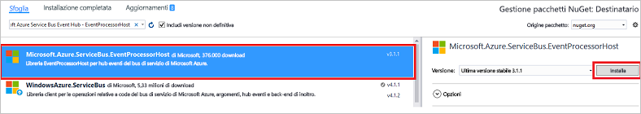

# <a name="get-started-with-event-hubs-using-the-net-framework"></a>Introduzione a Hub eventi con .NET Framework

## <a name="receive-messages-with-eventprocessorhost"></a>Ricevere messaggi con EventProcessorHost
[EventProcessorHost][EventProcessorHost] è una classe .NET che semplifica la ricezione di messaggi da Hub eventi mediante la gestione di checkpoint persistenti e ricezioni parallele da tali hub. Usando [EventProcessorHost][EventProcessorHost] è possibile suddividere gli eventi tra più ricevitori, anche se ospitati in nodi diversi. Questo esempio illustra come usare [EventProcessorHost][EventProcessorHost] per un ricevitore singolo. L'esempio di [elaborazione di eventi con aumento del numero di istanze][Scale out Event Processing with Event Hubs] mostra come usare [EventProcessorHost][EventProcessorHost] con più ricevitori.

Per usare [EventProcessorHost][EventProcessorHost], è necessario un [account di archiviazione di Azure][Azure Storage account]:

1. Accedere al [portale di Azure][Azure portal] e fare clic su **Nuovo** nella parte superiore sinistra della schermata.
2. Fare clic su **Archiviazione** e quindi su **Account di archiviazione**.
   
    
3. Nel pannello **Crea account di archiviazione** digitare un nome per l'account di archiviazione. Scegliere una sottoscrizione, un gruppo di risorse e una località di Azure in cui creare la risorsa. Fare quindi clic su **Crea**.
   
    
4. Nell'elenco degli account di archiviazione fare clic su quello appena creato.
5. Nel pannello Account di archiviazione fare clic su **Chiavi di accesso**. Copiare il valore di **key1** da usare più avanti in questa esercitazione.
   
    
6. In Visual Studio creare un nuovo progetto di app desktop di Visual C# usando il modello di progetto **Applicazione console**. Assegnare al progetto il nome **Receiver**.
   
    
7. In Esplora soluzioni fare clic con il pulsante destro del mouse sulla soluzione e quindi scegliere **Gestisci pacchetti NuGet per la soluzione**.
8. Fare clic sulla scheda **Sfoglia** e cercare `Microsoft Azure Service Bus Event Hub - EventProcessorHost`. Assicurarsi che il nome del progetto (**Receiver**) sia specificato nella casella **Versione/i**. Fare clic su **Installa**e accettare le condizioni per l'utilizzo.
   
    
   
    Visual Studio scarica e installa il [pacchetto NuGet Azure Service Bus Event Hub - EventProcessorHost](https://www.nuget.org/packages/Microsoft.Azure.ServiceBus.EventProcessorHost)e aggiunge un riferimento al pacchetto con tutte le relative dipendenze.
9. Fare clic con il pulsante destro del mouse sul progetto **Receiver**, scegliere **Aggiungi** e quindi **Classe**. Assegnare alla nuova classe il nome **SimpleEventProcessor** e quindi fare clic su **Aggiungi** per crearla.
   
    
10. Aggiungere le istruzioni seguenti all'inizio del file SimpleEventProcessor.cs:
    
     ```csharp
     using Microsoft.ServiceBus.Messaging;
     using System.Diagnostics;
     ```
    
     Sostituire quindi il corpo della classe con il codice seguente:
    
     ```csharp
     class SimpleEventProcessor : IEventProcessor
     {
         Stopwatch checkpointStopWatch;
    
         async Task IEventProcessor.CloseAsync(PartitionContext context, CloseReason reason)
         {
             Console.WriteLine("Processor Shutting Down. Partition '{0}', Reason: '{1}'.", context.Lease.PartitionId, reason);
             if (reason == CloseReason.Shutdown)
             {
                 await context.CheckpointAsync();
             }
         }
    
         Task IEventProcessor.OpenAsync(PartitionContext context)
         {
             Console.WriteLine("SimpleEventProcessor initialized.  Partition: '{0}', Offset: '{1}'", context.Lease.PartitionId, context.Lease.Offset);
             this.checkpointStopWatch = new Stopwatch();
             this.checkpointStopWatch.Start();
             return Task.FromResult<object>(null);
         }
    
         async Task IEventProcessor.ProcessEventsAsync(PartitionContext context, IEnumerable<EventData> messages)
         {
             foreach (EventData eventData in messages)
             {
                 string data = Encoding.UTF8.GetString(eventData.GetBytes());
    
                 Console.WriteLine(string.Format("Message received.  Partition: '{0}', Data: '{1}'",
                     context.Lease.PartitionId, data));
             }
    
             //Call checkpoint every 5 minutes, so that worker can resume processing from 5 minutes back if it restarts.
             if (this.checkpointStopWatch.Elapsed > TimeSpan.FromMinutes(5))
             {
                 await context.CheckpointAsync();
                 this.checkpointStopWatch.Restart();
             }
         }
     }
     ```
    
     Questa classe verrà chiamata da **EventProcessorHost** per elaborare eventi ricevuti dall'hub eventi. Si noti che la classe `SimpleEventProcessor` usa un cronometro per chiamare periodicamente il metodo checkpoint sul contesto di **EventProcessorHost** . Questo assicura che, se il ricevitore viene riavviato, non perderà più di cinque minuti di lavoro di elaborazione.
11. Nella classe **Program** aggiungere l'istruzione `using` seguente all'inizio del file:
    
     ```csharp
     using Microsoft.ServiceBus.Messaging;
     ```
    
     Sostituire quindi il metodo `Main` nella classe `Program` con il codice seguente, sostituendo il nome dell'hub eventi e la stringa di connessione a livello di spazio dei nomi salvata in precedenza, nonché l'account di archiviazione e la chiave copiata nelle sezioni precedenti. 
    
     ```csharp
     static void Main(string[] args)
     {
       string eventHubConnectionString = "{Event Hub connection string}";
       string eventHubName = "{Event Hub name}";
       string storageAccountName = "{storage account name}";
       string storageAccountKey = "{storage account key}";
       string storageConnectionString = string.Format("DefaultEndpointsProtocol=https;AccountName={0};AccountKey={1}", storageAccountName, storageAccountKey);
    
       string eventProcessorHostName = Guid.NewGuid().ToString();
       EventProcessorHost eventProcessorHost = new EventProcessorHost(eventProcessorHostName, eventHubName, EventHubConsumerGroup.DefaultGroupName, eventHubConnectionString, storageConnectionString);
       Console.WriteLine("Registering EventProcessor...");
       var options = new EventProcessorOptions();
       options.ExceptionReceived += (sender, e) => { Console.WriteLine(e.Exception); };
       eventProcessorHost.RegisterEventProcessorAsync<SimpleEventProcessor>(options).Wait();
    
       Console.WriteLine("Receiving. Press enter key to stop worker.");
       Console.ReadLine();
       eventProcessorHost.UnregisterEventProcessorAsync().Wait();
     }
     ```

> [!NOTE]
> Questa esercitazione usa una singola istanza di [EventProcessorHost][EventProcessorHost]. Per aumentare la velocità effettiva, è consigliabile eseguire più istanze di [EventProcessorHost][EventProcessorHost], come illustrato nell'esempio di [elaborazione di eventi con aumento del numero di istanze][elaborazione di eventi con aumento del numero di istanze]. In questi casi, le varie istanze si coordinano automaticamente tra loro per ottenere il bilanciamento del carico relativo agli eventi ricevuti. Se si vuole che ognuno dei vari ricevitori elabori *tutti* gli eventi, è necessario usare il concetto **ConsumerGroup** . Quando si ricevono eventi da più macchine, potrebbe risultare utile specificare nomi per le istanze di [EventProcessorHost][EventProcessorHost] in base alle macchine (o ai ruoli) in cui sono distribuite. Per altre informazioni su questi argomenti, vedere [Panoramica di Hub eventi][Event Hubs Overview] e [Guida alla programmazione di Hub eventi][Event Hubs Programming Guide].
> 
> 

<!-- Links -->
[Event Hubs Overview]: event-hubs-overview.md
[Event Hubs Programming Guide]: event-hubs-programming-guide.md
[Azure Storage account]: ../storage/storage-create-storage-account.md
[EventProcessorHost]: /dotnet/api/microsoft.servicebus.messaging.eventprocessorhost
[Azure portal]: https://portal.azure.com

## <a name="next-steps"></a>Passaggi successivi
Dopo la compilazione di un'applicazione di lavoro che crea un Hub eventi e invia e riceve dati, è possibile ottenere altre informazioni selezionando i collegamenti seguenti:

* [Host processore di eventi](/dotnet/api/microsoft.servicebus.messaging.eventprocessorhost)
* [Panoramica di Hub eventi][Event Hubs overview]
* [Domande frequenti su Hub eventi](event-hubs-faq.md)

<!-- Images. -->
[19]: ./media/event-hubs-csharp-ephcs-getstarted/create-eh-proj1.png
[20]: ./media/event-hubs-csharp-ephcs-getstarted/create-eh-proj2.png
[21]: ./media/event-hubs-csharp-ephcs-getstarted/run-csharp-ephcs1.png
[22]: ./media/event-hubs-csharp-ephcs-getstarted/run-csharp-ephcs2.png

<!-- Links -->
[Event Processor Host]: https://www.nuget.org/packages/Microsoft.Azure.ServiceBus.EventProcessorHost
[Event Hubs overview]: event-hubs-overview.md
[Scale out Event Processing with Event Hubs]: https://code.msdn.microsoft.com/Service-Bus-Event-Hub-45f43fc3


<!--HONumber=Feb17_HO1-->


