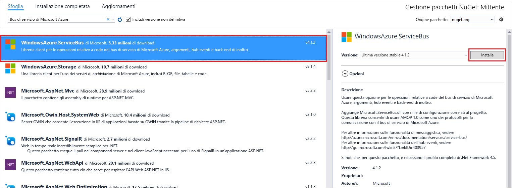

# <a name="send-events-to-azure-event-hubs-using-the-net-framework"></a>Inviare eventi a Hub eventi di Azure usando .NET Framework

## <a name="introduction"></a>Introduzione

Hub eventi è un servizio che consente di elaborare grandi quantità di dati di telemetria sugli eventi da applicazioni e dispositivi connessi. Dopo aver raccolto i dati in Hub eventi, è possibile archiviarli usando un cluster di archiviazione o trasformarli usando un provider di analisi in tempo reale. Questa funzionalità di elaborazione e raccolta di eventi su vasta scala rappresenta un componente chiave delle moderne architetture di applicazioni, tra cui Internet delle cose (IoT).

Questa esercitazione illustra come usare il [portale di Azure](https://portal.azure.com) per creare un hub eventi. Descrive anche come inviare eventi a un hub eventi usando un'applicazione console scritta in C# con .NET Framework. Per ricevere eventi usando .NET Framework, vedere l'articolo [Receive events using the .NET Framework](event-hubs-dotnet-framework-getstarted-receive-eph.md) (Ricevere eventi usando .NET Framework) o fare clic sul linguaggio di ricezione appropriato nel sommario a sinistra.

Per completare questa esercitazione è necessario soddisfare i prerequisiti seguenti:

* [Microsoft Visual Studio 2015 o versione successiva](http://visualstudio.com). Gli screenshot in questa esercitazione illustrano Visual Studio 2017.
* Un account Azure attivo. Se non si ha un account, è possibile crearne uno gratuito in pochi minuti. Per informazioni dettagliate, vedere la pagina relativa alla [versione di valutazione gratuita di Azure](https://azure.microsoft.com/free/).

## <a name="create-an-event-hubs-namespace-and-an-event-hub"></a>Creare uno spazio dei nomi di Hub eventi e un hub eventi

Il primo passaggio consiste nell'usare il [portale di Azure](https://portal.azure.com) per creare uno spazio dei nomi di tipo Hub eventi e ottenere le credenziali di gestione necessarie all'applicazione per comunicare con l'hub eventi. Per creare uno spazio dei nomi e un hub eventi, seguire la procedura descritta in [questo articolo](event-hubs-create.md) e quindi procedere con i passaggi seguenti di questa esercitazione.

## <a name="create-a-sender-console-application"></a>Creare un'applicazione console per il mittente

In questa sezione si scriverà un'app console Windows che invia eventi all'hub eventi.

1. In Visual Studio creare un nuovo progetto di app desktop di Visual C# usando il modello di progetto **Applicazione console** . Assegnare al progetto il nome **Sender**.
   
    
2. In Esplora soluzioni fare clic con il pulsante destro del mouse sul progetto **Sender**, quindi scegliere **Gestisci pacchetti NuGet per la soluzione**. 
3. Fare clic sulla scheda **Sfoglia** e quindi cercare `WindowsAzure.ServiceBus`. Fare clic su **Installa**e accettare le condizioni per l'utilizzo. 
   
    
   
    Visual Studio scarica e installa il [pacchetto NuGet delle librerie del bus di servizio di Azure](https://www.nuget.org/packages/WindowsAzure.ServiceBus)e aggiunge un riferimento al pacchetto.
4. Aggiungere le istruzione `using` seguenti all'inizio del file **Program.cs** :
   
  ```csharp
  using System.Threading;
  using Microsoft.ServiceBus.Messaging;
  ```
5. Aggiungere i campi seguenti alla classe **Program**, sostituendo i valori segnaposto con il nome dell'hub eventi creato nella sezione precedente e la stringa di connessione a livello di spazio dei nomi salvata in precedenza.
   
  ```csharp
  static string eventHubName = "{Event Hub name}";
  static string connectionString = "{send connection string}";
  ```
6. Aggiungere il metodo seguente alla classe **Program** :
   
  ```csharp
  static void SendingRandomMessages()
  {
      var eventHubClient = EventHubClient.CreateFromConnectionString(connectionString, eventHubName);
      while (true)
      {
          try
          {
              var message = Guid.NewGuid().ToString();
              Console.WriteLine("{0} > Sending message: {1}", DateTime.Now, message);
              eventHubClient.Send(new EventData(Encoding.UTF8.GetBytes(message)));
          }
          catch (Exception exception)
          {
              Console.ForegroundColor = ConsoleColor.Red;
              Console.WriteLine("{0} > Exception: {1}", DateTime.Now, exception.Message);
              Console.ResetColor();
          }
   
          Thread.Sleep(200);
      }
  }
  ```
   
  Questo metodo invia continuamente eventi all'hub eventi con un ritardo di 200 millisecondi.
7. Aggiungere infine le righe seguenti al metodo **Main** :
   
  ```csharp
  Console.WriteLine("Press Ctrl-C to stop the sender process");
  Console.WriteLine("Press Enter to start now");
  Console.ReadLine();
  SendingRandomMessages();
  ```
8. Eseguire il programma e assicurarsi che non siano presenti errori.
  
Congratulazioni. Sono stati inviati messaggi a un hub eventi.

## <a name="next-steps"></a>Passaggi successivi
Ora che è stata creata un'applicazione funzionante che crea un hub eventi e invia dati, è possibile passare agli scenari seguenti:

* [Receive events using the Event Processor Host](event-hubs-dotnet-framework-getstarted-receive-eph.md) (Ricevere eventi usando l'host processore di eventi)
* [Event Processor Host reference](/dotnet/api/microsoft.servicebus.messaging.eventprocessorhost) (Informazioni di riferimento sull'host processore di eventi)
* [Panoramica di Hub eventi](event-hubs-what-is-event-hubs.md)

<!-- Images. -->
[19]: ./media/event-hubs-csharp-ephcs-getstarted/create-eh-proj1.png
[20]: ./media/event-hubs-csharp-ephcs-getstarted/create-eh-proj2.png
[21]: ./media/event-hubs-csharp-ephcs-getstarted/run-csharp-ephcs1.png
[22]: ./media/event-hubs-csharp-ephcs-getstarted/run-csharp-ephcs2.png

