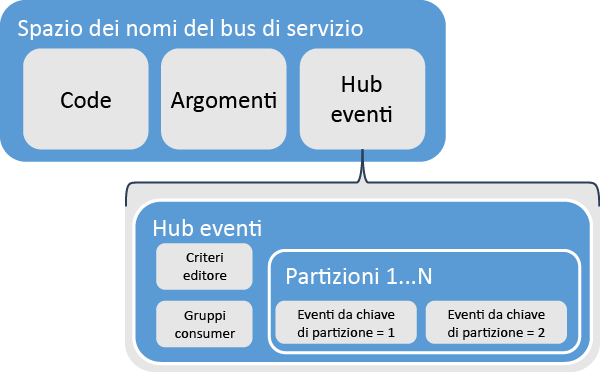
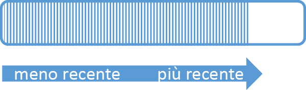
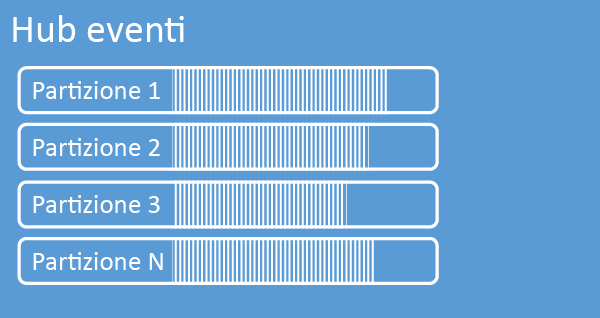
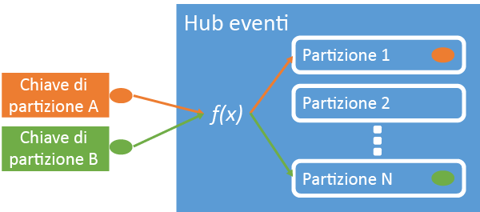
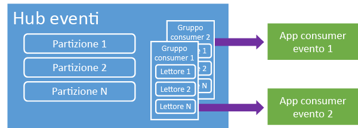
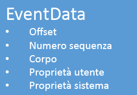

<properties 
   pageTitle="Panoramica di Hub eventi"
   description="Introduzione e panoramica di Hub eventi di Azure."
   services="event-hubs"
   documentationCenter="na"
   authors="sethmanheim"
   manager="timlt"
   editor="" />
<tags 
   ms.service="event-hubs"
   ms.devlang="na"
   ms.topic="article"
   ms.tgt_pltfrm="na"
   ms.workload="tbd"
   ms.date="06/09/2015"
   ms.author="sethm" />

# Panoramica di Hub eventi di Azure

Molte soluzioni moderne intendono fornire esperienze del cliente adattive o migliorare i prodotti tramite feedback continui e telemetria automatizzata. Tali soluzioni devono affrontare la sfida della protezione e dell’elaborazione affidabile di grandi quantità di informazioni di più autori simultanei. Hub eventi di Microsoft Azure è un servizio di piattaforma gestita che fornisce una base per l'acquisizione di dati su larga scala in una vasta gamma di scenari. Esempi di tali scenari sono il rilevamento del comportamento in app per dispositivi mobili, informazioni sul traffico da web farm, l’acquisizione di eventi in gioco nei giochi di console o i dati di telemetria raccolti da computer industriali o veicoli connessi. Il ruolo comune svolto da Hub eventi nelle architetture delle soluzioni è la sua funzione di "porta principale" per una pipeline di eventi, spesso denominata *ingestor evento*. Un ingestor evento è un componente o servizio che si trova tra i producer e i consumer di eventi per separare la produzione di un flusso di eventi dal consumo di tali eventi.

Hub eventi di Azure è un servizio di elaborazione eventi che fornisce un punto di ingresso di eventi e telemetria nel cloud su grandissima scala, con bassa latenza e affidabilità elevata. Questo servizio, usato insieme ad altri servizi a valle, è particolarmente utile negli scenari di strumentazione delle applicazioni, elaborazione dei flussi di lavoro o esperienza utente e Internet delle cose (IoT). Hub eventi fornisce funzionalità di gestione del flusso di messaggi e anche se un Hub eventi è un'entità simile a code e argomenti, presenta caratteristiche molto diverse dai servizi di messaggistica aziendale tradizionale. Scenari di messaggistica aziendale richiedono in genere un numero di funzionalità sofisticate come sequenziazione, coda dei messaggi non recapitabili, supporto delle transazioni e garanzie di consegna sicura, mentre la preoccupazione principale per l’acquisizione di eventi è la velocità effettiva elevata e la flessibilità di elaborazione per i flussi di eventi. Pertanto, le funzionalità di Hub eventi di Azure differiscono dagli argomenti di Bus di servizio in quando sono fortemente orientati agli scenari con velocità effettiva elevata ed elaborazione di eventi. Di conseguenza, gli Hub eventi non implementano alcune delle funzionalità di messaggistica disponibili per gli argomenti. Se tali funzionalità sono necessarie, gli argomenti rimangano la scelta ottimale.

Un Hub eventi viene creato a livello di spazio dei nomi in Bus di servizio, analogamente a code e argomenti. Hub eventi utilizza AMQP e HTTP come le interfacce API primarie. Il grafico seguente mostra la relazione tra Hub eventi e Bus di servizio.

## Informazioni generali

Hub eventi fornisce i flussi di messaggi tramite un modello consumer partizionato. Le code e gli argomenti utilizzano un modello del [consumer concorrente](https://msdn.microsoft.com/library/dn568101.aspx) in cui ogni consumer tenta di leggere dalla stessa coda o risorsa. La concorrenza per le risorse determina complessità e limiti di scalabilità per le applicazioni di elaborazione del flusso. Hub eventi utilizza un modello consumer partizionato in cui ogni consumer legge solo un sottoinsieme specifico, o partizione, del flusso di messaggi. Questo modello consente la scalabilità orizzontale per l'elaborazione di eventi e fornisce altre funzionalità incentrate sul flusso non disponibili in code e argomenti.

### Partizioni

Una partizione è una sequenza ordinata di eventi contenuta in un Hub eventi. Man mano che arrivano, i nuovi eventi vengono aggiunti alla fine di questa sequenza. Una partizione può essere considerata come "registro commit".

Le partizioni conservano i dati per un periodo di conservazione configurato che viene impostato a livello di Hub eventi. Questa impostazione viene applicata a tutte le partizioni nell'Hub eventi. Gli eventi scadono su base temporale; non è possibile eliminarli in modo esplicito. Un Hub eventi contiene più partizioni. Ogni partizione è indipendente e contiene la propria sequenza di dati. Di conseguenza, le partizioni spesso crescono a velocità diverse.

Il numero di partizioni specificato in fase di creazione dell'Hub eventi e deve essere compreso tra 8 e 32. Le partizioni sono un meccanismo di organizzazione dei dati e sono più strettamente correlate al grado di parallelismo a valle necessario nell'utilizzo di applicazioni rispetto alla velocità effettiva degli Hub eventi. In questo modo la scelta del numero di partizioni in un Hub eventi è direttamente correlato al numero di lettori simultanei previsti. Dopo la creazione di Hub eventi, il numero di partizioni non può essere modificato. Tale numero deve essere considerato in termini di scalabilità prevista a lungo termine. È possibile aumentare il limite di 32 partizioni contattando il team di Bus di servizio di Azure.

Anche se le partizioni sono identificabili e possono costituire destinazioni dirette, in genere è preferibile evitare l'invio di dati a partizioni specifiche. Al contrario, è possibile utilizzare costrutti di livello superiori introdotti nelle sezioni [Autore di eventi](#Event-publisher) e [Criteri di autore](#Capacity-and-security).

Nel contesto di Hub eventi, i messaggi vengono definiti come *dati dell'evento*. I dati dell'evento contengono il corpo dell'evento, un contenitore di proprietà definito dall’utente e diversi metadati sull'evento, ad esempio l'offset nella partizione e il relativo numero nella sequenza di flusso. Le partizioni vengono riempite con una sequenza di dati dell'evento.

## Autore di eventi

Qualsiasi entità che invia eventi o dati a un Hub di eventi è un *autore di eventi*. Gli autori di eventi possono pubblicare eventi utilizzando HTTPS o AMQP 1.0. Gli autori di eventi utilizzano un token di firma di accesso condiviso (SAS) per identificarsi con un Hub eventi e possono avere un'identità univoca oppure utilizzare un token SAS comune, a seconda dei requisiti dello scenario.

Per altre informazioni sull’uso di SAS, vedere [Autenticazione della firma di accesso condiviso con il bus di servizio](https://msdn.microsoft.com/library/dn170477.aspx).

### Attività comuni degli autori

In questa sezione vengono descritte attività comuni per gli autori di eventi.

#### Acquisizione di un token SAS

Firma di accesso condiviso (SAS) è il meccanismo di autenticazione di Hub eventi. Bus di servizio fornisce criteri di firma di accesso condiviso a livello di Hub eventi e spazio dei nomi. Un token SAS viene generato da una chiave SAS ed è un hash SHA di un URL, codificato in un formato specifico. Utilizzando il nome della chiave (criterio) e il token, Bus di servizio può rigenerare l'hash e pertanto autenticare il mittente. In genere, i token SAS per gli autori di eventi vengono creati con soli privilegi di **invio** su un Hub eventi specifico. Questo meccanismo di URL token SAS costituisce la base per l'identificazione dell’autore introdotta nei criteri di autore. Per altre informazioni sull’uso di SAS, vedere [Autenticazione della firma di accesso condiviso con il bus di servizio](https://msdn.microsoft.com/library/dn170477.aspx).

#### Pubblicazione di un evento

È possibile pubblicare un evento tramite AMQP 1.0 o HTTPS. Bus di servizio fornisce una classe [EventHubClient](https://msdn.microsoft.com/library/microsoft.servicebus.messaging.eventhubclient.aspx) per la pubblicazione di eventi a un Hub eventi dai client .NET. Per altre piattaforme e runtime, è possibile utilizzare qualsiasi client AMQP 1.0, ad esempio [Apache Qpid](http://qpid.apache.org/). È possibile pubblicare eventi singolarmente o in batch. Una singola pubblicazione (istanza dei dati dell'evento) ha un limite di 256 KB, a prescindere che si tratti di un singolo evento o di un batch. La pubblicazione di eventi di dimensioni maggiori determina un errore. È consigliabile che gli autori non conoscano le partizioni presenti nell'Hub eventi e specifichino solo una *chiave di partizione* (introdotta nella sezione successiva) o la propria identità tramite i token SAS.

La scelta di utilizzare AMQP o HTTPS dipende dallo scenario di utilizzo. AMQP richiede di stabilire un socket bidirezionale persistente oltre alla sicurezza a livello di trasporto (TLS) o SSL/TLS. Questa operazione può essere costosa in termini di traffico di rete, ma verrà eseguita solo all'inizio di una sessione AMQP. HTTPS presenta un sovraccarico iniziale inferiore, ma richiede un sovraccarico SSL aggiuntivo per ogni richiesta. Per gli autori che pubblicano spesso eventi AMQP offre risparmi significativi di prestazioni, latenza e velocità effettiva.

### Chiave di partizione

Una chiave di partizione è un valore che viene utilizzato per mappare i dati dell'evento in ingresso in partizioni specifiche ai fini dell’organizzazione dei dati. La chiave di partizione è un valore fornito dal mittente passato a un Hub eventi. Viene elaborato tramite una funzione di hashing statica, il cui risultato crea l'assegnazione di partizione. Se non si specifica una chiave di partizione quando si pubblica un evento, viene utilizzata un'assegnazione round robin. Quando si utilizzano chiavi di partizione, solo l'autore di eventi è a conoscenza della chiave di partizione, non la partizione in cui gli eventi vengono pubblicati. Questa separazione tra chiave e partizione evita che il mittente debba conoscere troppe informazioni sull'elaborazione a valle e l'archiviazione degli eventi. Le chiavi di partizione sono importanti per organizzare i dati per l'elaborazione a valle, ma fondamentalmente non sono correlate alle partizioni stesse. Un’identità univoca per dispositivo o utente crea una chiave di partizione efficace, ma è possibile utilizzare anche altri attributi, ad esempio l’area geografica, per raggruppare gli eventi correlati in un'unica partizione. Nella figura seguente vengono mostrati mittenti di eventi che utilizzano le chiavi di partizione per aggiungere alle partizioni.

Hub di eventi di Azure garantisce che tutti gli eventi che condividono lo stesso valore di chiave di partizione vengono recapitati in ordine e alla stessa partizione. Inoltre, se si utilizzano chiavi di partizione con i criteri di autore, descritti nella sezione successiva, l'identità dell’autore e il valore della chiave di partizione devono corrispondere. In caso contrario, si verifica un errore.

### Consumer di eventi

Qualsiasi entità che legge i dati dell'evento da un Hub eventi è un consumer di eventi. Tutti i consumer di eventi leggono il flusso di eventi tramite le partizioni in un gruppo di consumer. Ogni partizione deve avere un solo lettore attivo alla volta. Tutti i consumer di Hub eventi si connettono tramite la sessione AMQP 1.0, in cui gli eventi vengono recapitati appena disponibili. Il client non deve eseguire il polling per la disponibilità dei dati.

#### Gruppi di utenti

Il meccanismo di pubblicazione/sottoscrizione degli Hub eventi è abilitato tramite i gruppi di consumer. Un gruppo di consumer è una vista (stato, posizione o offset) di un intero Hub eventi. I gruppi di consumer consentono a più applicazioni costose di avere una visualizzazione separata del flusso di eventi e di leggere il flusso in modo indipendente in base alle proprie esigenze e con i propri gli offset. In un’architettura di elaborazione flusso, ogni applicazione a valle equivale a un gruppo di consumer. Se si desidera scrivere i dati dell’evento nell’archiviazione a lungo termine, tale applicazione writer di archiviazione è un gruppo di consumer. L’elaborazione di eventi complessi viene eseguita da un altro gruppo di consumer separato. È possibile accedere alla partizioni solo tramite un gruppo di consumer. In un Hub eventi è sempre presente un gruppo di consumer predefinito ed è possibile creare fino a 20 gruppi di consumer per un Hub eventi di livello Standard.

Di seguito sono riportati esempi della convenzione dell'URI del gruppo di consumer:

	//<my namespace>.servicebus.windows.net/<event hub name>/<Consumer Group #1>
	//<my namespace>.servicebus.windows.net/<event hub name>/<Consumer Group #2>

Nella figura seguente sono mostrati i consumer di eventi all'interno di gruppi di consumer.

#### Offset di flusso

Un offset è la posizione di un evento all'interno di una partizione. Un offset può essere considerato come un cursore sul lato client. L'offset è la numerazione di byte dell'evento. In questo modo un consumer di eventi (lettore) può specificare un punto nel flusso di eventi da cui si desidera iniziare la lettura degli eventi. È possibile specificare l'offset come un timestamp o un valore di offset. I consumer sono responsabili di archiviare i propri valori di offset all'esterno del servizio Hub eventi.

All'interno di una partizione, ogni evento include un offset. Tale offset viene utilizzato dai consumer per mostrare la posizione nella sequenza di eventi per una determinata partizione. Gli offset possono essere passati all'Hub eventi come numero o come valore timestamp quando si connette un lettore.

#### Checkpoint

Il *checkpoint* è un processo mediante il quale i lettori contrassegnano o eseguono il commit della propria posizione all'interno di una sequenza di eventi di partizione. Il checkpoint è responsabilità del consumer e si verifica per partizione all'interno di un gruppo di consumer. Ciò significa che per ogni gruppo di consumer, ogni lettore partizione deve tenere traccia della posizione corrente nel flusso di eventi e può informare il servizio quando considera completo il flusso di dati. Se un lettore si disconnette da una partizione, quando riconnette inizia a leggere in corrispondenza del checkpoint inviato in precedenza dall’ulitimo lettore di tale partizione in tale gruppo di consumer. Quando il lettore si connette, passa l'offset all'Hub eventi per specificare la posizione da cui iniziare la lettura. In questo modo è possibile utilizzare la funzionalità di checkpoint sia per contrassegnare gli eventi come "completi" dalle applicazioni a valle sia per fornire la resilienza in caso di failover tra i lettori in esecuzione in computer diversi. Poiché i dati dell’evento vengono conservati per il periodo di conservazione specificato durante la che creazione di Hub eventi, è possibile tornare ai dati meno recenti specificando un offset inferiore da questo processo di checkpoint. Tramite questo meccanismo il checkpoint consente sia la resilienza del failover che la riproduzione del flusso di eventi controllati.

#### Attività comuni del consumer

In questa sezione vengono descritte le attività comuni per i consumer di eventi o i lettori di Hub eventi. Tutti i consumer di Hub eventi si connettono tramite AMQP 1.0. AMQP 1.0 è un canale di comunicazione bidirezionale che riconosce sessione e stato. Ogni partizione dispone di una sessione di collegamento AMQP 1.0 che facilita il trasporto di eventi separati dalla partizione.

##### Connessione a una partizione

Per utilizzare gli eventi da un Hub eventi, un consumer deve connettersi a una partizione. Come accennato in precedenza, alle partizioni si accede sempre tramite un gruppo di consumer. Come parte del modello consumer partizionato, un unico lettore deve essere attivo in una partizione in qualsiasi momento all'interno di un gruppo di consumer. È pratica comune quando ci si connette direttamente a partizioni l’uso di un meccanismo di leasing per coordinare le connessioni di lettura per partizioni specifiche. In questo modo è possibile per ogni partizione in un gruppo di consumer avere un solo lettore attivo. La gestione di posizione nella sequenza di un lettore è un'importante attività che è possibile ottenere tramite i checkpoint. Questa funzionalità viene semplificata dall'utilizzo della classe [EventProcessorHost](https://msdn.microsoft.com/library/microsoft.servicebus.messaging.eventprocessorhost.aspx) per i client .NET. [EventProcessorHost](https://msdn.microsoft.com/library/microsoft.servicebus.messaging.eventprocessorhost.aspx) è un agente consumer intelligente e viene descritto nella sezione successiva.

##### Lettura degli eventi

Dopo l'apertura di una sessione AMQP 1.0 e del collegamento per una partizione specifica, gli eventi vengono recapitati al client AMQP 1.0 dal servizio Hub eventi. Questo meccanismo di recapito permette una velocità effettiva più elevata e una latenza più bassa rispetto ai meccanismi basati su pull, ad esempio HTTP GET. Quando gli eventi vengono inviati al client, ogni istanza dei dati dell'evento contiene metadati importanti, ad esempio l’offset e il numero di sequenza utilizzati per facilitare il checkpoint sulla in sequenza di eventi.

È responsabilità dell'utente per gestire questo offset nel modo che meglio consente di gestire l’avanzamento durante l'elaborazione del flusso.

## Capacità e sicurezza

Hub eventi è un'architettura altamente scalabile parallela di ingresso del flusso. Di conseguenza, esistono diversi aspetti chiavi da considerare per le dimensioni e la scalabilità di una soluzione basata su Hub eventi. Il primo di questi controlli di capacità è rappresentato dalle *unità elaborate*, descritte nella sezione seguente.

### Unità elaborate

La capacità di velocità effettiva di Hub eventi è controllata dalle unità elaborate. Le unità elaborate sono unità di capacità pre-acquistate. Una singola unità elaborata include:

- In ingresso: fino a 1 MB al secondo o 1000 eventi al secondo.

- In uscita: fino a 2 MB al secondo.

L’ingresso è limitato dalla quantità di capacità fornita dal numero di unità elaborate acquistate. L'invio di dati oltre questa quantità causa un'eccezione di "quota superata". Questa quantità è 1 MB al secondo o 1000 eventi al secondo, qualunque valore venga raggiunto per primo. L’uscita non genera eccezioni di limitazione, ma è limitata alla quantità di trasferimento dei dati fornito dalle unità elaborate acquistate: 2 MB al secondo per ogni unità elaborata. Se si ricevono eccezioni di velocità di pubblicazione o sono previste uscite maggiori, controllare il numero di unità elaborate acquistate per lo spazio dei nomi in cui è stato creato l'Hub eventi. Per ottenere ulteriori unità elaborate è possibile modificare l'impostazione nella pagina **Spazi dei nomi** della scheda **Configura** nel portale di gestione di Azure. È inoltre possibile modificare questa impostazione utilizzando le API di Azure.

Mentre le partizioni sono un concetto di organizzazione di dati, le unità elaborate sono semplicemente un concetto di capacità. Le unità elaborate vengo o fatturate su base oraria e sono pre-acquistate. Una volta acquistate, le unità elaborate vengono fatturate per un minimo di un'ora. Fino a 20 velocità elaborate possono essere acquistate per uno spazio dei nomi del Bus di servizio ed è previsto un limite di account Azure di 20 unità elaborate. Tali unità elaborate sono condivise tra tutti gli Hub eventi in un determinato spazio dei nomi.

Le unità elaborate vengono fornite con un criterio del massimo sforzo e l’acquisto immediato potrebbe non essere sempre disponibile. Se è necessaria una capacità specifica, è consigliabile acquistare le unità elaborate in anticipo. Se sono richieste più di 20 unità elaborate, è possibile contattare il supporto di Bus di sevizio di Microsoft Azure per acquistare ulteriori unità elaborate su base impegno in blocchi di 20, fino alle prime 100 unità elaborate. Inoltre, è possibile acquistare blocchi di 100 unità elaborate.

È consigliabile bilanciare attentamente unità elaborate e partizioni per ottenere una scalabilità ottimale con gli Hub eventi. Una singola partizione ha una scala massima di una unità elaborata. Il numero di unità elaborate deve essere minore o uguale al numero di partizioni in un Hub eventi.

Per dettagliate informazioni sui prezzi, vedere [Hub eventi Prezzi](http://azure.microsoft.com/pricing/details/event-hubs/).

### Criterio di autore

Hub eventi consente un controllo granulare dei producer di eventi tramite *criteri di autore*. I criteri di autore sono un insieme di funzionalità di runtime progettate per consentire un numero elevato di producer di eventi indipendenti. Con i criteri di autore, ogni autore utilizza un proprio identificatore univoco durante la pubblicazione di eventi in un Hub eventi mediante il meccanismo seguente:

	//<my namespace>.servicebus.windows.net/<event hub name>/publishers/<my publisher name>

Non è necessario creare nomi di autore prima di procedere, ma devono corrispondere al token SAS utilizzato quando si pubblica un evento, al fine di garantire le identità di autore indipendenti. Per altre informazioni sulle firma di accesso condiviso, vedere [Autenticazione della firma di accesso condiviso con il bus di servizio](https://msdn.microsoft.com/library/dn170477.aspx). Quando si utilizzano criteri di autore, il valore **PartitionKey** è impostato sul nome dell’autore. Per il corretto funzionamento, questi valori devono corrispondere.

## Riepilogo

Hub eventi di Azure fornisce un servizio di elaborazione di telemetria ed eventi iperscalabili che può essere utilizzato per il monitoraggio del flusso di lavoro utente e applicazione comune a qualsiasi scala. Con la possibilità di fornire funzionalità di pubblicazione-sottoscrizione con una latenza bassa e su larga scala, Hub eventi funge da "rampa di ingresso" per Big Data. Con l'identità basata sull’autore e gli elenchi di revoche, queste funzionalità sono estese agli scenari comuni di Internet delle cose. Per ulteriori informazioni sullo sviluppo di applicazioni Hub eventi vedere il [Guida alla programmazione di Hub eventi](https://msdn.microsoft.com/library/dn789972.aspx).

## Passaggi successivi

Ora che i concetti di Hub eventi sono chiari, è possibile passare agli scenari seguenti:

- Iniziare con un’[esercitazione di Hub eventi].
- Un'[applicazione di esempio completa che usa Hub eventi].
- Una [soluzione di messaggistica accodata] che usa le code di Bus di servizio.

[esercitazione di Hub eventi]: service-bus-event-hubs-csharp-ephcs-getstarted.md
[applicazione di esempio completa che usa Hub eventi]: https://code.msdn.microsoft.com/windowsazure/Service-Bus-Event-Hub-286fd097
[soluzione di messaggistica accodata]: ../cloud-services-dotnet-multi-tier-app-using-service-bus-queues.md
 

<!---HONumber=62-->