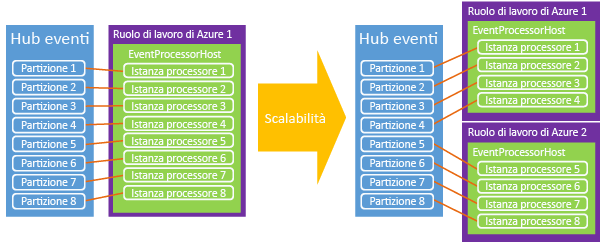

# <a name="event-hubs-programming-guide"></a>Guida alla programmazione di Hub eventi
Questo articolo prende in esame alcuni scenari comuni nella scrittura di codice tramite Hub eventi di Azure e Azure .NET SDK. Si presuppone una conoscenza preliminare di Hub eventi. Per una panoramica sui concetti relativi a Hub eventi, vedere [Panoramica di Hub eventi](event-hubs-what-is-event-hubs.md).

## <a name="event-publishers"></a>Publisher di eventi
Si inviano eventi a un hub eventi viene usando una connessione AMQP 1.0 o HTTP POST. La scelta del protocollo da usare dipende dallo scenario specifico. Le connessioni AMQP 1.0 sono misurate come connessioni negoziate nel bus di servizio e sono più appropriate in scenari in cui sono frequenti volumi di messaggi più elevati e con requisiti di latenza inferiori, perché offrono un canale di messaggistica persistente.

Si crea e si gestisce Hub eventi con la classe [NamespaceManager][] . Quando si usano le API gestite da .NET, i costrutti primari per la pubblicazione dei dati in Hub eventi sono le classi [EventHubClient](/dotnet/api/microsoft.servicebus.messaging.eventhubclient) e [EventData][]. [EventHubClient][] offre il canale di comunicazione AMQP tramite il quale gli eventi vengono inviati all'hub eventi. La classe [EventData][] rappresenta un evento e viene usata per pubblicare i messaggi in un Hub eventi. Questa classe include il corpo, alcuni metadati e informazioni di intestazione sull'evento. Altre proprietà vengono aggiunte all'oggetto [EventData][] quando passa attraverso un hub eventi.

## <a name="get-started"></a>Introduzione
Le classi .NET che supportano Hub eventi fanno parte dell'assembly Microsoft.ServiceBus.dll. Il modo più semplice per fare riferimento all'API del bus di servizio e configurare l'applicazione con tutte le dipendenze del bus di servizio consiste nello scaricare il [pacchetto NuGet del bus di servizio](https://www.nuget.org/packages/WindowsAzure.ServiceBus). In alternativa, è possibile usare [Console di gestione pacchetti](http://docs.nuget.org/docs/start-here/using-the-package-manager-console) in Visual Studio. A tale scopo, eseguire il comando seguente nella finestra della [Console di gestione pacchetti](http://docs.nuget.org/docs/start-here/using-the-package-manager-console) :

```
Install-Package WindowsAzure.ServiceBus
```

## <a name="create-an-event-hub"></a>Creare un hub eventi
È possibile utilizzare la classe [NamespaceManager][] per creare gli hub di eventi. ad esempio:

```csharp
var manager = new Microsoft.ServiceBus.NamespaceManager("mynamespace.servicebus.windows.net");
var description = manager.CreateEventHub("MyEventHub");
```

Nella maggior parte dei casi, è consigliabile usare i metodi [CreateEventHubIfNotExists][] per evitare di generare eccezioni se il servizio viene riavviato. ad esempio:

```csharp
var description = manager.CreateEventHubIfNotExists("MyEventHub");
```

Tutte le operazioni di creazione di Hub eventi, tra cui [CreateEventHubIfNotExists][], richiedono di **gestire** le autorizzazioni per lo spazio dei nomi in questione. Se si desidera limitare le autorizzazioni delle applicazioni publisher o consumer, è possibile evitare queste chiamate alle operazioni di creazione nel codice di produzione quando si usano credenziali con autorizzazioni limitate.

La classe [EventHubDescription](/dotnet/api/microsoft.servicebus.messaging.eventhubdescription) contiene informazioni dettagliate su un hub eventi, tra cui le regole di autorizzazione, l'intervallo di conservazione dei messaggi, l'ID di partizione, lo stato e il percorso. È possibile usare questa classe per aggiornare i metadati in un hub eventi.

## <a name="create-an-event-hubs-client"></a>Creare un client di Hub eventi
La classe primaria per l'interazione con Hub eventi è [Microsoft.ServiceBus.Messaging.EventHubClient][]. Questa classe fornisce funzionalità di mittente e destinatario. È possibile creare un'istanza di questa classe usando il metodo [Create](/dotnet/api/microsoft.servicebus.messaging.eventhubclient.create) , come illustrato nell'esempio seguente.

```csharp
var client = EventHubClient.Create(description.Path);
```

Questo metodo usa le informazioni di connessione del bus di servizio nella sezione `appSettings` del file App.config. Per un esempio dell'XML di `appSettings` usato per archiviare le informazioni di connessione del bus di servizio, vedere la documentazione per il metodo [Microsoft.ServiceBus.Messaging.EventHubClient.Create(System.String)](/dotnet/api/microsoft.servicebus.messaging.eventhubclient#Microsoft_ServiceBus_Messaging_EventHubClient_Create_System_String_) .

È anche possibile creare il client da una stringa di connessione. Questa opzione funziona bene quando si usano i ruoli di lavoro di Azure, poiché è possibile archiviare la stringa nelle proprietà di configurazione per il lavoro. ad esempio:

```csharp
EventHubClient.CreateFromConnectionString("your_connection_string");
```

La stringa di connessione avrà un formato uguale a quello presente nel file App.config per i metodi precedenti:

```
Endpoint=sb://[namespace].servicebus.windows.net/;SharedAccessKeyName=RootManageSharedAccessKey;SharedAccessKey=[key]
```

Infine è anche possibile creare un oggetto [EventHubClient][] da un'istanza di [MessagingFactory](/dotnet/api/microsoft.servicebus.messaging.messagingfactory), come illustrato nell'esempio seguente.

```csharp
var factory = MessagingFactory.CreateFromConnectionString("your_connection_string");
var client = factory.CreateEventHubClient("MyEventHub");
```

È importante notare che oggetti [EventHubClient][] aggiuntivi creati da un'istanza di factory di messaggistica riutilizzeranno la stessa connessione TCP sottostante. Di conseguenza, questi oggetti prevedono un limite sul lato client per la velocità effettiva. Il metodo [Create](/dotnet/api/microsoft.servicebus.messaging.eventhubclient#Microsoft_ServiceBus_Messaging_EventHubClient_Create_System_String_) riutilizza una singola factory di messaggistica. Se è necessario molto elevata velocità effettiva di un singolo mittente, è possibile creare più factory di messaggistica e un oggetto [EventHubClient][] factory di messaggistica.

## <a name="send-events-to-an-event-hub"></a>Inviare eventi a un Hub eventi
Gli eventi vengono inviati a un hub eventi tramite la creazione di un'istanza [EventData][] e l'invio di quest'ultima con il metodo [Send](/dotnet/api/microsoft.servicebus.messaging.eventhubclient#Microsoft_ServiceBus_Messaging_EventHubClient_Send_Microsoft_ServiceBus_Messaging_EventData_). Questo metodo accetta un singolo parametro dell'istanza di [EventData][] e lo invia in modo sincrono a un hub eventi.

## <a name="event-serialization"></a>Serializzazione degli eventi
La classe [EventData][] ha [quattro costruttori di overload](/dotnet/api/microsoft.servicebus.messaging.eventdata#constructors_) che accettano una serie di parametri, ad esempio un oggetto, un serializzatore, una matrice di byte o un flusso. È inoltre possibile creare un'istanza della classe [EventData][] e impostare il flusso del corpo in un secondo momento. Quando si usa JSON con [EventData][]è possibile usare **Encoding.UTF8.GetBytes()** per recuperare la matrice di byte per una stringa con codifica JSON.

## <a name="partition-key"></a>Chiave di partizione
La classe [EventData][] ha una proprietà [PartitionKey][] che consente al mittente di specificare un valore che viene eseguito con hash per produrre un'assegnazione di partizione. L'uso di una chiave di partizione assicura che tutti gli eventi con la stessa chiave vengano inviati alla stessa partizione nell'hub eventi. Le chiavi di partizione comuni includono ID sessione utente e ID mittente univoci. La proprietà [PartitionKey][] è facoltativa e può essere specificata quando si usa il metodo [Microsoft.ServiceBus.Messaging.EventHubClient.Send(Microsoft.ServiceBus.Messaging.EventData)](/dotnet/api/microsoft.servicebus.messaging.eventhubclient#Microsoft_ServiceBus_Messaging_EventHubClient_Send_Microsoft_ServiceBus_Messaging_EventData_)o [Microsoft.ServiceBus.Messaging.EventHubClient.SendAsync(Microsoft.ServiceBus.Messaging.EventData)](/dotnet/api/microsoft.servicebus.messaging.eventhubclient#Microsoft_ServiceBus_Messaging_EventHubClient_SendAsync_Microsoft_ServiceBus_Messaging_EventData_). Se non si specifica un valore per [PartitionKey][], gli eventi inviati vengono distribuiti alle partizioni tramite un modello round robin.

### <a name="availability-considerations"></a>Considerazioni sulla disponibilità

L'uso di una chiave di partizione è facoltativo. È consigliabile valutare attentamente se farne uso o meno. La chiave di partizione è un'ottima scelta se l'ordine degli eventi è importante. Quando si usa una chiave di partizione, queste partizioni richiedono la disponibilità in un singolo nodo. Nel tempo possono verificarsi interruzioni, ad esempio al riavvio dei nodi di calcolo e all'applicazione di patch. Di conseguenza, se si imposta un ID di partizione e per qualche motivo la partizione diventa non disponibile, il tentativo di accedere ai dati della partizione avrà esito negativo. Se è prioritaria la disponibilità elevata, non specificare alcuna chiave di partizione. In questo caso gli eventi verranno inviati alle partizioni con il modello round robin descritto in precedenza. In questo scenario viene esercitata una scelta esplicita tra disponibilità (nessun ID di partizione) e coerenza (aggiunta di eventi a un ID di partizione).

Va anche considerata la gestione dei ritardi nell'elaborazione degli eventi. In alcuni casi è preferibile eliminare i dati e riprovare anziché continuare a provare e mantenere attiva l'elaborazione, poiché ciò può sommare altro ritardo all'elaborazione downstream. Con i titoli azionari, ad esempio, è consigliabile attendere il completamento dell'aggiornamento dei dati, ma nel caso di una chat in tempo reale o in uno scenario VOIP è preferibile ottenere i dati rapidamente, anche se non sono completi.

Considerati gli aspetti relativi alla disponibilità, in questi scenari è possibile scegliere una tra le strategie di gestione degli errori seguenti:

- Arresto (arresto della lettura da Hub eventi fino alla risoluzione del problema)
- Eliminazione (i messaggi non sono importanti, eliminarli)
- Ripetizione (nuovo tentativo di invio dei messaggi quando possibile)
- [Mancato recapito dei messaggi](../service-bus-messaging/service-bus-dead-letter-queues.md) (usare una coda o un altro Hub eventi per evitare il recapito dei soli messaggi che non è possibile elaborare)

## <a name="batch-event-send-operations"></a>Operazioni di invio di eventi in batch
L'invio di eventi in batch può aumentare la velocità effettiva. Il metodo [SendBatch](/dotnet/api/microsoft.servicebus.messaging.eventhubclient#Microsoft_ServiceBus_Messaging_EventHubClient_SendBatch_System_Collections_Generic_IEnumerable_Microsoft_ServiceBus_Messaging_EventData__) accetta un parametro **IEnumerable** di tipo [EventData][] e invia l'intero batch come operazione atomica all'hub eventi.

```csharp
public void SendBatch(IEnumerable<EventData> eventDataList);
```

Si noti che un singolo batch non deve superare il limite di 256 KB di un evento. Inoltre, ogni messaggio nel batch usa la stessa identità del publisher. È responsabilità del mittente verificare che il batch non superi la dimensione massima dell'evento. In questo caso, viene generato un errore di **invio** del client.

## <a name="send-asynchronously-and-send-at-scale"></a>Inviare in modo asincrono e inviare a livello di scalabilità
È anche possibile inviare eventi a un hub eventi in modo asincrono. L'invio asincrono può consentire di aumentare la velocità con cui un client può inviare gli eventi. Entrambi i metodi [Send](/dotnet/api/microsoft.servicebus.messaging.eventhubclient#Microsoft_ServiceBus_Messaging_EventHubClient_Send_Microsoft_ServiceBus_Messaging_EventData_) e [SendBatch](/dotnet/api/microsoft.servicebus.messaging.eventhubclient#Microsoft_ServiceBus_Messaging_EventHubClient_SendBatch_System_Collections_Generic_IEnumerable_Microsoft_ServiceBus_Messaging_EventData__) sono disponibili nelle versioni asincrone che restituiscono un oggetto [Task](https://msdn.microsoft.com/library/system.threading.tasks.task.aspx). Sebbene questa tecnica possa consentire di aumentare la velocità effettiva, può anche provocare l'invio continuo di eventi da parte del client anche in presenza di limitazioni imposte dal servizio Hub eventi e ciò può comportare errori del client o perdita di messaggi, se l'implementazione non avviene correttamente. Inoltre, è possibile usare la proprietà [RetryPolicy](/dotnet/api/microsoft.servicebus.messaging.cliententity#Microsoft_ServiceBus_Messaging_ClientEntity_RetryPolicy) nel client per controllare le opzioni di ripetizione dei tentativi nel client.

## <a name="create-a-partition-sender"></a>Creare un mittente di partizione
Sebbene sia più comune inviare eventi a un hub eventi senza una chiave di partizione, in alcuni casi è possibile inviare gli eventi direttamente a una partizione specifica. ad esempio:

```csharp
var partitionedSender = client.CreatePartitionedSender(description.PartitionIds[0]);
```

[CreatePartitionedSender](/dotnet/api/microsoft.servicebus.messaging.eventhubclient#Microsoft_ServiceBus_Messaging_EventHubClient_CreatePartitionedSender_System_String_) restituisce un oggetto [EventHubSender](/dotnet/api/microsoft.servicebus.messaging.eventhubsender) che è possibile usare per pubblicare eventi in una partizione specifica dell'hub eventi.

## <a name="event-consumers"></a>Consumer di eventi
Hub eventi dispone di due modelli principali per l'utilizzo di eventi: ricevitori diretti e astrazioni di livello superiore, ad esempio [EventProcessorHost][]. I ricevitori diretti sono responsabili del coordinamento del proprio accesso alle partizioni in un gruppo di consumer.

### <a name="direct-consumer"></a>Consumer diretto
Il modo più diretto per leggere da una partizione all'interno di un gruppo di consumer consiste nell'uso della classe [EventHubReceiver](/dotnet/apie/microsoft.servicebus.messaging.eventhubreceiver) . Per creare un'istanza di questa classe, è necessario usare un'istanza della classe [EventHubConsumerGroup](/dotnet/api/microsoft.servicebus.messaging.eventhubconsumergroup) . Nell'esempio seguente, è necessario specificare l'ID di partizione quando si crea il ricevitore per il gruppo di consumer.

```csharp
EventHubConsumerGroup group = client.GetDefaultConsumerGroup();
var receiver = group.CreateReceiver(client.GetRuntimeInformation().PartitionIds[0]);
```

Il metodo [CreateReceiver](/dotnet/api/microsoft.servicebus.messaging.eventhubconsumergroup#methods_summary) dispone di diversi overload che facilitano il controllo sul lettore creato. Questi metodi includono la specifica di un offset sotto forma di stringa o timestamp e la possibilità di specificare se includere questo offset nel flusso restituito o iniziare dopo di esso. Dopo aver creato il ricevitore, è possibile iniziare a ricevere gli eventi nell'oggetto restituito. Il metodo [Receive](/dotnet/api/microsoft.servicebus.messaging.eventhubreceiver#methods_summary) dispone di quattro overload che controllano i parametri dell'operazione receive, ad esempio le dimensioni di batch e il tempo di attesa. È possibile usare le versioni asincrone di questi metodi per aumentare la velocità effettiva di un consumer. ad esempio:

```csharp
bool receive = true;
string myOffset;
while(receive)
{
    var message = receiver.Receive();
    myOffset = message.Offset;
    string body = Encoding.UTF8.GetString(message.GetBytes());
    Console.WriteLine(String.Format("Received message offset: {0} \nbody: {1}", myOffset, body));
}
```

Per una partizione specifica, i messaggi vengono ricevuti nell'ordine in cui sono stati inviati all'hub eventi. L'offset è un token di stringa usato per identificare un messaggio in una partizione.

Si noti che una singola partizione all'interno di un gruppo di consumer non può avere più di cinque lettori concorrenti connessi in un determinato momento. Quando i reader si connettono o si disconnettono, le relative sessioni potrebbero rimanere attive per alcuni minuti prima che il servizio riconosca che si sono disconnessi. In questo intervallo, la riconnessione a una partizione potrebbe non riuscire. Per un esempio completo di scrittura di un ricevitore diretto per Hub eventi, vedere l'esempio relativo ai [ricevitori diretti per gli hub eventi](https://code.msdn.microsoft.com/Event-Hub-Direct-Receivers-13fa95c6) .

### <a name="event-processor-host"></a>Host processore di eventi
La classe [EventProcessorHost][] elabora i dati da Hub eventi. È consigliabile usare questa implementazione durante la creazione di reader di eventi sulla piattaforma .NET. [EventProcessorHost][] fornisce un ambiente di runtime thread-safe, multiprocesso e sicuro per le implementazioni del processore di eventi che fornisce inoltre la gestione di lease di Checkpoint e la partizione.

Per usare la classe [EventProcessorHost][], è possibile implementare [IEventProcessor](/dotnet/api/microsoft.servicebus.messaging.ieventprocessor). Questa interfaccia contiene tre metodi:

* [OpenAsync](/dotnet/api/microsoft.servicebus.messaging.ieventprocessor#Microsoft_ServiceBus_Messaging_IEventProcessor_OpenAsync_Microsoft_ServiceBus_Messaging_PartitionContext_)
* [CloseAsync](/dotnet/api/microsoft.servicebus.messaging.ieventprocessor#Microsoft_ServiceBus_Messaging_IEventProcessor_CloseAsync_Microsoft_ServiceBus_Messaging_PartitionContext_Microsoft_ServiceBus_Messaging_CloseReason_)
* [ProcessEventsAsync](/dotnet/api/microsoft.servicebus.messaging.ieventprocessor#Microsoft_ServiceBus_Messaging_IEventProcessor_ProcessEventsAsync_Microsoft_ServiceBus_Messaging_PartitionContext_System_Collections_Generic_IEnumerable_Microsoft_ServiceBus_Messaging_EventData__)

Per avviare l'elaborazione di eventi, creare un'istanza [EventProcessorHost][]fornendo i parametri appropriati per l'Hub eventi. Chiamare quindi [RegisterEventProcessorAsync](/dotnet/api/microsoft.servicebus.messaging.eventprocessorhost#Microsoft_ServiceBus_Messaging_EventProcessorHost_RegisterEventProcessorAsync__1) per registrare l'implementazione di [IEventProcessor](/dotnet/api/microsoft.servicebus.messaging.ieventprocessor) con il runtime. A questo punto, l'host tenta di acquisire un lease per ogni partizione nell'hub eventi mediante un algoritmo "greedy". Tali lease dureranno per un determinato intervallo di tempo e quindi devono essere rinnovati. Appena nuovi nodi, in questo caso istanze di lavoro, passano online, inviano prenotazioni di lease e nel tempo il carico passa tra i nodi man mano che ognuno tenta di acquisire più lease.



Con il passare del tempo, viene stabilito un equilibrio. Questa funzionalità dinamica consente il ridimensionamento automatico basato su CPU da applicare ai consumer per la scalabilità verticale e orizzontale. Poiché gli hub eventi non hanno una conoscenza diretta del numero di messaggi, l'utilizzo medio della CPU è spesso il meccanismo migliore per misurare la scala back-end o di consumer. Se i publisher iniziano a pubblicare più eventi di quelli che i consumer possono elaborare, l'aumento della CPU nei consumer può essere usato per applicare la scalabilità automatica sul numero di istanze di lavoro.

La classe [EventProcessorHost][] implementa inoltre un meccanismo di impostazione di checkpoint basato sull'archiviazione di Azure. Questo meccanismo archivia l'offset per ogni partizione, in modo che ogni consumer possa determinare qual è stato l'ultimo checkpoint per il consumer precedente. Man mano che le partizioni passano tra i nodi tramite lease, questo è il meccanismo di sincronizzazione che semplifica lo spostamento del carico.

## <a name="publisher-revocation"></a>Revoca di publisher
Oltre alle funzionalità di runtime avanzate di [EventProcessorHost][], Hub eventi consente anche di revocare i publisher per impedire a publisher specifici di inviare eventi a un Hub eventi. Queste funzionalità sono particolarmente utili in situazioni in cui il token di un autore è stato compromesso o un aggiornamento software sta causando un comportamento non appropriato. In queste situazioni, l'identità dell'autore, che fa parte del relativo token di firma di accesso condiviso, può essere bloccata impedendo la pubblicazione di eventi.

Per altre informazioni sulla revoca di publisher e su come eseguire l'invio a Hub eventi come publisher, vedere l'esempio relativo alla [pubblicazione sicura su larga scala in Hub eventi](https://code.msdn.microsoft.com/Service-Bus-Event-Hub-99ce67ab).

## <a name="next-steps"></a>Passaggi successivi
Per altre informazioni sugli scenari di Hub eventi, visitare i collegamenti seguenti:

* [Panoramica dell'API di Hub eventi](event-hubs-api-overview.md)
* [Che cos'è Hub eventi?](event-hubs-what-is-event-hubs.md)
* [Riferimento all'API dell'host processore di eventi](/dotnet/api/microsoft.servicebus.messaging.eventprocessorhost)

[NamespaceManager]: /dotnet/api/microsoft.servicebus.namespacemanager
[EventHubClient]: /dotnet/api/microsoft.servicebus.messaging.eventhubclient
[EventData]: /dotnet/api/microsoft.servicebus.messaging.eventdata
[CreateEventHubIfNotExists]: /dotnet/api/microsoft.servicebus.namespacemanager.createeventhubifnotexists
[PartitionKey]: /dotnet/api/microsoft.servicebus.messaging.eventdata#Microsoft_ServiceBus_Messaging_EventData_PartitionKey
[EventProcessorHost]: /dotnet/api/microsoft.servicebus.messaging.eventprocessorhost

