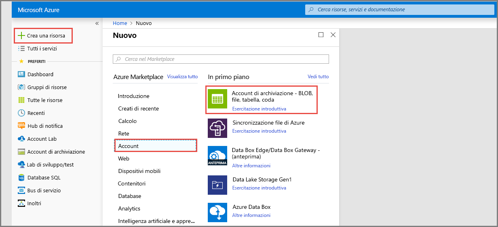
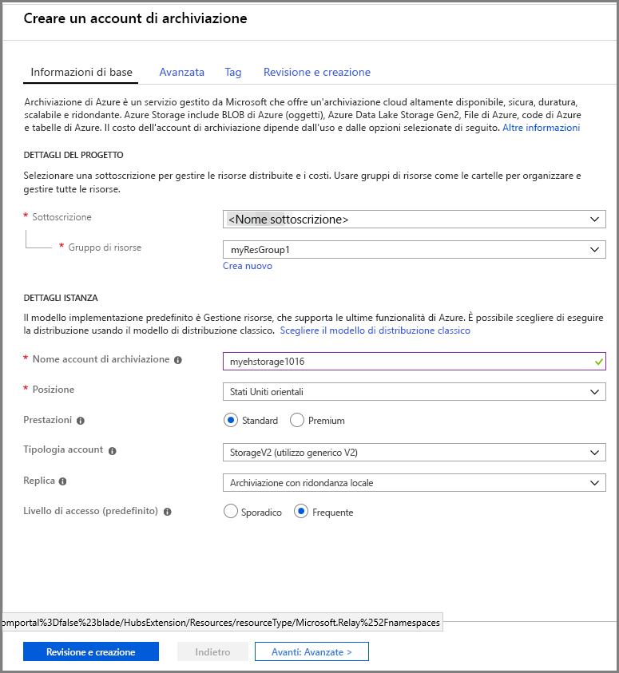

# Guida introduttiva: elaborare flussi di eventi con il portale di Azure e .NET

Hub eventi di Azure è una piattaforma di streaming di dati e un servizio di inserimento degli eventi estremamente scalabile, che consente di ricevere ed elaborare milioni di eventi al secondo. Questa guida introduttiva illustra come creare un hub eventi usando il [portale di Azure](https://portal.azure.com) e inviare e ricevere da un hub eventi usando .NET Standard SDK.

Per completare questa guida introduttiva è necessaria una sottoscrizione di Azure. Se non se ne ha una, [creare un account gratuito][] prima di iniziare.

## Prerequisiti

Per completare questa guida introduttiva, accertarsi di disporre di quanto segue:

- [Visual Studio 2017 Update 3 (versione 15.3, 26730.01)](http://www.visualstudio.com/vs) o versioni successive.
- [NET Standard SDK](https://www.microsoft.com/net/download/windows) versione 2.0 o successiva.

## Creare un gruppo di risorse

Un gruppo di risorse è una raccolta logica per le risorse di Azure. Tutte le risorse vengono distribuite e gestite in un gruppo di risorse. Per creare un gruppo di risorse, seguire questa procedura:

1. Nel riquadro di spostamento a sinistra fare clic su **Gruppi di risorse**. Fare quindi clic su **Aggiungi**.

   ![][1]

2. Digitare un nome univoco per il gruppo di risorse. Il sistema verifica immediatamente se il nome è disponibile nella sottoscrizione di Azure attualmente selezionata.

3. In **Sottoscrizione** fare clic sul nome della sottoscrizione di Azure in cui si vuole creare il gruppo di risorse.

4. Selezionare un'area geografica per il gruppo di risorse.

5. Fare clic su **Crea**.

   ![][2]

## Creare uno spazio dei nomi di Hub eventi

Uno spazio dei nomi di Hub eventi specifica un contenitore di ambito univoco, a cui fa riferimento il nome di dominio completo, in cui si crea uno o più hub eventi. Per creare uno spazio dei nomi nel gruppo di risorse, seguire questa procedura:

1. Accedere al [portale di Azure][] e fare clic su **Crea una risorsa** nella parte superiore sinistra della schermata.

2. Fare clic su **Internet delle cose** e quindi su **Hub eventi**.

3. Nel pannello **Crea spazio dei nomi** immettere un nome per lo spazio dei nomi. Verrà effettuato immediatamente un controllo sulla disponibilità del nome.

   

4. Dopo aver verificato che il nome dello spazio dei nomi sia disponibile, scegliere il piano tariffario (Basic o Standard). Scegliere anche una sottoscrizione, un gruppo di risorse e una località di Azure in cui creare la risorsa.
 
5. Fare clic su **Crea** per creare lo spazio dei nomi. Per il provisioning completo delle risorse da parte del sistema, potrebbero essere necessari alcuni minuti.

6. Nell'elenco di spazi dei nomi del portale fare clic sullo spazio dei nomi appena creato.

7. Fare clic su **Criteri di accesso condivisi** e quindi su **RootManageSharedAccessKey**.
    
8. Fare clic sul pulsante di copia per copiare la stringa di connessione **RootManageSharedAccessKey** negli Appunti. Salvare la stringa di connessione in una posizione temporanea, ad esempio il Blocco note, per usarla in seguito.
    
## Creare un hub eventi

Per creare un hub eventi nello spazio dei nomi, eseguire le operazioni seguenti:

1. Nell'elenco di spazi dei nomi di Hub eventi fare clic sullo spazio dei nomi appena creato.      
   
     

2. Nella finestra dello spazio dei nomi fare clic su **Hub eventi**.
   
    

1. Nella parte superiore della finestra fare clic su **+ Aggiungi hub eventi**.
   
    
1. Digitare un nome per l'hub eventi e quindi fare clic su **Crea**.
   
    

Congratulazioni. È stato usato il portale per creare uno spazio dei nomi di Hub eventi e un hub eventi nello spazio dei nomi.

## Creare un account di archiviazione per l'host del processore di eventi

L'host del processore di eventi è un agente intelligente che semplifica la ricezione di eventi da Hub eventi gestendo checkpoint persistenti e ricezioni parallele. Per eseguire il checkpoint, l'host del processore di eventi richiede un account di archiviazione. Nell'esempio seguente viene illustrato come creare un account di archiviazione e come ottenere le relative chiavi di accesso:

1. Accedere al [portale di Azure][portale di Azure] e fare clic su **Nuovo** nella parte superiore sinistra della schermata.

2. Fare clic su **Archiviazione** e quindi su **Account di archiviazione**.
   
    

3. In **Crea account di archiviazione** digitare un nome per l'account di archiviazione. Scegliere una sottoscrizione, un gruppo di risorse e una località di Azure in cui creare la risorsa. Fare quindi clic su **Crea**.
   
    

4. Nell'elenco degli account di archiviazione fare clic su quello appena creato.

5. Nella finestra dell'account di archiviazione fare clic su **Chiavi di accesso**. Copiare il valore di **key1** da usare più avanti.
   
    

## Scaricare ed eseguire esempi

Il passaggio successivo consiste nell'esecuzione di codice di esempio che invia eventi a un hub eventi e li riceve usando l'host del processore di eventi. 

Prima di tutto, scaricare gli esempi [SampleSender](https://github.com/Azure/azure-event-hubs/tree/master/samples/DotNet/Microsoft.Azure.EventHubs/SampleSender) e [SampleEphReceiver](https://github.com/Azure/azure-event-hubs/tree/master/samples/DotNet/Microsoft.Azure.EventHubs/SampleEphReceiver) da GitHub o clonare il [repository azure-event-hubs](https://github.com/Azure/azure-event-hubs).

### Mittente

1. Aprire Visual Studio, nel menu **File** fare clic su **Apri** e quindi su **Progetto/Soluzione**.

2. Individuare la cartella dell'esempio **SampleSender** scaricato in precedenza e fare doppio clic sul file SampleSender.sln per caricare il progetto in Visual Studio.

3. In Esplora soluzioni fare doppio clic sul file Program.cs per aprirlo nell'editor di Visual Studio.

4. Sostituire il valore `EventHubConnectionString` con la stringa di connessione ottenuta durante la creazione dello spazio dei nomi.

5. Sostituire `EventHubName` con il nome dell'hub eventi creato nello spazio dei nomi.

6. Dal menu **Compila** fare clic su **Compila soluzione** per assicurarsi che non vi siano errori.

### Ricevitore

1. Aprire Visual Studio, nel menu **File** fare clic su **Apri** e quindi su **Progetto/Soluzione**.

2. Individuare la cartella dell'esempio **SampleEphReceiver** scaricato nel passaggio 1 e fare doppio clic sul file SampleEphReceiver.sln per caricare il progetto in Visual Studio.

3. In Esplora soluzioni fare doppio clic sul file Program.cs per aprirlo nell'editor di Visual Studio.

4. Sostituire i valori delle variabili seguenti:
    1. `EventHubConnectionString`: sostituire questo elemento con la stringa di connessione ottenuta durante la creazione dello spazio dei nomi.
    2. `EventHubName`: sostituire questo elemento con il nome dell'hub eventi creato nello spazio dei nomi.
    3. `StorageContainerName`: sostituire questo elemento con il nome del contenitore di archiviazione. Assegnare un nome univoco e il contenitore viene creato automaticamente quando si esegue l'app.
    4. `StorageAccountName`: sostituire questo elemento con l'account di archiviazione creato.
    5. `StorageAccountKey`: sostituire questo elemento con la chiave dell'account di archiviazione ottenuta dal portale di Azure.

5. Dal menu **Compila** fare clic su **Compila soluzione** per assicurarsi che non vi siano errori.

### Eseguire le app

Per prima cosa, eseguire l'applicazione **SampleSender** e osservare i 100 messaggi inviati. Premere **INVIO** per terminare il programma.

![][3]

Eseguire l'app **SampleEphReceiver** e osservare i messaggi ricevuti nell'host del processore di eventi.

![][4]
 
## Pulire le risorse

È possibile usare il portale per rimuovere l'account di archiviazione, lo spazio dei nomi e l'hub eventi. 

1. Dal portale di Azure fare clic su **Tutte le risorse** nel riquadro a sinistra. 
2. Fare clic sull'account di archiviazione o sullo spazio dei nomi che si vuole eliminare. L'eliminazione dello spazio dei nomi rimuove anche tutti gli hub eventi in esso contenuti.
3. Nella barra dei menu nella parte superiore della schermata fare clic su **Elimina**. Confermare l'eliminazione. 

## Passaggi successivi

In questo articolo sono stati creati lo spazio dei nomi di Hub eventi e altre risorse necessarie per inviare e ricevere eventi dall'hub eventi. Per altre informazioni, passare all'esercitazione successiva:

> [!div class="nextstepaction"]
> [Visualizzare anomalie dei dati nei flussi di dati di Hub eventi](event-hubs-tutorial-visualize-anomalies.md)

[Creare un account gratuito]: https://azure.microsoft.com/free/?ref=microsoft.com&utm_source=microsoft.com&utm_medium=docs&utm_campaign=visualstudio
[portale di Azure]: https://portal.azure.com/
[1]: ./media/event-hubs-quickstart-portal/resource-groups1.png
[2]: ./media/event-hubs-quickstart-portal/resource-groups2.png
[3]: ./media/event-hubs-quickstart-portal/sender1.png
[4]: ./media/event-hubs-quickstart-portal/receiver1.png
