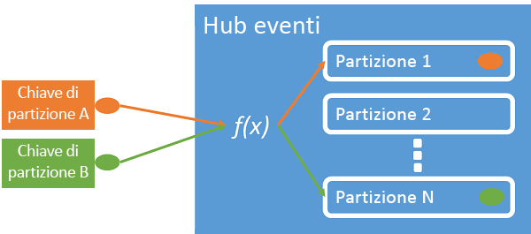
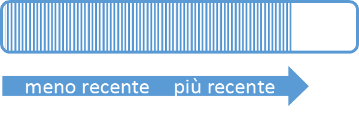
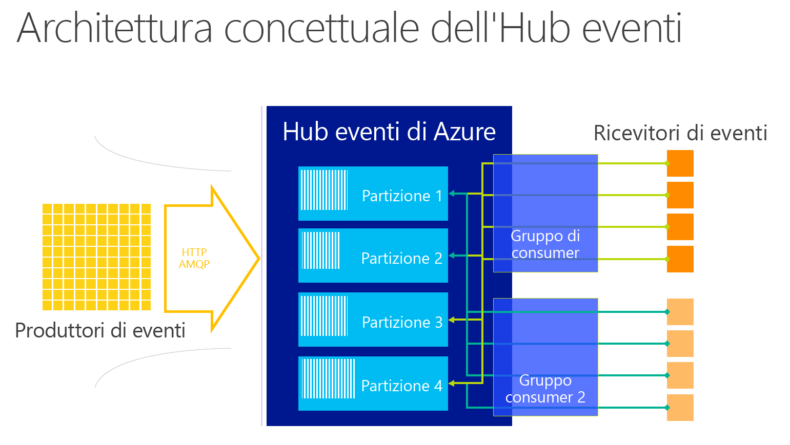

# <a name="what-is-azure-event-hubs"></a>Che cos'è l'hub di eventi di Azure?
Hub eventi è una piattaforma di streaming di dati a scalabilità elevata, che consente di inserire milioni di eventi al secondo. I dati inviati a un Hub eventi possono essere trasformati e archiviati usando qualsiasi provider di analisi in tempo reale o adattatori di invio in batch/archiviazione. Con la possibilità di fornire funzionalità di pubblicazione-sottoscrizione con una latenza bassa e su larga scala, Hub eventi funge da "rampa di ingresso" per Big Data.

## <a name="why-use-event-hubs"></a>Vantaggi dell'uso di Hub eventi
Gli eventi e le funzionalità di gestione della telemetria di Hub eventi sono particolarmente utili per:

* Strumentazione dell'applicazione
* Esperienza dell'utente o l'elaborazione del flusso di lavoro
* Scenari Internet of Things (IoT)

Hub eventi consente anche il rilevamento del comportamento nelle app per dispositivi mobili, il traffico di informazioni da Web farm, l'acquisizione di eventi nei giochi per console e la raccolta di dati di telemetria da computer industriali o veicoli connessi.

## <a name="azure-event-hubs-overview"></a>Panoramica di Hub eventi di Azure
Il ruolo comune svolto da Hub eventi nelle architetture delle soluzioni è la sua funzione di "porta principale" per una pipeline di eventi, spesso denominata *ingestor evento*. Un ingestor evento è un componente o servizio che si trova tra gli autori e i consumer di eventi per separare la produzione di un flusso di eventi dal consumo di tali eventi.


Hub eventi di Azure è un servizio di elaborazione eventi che consente l'inserimento di eventi e telemetria su scala cloud, con bassa latenza e affidabilità elevata. Hub eventi fornisce funzionalità di gestione del flusso di messaggi e presenta caratteristiche molto diverse dai servizi di messaggistica aziendale tradizionale. Le funzionalità di Hub eventi sono basate su scenari con velocità effettiva elevata ed elaborazione di eventi. Di conseguenza, Hub eventi non implementa alcune delle funzionalità di messaggistica disponibili per le entità di messaggistica, ad esempio gli argomenti.

Un Hub eventi viene creato a livello di spazio dei nomi e usa AMQP e HTTP come interfacce API primarie.

## <a name="event-publishers"></a>Publisher di eventi
Qualsiasi entità che invia dati a un Hub di eventi è un *autore di eventi*. Gli autori di eventi possono pubblicare eventi usando HTTPS o AMQP 1.0. Gli autori di eventi usano un token di firma di accesso condiviso (SAS) per identificarsi con un Hub eventi e possono avere un'identità univoca oppure usare un token SAS comune.

### <a name="publishing-an-event"></a>Pubblicazione di un evento
È possibile pubblicare un evento tramite AMQP 1.0 o HTTPS. Bus di servizio fornisce una classe [EventHubClient](https://docs.microsoft.com/dotnet/api/microsoft.servicebus.messaging.eventhubclient) per la pubblicazione di eventi a un Hub eventi dai client .NET. Per altre piattaforme e runtime, è possibile utilizzare qualsiasi client AMQP 1.0, ad esempio [Apache Qpid](http://qpid.apache.org/). È possibile pubblicare eventi singolarmente o in batch. Una singola pubblicazione (istanza dei dati dell'evento) ha un limite di 256 KB, indipendentemente dal fatto che si tratti di un singolo evento o di un batch. La pubblicazione di eventi di dimensioni maggiori determina un errore. È consigliabile che gli autori non conoscano le partizioni presenti nell'Hub eventi e specifichino solo una *chiave di partizione* (introdotta nella sezione successiva) o la propria identità tramite i token SAS.

La scelta di utilizzare AMQP o HTTPS dipende dallo scenario di utilizzo. AMQP richiede di stabilire un socket bidirezionale persistente oltre alla sicurezza a livello di trasporto (TLS) o SSL/TLS. AMQP comporta costi di rete superiori in fase di inizializzazione della sessione, ma HTTPS richiede un costo generale SSL aggiuntivo per ogni richiesta. AMQP offre prestazioni più elevate per i server di pubblicazione più attivi.



Hub eventi garantisce che tutti gli eventi che condividono lo stesso valore di chiave di partizione vengano recapitati in ordine e alla stessa partizione. Se si usano chiavi di partizione con i criteri di autore, l'identità dell’autore e il valore della chiave di partizione devono corrispondere. In caso contrario, si verifica un errore.

### <a name="publisher-policy"></a>Criteri di autore
Hub eventi consente un controllo granulare degli autori di eventi tramite *criteri di autore*. I criteri di autore sono funzionalità di runtime progettate per consentire un numero elevato di autori di eventi indipendenti. Con i criteri di autore, ogni autore utilizza un proprio identificatore univoco durante la pubblicazione di eventi in un Hub eventi mediante il meccanismo seguente:

```
//[my namespace].servicebus.windows.net/[event hub name]/publishers/[my publisher name]
```

Non è necessario creare nomi di autore prima di procedere, ma devono corrispondere al token SAS utilizzato quando si pubblica un evento, al fine di garantire le identità di autore indipendenti. Quando si utilizzano criteri di autore, il valore **PartitionKey** è impostato sul nome dell’autore. Per il corretto funzionamento, questi valori devono corrispondere.

## <a name="partitions"></a>Partitions
Hub eventi fornisce lo streaming di messaggi tramite un modello consumer partizionato in cui ogni consumer legge solo un sottoinsieme specifico, o partizione, del flusso di messaggi. Questo modello consente la scalabilità orizzontale per l'elaborazione di eventi e fornisce altre funzionalità incentrate sul flusso non disponibili in code e argomenti.

Una partizione è una sequenza ordinata di eventi contenuta in un Hub eventi. Man mano che arrivano, i nuovi eventi vengono aggiunti alla fine di questa sequenza. Una partizione può essere considerata come "registro commit".



Gli Hub eventi conservano i dati per un periodo di conservazione configurato che viene applicato a tutte le partizioni in Hub eventi. Gli eventi scadono su base temporale; non è possibile eliminarli in modo esplicito. Poiché le partizioni sono indipendenti e contengono una sequenza specifica di dati, presentano spesso velocità di crescita diverse.


Il numero di partizioni viene specificato in fase di creazione e deve essere compreso tra 2 e 32. Il numero di partizioni non può essere modificato. È quindi consigliabile valutare le dimensioni a lungo termine in fase di impostazione del numero di partizioni. Le partizioni sono un meccanismo di organizzazione dei dati correlato al parallelismo downstream necessario per utilizzare le applicazioni. Il numero di partizioni in un Hub eventi è direttamente correlato al numero di lettori simultanei previsti. Per impostare un numero di partizioni superiore a 32, contattare il team di Hub eventi.

Anche se le partizioni sono identificabili e consentono l'invio diretto, questa operazione non è consigliata. È invece possibile usare i costrutti più generici introdotti nelle sezioni [Autore di eventi](#event-publishers) e [Capacità](#capacity).

Nelle partizioni viene inserita una sequenza di dati evento, che include il corpo dell'evento, un contenitore delle proprietà definito dall'utente e metadati quali il rispettivo offset nella partizione e il rispettivo numero nella sequenza di flusso.

### <a name="partition-key"></a>Chiave di partizione
È possibile usare una chiave di partizione per mappare i dati dell'evento in ingresso in partizioni specifiche ai fini dell'organizzazione dei dati. La chiave di partizione è un valore fornito dal mittente passato a un Hub eventi. Viene elaborato tramite una funzione di hashing statica, che crea l'assegnazione di partizione. Se non si specifica una chiave di partizione quando si pubblica un evento, viene usata un'assegnazione round robin.

L'autore di eventi è a conoscenza solo della chiave di partizione, non la partizione in cui gli eventi vengono pubblicati. Questa separazione tra chiave e partizione evita che il mittente debba conoscere troppe informazioni sull'elaborazione downstream. Un’identità univoca per dispositivo o utente crea una chiave di partizione efficace, ma è possibile utilizzare anche altri attributi, ad esempio l’area geografica, per raggruppare gli eventi correlati in un'unica partizione.

## <a name="sas-tokens"></a>Token di firma di accesso condiviso
Hub eventi usa le *firme di accesso condiviso*, disponibili a livello di spazio dei nomi e di Hub eventi. Un token SAS viene generato da una chiave SAS ed è un hash SHA di un URL, codificato in un formato specifico. Usando il nome della chiave (criterio) e il token, Hub eventi può rigenerare l'hash e quindi autenticare il mittente. In genere, i token SAS per gli autori di eventi vengono creati con soli privilegi di **invio** su un Hub eventi specifico. Questo meccanismo di URL token SAS costituisce la base per l'identificazione dell’autore introdotta nei criteri di autore. Per altre informazioni sull'uso di SAS, vedere [Autenticazione della firma di accesso condiviso con il bus di servizio](../service-bus-messaging/service-bus-shared-access-signature-authentication.md).

## <a name="event-consumers"></a>Consumer di eventi
Qualsiasi entità che legge i dati dell'evento da un Hub eventi è un *consumer di eventi*. Tutti i consumer di Hub eventi si connettono tramite la sessione AMQP 1.0 e gli eventi vengono recapitati tramite la sessione appena disponibili. Il client non deve eseguire il polling per la disponibilità dei dati.

### <a name="consumer-groups"></a>Gruppi di utenti
Il meccanismo di pubblicazione/sottoscrizione degli Hub eventi è abilitato tramite i *gruppi di consumer*. Un gruppo di consumer è una vista (stato, posizione o offset) di un intero Hub eventi. I gruppi di consumer consentono a più applicazioni costose di avere una visualizzazione separata del flusso di eventi e di leggere il flusso in modo indipendente in base alle proprie esigenze e con i propri gli offset.

In un’architettura di elaborazione flusso, ogni applicazione a valle equivale a un gruppo di consumer. Se si desidera scrivere i dati dell’evento nell’archiviazione a lungo termine, tale applicazione writer di archiviazione è un gruppo di consumer. L'elaborazione di eventi complessi può essere quindi eseguita da un altro gruppo di consumer separato. È possibile accedere alla partizioni solo tramite un gruppo di consumer. Ogni partizione può avere solo un lettore attivo alla volta **da un gruppo di consumer specifico**. In un Hub eventi è sempre presente un gruppo di consumer predefinito ed è possibile creare fino a 20 gruppi di consumer per un Hub eventi di livello Standard.

Di seguito sono riportati esempi della convenzione dell'URI del gruppo di consumer:

```
//[my namespace].servicebus.windows.net/[event hub name]/[Consumer Group #1]
//[my namespace].servicebus.windows.net/[event hub name]/[Consumer Group #2]
```



### <a name="stream-offsets"></a>Offset di flusso
Un *offset* è la posizione di un evento all'interno di una partizione. Un offset può essere considerato come un cursore sul lato client. L'offset è la numerazione di byte dell'evento. In questo modo un consumer di eventi (lettore) può specificare un punto nel flusso di eventi da cui si desidera iniziare la lettura degli eventi. È possibile specificare l'offset come un timestamp o un valore di offset. I consumer sono responsabili di archiviare i propri valori di offset all'esterno del servizio Hub eventi. All'interno di una partizione, ogni evento include un offset.


### <a name="checkpointing"></a>Checkpoint
*Checkpoint* è un processo mediante il quale i lettori contrassegnano o eseguono il commit della propria posizione all'interno di una sequenza di eventi di partizione. Il checkpoint è responsabilità del consumer e si verifica per partizione all'interno di un gruppo di consumer. Ciò significa che per ogni gruppo di consumer, ogni lettore partizione deve tenere traccia della posizione corrente nel flusso di eventi e può informare il servizio quando considera completo il flusso di dati.

Se un lettore si disconnette da una partizione, quando riconnette inizia a leggere in corrispondenza del checkpoint inviato in precedenza dall’ulitimo lettore di tale partizione in tale gruppo di consumer. Quando il lettore si connette, passa l'offset all'Hub eventi per specificare la posizione da cui iniziare la lettura. In questo modo è possibile utilizzare la funzionalità di checkpoint sia per contrassegnare gli eventi come "completi" dalle applicazioni a valle sia per fornire la resilienza in caso di failover tra i lettori in esecuzione in computer diversi. È possibile tornare a dati precedenti specificando un offset inferiore da questo processo di checkpoint. Tramite questo meccanismo il checkpoint consente sia la resilienza del failover che la riproduzione del flusso di eventi.

### <a name="common-consumer-tasks"></a>Attività comuni del consumer
Tutti i consumer di Hub eventi si connettono tramite una sessione AMQP 1.0 e un canale di comunicazione bidirezionale in grado di riconoscere lo stato. Ogni partizione ha una sessione AMQP 1.0 che facilita il trasporto di eventi separati dalla partizione.

#### <a name="connect-to-a-partition"></a>Connettersi a una partizione
Quando ci si connette direttamente a partizioni, viene in genere usato un meccanismo di leasing per coordinare le connessioni di lettura per partizioni specifiche. In questo modo è possibile per ogni partizione in un gruppo di consumer avere un solo lettore attivo. Il checkpoint, il leasing e la gestione dei lettori viene vengono semplificati tramite la classe [EventProcessorHost](https://docs.microsoft.com/dotnet/api/microsoft.servicebus.messaging.eventprocessorhost) per i client .NET. [EventProcessorHost](https://docs.microsoft.com/dotnet/api/microsoft.servicebus.messaging.eventprocessorhost) è un agente consumer intelligente.

#### <a name="read-events"></a>Leggere gli eventi
Dopo l'apertura di una sessione AMQP 1.0 e del collegamento per una partizione specifica, gli eventi vengono recapitati al client AMQP 1.0 dal servizio Hub eventi. Questo meccanismo di recapito permette una velocità effettiva più elevata e una latenza più bassa rispetto ai meccanismi basati su pull, ad esempio HTTP GET. Quando gli eventi vengono inviati al client, ogni istanza dei dati dell'evento contiene metadati importanti, ad esempio l’offset e il numero di sequenza utilizzati per facilitare il checkpoint sulla in sequenza di eventi.

Dati evento:
* Offset
* Numero di sequenza
* Corpo
* Proprietà utente
* Proprietà di sistema

L'utente è responsabile della gestione dell'offset.

## <a name="capacity"></a>Capacità
Hub eventi è un'architettura parallela a scalabilità elevata ed è necessario valutare alcuni fattori chiave durante il ridimensionamento.

### <a name="throughput-units"></a>Unità elaborate
La capacità di velocità effettiva di Hub eventi è controllata dalle *unità elaborate*. Le unità elaborate sono unità di capacità pre-acquistate. Una singola unità elaborata include:

* Ingresso: fino a 1 MB al secondo o 1000 eventi al secondo, qualunque valore venga raggiunto per primo.
* Uscita: fino a 2 MB al secondo

Oltre la capacità delle unità elaborate acquistate, i dati in ingresso vengono limitati e viene restituito un valore [ServerBusyException](https://docs.microsoft.com/dotnet/api/microsoft.azure.eventhubs.serverbusyexception). I dati in uscita non producono eccezioni di limitazione, ma sono ancora limitati alla capacità delle unità elaborate acquistate. Se si ricevono eccezioni di velocità di pubblicazione o sono previste uscite maggiori, controllare il numero di unità elaborate acquistate per lo spazio dei nomi. È possibile gestire le unità elaborate nel pannello **Ridimensionamento** del [portale di Azure][Azure portal]. È possibile ottenere questo risultato anche a livello di codice usando le API di Azure.

Le unità elaborate vengo o fatturate su base oraria e sono pre-acquistate. Una volta acquistate, le unità elaborate vengono fatturate per un minimo di un'ora. È possibile acquistare fino a 20 unità elaborate per uno spazio dei nomi di Hub eventi, che vengono condivise in tutti gli Hub eventi nello spazio dei nomi.

È possibile acquistare altre unità elaborate in blocchi di 20, fino a un massimo di 100 unità elaborate, contattando il Supporto tecnico di Azure. Inoltre, è possibile acquistare blocchi di 100 unità elaborate.

È consigliabile bilanciare unità elaborate e partizioni per ottenere una scalabilità ottimale. Una singola partizione ha una scala massima di una unità elaborata. Il numero di unità elaborate deve essere minore o uguale al numero di partizioni in un Hub eventi.

Per dettagliate informazioni sui prezzi, vedere [Hub eventi Prezzi](https://azure.microsoft.com/pricing/details/event-hubs/).

## <a name="next-steps"></a>Passaggi successivi

* Iniziare con un'[esercitazione di Hub eventi][Event Hubs tutorial]
* Un'[applicazione di esempio completa che usa Hub eventi]
* [Guida alla programmazione di Hub eventi](event-hubs-programming-guide.md)
* [Domande frequenti su Hub eventi](event-hubs-faq.md)

[Event Hubs tutorial]: event-hubs-csharp-ephcs-getstarted.md
[applicazione di esempio completa che usa Hub eventi]: https://code.msdn.microsoft.com/Service-Bus-Event-Hub-286fd097
[Azure portal]: https://portal.azure.com


<!--HONumber=Feb17_HO1-->


