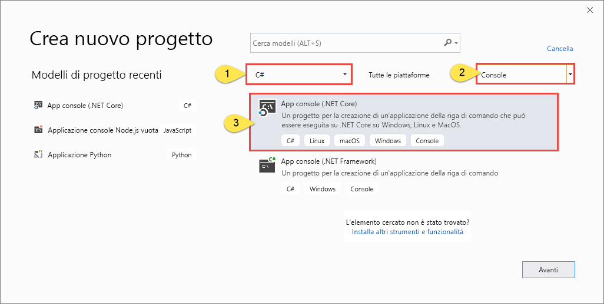
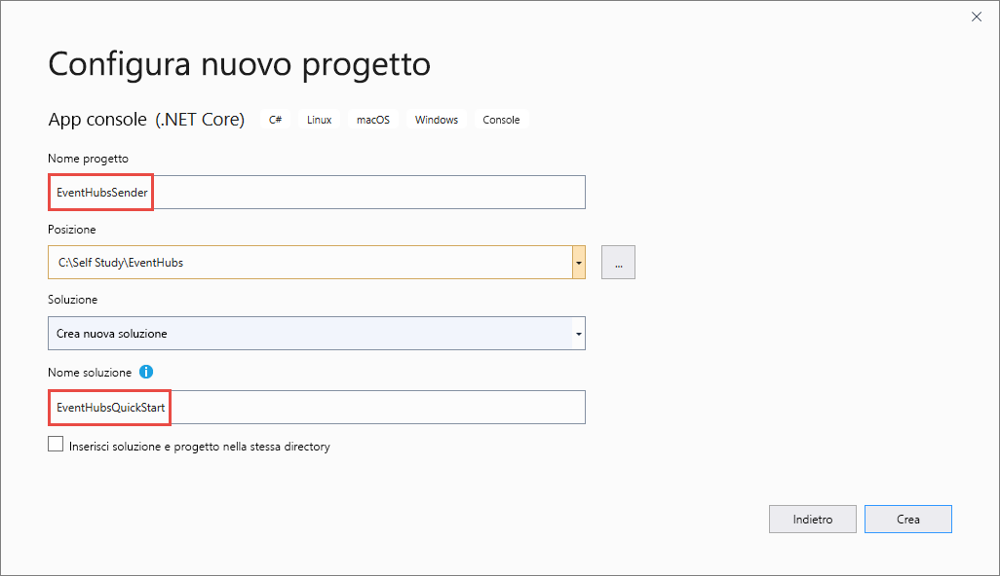

# <a name="send-events-to-and-receive-events-from-azure-event-hubs---net-azuremessagingeventhubs"></a>Inviare e ricevere eventi da Hub eventi di Azure - .NET (Azure.Messaging.EventHubs) 
Questa guida di avvio rapido illustra come inviare e ricevere eventi da un hub eventi con la libreria .NET **Azure.Messaging.EventHubs**. 

> [!IMPORTANT]
> In questo argomento di avvio rapido viene usata la nuova libreria **Azure.Messaging.EventHubs**. Per una guida di avvio rapido che usa la libreria **Microsoft.Azure.EventHubs** precedente, vedere [Inviare e ricevere eventi con la libreria Microsoft.Azure.EventHubs](event-hubs-dotnet-standard-getstarted-send.md). 


## <a name="prerequisites"></a>Prerequisiti
Se non si ha familiarità con Hub eventi di Azure, vedere [Panoramica di Hub eventi](event-hubs-about.md) prima di procedere con questa guida di avvio rapido. 

Per completare questa guida introduttiva è necessario soddisfare i prerequisiti seguenti:

- **Sottoscrizione di Microsoft Azure**. Per usare i servizi di Azure, tra cui Hub eventi di Azure, è necessaria una sottoscrizione.  Se non si ha un account Azure, è possibile iscriversi per ottenere una [versione di valutazione gratuita](https://azure.microsoft.com/free/) oppure usare i vantaggi della sottoscrizione di MSDN per la [creazione di un account](https://azure.microsoft.com).
- **Microsoft Visual Studio 2019**. La libreria client di Hub eventi di Azure usa le nuove funzionalità introdotte in C# 8.0.  È comunque possibile usare la libreria con le  versioni precedenti del linguaggio C#, ma la nuova sintassi non sarà disponibile. Per utilizzare la sintassi completa, è consigliabile eseguire la compilazione con [.NET Core SDK](https://dotnet.microsoft.com/download) 3.0 o versione successiva e la [versione della lingua](/dotnet/csharp/language-reference/configure-language-version#override-a-default) impostata su `latest`. Se si usa Visual Studio, le versioni precedenti a Visual Studio 2019 non sono compatibili con gli strumenti necessari per la compilazione di progetti in C# 8.0. Visual Studio 2019, inclusa l'edizione Community gratuita, può essere scaricato [qui](https://visualstudio.microsoft.com/vs/).
- **Creare uno spazio dei nomi di Hub eventi e un hub eventi**. Il primo passaggio consiste nell'usare il [portale di Azure](https://portal.azure.com) per creare uno spazio dei nomi di tipo Hub eventi e ottenere le credenziali di gestione necessarie all'applicazione per comunicare con l'hub eventi. Per creare uno spazio dei nomi e un hub eventi, seguire la procedura descritta in [questo articolo](event-hubs-create.md). Ottenere quindi la **stringa di connessione allo spazio dei nomi di Hub eventi** seguendo le istruzioni disponibili nell'articolo [Ottenere una stringa di connessione](event-hubs-get-connection-string.md#get-connection-string-from-the-portal). La stringa di connessione sarà necessaria più avanti in questa guida di avvio rapido.

## <a name="send-events"></a>Inviare eventi 
Questa sezione illustra come creare un'applicazione console .NET Core per inviare eventi a un hub eventi. 

### <a name="create-a-console-application"></a>Creare un'applicazione console

1. Avviare Visual Studio 2019. 
1. Selezionare **Crea un nuovo progetto**. 
1. Nella finestra di dialogo **Crea un nuovo progetto** seguire questa procedura: Se questa finestra di dialogo non viene visualizzata, scegliere **File** dal menu, selezionare **Nuovo** e quindi **Progetto**. 
    1. Selezionare **C#** come linguaggio di programmazione.
    1. Selezionare **Console** come tipo di applicazione. 
    1. Selezionare **App console (.NET Core)** nell'elenco risultati. 
    1. Quindi selezionare **Avanti**. 

            
1. Immettere **EventHubsSender** per il nome del progetto, **EventHubsQuickStart** per il nome della soluzione e quindi selezionare **OK** per creare il progetto. 

    

### <a name="add-the-event-hubs-nuget-package"></a>Aggiungere il pacchetto NuGet di Hub eventi

1. Scegliere **Strumenti** > **Gestione pacchetti NuGet** > **Console di Gestione pacchetti** dal menu. 
1. Eseguire il comando seguente per installare il pacchetto NuGet **Azure.Messaging.EventHubs**:

    ```cmd
    Install-Package Azure.Messaging.EventHubs
    ```


### <a name="write-code-to-send-messages-to-the-event-hub"></a>Scrivere codice per inviare messaggi all'hub eventi

1. Aggiungere le istruzioni `using` seguenti all'inizio del file **Program.cs**:

    ```csharp
    using System.Text;
    using System.Threading.Tasks;
    using Azure.Messaging.EventHubs;
    using Azure.Messaging.EventHubs.Producer;
    ```

2. Aggiungere le costanti alla classe `Program` per la stringa di connessione di Hub eventi e il nome dell'hub eventi. Sostituire i segnaposto tra parentesi con i valori appropriati ottenuti durante la creazione dell'hub eventi. Assicurarsi che `{Event Hubs namespace connection string}` sia la stringa di connessione a livello di spazio dei nomi e non la stringa dell'hub eventi. 

    ```csharp
    private const string connectionString = "<EVENT HUBS NAMESPACE - CONNECTION STRING>";
    private const string eventHubName = "<EVENT HUB NAME>";
    ```

3. Sostituire il metodo `Main` con il metodo `async Main` seguente. Per i dettagli, vedere i commenti nel codice. 

    ```csharp
        static async Task Main()
        {
            // Create a producer client that you can use to send events to an event hub
            await using (var producerClient = new EventHubProducerClient(connectionString, eventHubName))
            {
                // Create a batch of events 
                using EventDataBatch eventBatch = await producerClient.CreateBatchAsync();

                // Add events to the batch. An event is a represented by a collection of bytes and metadata. 
                eventBatch.TryAdd(new EventData(Encoding.UTF8.GetBytes("First event")));
                eventBatch.TryAdd(new EventData(Encoding.UTF8.GetBytes("Second event")));
                eventBatch.TryAdd(new EventData(Encoding.UTF8.GetBytes("Third event")));

                // Use the producer client to send the batch of events to the event hub
                await producerClient.SendAsync(eventBatch);
                Console.WriteLine("A batch of 3 events has been published.");
            }
        }
    ```
5. Compilare il progetto e assicurarsi che non siano presenti errori.
6. Eseguire il programma e attendere il messaggio di conferma. 
7. Nel portale di Azure è possibile verificare se l'hub eventi ha ricevuto i messaggi. Passare alla visualizzazione **Messaggi** nella sezione **Metriche**. Aggiornare la pagina per aggiornare il grafico. La conferma che i messaggi sono stati ricevuti potrebbe comparire dopo alcuni secondi. 

    [](./media/getstarted-dotnet-standard-send-v2/verify-messages-portal.png#lightbox)

    > [!NOTE]
    > Per il codice sorgente completo con commenti più informativi, vedere [questo file in GitHub](https://github.com/Azure/azure-sdk-for-net/blob/master/sdk/eventhub/Azure.Messaging.EventHubs/samples/Sample03_PublishAnEventBatch.cs)

## <a name="receive-events"></a>Ricevere eventi
Questa sezione mostra come scrivere un'applicazione console .NET Core che riceve i messaggi da un hub eventi tramite un processore di eventi. Il processore di eventi semplifica la ricezione di eventi dagli hub eventi gestendo checkpoint persistenti e ricezioni parallele da tali hub. Un processore di eventi è associato a un hub eventi specifico e a un gruppo di consumer. Riceve gli eventi da più partizioni nell'hub eventi, passandoli a un delegato del gestore per l'elaborazione tramite il codice fornito. 


> [!NOTE]
> Se il codice viene eseguito in Hub di Azure Stack, questa piattaforma potrebbe supportare una versione diversa dell'SDK di archiviazione BLOB rispetto a quelle disponibili in Azure. Se ad esempio l'esecuzione avviene nell'[hub di Azure Stack versione 2002](/azure-stack/user/event-hubs-overview), la versione più recente disponibile per il servizio di archiviazione è 2017-11-09. In questo caso, oltre ai passaggi descritti in questa sezione, sarà anche necessario aggiungere codice destinato alla versione 2017-11-09 dell'API del servizio di archiviazione. Per informazioni su come definire come destinazione una versione specifica dell'API di archiviazione, vedere [questo esempio in GitHub](https://github.com/Azure/azure-sdk-for-net/tree/master/sdk/eventhub/Azure.Messaging.EventHubs.Processor/samples/Sample10_RunningWithDifferentStorageVersion.cs). Per altre informazioni sulle versioni del servizio di archiviazione di Azure supportate in Hub di Azure Stack, vedere [Archiviazione nell'hub di Azure Stack: differenze e considerazioni](/azure-stack/user/azure-stack-acs-differences).

### <a name="create-an-azure-storage-and-a-blob-container"></a>Creare un account di archiviazione di Azure e un contenitore BLOB
In questo argomento di avvio rapido si usa una risorsa di archiviazione di Azure come archivio di checkpoint. Seguire questa procedura per creare un account di archiviazione di Azure. 

1. [Creare un account di archiviazione di Azure](../storage/common/storage-account-create.md?tabs=azure-portal)
2. [Creare un contenitore BLOB](../storage/blobs/storage-quickstart-blobs-portal.md#create-a-container)
3. [Ottenere la stringa di connessione all'account di archiviazione](../storage/common/storage-configure-connection-string.md)

    Prendere nota della stringa di connessione e del nome del contenitore. Questi valori verranno usati nel codice di ricezione. 


### <a name="create-a-project-for-the-receiver"></a>Creare un progetto per l'app ricevente

1. Nella finestra Esplora soluzioni fare clic con il pulsante destro del mouse sulla soluzione **EventHubQuickStart**, scegliere **Aggiunti** e selezionare **Nuovo progetto**. 
1. Selezionare **App console (.NET Core)** , quindi **Avanti**. 
1. Immettere **EventHubsReceiver** per **Nome progetto** e selezionare **Crea**. 

### <a name="add-the-event-hubs-nuget-package"></a>Aggiungere il pacchetto NuGet di Hub eventi

1. Scegliere **Strumenti** > **Gestione pacchetti NuGet** > **Console di Gestione pacchetti** dal menu. 
1. Eseguire il comando seguente per installare il pacchetto NuGet **Azure.Messaging.EventHubs**:

    ```cmd
    Install-Package Azure.Messaging.EventHubs
    ```
1. Eseguire il comando seguente per installare il pacchetto NuGet **Azure.Messaging.EventHubs.Processor**:

    ```cmd
    Install-Package Azure.Messaging.EventHubs.Processor
    ```    

### <a name="update-the-main-method"></a>Aggiornare il metodo Main 

1. Aggiungere le istruzioni `using` seguenti all'inizio del file **Program.cs**.

    ```csharp
    using System.Text;
    using System.Threading.Tasks;
    using Azure.Storage.Blobs;
    using Azure.Messaging.EventHubs;
    using Azure.Messaging.EventHubs.Consumer;
    using Azure.Messaging.EventHubs.Processor;
    ```
1. Aggiungere le costanti alla classe `Program` per la stringa di connessione di Hub eventi e il nome dell'hub eventi. Sostituire i segnaposto tra parentesi con i valori appropriati ottenuti durante la creazione dell'hub eventi. Sostituire i segnaposto tra parentesi quadre con i valori appropriati ottenuti durante la creazione dell'hub eventi e dell'account di archiviazione (chiavi di accesso, stringa di connessione primaria). Assicurarsi che `{Event Hubs namespace connection string}` sia la stringa di connessione a livello di spazio dei nomi e non la stringa dell'hub eventi.

    ```csharp
        private const string ehubNamespaceConnectionString = "<EVENT HUBS NAMESPACE - CONNECTION STRING>";
        private const string eventHubName = "<EVENT HUB NAME>";
        private const string blobStorageConnectionString = "<AZURE STORAGE CONNECTION STRING>";
        private const string blobContainerName = "<BLOB CONTAINER NAME>";
    ```
3. Sostituire il metodo `Main` con il metodo `async Main` seguente. Per i dettagli, vedere i commenti nel codice. 

    ```csharp
        static async Task Main()
        {
            // Read from the default consumer group: $Default
            string consumerGroup = EventHubConsumerClient.DefaultConsumerGroupName;

            // Create a blob container client that the event processor will use 
            BlobContainerClient storageClient = new BlobContainerClient(blobStorageConnectionString, blobContainerName);

            // Create an event processor client to process events in the event hub
            EventProcessorClient processor = new EventProcessorClient(storageClient, consumerGroup, ehubNamespaceConnectionString, eventHubName);

            // Register handlers for processing events and handling errors
            processor.ProcessEventAsync += ProcessEventHandler;
            processor.ProcessErrorAsync += ProcessErrorHandler;

            // Start the processing
            await processor.StartProcessingAsync();

            // Wait for 10 seconds for the events to be processed
            await Task.Delay(TimeSpan.FromSeconds(10));

            // Stop the processing
            await processor.StopProcessingAsync();
        }    
    ```
1. A questo punto, aggiungere i seguenti metodi di gestori di eventi ed errori alla classe. 

    ```csharp
        static async Task ProcessEventHandler(ProcessEventArgs eventArgs)
        {
            // Write the body of the event to the console window
            Console.WriteLine("\tRecevied event: {0}", Encoding.UTF8.GetString(eventArgs.Data.Body.ToArray()));

            // Update checkpoint in the blob storage so that the app receives only new events the next time it's run
            await eventArgs.UpdateCheckpointAsync(eventArgs.CancellationToken);
        }

        static Task ProcessErrorHandler(ProcessErrorEventArgs eventArgs)
        {
            // Write details about the error to the console window
            Console.WriteLine($"\tPartition '{ eventArgs.PartitionId}': an unhandled exception was encountered. This was not expected to happen.");
            Console.WriteLine(eventArgs.Exception.Message);
            return Task.CompletedTask;
        }    
    ```
1. Compilare il progetto e assicurarsi che non siano presenti errori.

    > [!NOTE]
    > Per il codice sorgente completo con commenti più informativi, vedere [questo file in GitHub](https://github.com/Azure/azure-sdk-for-net/blob/master/sdk/eventhub/Azure.Messaging.EventHubs.Processor/samples/Sample01_HelloWorld.cs).
6. Eseguire l'applicazione ricevente. 
1. Viene visualizzato un messaggio che indica che l'evento è stato ricevuto. 

    

    Questi eventi sono i tre eventi inviati in precedenza all'hub eventi eseguendo il programma mittente. 


## <a name="next-steps"></a>Passaggi successivi
Controllare gli esempi in GitHub. 

- [Esempi di Hub eventi su GitHub](https://github.com/Azure/azure-sdk-for-net/tree/master/sdk/eventhub/Azure.Messaging.EventHubs/samples)
- [Esempi di processore di eventi in GitHub](https://github.com/Azure/azure-sdk-for-net/tree/master/sdk/eventhub/Azure.Messaging.EventHubs.Processor/samples)
- [Esempio di controllo degli accessi in base al ruolo](https://github.com/Azure/azure-event-hubs/tree/master/samples/DotNet/Azure.Messaging.EventHubs/ManagedIdentityWebApp)
