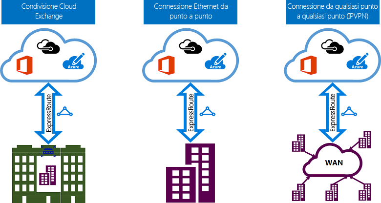

# Modelli di connettività di ExpressRoute
È possibile creare una connessione tra la rete locale e Microsoft Cloud in tre modi diversi, ovvero [condivisione percorso di CloudExchange](#CloudExchange), [connessione Ethernet da punto a punto](#Ethernet) e [connessione (IPVPN) any-to-any](#IPVPN). I provider di connettività possono fornire uno o più modelli di connettività. È possibile interagire con il provider di connettività per scegliere il modello più appropriato.
  

## Percorso condiviso in una struttura Cloud Exchange
Nel caso di percorso condiviso in una struttura con scambio cloud, è possibile ordinare Cross Connection virtuali con il cloud Microsoft tramite lo scambio Ethernet del provider di condivisione del percorso. I provider di condivisione del percorso possono fornire Cross Connection di livello 2 oppure gestite di livello 3 tra l'infrastruttura nella struttura di condivisione percorso e il cloud Microsoft.

## Connessioni Ethernet da punto a punto
È possibile connettere i data center o gli uffici locali al cloud Microsoft tramite collegamenti Ethernet punto a punto. I provider Ethernet punto a punto forniscono connessioni di livello 2 o connessioni gestite di livello 3 tra la sede dell'utente e il cloud Microsoft.

## Reti (IPVPN) any-to-any
È possibile integrare una rete WAN con il cloud Microsoft. I provider IPVPN (in genere VPN MPLS) forniscono connettività any-to-any tra le succursali e i data center. Il cloud Microsoft può essere interconnesso a una rete WAN in modo che abbia l'aspetto di qualsiasi altra succursale. I provider WAN offrono in genere connettività gestita di livello 3. Le caratteristiche e le funzionalità di ExpressRoute sono identiche in tutti i modelli di connettività sopra descritti. 

## Passaggi successivi
* Informazioni sulle connessioni e i domini di routing ExpressRoute. Vedere [Circuiti e domini di routing ExpressRoute](expressroute-circuit-peerings.md).
* Informazioni sulle funzionalità di ExpressRoute. Vedere [Panoramica tecnica relativa a ExpressRoute](expressroute-introduction.md)
* Trovare un provider di servizi. Vedere [Partner e località di peering per Azure ExpressRoute](expressroute-locations.md).
* Verificare che vengano soddisfatti tutti i prerequisiti. Vedere [Prerequisiti per ExpressRoute](expressroute-prerequisites.md).
* Vedere i requisiti per [Routing](expressroute-routing.md), [NAT](expressroute-nat.md) e [QoS](expressroute-qos.md).
* Configurare la connessione ExpressRoute.
  * [Creare un circuito ExpressRoute](expressroute-howto-circuit-portal-resource-manager.md)
  * [Configurare il routing](expressroute-howto-routing-portal-resource-manager.md)
  * [Collegare una rete virtuale a un circuito ExpressRoute](expressroute-howto-linkvnet-portal-resource-manager.md)