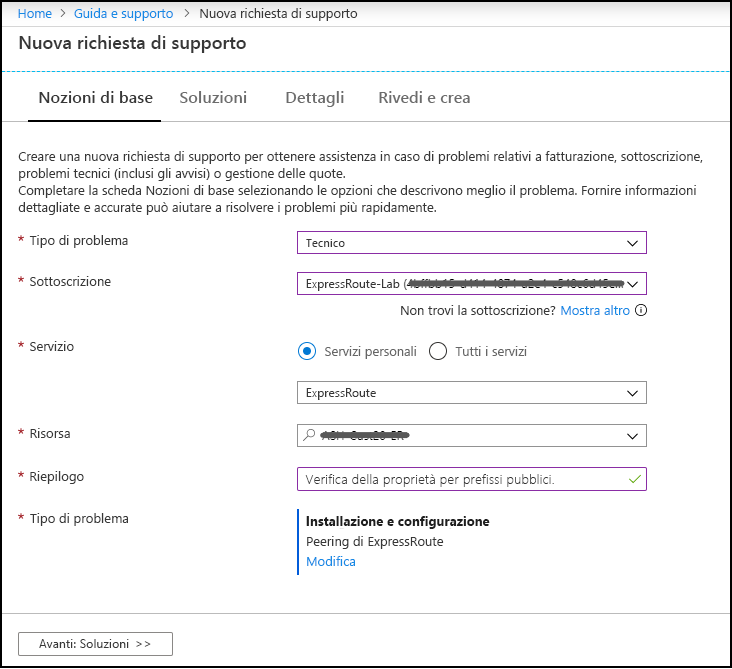

# Domande frequenti su ExpressRoute

## Che cos'è ExpressRoute?

ExpressRoute è un servizio di Azure che consente di creare connessioni private tra i data center Microsoft e l'infrastruttura presente nella struttura locale o in una struttura di condivisione. Le connessioni ExpressRoute non sfruttano la rete Internet pubblica e offrono un livello di sicurezza superiore, maggiore affidabilità, velocità più elevate e minori latenze rispetto alle connessioni Internet tradizionali.

### Quali sono i vantaggi dell'uso di ExpressRoute e delle connessioni di rete private?

Le connessioni ExpressRoute non sfruttano la rete Internet pubblica. Esse offrono un livello di sicurezza superiore, maggiore affidabilità, velocità più elevate e latenze minori e coerenti rispetto alle connessioni Internet tradizionali. In alcuni casi, l'uso di connessioni ExpressRoute per trasferire dati tra dispositivi locali e Azure può produrre vantaggi significativi in termini di costi.

### Dov'è disponibile il servizio?

Vedere questa pagina per la posizione e la disponibilità del servizio: [Partner e località per ExpressRoute](expressroute-locations.md).

### In che modo è possibile usare ExpressRoute per connettersi a Microsoft in assenza di una relazione con uno dei partner del gestore ExpressRoute?

Si può selezionare un gestore regionale e connessioni Ethernet via terra in una delle sedi supportate del provider di Exchange. È quindi possibile connettersi a Microsoft nella sede del provider. Per verificare se il provider di servizio è presente in una delle località di Exchange, vedere l'ultima sezione della pagina [Partner e località per ExpressRoute](expressroute-locations.md) . Sarà quindi possibile ordinare un circuito ExpressRoute tramite il provider di servizi per connettersi ad Azure.

### Quanto costa ExpressRoute?

Per informazioni sui prezzi, vedere [Dettagli prezzi](https://azure.microsoft.com/pricing/details/expressroute/) .

### Se si paga per un circuito ExpressRoute di una determinata larghezza di banda, è possibile allocare questa larghezza di banda per il traffico in ingresso e in uscita separatamente?

Sì, la larghezza di banda del circuito ExpressRoute è duplex. Se ad esempio si acquista un circuito ExpressRoute a 200 Mbps, si sta procurando 200 Mbps per il traffico in ingresso e 200 Mbps per il traffico in uscita.

### Se si acquista un circuito ExpressRoute di una determinata larghezza di banda, la connessione VPN acquistata dal provider di servizi di rete deve essere della stessa velocità?

No. È possibile acquistare una connessione VPN di qualsiasi velocità dal provider di servizi. Tuttavia, la connessione ad Azure è limitata alla larghezza di banda del circuito ExpressRoute acquistato.

### Se si paga per un circuito ExpressRoute di una determinata larghezza di banda, è possibile usare più della larghezza di banda acquistata?

Sì, è possibile usare fino a due volte il limite di larghezza di banda acquistato usando la larghezza di banda disponibile nella connessione secondaria del circuito ExpressRoute. La ridondanza predefinita del circuito viene configurata con le connessioni primarie e secondarie, ognuna della larghezza di banda acquistata, a due router perimetrali Microsoft Enterprise (MSEE). Se necessario, è possibile usare la larghezza di banda disponibile tramite la connessione secondaria per ulteriore traffico. Poiché la connessione secondaria è destinata alla ridondanza, tuttavia, non è garantita e non deve essere usata per il traffico aggiuntivo per un periodo di tempo prolungato. Per altre informazioni su come usare entrambi Connnections per trasmettere il traffico, vedere [qui](https://docs.microsoft.com/azure/expressroute/expressroute-optimize-routing#solution-use-as-path-prepending).
Se si prevede di usare solo la connessione primaria per trasmettere il traffico, la larghezza di banda per la connessione è fissa e il tentativo di eseguire l'oversubscription comporterà un aumento delle perdite di pacchetti. Se il traffico viene trasmesso attraverso un gateway ExpressRoute, la larghezza di banda per lo SKU è fissa e non può essere scaricata.

### Si possono usare contemporaneamente la stessa connessione di rete privata con la rete virtuale e altri servizi di Azure?

Sì. Dopo l'installazione, il circuito ExpressRoute consente di accedere ai servizi all'interno di una rete virtuale e ad altri servizi di Azure contemporaneamente. La connessione alle reti virtuali viene eseguita tramite il percorso di peering privato e ad altri servizi tramite il percorso di peering Microsoft.

### In che modo vengono annunciate le reti virtuali nel peering privato ExpressRoute?

Il gateway ExpressRoute annuncerà lo *spazio indirizzi* della rete virtuale di Azure, quindi non è possibile includere/escludere a livello di subnet. Viene annunciato sempre lo spazio indirizzi della rete virtuale. Inoltre, se viene usato il peering reti virtuali e nella rete virtuale con peering è abilitato "Usa gateway remoto", viene annunciato anche lo spazio indirizzi della rete virtuale con peering.

### Quanti prefissi è possibile annunciare da una rete virtuale alla rete locale nel peering privato ExpressRoute?

In una connessione ExpressRoute singola o tramite il peering reti virtuali è possibile annunciare un massimo di 200 prefissi usando il transito tramite gateway. Se, ad esempio, si dispone di 199 di spazi di indirizzi in una singola rete virtuale connessa a un circuito ExpressRoute, tutti e 199 i prefissi vengono annunciati nella rete locale. In alternativa, se si dispone di una rete virtuale abilitata per consentire il transito tramite gateway con 1 spazio indirizzi e 150 reti virtuali spoke abilitate con l'opzione "Consenti gateway remoto", la rete virtuale distribuita con il gateway annuncerà 151 prefissi nella rete locale.

### Cosa accade se si supera il limite di prefissi in una connessione ExpressRoute?

La connessione tra il circuito ExpressRoute e il gateway (e le reti virtuali con peering che usano il transito tramite gateway) si arresterà. Verrà ristabilita quando il limite di prefissi non sarà più superato.  

### È possibile filtrare le route provenienti dalla rete locale?

L'unico modo per filtrare/includere le route è nel router perimetrale locale. È possibile aggiungere alla rete virtuale alcune route definite dall'utente che influiscano su un routing specifico, ma sarà un'operazione statica e non parte dell'annuncio BGP.

### ExpressRoute offre un contratto di servizio?

Per informazioni, vedere [Contratto di servizio di ExpressRoute](https://azure.microsoft.com/support/legal/sla/).

## Servizi supportati

ExpressRoute supporta [tre domini di routing](expressroute-circuit-peerings.md) per vari tipi di servizi: peering privato, peering Microsoft e peering pubblico (deprecato).

### Peering privato

**Supportati:**

* Reti virtuali, inclusi tutti i servizi cloud e tutte le macchine virtuali

### Peering Microsoft

Se il circuito ExpressRoute è abilitato per il peering Azure Microsoft, è possibile accedere agli [intervalli di indirizzi IP pubblici](../virtual-network/public-ip-addresses.md#public-ip-addresses) usati in Azure nel circuito. Il peering Azure Microsoft garantirà accesso ai servizi attualmente ospitati in Azure (con restrizioni geografiche in base allo SKU del circuito). Per verificare la disponibilità di un servizio specifico, è possibile controllare la documentazione relativa a tale servizio per verificare se è stato pubblicato un intervallo riservato per il servizio. Quindi cercare gli intervalli di indirizzi IP del servizio di destinazione e confrontarli con quelli elencati in [Azure IP Ranges and Service Tags – Public Cloud XML file](https://www.microsoft.com/download/details.aspx?id=56519). In alternativa, è possibile aprire un ticket di supporto per il servizio in questione per ottenere chiarimenti.

**Supportati:**

* [Microsoft 365](/microsoft-365/enterprise/azure-expressroute)
* Power BI - Disponibile tramite una community regionale di Azure. Vedere [qui](/power-bi/service-admin-where-is-my-tenant-located) per trovare informazioni su come scoprire la regione del tenant Power BI.
* Azure Active Directory
* [Azure DevOps](https://blogs.msdn.microsoft.com/devops/2018/10/23/expressroute-for-azure-devops/) (community di Servizi globali di Azure)
* Indirizzi IP pubblici di Azure per IaaS (macchine virtuali, gateway di rete virtuale, servizio di bilanciamento del carico e così via)  
* È supportata anche la maggior parte degli altri servizi di Azure. Contattare direttamente il servizio che si vuole usare per verificarne il supporto.

**Non supportati:**

* RETE CDN
* Frontdoor di Azure
* [Desktop virtuale Windows](https://azure.microsoft.com/services/virtual-desktop/)
* Server Multi-Factor Authentication Server (legacy)
* Gestione traffico

### Peering pubblico

Il peering pubblico è stato disabilitato sui circuiti nuovi di ExpressRoute. I servizi di Azure sono ora disponibili nel peering Microsoft. Se un circuito è stato creato prima che il peering pubblico fosse deprecato, è possibile scegliere di usare il peering Microsoft o il peering pubblico a seconda dei servizi desiderati.

Per conoscere altre informazioni e i passaggi di configurazione per il peering pubblico, vedere [Peering pubblico di ExpressRoute](about-public-peering.md).

### Perché durante la configurazione del peering Microsoft viene visualizzato lo stato "Convalida necessaria" per "Prefissi pubblici annunciati"?

Microsoft verifica se all'utente sono assegnati "Prefissi pubblici annunciati" e "ASN peer" (o "ASN cliente") nel registro di sistema di routing Internet. Se si ricevono prefissi pubblici da un'altra entità e l'assegnazione non viene registrata con il registro di sistema di routing, la convalida automatica non verrà completata e sarà richiesta la convalida manuale. Se la convalida automatica ha esito negativo, verrà visualizzato il messaggio "Convalida necessaria".

Se viene visualizzato il messaggio "Convalida necessaria", raccogliere i documenti che mostrano i prefissi pubblici assegnati all'organizzazione dall'entità elencata come proprietaria dei prefissi nel registro di sistema di routing e inviarli per la convalida manuale aprendo un ticket di supporto come illustrato di seguito.

### Dynamics 365 è supportato in ExpressRoute?

Gli ambienti Dynamics 365 e Common Data Service (CDS) sono ospitati in Azure, di conseguenza i clienti traggono vantaggio dal supporto ExpressRoute sottostante per le risorse di Azure. È possibile connettersi agli endpoint servizio se il filtro del router include le aree di Azure in cui sono ospitati gli ambienti Dynamics 365/CDS.

> [!NOTE]
> [ExpressRoute Premium](#expressroute-premium) **non** è necessario per la connettività Dynamics 365 tramite Azure ExpressRoute se il circuito ExpressRoute viene distribuito nella stessa [area geopolitica](./expressroute-locations-providers.md#expressroute-locations).

## Dati e connessioni

### Esistono limiti alla quantità di dati trasferibili usando ExpressRoute?

Non esistono limiti alla quantità di dati trasferibili. Per informazioni sulle tariffe relative alle velocità della larghezza di banda, vedere [Dettagli prezzi](https://azure.microsoft.com/pricing/details/expressroute/) .

### Quali sono le velocità di connessione supportate da ExpressRoute?

Offerte relative alle larghezze di banda supportate:

50 Mbps, 100 Mbps, 200 Mbps, 500 Mbps, 1 Gbps, 2 Gbps, 5 Gbps, 10 Gbps

### Quali provider del servizio sono disponibili?

Per l'elenco dei provider di servizi e delle relative località, vedere [Partner e località per ExpressRoute](expressroute-locations.md) .

## Dettagli tecnici

### Quali sono i requisiti tecnici per la connessione della posizione locale ad Azure?

Per informazioni sui requisiti, vedere la [pagina dei prerequisiti di ExpressRoute](expressroute-prerequisites.md).

### Le connessioni a ExpressRoute sono ridondanti?

Sì. Ogni circuito ExpressRoute ha una coppia ridondante di connessioni incrociate configurate per garantire una disponibilità elevata.

### In caso di errore di un collegamento a ExpressRoute, verrà persa la connettività?

In caso di errore di una delle connessioni incrociate, la connettività non verrà persa. È attualmente disponibile una connessione ridondante per supportare il carico della rete e offrire disponibilità elevata per il circuito ExpressRoute. Per ottenere resilienza a livello di circuito, è possibile anche creare un circuito in una sede di peering diversa.

### Come è possibile implementare la ridondanza nel peering privato?

Più circuiti ExpressRoute da diverse località di peering o fino a quattro connessioni dalla stessa località di peering possono essere connesse alla stessa rete virtuale per offrire disponibilità elevata nel caso in cui un singolo circuito non sia più disponibile. È quindi possibile [assegnare pesi più elevati](./expressroute-optimize-routing.md#solution-assign-a-high-weight-to-local-connection) a una delle connessioni locali per preferire un circuito specifico. È vivamente consigliabile configurare almeno due circuiti ExpressRoute per evitare singoli punti di guasto. 

Vedere [qui](./designing-for-high-availability-with-expressroute.md) per la progettazione della disponibilità elevata e [qui](./designing-for-disaster-recovery-with-expressroute-privatepeering.md) per la progettazione del ripristino di emergenza.  

### Come è possibile implementare la ridondanza nel peering Microsoft?

Si consiglia vivamente quando i clienti usano il peering Microsoft per accedere ai servizi pubblici di Azure, ad esempio archiviazione di Azure o Azure SQL, nonché i clienti che usano il peering Microsoft per Microsoft 365 di implementare più circuiti in posizioni di peering diverse per evitare singoli punti di errore. I clienti possono annunciare lo stesso prefisso in entrambi i circuiti e [anteporre il PERCORSO AS](./expressroute-optimize-routing.md#solution-use-as-path-prepending) o annunciare vari prefissi per determinare il percorso dalla rete locale.

Per la progettazione per la disponibilità elevata, vedere [qui](./designing-for-high-availability-with-expressroute.md).

### Come è possibile garantire la disponibilità elevata in una rete virtuale connessa a ExpressRoute?

È possibile ottenere la disponibilità elevata connettendosi a un massimo di quattro circuiti ExpressRoute nella stessa località di peering alla rete virtuale o connettendo circuiti ExpressRoute in posizioni di peering diverse (ad esempio, Singapore, Singapore2) alla rete virtuale. Se si arresta un circuito ExpressRoute, la connettività eseguirà il failover su un altro circuito ExpressRoute. Per impostazione predefinita, il traffico in uscita dalla rete virtuale viene instradato sul routing ECMP (Equal-Cost-Multi-Path). È possibile usare il peso della connessione per preferire un circuito a un altro. Per altre informazioni, vedere [Optimizing ExpressRoute Routing](expressroute-optimize-routing.md) (Ottimizzazione del routing di ExpressRoute).

### Come è possibile assicurarsi che il traffico destinato a servizi pubblici di Azure come Archiviazione e SQL di Azure nel peering Microsoft o nel peering pubblico sia quello preferito nel percorso ExpressRoute?

Per assicurarsi che il percorso da locale ad Azure sia sempre il preferito nel circuito ExpressRoute, è necessario implementare l'attributo *Preferenza locale* nei router.

Vedere [qui](./expressroute-optimize-routing.md#path-selection-on-microsoft-and-public-peerings) i dettagli aggiuntivi sulla selezione del percorso BGP e sulle configurazioni comuni del router. 

### Se non si condivide un percorso in un'infrastruttura Cloud Exchange e il provider di servizi offre una connessione punto a punto, è necessario ordinare due connessioni fisiche tra la rete locale e Microsoft?

Se il provider di servizi è in grado di stabilire due circuiti virtuali Ethernet sulla connessione fisica, è sufficiente una connessione fisica. La connessione fisica, ad esempio una fibra ottica, viene terminata su un dispositivo di livello 1 (L1) (vedere l'immagine). I due circuiti virtuali Ethernet sono contrassegnati con ID VLAN diversi, uno per il circuito primario e uno per quello secondario. Gli ID VLAN sono nell'intestazione Ethernet 802.1Q esterna. L'intestazione Ethernet 802.1Q interna, non indicata nella figura, viene mappata a un [dominio di routing ExpressRoute](expressroute-circuit-peerings.md)specifico.

### Si può estendere una delle reti VLAN ad Azure tramite ExpressRoute?

No. Non sono supportate estensioni alla connettività di livello 2 in Azure.

### La sottoscrizione può includere più di un circuito ExpressRoute?

Sì. La sottoscrizione può includere più di un circuito ExpressRoute. Il limite predefinito è impostato a 10. Se necessario, contattare il supporto tecnico Microsoft per aumentare il limite.

### Si possono usare circuiti ExpressRoute di diversi provider di servizi?

Sì. È possibile usare i circuiti ExpressRoute con molti provider di servizi. Ogni circuito ExpressRoute è associato a un solo provider di servizi. 

### Sono presenti due località di peering per ExpressRoute nella stessa area metropolitana, ad esempio Singapore e Singapore2. Quale località di peering devo scegliere per creare il mio circuito ExpressRoute?
Se il provider di servizi offre ExpressRoute in entrambe le località, è possibile contattare il provider e selezionare uno dei due siti per configurare ExpressRoute. 

### È possibile avere più circuiti ExpressRoute nella stessa area metropolitana? È possibile collegarli alla stessa rete virtuale?

Sì. È possibile avere più circuiti ExpressRoute con provider di servizi uguali o diversi. Se nell'area metropolitana sono presenti più località peer per ExpressRoute e i circuiti vengono creati in località peer diverse, è possibile collegarli alla stessa rete virtuale. Se i circuiti vengono creati nella stessa posizione di peering, è possibile collegare fino a quattro circuiti alla stessa rete virtuale.

### Come si connettono le reti virtuali a un circuito ExpressRoute?

I passaggi di base sono:

* Stabilire un circuito ExpressRoute e richiedere al provider di servizi di abilitarlo.
* L'utente o il provider deve configurare i peering BGP.
* Collegare la rete virtuale al circuito ExpressRoute.

Per altre informazioni, vedere [Flussi di lavoro e stati di provisioning di un circuito ExpressRoute](expressroute-workflows.md).

### Sono previsti limiti di connettività per il circuito ExpressRoute?

Sì. L'articolo [Partner e località per ExpressRoute](expressroute-locations.md) offre una panoramica dei limiti di connettività per un circuito ExpressRoute. La connettività per un circuito ExpressRoute è limitata a una singola area geopolitica. È possibile espandere la connettività per superare le aree geopolitiche abilitando la funzionalità Premium di ExpressRoute.

### Un circuito ExpressRoute può essere collegato a più reti virtuali?

Sì. È possibile avere fino a 10 connessioni di reti virtuali in un circuito ExpressRoute Standard e fino a 100 in un [circuito ExpressRoute Premium](#expressroute-premium). 

### Sono disponibili più sottoscrizioni di Azure che contengono reti virtuali. È possibile connettere reti virtuali di sottoscrizioni distinte a un singolo circuito ExpressRoute?

Sì. È possibile collegare fino a 10 reti virtuali nella stessa sottoscrizione del circuito o diverse sottoscrizioni usando un singolo circuito ExpressRoute. Per aumentare questo limite, abilitare la funzionalità Premium di ExpressRoute. Si noti che l'addebito per la connettività e la larghezza di banda per il circuito dedicato verrà applicato al proprietario del circuito ExpressRoute. tutte le reti virtuali condividono la stessa larghezza di banda.

Per altre informazioni, vedere [Condivisione di un circuito ExpressRoute tra più sottoscrizioni](expressroute-howto-linkvnet-arm.md).

### Sono disponibili più sottoscrizioni di Azure associate a diversi tenant di Azure Active Directory o le registrazioni di Enterprise Agreement. È possibile connettere reti virtuali presenti in tenant separati e registrazioni a un singolo circuito ExpressRoute che non si trova nello stesso tenant o registrazione?

Sì. Le autorizzazioni di ExpressRoute possono estendersi a sottoscrizione, tenant e registrazione, senza richiedere alcuna configurazione aggiuntiva. Si noti che l'addebito per la connettività e la larghezza di banda per il circuito dedicato verrà applicato al proprietario del circuito ExpressRoute. tutte le reti virtuali condividono la stessa larghezza di banda.

Per altre informazioni, vedere [Condivisione di un circuito ExpressRoute tra più sottoscrizioni](expressroute-howto-linkvnet-arm.md).

### Le reti virtuali connesse allo stesso circuito sono isolate tra loro?

No. Da un punto di vista del routing, tutte le reti virtuali collegate allo stesso circuito ExpressRoute appartengono allo stesso dominio di routing e non sono isolate le une dalle altre. Se è necessario l'isolamento delle route, creare un circuito ExpressRoute separato.

### È possibile connettere una sola rete virtuale a più circuiti ExpressRoute?

Sì. È possibile collegare una singola rete virtuale con un massimo di 4 circuiti ExpressRoute nella stessa località di peering o in località diverse. 

### Si può accedere a Internet usando le reti virtuali connesse a circuiti ExpressRoute?

Sì. Se non è stata eseguita la pubblicazione di route predefinite (0.0.0.0/0) o prefissi di route Internet tramite la sessione BGP, è possibile connettersi a Internet da una rete virtuale collegata a un circuito ExpressRoute.

### Si può bloccare la connettività Internet per le reti virtuali connesse a circuiti ExpressRoute?

Sì. È possibile pubblicare route predefinite (0.0.0.0/0) per bloccare tutta la connettività Internet per le macchine virtuali distribuite in una rete virtuale e indirizzare tutto il traffico in uscita attraverso il circuito ExpressRoute.

> [!NOTE]
> Se il percorso annunciato di 0.0.0.0/0 viene prelevato dalle route annunciate (ad esempio, a causa di un'interruzione o di una configurazione errata), Azure fornirà una [Route di sistema](../virtual-network/virtual-networks-udr-overview.md#system-routes) per le risorse nella rete virtuale connessa per fornire la connettività a Internet.  Per garantire che il traffico in uscita verso Internet sia bloccato, è consigliabile inserire un gruppo di sicurezza di rete in tutte le subnet con una regola di negazione in uscita per il traffico Internet.

Se si pubblicano route predefinite, il traffico verso i servizi offerti tramite peering Microsoft, ad esempio l'archiviazione di Azure e database SQL, viene forzato verso l'istanza locale. Sarà necessario configurare i router in modo che restituiscano traffico ad Azure tramite il percorso di peering Microsoft su Internet. Se è stato abilitato un endpoint di servizio per il servizio, il traffico verso il servizio non viene forzato in locale, ma rimane all'interno della rete backbone di Azure. Per altre informazioni sugli endpoint del servizio, vedere [Endpoint servizio di rete virtuale](../virtual-network/virtual-network-service-endpoints-overview.md?toc=%2fazure%2fexpressroute%2ftoc.json).

### Le reti virtuali collegate allo stesso circuito ExpressRoute possono comunicare tra loro?

Sì. Le macchine virtuali distribuite in reti virtuali connesse allo stesso circuito ExpressRoute possono comunicare tra loro.

### È possibile usare la connettività da sito per reti virtuali insieme a ExpressRoute?

Sì. ExpressRoute può coesistere con VPN da sito a sito. Vedere [Configurare connessioni coesistenti ExpressRoute e da sito a sito](expressroute-howto-coexist-resource-manager.md).

### Perché esiste un indirizzo IP pubblico associato al gateway ExpressRoute in una rete virtuale?

L'indirizzo IP pubblico viene usato solo per la gestione interna e non costituisce un rischio per la sicurezza della rete virtuale.

### Sono previsti limiti per i numeri di route pubblicabili?

Sì. Sono accettati al massimo 4000 prefissi di route per il peering privato e 200 per il peering Microsoft. Se si abilita la funzionalità Premium di ExpressRoute, sarà possibile aumentare questo valore fino a 10.000 route per il peering privato.

### Sono previste limitazioni per gli intervalli IP pubblicabili tramite la sessione BGP?

I prefissi privati (RFC1918) non sono accettati nella sessione BGP per il peering Microsoft. È accettata qualsiasi dimensione di prefisso (fino a 32) sia nel peering Microsoft che nel peering privato.

### Cosa succede se si superano i limiti per BGP?

Le sessioni BGP saranno rimosse. Saranno ripristinate quando il numero di prefissi tornerà sotto il limite consentito.

### Che cos'è il tempo di attesa BGP ExpressRoute? È possibile regolarlo?

Il tempo di attesa è 180. I messaggi keep-alive vengono inviati ogni 60 secondi. Queste sono impostazioni fisse sul lato Microsoft che non è possibile modificare. È possibile configurare diversi timer, e i parametri della sessione BGP verranno negoziati di conseguenza.

### È possibile modificare la larghezza di banda di un circuito ExpressRoute?

Sì, è possibile provare ad aumentare la larghezza di banda del circuito ExpressRoute nel portale di Azure o con PowerShell. Se è disponibile capacità sulla porta fisica in cui è stato creato il circuito, la modifica ha esito positivo. 

Se la modifica ha esito negativo, significa che la capacità residua sulla porta corrente non è sufficiente e che è necessario creare un nuovo circuito ExpressRoute con maggiore larghezza di banda, oppure che la posizione non ha altra capacità. In quest'ultimo caso non è possibile aumentare la larghezza di banda. 

Sarà anche necessario contattare il provider di connettività per assicurare che aggiorni le limitazioni della propria rete per supportare l'incremento della larghezza di banda. Non è tuttavia possibile ridurre la larghezza di banda del circuito ExpressRoute. È necessario creare un nuovo circuito ExpressRoute con larghezza di banda inferiore ed eliminare il circuito precedente.

### Come si modifica la larghezza di banda di un circuito ExpressRoute?

È possibile aggiornare la larghezza di banda del circuito ExpressRoute usando l'API REST dedicata o il cmdlet di PowerShell.

## ExpressRoute Premium

### Che cos'è ExpressRoute Premium?

ExpressRoute Premium è una raccolta delle funzionalità seguenti:

* Aumento del limite delle tabelle di routing da 4000 a 10.000 route per il peering privato.
* Incremento del numero di reti virtuali e connessioni di Copertura globale di ExpressRoute che possono essere abilitate per un circuito ExpressRoute (il valore predefinito è 10). Per altre informazioni, vedere la tabella [Limiti di ExpressRoute](#limits).
* Connettività a Microsoft 365
* Connettività globale sulla rete di base Microsoft. È ora possibile collegare una VNet in un'area geopolitica a un circuito ExpressRoute in un'altra area. 
    **Esempi:**

    *  È possibile collegare una VNet creata in Europa occidentale a un circuito ExpressRoute creato a Silicon Valley. 
    *  Nel peering Microsoft vengono pubblicati i prefissi di altre aree geopolitiche, in modo che sia possibile, ad esempio, connettersi a SQL Azure in Europa occidentale da un circuito di Silicon Valley.

### Quante reti virtuali e connessioni di Copertura globale di ExpressRoute è possibile abilitare su un circuito ExpressRoute se è stato abilitato ExpressRoute Premium?

Le tabelle seguenti illustrano i limiti di ExpressRoute e il numero di reti virtuali e connessioni di Copertura globale di ExpressRoute per ogni circuito ExpressRoute:

[!INCLUDE [ExpressRoute limits](../../includes/expressroute-limits.md)]

### Come si abilita ExpressRoute Premium?

Le funzionalità di ExpressRoute Premium possono essere abilitate quando si attiva la funzionalità e possono essere arrestate tramite l'aggiornamento dello stato del circuito. È possibile abilitare ExpressRoute Premium in fase di creazione del circuito oppure chiamare l'API REST o il cmdlet di PowerShell.

### Come si disabilita ExpressRoute Premium?

È possibile disabilitare ExpressRoute Premium chiamando l'API REST o il cmdlet di PowerShell. È necessario assicurarsi di avere ridimensionato le esigenze di connettività per soddisfare i limiti predefiniti prima di disabilitare ExpressRoute Premium. Se l'uso supera i limiti predefiniti, la richiesta di disabilitazione di ExpressRoute Premium avrà esito negativo.

### È possibile scegliere solo alcune funzionalità di ExpressRoute Premium?

No. Non è possibile selezionare le funzionalità. Quando si attiva ExpressRoute Premium, vengono abilitate tutte le funzionalità.

### Quanto costa ExpressRoute Premium?

Per informazioni sui costi, vedere [Dettagli prezzi](https://azure.microsoft.com/pricing/details/expressroute/) .

### È necessario un pagamento aggiuntivo per ExpressRoute Premium, oltre agli addebiti per la versione standard di ExpressRoute?

Sì. Gli addebiti per ExpressRoute Premium vengono sommati agli addebiti per ExpressRoute e agli addebiti richiesti dal provider di connettività.

## ExpressRoute Local
### Che cos'è ExpressRoute Local?
ExpressRoute Local è uno SKU del circuito ExpressRoute che si aggiunge agli SKU Standard e Premium. Una funzionalità chiave di Local è che questo circuito in una località di peering ExpressRoute fornisce accesso solo a una o due aree di Azure nella stessa metropolitana o in una vicina. Al contrario, un circuito Standard offre accesso a tutte le aree di Azure in un'area geopolitica, mentre un circuito Premium fornisce accesso a tutte le aree di Azure a livello globale. 

### Quali sono i vantaggi di ExpressRoute Local?
Anche se per il circuito ExpressRoute Standard o Premium è necessario pagare il trasferimento dei dati in uscita, per il circuito ExpressRoute Local non occorre farlo separatamente. In altre parole, il prezzo di ExpressRoute Local include le tariffe per il trasferimento dei dati. ExpressRoute Local è una soluzione più economica se si dispone di una grande quantità di dati da trasferire ed è possibile spostare i dati tramite una connessione privata a una località di peering ExpressRoute vicino alle aree di Azure desiderate. 

### Quali funzionalità sono disponibili e quali non sono disponibili in ExpressRoute Local?
Un circuito ExpressRoute Local ha la stessa serie di funzionalità del circuito Standard, tranne:
* Ambito di accesso alle aree di Azure come descritto in precedenza
* Copertura globale di ExpressRoute non è disponibile nel circuito Local

ExpressRoute Local ha anche gli stessi limiti di Standard per quanto riguarda le risorse (ad esempio il numero di reti virtuali per circuito). 

### Dove è disponibile ExpressRoute Local e a quali aree di Azure viene mappata ogni località di peering?
ExpressRoute Local è disponibile nelle località di peering in cui ci sono una o due aree di Azure vicine. Non è disponibile in una località di peering in cui non ci sono aree di Azure nello stato, nella provincia, nel paese o nella regione. Vedere i mapping esatti nella [pagina Località](expressroute-locations-providers.md).  

## ExpressRoute per Microsoft 365

[!INCLUDE [expressroute-office365-include](../../includes/expressroute-office365-include.md)]

### Ricerca per categorie creare un circuito ExpressRoute per connettersi ai servizi Microsoft 365?

1. Per assicurarsi di soddisfare i requisiti previsti, vedere la pagina sui [prerequisiti di ExpressRoute](expressroute-prerequisites.md).
2. Per assicurarsi di soddisfare le esigenze specifiche a livello di connettività, vedere l'elenco di provider di servizi e località nell'articolo [Partner e località per ExpressRoute](expressroute-locations.md).
3. Pianificare i requisiti di capacità rivedendo la [pianificazione della rete e l'ottimizzazione delle prestazioni per Microsoft 365](/microsoft-365/enterprise/network-planning-and-performance).
4. Seguire la procedura indicata nei flussi di lavoro per configurare la connettività dei [flussi di lavoro ExpressRoute per provisioning e stati di un circuito](expressroute-workflows.md).

> [!IMPORTANT]
> Assicurarsi di aver abilitato il componente aggiuntivo ExpressRoute Premium quando si configura la connettività ai servizi Microsoft 365.
> 
> 

### I circuiti ExpressRoute esistenti possono supportare la connettività ai servizi Microsoft 365?

Sì. Il circuito ExpressRoute esistente può essere configurato per supportare la connettività ai servizi Microsoft 365. Assicurarsi di disporre di capacità sufficiente per connettersi ai servizi Microsoft 365 e che sia stato abilitato il componente aggiuntivo Premium. La [pianificazione della rete e l'ottimizzazione delle prestazioni per Microsoft 365 consentono di](/microsoft-365/enterprise/network-planning-and-performance) pianificare le esigenze di connettività. Vedere inoltre [Creare e modificare un circuito ExpressRoute](expressroute-howto-circuit-classic.md).

### A quali servizi Microsoft 365 è possibile accedere tramite una connessione ExpressRoute?

Per un elenco aggiornato dei servizi supportati su ExpressRoute, vedere la pagina [URL e intervalli di indirizzi IP Microsoft 365](/microsoft-365/enterprise/urls-and-ip-address-ranges) .

### Quanto costa ExpressRoute per i servizi di Microsoft 365?

I servizi di Microsoft 365 richiedono l'abilitazione del componente aggiuntivo Premium. Vedere la [pagina dei dettagli sui prezzi](https://azure.microsoft.com/pricing/details/expressroute/) per informazioni sui prezzi.

### Quali aree sono ExpressRoute per Microsoft 365 supportate in?

Vedere [Partner e località di peering per Azure ExpressRoute](expressroute-locations.md) per ottenere informazioni.

### È possibile accedere a Microsoft 365 tramite Internet anche se ExpressRoute è stato configurato per la mia organizzazione?

Sì. Gli endpoint di servizio di Microsoft 365 sono raggiungibili tramite Internet, anche se ExpressRoute è stato configurato per la rete. Rivolgersi al team di rete dell'organizzazione se la rete nella propria sede è configurata per la connessione ai servizi Microsoft 365 tramite ExpressRoute.

### Come è possibile pianificare la disponibilità elevata per Microsoft 365 il traffico di rete in Azure ExpressRoute?
Per consigli, vedere [Disponibilità elevata e failover con Azure ExpressRoute](/microsoft-365/enterprise/network-planning-with-expressroute).

### È possibile accedere ai servizi US Government Community (GCC) di Office 365 tramite un circuito ExpressRoute di Azure per enti pubblici statunitensi?

Sì. Gli endpoint del servizio GCC di Office 365 sono raggiungibili tramite ExpressRoute di Azure US Gov. Tuttavia, è innanzitutto necessario aprire un ticket di supporto nel portale di Azure per fornire i prefissi che si desidera segnalare a Microsoft. Verrà stabilita la connettività ai servizi GCC di Office 365 dopo aver risolto il ticket di supporto. 

## Filtri di route per il peering Microsoft

### Sto attivando il peering Microsoft per la prima volta, quale sarà la route visualizzata?

Non verrà visualizzata nessuna route. È necessario allegare un filtro di route per il circuito per avviare gli annunci di prefisso. Per istruzioni, vedere [Configurare i filtri di route per il peering Microsoft](how-to-routefilter-powershell.md).

### Ho attivato il peering Microsoft e ora sto cercando di selezionare Exchange Online, ma compare un messaggio di errore che indica che non sono autorizzato a eseguire l'operazione.

Quando si usano filtri di route, tutti i clienti possono attivare il peering Microsoft. Tuttavia, per l'utilizzo di servizi di Microsoft 365, è comunque necessario essere autorizzati da Microsoft 365.

### Il peering Microsoft è stato abilitato prima del 1° agosto 2017. Come posso usare al meglio i filtri di route?

Il circuito esistente continuerà a annunciare i prefissi per Microsoft 365. Se si vuole aggiungere annunci di prefissi pubblici di Azure tramite lo stesso peering Microsoft, è possibile creare un filtro di route, selezionare i servizi necessari annunciati (inclusi i servizi Microsoft 365 necessari) e collegarlo al peering Microsoft. Per istruzioni, vedere [Configurare i filtri di route per il peering Microsoft](how-to-routefilter-powershell.md).

### Ho un peering Microsoft in una località, ora sto cercando di abilitarlo in un'altra località e non vengono visualizzati i prefissi.

* Il peering Microsoft dei circuiti ExpressRoute che sono stati configurati prima del 1° agosto 2017, avranno tutti i prefissi di servizio pubblicati tramite il peering Microsoft, anche se non sono definiti i filtri di route.

* Il peering Microsoft dei circuiti ExpressRoute che vengono configurati dopo il 1° agosto 2017 non avrà alcun prefisso annunciato fino a quando non viene associato un filtro di route per il circuito. Per impostazione predefinita, non verrà visualizzato alcun prefisso.

## ExpressRoute Direct

[!INCLUDE [ExpressRoute Direct](../../includes/expressroute-direct-faq-include.md)]

## Copertura globale

[!INCLUDE [Global Reach](../../includes/expressroute-global-reach-faq-include.md)]

## Privacy

### Il servizio ExpressRoute archivia i dati dei clienti?

No.
