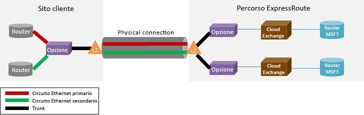

# Domande frequenti su ExpressRoute
## Che cos'è ExpressRoute?
ExpressRoute è un servizio di Azure che permette di creare connessioni private tra i data center Microsoft e l'infrastruttura disponibile localmente o in una struttura con percorso condiviso. Le connessioni ExpressRoute non sfruttano la rete Internet pubblica e offrono un livello di sicurezza superiore, maggiore affidabilità, velocità più elevate e minori latenze rispetto alle connessioni Internet tradizionali.

### Quali sono i vantaggi dell'uso di ExpressRoute e delle connessioni di rete private?
Le connessioni ExpressRoute non sfruttano la rete Internet pubblica e offrono un livello di sicurezza superiore, maggiore affidabilità, velocità più elevate e latenze minori e coerenti rispetto alle connessioni Internet tradizionali. In alcuni casi, l'uso di connessioni ExpressRoute per trasferire dati tra dispositivi locali e Azure può produrre vantaggi significativi in termini di costi.

### Dov'è disponibile il servizio?
Per informazioni sulla località e la disponibilità del servizio, vedere [Partner e località per ExpressRoute](expressroute-locations.md).

### In che modo è possibile usare ExpressRoute per connettersi a Microsoft se non è disponibile una relazione con uno dei partner del gestore ExpressRoute?
Si può selezionare un gestore regionale e connessioni Ethernet via terra in una delle sedi supportate del provider di Exchange. È quindi possibile connettersi a Microsoft nella sede del provider. Per verificare se il provider di servizio è presente in una delle località di Exchange, vedere l'ultima sezione della pagina [Partner e località per ExpressRoute](expressroute-locations.md) . Sarà quindi possibile ordinare un circuito ExpressRoute tramite il provider di servizi per connettersi ad Azure.

### Quanto costa ExpressRoute?
Per informazioni sui prezzi, vedere [Dettagli prezzi](https://azure.microsoft.com/pricing/details/expressroute/) .

### Se si acquista un circuito ExpressRoute di una determinata larghezza di banda, la connessione VPN acquistata dal provider di servizi di rete deve essere della stessa velocità?
No. È possibile acquistare una connessione VPN di qualsiasi velocità dal provider di servizi. Tuttavia, la connessione ad Azure sarà limitata alla larghezza di banda del circuito ExpressRoute acquistato.

### Se si paga per un circuito ExpressRoute di una determinata larghezza di banda, si ha la possibilità di potenziarlo fino a velocità più elevate, se necessario?
Sì. I circuiti ExpressRoute sono configurati per supportare i casi in cui è possibile potenziare fino al doppio il limite di larghezza di banda acquistato, senza alcun costo aggiuntivo. Contattare il provider di servizi per verificare se supporta questa funzionalità.

### Si può usare la stessa connessione di rete privata con la rete virtuale e altri servizi di Azure contemporaneamente?
Sì. Dopo l'installazione, il circuito ExpressRoute consentirà di accedere ai servizi all'interno di una rete virtuale e ad altri servizi di Azure contemporaneamente. La connessione alle reti virtuali verrà effettuata tramite il percorso di peering privato e ad altri servizi tramite il percorso di peering pubblico.

### ExpressRoute offre un contratto di servizio?
Per altre informazioni, vedere la [pagina relativa al contratto di servizio per ExpressRoute](https://azure.microsoft.com/support/legal/sla/) .

## Servizi supportati
ExpressRoute supporta [tre domini di routing](expressroute-circuit-peerings.md) per diversi tipi di servizi.

Peering privato
* Reti virtuali, inclusi tutti i servizi cloud e tutte le macchine virtuali

Peering pubblico
* La maggior parte dei servizi di Azure con alcune eccezioni indicate sotto
* Power BI
* Dynamics 365 for Operations (noto in precedenza come Dynamics AX Online)

Peering Microsoft
* [Office 365](http://aka.ms/ExpressRouteOffice365)
* La maggior parte dei servizi di Dynamics 365 (noti in precedenza come CRM Online)
  * Dynamics 365 for Sales
  * Dynamics 365 for Customer Service
  * Dynamics 365 for Field Service
  * Dynamics 365 for Project Service

I servizi di Azure seguenti non sono supportati in ExpressRoute
* RETE CDN
* Test del carico di Visual Studio Team Services
* Multi-Factor Authentication
* Gestione traffico

## Dati e connessioni
### Esistono limiti alla quantità di dati trasferibili usando ExpressRoute?
Non esistono limiti alla quantità di dati trasferibili. Per informazioni sulle tariffe relative alle velocità della larghezza di banda, vedere [Dettagli prezzi](https://azure.microsoft.com/pricing/details/expressroute/) .

### Quali sono le velocità di connessione supportate da ExpressRoute?
Offerte relative alle larghezze di banda supportate:

|50 Mbps, 100 Mbps, 200 Mbps, 500 Mbps, 1 Gbps, 2 Gbps, 5 Gbps, 10 Gbps|

### Quali provider del servizio sono disponibili?
Per l'elenco dei provider di servizi e delle relative località, vedere [Partner e località per ExpressRoute](expressroute-locations.md) .

## Dettagli tecnici
### Quali sono i requisiti tecnici per la connessione della posizione locale ad Azure?
Per informazioni sui requisiti, vedere la [pagina dei prerequisiti di ExpressRoute](expressroute-prerequisites.md) .

### Le connessioni a ExpressRoute sono ridondanti?
Sì. Ogni circuito ExpressRoute ha una coppia ridondante di connessioni incrociate configurate per garantire una disponibilità elevata.

### In caso di errore di un collegamento a ExpressRoute, verrà persa la connettività?
In caso di errore di una delle connessioni incrociate, la connettività non verrà persa. È attualmente disponibile una connessione ridondante per supportare il carico della rete. Si possono creare più circuiti in sedi di peering diverse per ottenere una maggiore resilienza agli errori.

### Se non si condivide un percorso in un'infrastruttura Cloud Exchange e il provider di servizi offre una connessione punto a punto, è necessario ordinare due connessioni fisiche tra la rete locale e Microsoft?
No, è sufficiente una connessione fisica se il provider di servizi è in grado di stabilire due circuiti virtuali Ethernet sulla connessione fisica. La connessione fisica, ad esempio una fibra ottica, viene terminata su un dispositivo di livello 1 (L1) (vedere l'immagine seguente). I due circuiti virtuali Ethernet sono contrassegnati con ID VLAN diversi, uno per il circuito primario e uno per quello secondario. Gli ID VLAN sono nell'intestazione Ethernet 802.1Q esterna. L'intestazione Ethernet 802.1Q interna, non indicata nella figura, viene mappata a un [dominio di routing ExpressRoute](expressroute-circuit-peerings.md)specifico. 

### Si può estendere una delle reti VLAN ad Azure tramite ExpressRoute?
No. Non sono supportate estensioni alla connettività di livello 2 in Azure.

### La sottoscrizione può includere più di un circuito ExpressRoute?
Sì. La sottoscrizione può includere più di un circuito ExpressRoute. Il limite predefinito per il numero di circuiti dedicati è impostato su 10. Se necessario, contattare il supporto tecnico Microsoft per aumentare il limite.

### Si possono usare circuiti ExpressRoute di diversi provider di servizi?
Sì. È possibile usare i circuiti ExpressRoute con molti provider di servizi. Ogni circuito ExpressRoute sarà associato a un solo provider di servizi. 

### È possibile avere più circuiti ExpressRoute nello stesso percorso?
Sì. È possibile avere più circuiti ExpressRoute con provider di servizi uguali o diversi nello stesso percorso. Non sarà tuttavia possibile collegare più di un circuito ExpressRoute alla stessa rete virtuale.

### Come si connettono le reti virtuali a un circuito ExpressRoute?
Di seguito è illustrata la procedura di base.

* È necessario stabilire un circuito ExpressRoute e richiedere al provider di servizi di abilitarlo.
* L'utente o il provider devono configurare i peering BGP.
* È necessario collegare la rete virtuale al circuito ExpressRoute.

Per altre informazioni, vedere [Flussi di lavoro e stati di provisioning di un circuito ExpressRoute](expressroute-workflows.md) .

### Sono previsti limiti di connettività per il circuito ExpressRoute?
Sì. [Partner e località per ExpressRoute](expressroute-locations.md) offre una panoramica dei limiti di connettività per un circuito ExpressRoute. La connettività per un circuito ExpressRoute è limitata a una singola area geopolitica. È possibile espandere la connettività per superare le aree geopolitiche abilitando la funzionalità Premium di ExpressRoute.

### Un circuito ExpressRoute può essere collegato a più reti virtuali?
Sì. È possibile avere fino a 10 connessioni di reti virtuali in un circuito ExpressRoute Standard e fino a 100 in un [circuito ExpressRoute Premium](#expressroute-premium). 

### Sono disponibili più sottoscrizioni di Azure che contengono reti virtuali. È possibile connettere reti virtuali di sottoscrizioni distinte a un singolo circuito ExpressRoute?
Sì. È possibile autorizzare fino a 10 sottoscrizioni di Azure a usare un unico circuito ExpressRoute. Per aumentare questo limite, abilitare la funzionalità Premium di ExpressRoute.

Per altri dettagli, vedere [Condivisione di un circuito ExpressRoute tra più sottoscrizioni](expressroute-howto-linkvnet-arm.md).

### Le reti virtuali connesse allo stesso circuito sono isolate tra loro?
No. Tutte le reti virtuali collegate allo stesso circuito ExpressRoute appartengono allo stesso dominio di routing e non sono isolate tra loro dal punto di vista del routing. Se è necessario l'isolamento delle route, creare un circuito ExpressRoute separato.

### È possibile connettere una sola rete virtuale a più circuiti ExpressRoute?
Sì. È possibile collegare una singola rete virtuale con un massimo di quattro circuiti ExpressRoute. Devono essere ordinati in 4 [località per ExpressRoute](expressroute-locations.md)diverse.

### Si può accedere a Internet usando le reti virtuali connesse a circuiti ExpressRoute?
Sì. Se non è stata eseguita la pubblicazione di route predefinite (0.0.0.0/0) o prefissi di route Internet tramite la sessione BGP, sarà possibile connettersi a Internet da una rete virtuale collegata a un circuito ExpressRoute.

### Si può bloccare la connettività Internet per le reti virtuali connesse a circuiti ExpressRoute?
Sì. È possibile pubblicare route predefinite (0.0.0.0/0) per bloccare tutta la connettività Internet per le macchine virtuali distribuite in una rete virtuale e indirizzare tutto il traffico in uscita attraverso il circuito ExpressRoute. Si noti che se si pubblicano route predefinite, il traffico verrà forzato verso i servizi offerti tramite peering pubblico, ad esempio l'archiviazione di Azure e database SQL, nella sede locale. Sarà necessario configurare i router in modo che restituiscano traffico ad Azure tramite il percorso di peering pubblico su Internet.

### Le reti virtuali collegate allo stesso circuito ExpressRoute possono comunicare tra loro?
Sì. Le macchine virtuali distribuite in reti virtuali connesse allo stesso circuito ExpressRoute possono comunicare tra loro.

### È possibile usare la connettività da sito per reti virtuali insieme a ExpressRoute?
Sì. ExpressRoute può coesistere con VPN da sito a sito.

### È possibile spostare una rete virtuale da una configurazione da sito a sito o da punto a sito, in modo da usare ExpressRoute?
Sì. Sarà necessario creare un gateway di ExpressRoute nella rete virtuale. Il processo comporterà un breve tempo di inattività.

### Perché esiste un indirizzo IP pubblico associato al gateway ExpressRoute in una rete virtuale?
Questo indirizzo IP pubblico viene usato esclusivamente per la gestione interna. Non viene esposto a Internet e non costituisce un rischio per la sicurezza della rete virtuale.

### Cosa si deve fare per connettersi al servizio di archiviazione di Azure tramite ExpressRoute?
Si deve stabilire un circuito ExpressRoute e configurare le route per il peering pubblico.

### Sono previsti limiti per i numeri di route pubblicabili?
Sì. Sono accettati al massimo 4000 prefissi di route per il peering privato e 200 ciascuno per il peering pubblico e il peering Microsoft. Se si abilita la funzionalità Premium di ExpressRoute, sarà possibile aumentare questo valore fino a 10.000 route per il peering privato.

### Sono previste limitazioni per gli intervalli IP pubblicabili tramite la sessione BGP?
I prefissi privati (RFC1918) non sono accettati nella sessione BGP per il peering pubblico e di Microsoft.

### Cosa succede se si superano i limiti per BGP?
Le sessioni BGP saranno rimosse. Saranno ripristinate quando il numero di prefissi tornerà sotto il limite consentito.

### Che cos'è il tempo di attesa BGP ExpressRoute? È possibile regolarlo?
Il tempo di attesa è 180. I messaggi keep-alive vengono inviati ogni 60 secondi. Queste sono impostazioni fisse sul lato Microsoft che non è possibile modificare.

### Dopo la pubblicazione della route predefinita (0.0.0.0/0) alle reti virtuali, non è possibile attivare Windows in esecuzione nelle macchine virtuali di Azure. Come si risolve questo problema?
I passaggi seguenti permettono ad Azure di riconoscere la richiesta di attivazione:

1. Stabilire il peering pubblico per il circuito ExpressRoute.
2. Eseguire una ricerca DNS e trovare l'indirizzo IP di **kms.core.windows.net**
3. Eseguire una delle operazioni seguenti in modo che il Servizio di gestione delle chiavi riconosca che la richiesta di attivazione proviene da Azure e soddisfi la richiesta.
   * Nella rete locale reindirizzare il traffico destinato all'indirizzo IP (ottenuto nel passaggio 2) ad Azure tramite il peering pubblico.
   * Richiedere al provider di servizi di rete di reindirizzare il traffico ad Azure tramite il peering pubblico.

### È possibile modificare la larghezza di banda di un circuito ExpressRoute?
Sì, è possibile provare ad aumentare la larghezza di banda del circuito ExpressRoute nel portale di Azure o con PowerShell. Se è disponibile capacità sulla porta fisica in cui è stato creato il circuito, la modifica avrà esito positivo. Se la modifica ha esito negativo, significa che la capacità residua sulla porta corrente non è sufficiente e che è necessario creare un nuovo circuito ExpressRoute con maggiore larghezza di banda OPPURE che il percorso non ha altra capacità. In quest'ultimo caso non sarà possibile aumentare la larghezza di banda. Sarà anche necessario contattare il provider di connettività per assicurare che aggiorni le limitazioni della propria rete per supportare l'incremento della larghezza di banda. Non è tuttavia possibile ridurre la larghezza di banda del circuito ExpressRoute. Sarà necessario creare un nuovo circuito ExpressRoute con larghezza di banda inferiore ed eliminare il circuito precedente.

### Come si modifica la larghezza di banda di un circuito ExpressRoute?
È possibile aggiornare la larghezza di banda del circuito ExpressRoute usando l'API dedicata per l'aggiornamento del circuito e il cmdlet di PowerShell.

## ExpressRoute Premium
### Che cos'è ExpressRoute Premium?
ExpressRoute Premium include le funzionalità seguenti.

* Aumento del limite delle tabelle di routing da 4000 a 10.000 route per il peering privato.
* Incremento del numero di VNet che possono essere connesse al circuito ExpressRoute (il valore predefinito è 10). Per informazioni dettagliate, vedere la tabella seguente.
* Connettività globale sulla rete di base Microsoft. È ora possibile collegare una VNet in un'area geopolitica a un circuito ExpressRoute in un'altra area. **Esempio:** è possibile collegare una VNet creata in Europa occidentale a un circuito ExpressRoute creato a Silicon Valley. **Altro esempio:** sul peering pubblico, i prefissi di altre aree geopolitiche vengono annunciati in modo che sia ad esempio possibile connettersi a SQL Azure in Europa occidentale da un circuito di Silicon Valley.
* Connettività ai servizi di Office 365 e a CRM Online.

### Quante VNet possono essere collegate a un circuito ExpressRoute se è stato abilitato ExpressRoute Premium?
Le tabelle seguenti illustrano i limiti di ExpressRoute e il numero di reti virtuali per ogni circuito ExpressRoute.

[!INCLUDE [expressroute-limits](../../includes/expressroute-limits.md)]

### Come si abilita ExpressRoute Premium?
Le funzionalità di ExpressRoute Premium possono essere abilitate quando si attiva la funzionalità e possono essere arrestate tramite l'aggiornamento dello stato del circuito. È possibile abilitare ExpressRoute Premium in fase di creazione del circuito oppure chiamare l'API dedicata per l'aggiornamento del circuito o il cmdlet di PowerShell per abilitare ExpressRoute Premium.

### Come si disabilita ExpressRoute Premium?
È possibile disabilitare ExpressRoute Premium chiamando l'API o il cmdlet di PowerShell dedicata per l'aggiornamento del circuito. È necessario assicurarsi di avere ridimensionato le esigenze di connettività per soddisfare i limiti predefiniti prima di disabilitare ExpressRoute Premium. La richiesta di disabilitazione di ExpressRoute Premium avrà esito negativo se l'utilizzo supera i limiti predefiniti.

### È possibile scegliere solo alcune funzionalità di ExpressRoute Premium?
No. Non sarà possibile selezionare le funzionalità necessarie. Quando si attiva ExpressRoute Premium, vengono abilitate tutte le funzionalità.

### Quanto costa ExpressRoute Premium?
Per informazioni sui costi, vedere [Dettagli prezzi](https://azure.microsoft.com/pricing/details/expressroute/) .

### È necessario un pagamento aggiuntivo per ExpressRoute Premium, oltre agli addebiti per la versione standard di ExpressRoute?
Sì. Gli addebiti per ExpressRoute Premium vengono sommati agli addebiti per ExpressRoute e agli addebiti richiesti dal provider di connettività.

## ExpressRoute e servizi di Office 365 e CRM Online
[!INCLUDE [expressroute-office365-include](../../includes/expressroute-office365-include.md)]

### Come si crea un circuito di ExpressRoute per la connessione ai servizi di Office 365 e a CRM Online?
1. Per assicurarsi di soddisfare i requisiti previsti, vedere la pagina sui [prerequisiti di ExpressRoute](expressroute-prerequisites.md).
2. Per assicurarsi di soddisfare le esigenze specifiche a livello di connettività, vedere l'elenco di provider di servizi e località in [Partner e località per ExpressRoute](expressroute-locations.md) .
3. Per pianificare i requisiti relativi alla capacità, vedere la pagina relativa alla [pianificazione e al perfezionamento delle prestazioni di rete per Office 365](http://aka.ms/tune/).
4. Seguire la procedura indicata nei flussi di lavoro sotto per configurare la connettività dei [flussi di lavoro ExpressRoute per provisioning e stati di un circuito](expressroute-workflows.md).

> [!IMPORTANT]
> Assicurarsi che sia stato abilitato il componente aggiuntivo ExpressRoute Premium quando si configura la connettività ai servizi di Office 365 e a CRM Online.
> 
> 

### È necessario abilitare il peering pubblico di Azure per connettersi ai servizi Office 365 e CRM Online?
No, è sufficiente abilitare il peering Microsoft. Il traffico di autenticazione verrà inviato ad Azure AD attraverso il peering Microsoft. 

### I circuiti ExpressRoute esistenti possono supportare la connettività ai servizi di Office 365 e a CRM Online?
Sì. È possibile configurare i circuiti ExpressRoute esistenti per supportare la connettività ai servizi di Office 365. Assicurarsi di avere una capacità sufficiente a connettersi ai servizi di Office 365 e verificare che sia stato abilitato il componente aggiuntivo Premium. [pianificazione e al perfezionamento delle prestazioni di rete per Office 365](http://aka.ms/tune/) . Vedere inoltre [Creare e modificare un circuito ExpressRoute](expressroute-howto-circuit-classic.md).

### A quali servizi di Office 365 è possibile accedere tramite una connessione ExpressRoute?
Per un elenco aggiornato dei servizi supportati con ExpressRoute, vedere la pagina [URL e intervalli di indirizzi IP per Office 365](http://aka.ms/o365endpoints).

### Quanto costa ExpressRoute per i servizi di Office 365 e CRM Online?
Per i servizi di Office 365 e CRM Online deve essere abilitato il componente aggiuntivo Premium. Per informazioni dettagliate sui costi di ExpressRoute, vedere la [pagina relativa ai prezzi](https://azure.microsoft.com/pricing/details/expressroute/) .

### In quali aree è supportato ExpressRoute per Office 365?
Per altre informazioni sull'elenco di partner e località in cui è supportato ExpressRoute, vedere [Partner e località per ExpressRoute](expressroute-locations.md) .

### È possibile accedere a Office 365 tramite Internet anche se ExpressRoute è stato configurato per l'organizzazione specifica?
Sì. Gli endpoint di Office 365 sono raggiungibili tramite Internet anche se ExpressRoute è stato configurato per la rete specifica. Se ci si trova in una località configurata per la connessione ai servizi di Office 365 tramite ExpressRoute, la connessione verrà effettuata tramite ExpressRoute.

### È possibile accedere a Dynamics 365 for Operations (noto in precedenza come) Dynamics AX Online tramite una connessione ExpressRoute?
Sì. [Dynamics 365 for Operations](https://www.microsoft.com/dynamics365/operations) è ospitato in Azure. È possibile abilitare il peering pubblico di Azure nel circuito ExpressRoute per connettersi. 

