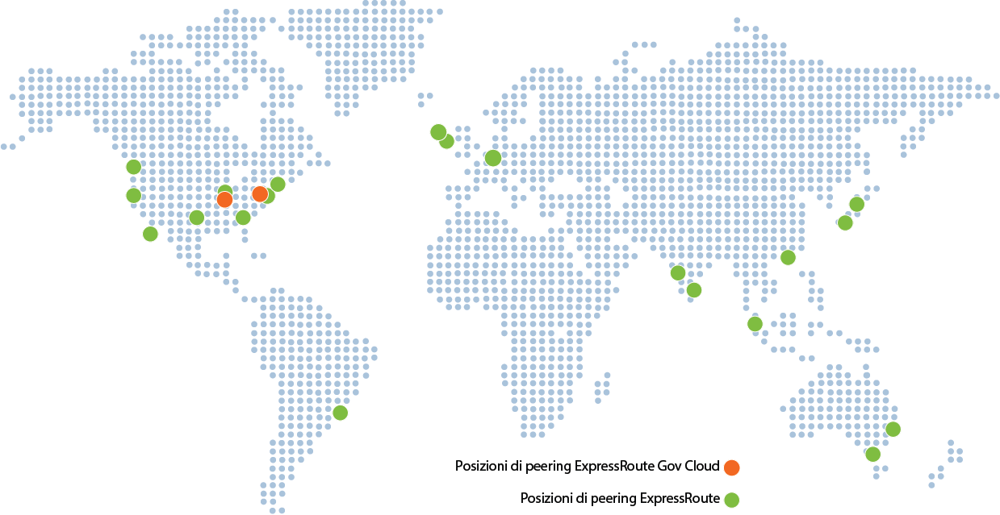

<properties
   pageTitle="Percorsi di ExpressRoute | Microsoft Azure"
   description="Questo articolo fornisce una panoramica dettagliata delle località in cui vengono offerti i servizi e informazioni su come connettersi alle aree di Azure."
   services="expressroute"
   documentationCenter="na"
   authors="cherylmc"
   manager="carolz"
   editor="" />
<tags
   ms.service="expressroute"
   ms.devlang="na"
   ms.topic="get-started-article"
   ms.tgt_pltfrm="na"
   ms.workload="infrastructure-services"
   ms.date="09/22/2015"
   ms.author="cherylmc" />

# Partner e località di peering per ExpressRoute

Le tabelle in questo articolo includono informazioni su provider di connettività ExpressRoute, copertura geografica di ExpressRoute, servizi cloud Microsoft supportati tramite ExpressRoute e integratori di sistemi ExpressRoute.

## Provider di connettività ExpressRoute

ExpressRoute è supportato in tutte le aree e le località di Azure. La mappa seguente fornisce un elenco di aree di Azure e località per ExpressRoute. Per località ExpressRoute si intendono le aree in cui è attivo il peering di Microsoft con alcuni provider di servizi.

Si otterrà l'accesso al servizio di Azure in tutte le aree di un'area geopolitica se è stata effettuata la connessione ad almeno una località per ExpressRoute entro l'area geopolitica. La tabella seguente fornisce una mappa di aree di Azure e di località ExpressRoute in un'area geopolitica.

|**Area geopolitica**|**Aree di Azure**|**Località per ExpressRoute**|
|---|---|---|
|**America del Nord**|Tutte le aree degli Stati Uniti: Stati Uniti orientali, Stati Uniti occidentali, Stati Uniti orientali 2, Stati Uniti centrali, Stati Uniti centro-meridionali, Stati Uniti centro-settentrionali|Atlanta, Chicago, Dallas, Los Angeles, New York, Seattle, Silicon Valley, Washington DC|
|**America del Sud**|Brasile meridionale|Sao Paulo|
|**Europa**|Europa settentrionale, Europa occidentale|Amsterdam, Dublino+, Londra|
|**Asia**|Asia orientale, Asia sudorientale|Hong Kong, Singapore|
|**Giappone**|Giappone occidentale, Giappone orientale|Osaka, Tokyo|
|**Australia**|Australia sudorientale, Australia orientale|Melbourne, Sydney|
|**India**|India occidentale, India centrale, India Meridionale|Chennai, Mumbai|

Nella tabella seguente vengono fornite informazioni su aree e confini geopolitici per cloud nazionali.

|**Area geopolitica**|**Aree di Azure**|**Località per ExpressRoute**|
|---|---|---|---|
|**Cloud del governo degli Stati Uniti**|Governo degli Stati Uniti|Iowa, Virginia|Ashburn, Chicago|

La connettività tra diverse aree geopolitiche non è supportata nello standard SKU EspressRoute. È necessario attivare il componente aggiuntivo premium ExpressRoute per supportare la connettività globale. La connettività per ambienti cloud nazionale non è supportata. È possibile utilizzare il provider di connettività in caso di necessità.

## Posizioni del provider di connettività

### Produzione Azure

| **Provider di servizi** |**Microsoft Azure** | **Office 365** | **Località** |
|-----------------------|--------------------|----------------|---------------|
| **[Aryaka Networks](http://www.aryaka.com/)** | Supportato | Supportato | Amsterdam, Silicon Valley, Singapore, Washington DC |
| **[AT & T NetBond](https://www.synaptic.att.com/clouduser/html/productdetail/ATT_NetBond.htm)** | Supportato | Supportato | Amsterdam, Londra+, Dallas, Silicon Valley, Washington DC |
| **[British Telecom](http://www.globalservices.bt.com/uk/en/news/bt_to_provide_connectivity_to_microsoft_azure)** | Supportato | Supportato | Amsterdam, Londra, Silicon Valley, Singapore, Tokyo, Washington DC |
|**China Telecom Global** | Imminente | Non supportato | Hong Kong+ |
| **[Colt](http://www.colt.net/uk/en/news/colt-announces-dedicated-cloud-access-for-microsoft-azure-services-en.htm)** | Supportato | Non supportato | Amsterdam, Londra |
| **Comcast** | Supportato | Non supportato | Silicon Valley, Washington DC |
| **CoreSite** | Supportato | Non supportato | Los Angeles | 
| **[Equinix](http://www.equinix.com/partners/microsoft-azure/)** | Supportato | Supportato | Amsterdam, Atlanta, Chicago, Dallas, Hong Kong, Londra, Los Angeles, Melbourne, New York, Osaka, San Paolo, Seattle, Silicon Valley, Singapore, Sydney, Tokyo, Washington DC |
| **[Internet Initiative Japan Inc. - IIJ](http://www.iij.ad.jp/en/news/pressrelease/2013/pdf/Azure_E.pdf)** | Supportato | Non supportato | Tokyo |
| **[InterCloud](https://www.intercloud.com/)** | Supportato | Supportato | Amsterdam, Londra, Singapore, Washington DC |
| **Internet Solutions - Cloud Connect** | Supportato | Supportato | Amsterdam, Londra |
| **Interxion** | Supportato | Non supportato | Amsterdam |
| **[Level 3 Communications](http://your.level3.com/LP=882?WT.tsrc=02192014LP882AzureVanityAzureText)** | Supportato | Non supportato | Amsterdam, Chicago, Dallas, Londra, Seattle, Silicon Valley, Washington DC |
| **Megaport** | Supportato | Non supportato | Melbourne, Sydney |
| **MTN** | Supportato | Non supportato | Londra |
| **NTT Communications** | Supportato | Non supportato | Londra+, Tokyo |
| **NEXTDC** | Supportato | Non supportato | Melbourne, Sydney+ |
| **[Orange](http://www.orange-business.com/)** | Supportato | Non supportato | Amsterdam, Hong Kong, Londra, Silicon Valley, Singapore, Washington DC |
| **PCCW Global Limited** | Supportato | Non supportato | Hong Kong |
| **[SingTel](http://info.singtel.com/about-us/news-releases/singtel-provide-secure-private-access-microsoft-azure-public-cloud)** | Supportato | Non supportato | Singapore |
| **[Tata Communications](http://www.tatacommunications.com/lp/izo/azure/azure_index.html)** | Supportato | Supportato | Amsterdam, Chennai+, Hong Kong, Londra, Mumbai, Singapore |
| **[TeleCity Group](http://www.telecitygroup.com/investor-centre/news_details.htm?locid=03100500400b00d&xml)** | Supportato | Supportato | Amsterdam, Londra |
| **[Telstra Corporation](http://www.telstra.com.au/business-enterprise/network-services/networks/cloud-direct-connect/)** | Supportato | Non supportato | Melbourne, Sydney |
| **[Verizon](http://www.verizonenterprise.com/products/networking/secure-cloud-interconnect/)** | Supportato | Supportato | Hong Kong, Londra, Silicon Valley, Sydney, Washington DC |
| **Vodafone** | Supportato | Non supportato | Londra | 
| **[Zayo Group](http://www.zayo.com/)** | Supportato | Non supportato | Chicago, Silicon Valley, Washington DC |

 **+** indica disponibile a breve

### Ambienti cloud nazionali

#### Cloud del governo degli Stati Uniti

| **Provider di servizi** |**Microsoft Azure** | **Office 365** | **Località** |
|-----------------------|--------------------|----------------|---------------|
| **[AT & T NetBond](https://www.synaptic.att.com/clouduser/html/productdetail/ATT_NetBond.htm)** | Supportato | Non supportato | Chicago+, Washington DC |
| **[Equinix](http://www.equinix.com/partners/microsoft-azure/)** | Imminente | Non supportato | Chicago +, Washington DC + |
| **[Level 3 Communications - IPVPN](http://your.level3.com/LP=882?WT.tsrc=02192014LP882AzureVanityAzureText)** | Supportato | Non supportato | Chicago+, Washington DC |
| **[Verizon](http://news.verizonenterprise.com/2014/04/secure-cloud-interconnect-solutions-enterprise/)** | Supportato | Non supportato | Chicago+, Washington DC |

## Connettività tramite provider di servizi non elencati

Se il provider di connettività non è incluso nelle sezioni precedenti, sarà comunque possibile creare una connessione.

- Contattare il provider di connettività per verificare se è connesso a uno qualsiasi degli scambi nella tabella precedente. Per altre informazioni sui servizi offerti dai provider di Exchange, è possibile esaminare i seguenti collegamenti. Alcuni provider di connettività sono già connessi agli scambi Ethernet.

	- [Equinix Cloud Exchange](http://www.equinix.com/services/interconnection-connectivity/cloud-exchange/)
	- [TeleCity CloudIX](http://www.telecitygroup.com/colocation-services/cloud-ix.htm)
	- [Interxion](http://www.interxion.com/)
	- [NEXTDC](http://www.nextdc.com/)
	- [CoreSite](http://www.coresite.com/)
- Richiedere al provider di connettività di estendere la rete alla località di peering scelta.
	- Assicurarsi che il provider di connettività estenda la connettività con disponibilità elevata, in modo che non siano presenti singoli punti di errore.
- Ordinare a un circuito ExpressRoute con scambio come provider di connettività di connettersi a Microsoft.
	- Per configurare la connettività, eseguire la procedura illustrata in [Creare un circuito ExpressRoute](expressroute-howto-circuit-classic.md).

|**Provider di connettività**|**Exchange**|**Località di peering**|
|---|---|---|
|**[XO Communications](http://www.xo.com/)**|Equinix|Silicon Valley|

## Integratori di sistemi ExpressRoute

L'abilitazione della connettività privata per soddisfare le proprie esigenze può risultare complessa, in base alle dimensioni della rete. Per ottenere supporto per l'onboarding in ExpressRoute, è possibile collaborare con uno degli Integratori di sistemi elencati nella seguente tabella.

|**Integratore di sistemi**|**Continente**|
|---|---|
|**[Nimbo](http://www.nimbo.com/)**|Stati Uniti||
|**[Dotnet Solutions](http://www.dotnetsolutions.co.uk/)**|Europa, Medio Oriente e Africa|

## Passaggi successivi

- Per altre informazioni su ExpressRoute, vedere le [Domande frequenti su ExpressRoute](expressroute-faqs.md).
- Verificare che vengano soddisfatti tutti i prerequisiti. Vedere [Prerequisiti per ExpressRoute](expressroute-prerequisites.md).

<!---HONumber=Nov15_HO2-->