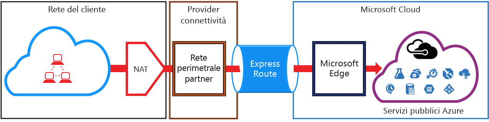
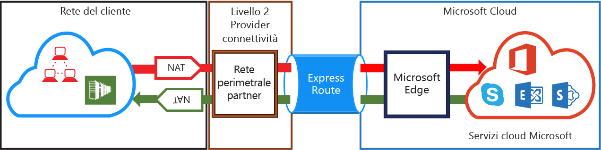

# Requisiti NAT di ExpressRoute
Per connettersi a servizi cloud Microsoft tramite ExpressRoute, è necessario configurare e gestire NAT. Alcuni provider di connettività offrono la configurazione e la gestione di NAT come servizio gestito. Contattare il provider di connettività per informarsi se viene offerto un servizio di questo tipo. Se questo servizio non è offerto, è necessario soddisfare i requisiti descritti di seguito. 

Per una panoramica dei diversi domini di routing, vedere la pagina [Circuiti e domini di routing ExpressRoute](expressroute-circuit-peerings.md) . Per soddisfare i requisiti di indirizzi IP pubblici per i peering Microsoft e pubblico di Azure, è consigliabile configurare un'infrastruttura NAT tra la rete e Microsoft. Questa sezione fornisce una descrizione dettagliata dell'infrastruttura NAT che è necessario configurare.

## Requisiti NAT per il peering pubblico di Azure
Il percorso di peering pubblico di Azure consente di connettersi a tutti i servizi ospitati in Azure tramite i relativi indirizzi IP pubblici. Sono inclusi i servizi elencati nell'articolo [Domande frequenti su ExpressRoute](expressroute-faqs.md) e tutti i servizi ospitati da ISV in Microsoft Azure. 

> [!IMPORTANT]
> La connettività ai servizi di Microsoft Azure nel peering pubblico viene sempre avviata dalla propria rete nella rete Microsoft. Non è quindi possibile avviare sessioni da servizi di Microsoft Azure alla propria rete tramite ExpressRoute. Se si prova a eseguire questa operazione, i pacchetti inviati a tali indirizzi IP annunciati useranno Internet anziché ExpressRoute.
> 

Il traffico destinato a Microsoft Azure nel peering pubblico deve essere inviato tramite SNAT a indirizzi IPv4 pubblici validi per poter accedere alla rete Microsoft. La figura seguente riporta come eseguire una configurazione generale della NAT per soddisfare i requisiti elencati precedentemente.

 

### Annunci di route e pool IP di NAT
È necessario assicurarsi che il traffico acceda al percorso di peering pubblico di Azure con un indirizzo IPv4 pubblico valido. Microsoft deve essere in grado di convalidare la proprietà del pool di indirizzi IPv4 NAT a fronte di un registro Internet di routing regionale (RIR) o di un registro di routing Internet (IRR). Verrà eseguito un controllo in base al numero AS usato per il peering e agli indirizzi IP usati per l'infrastruttura NAT. Per informazioni sui registri di routing, fare riferimento alla pagina relativa ai [requisiti di routing di ExpressRoute](expressroute-routing.md) .

Non esistono restrizioni per la lunghezza del prefisso IP NAT annunciato tramite questo peering. È necessario monitorare il pool di NAT e assicurarsi che le sessioni NAT non siano prive di risorse.

> [!IMPORTANT]
> Il pool IP NAT annunciato per Microsoft non deve essere annunciato per Internet, altrimenti verrebbe interrotta la connettività con altri servizi Microsoft.
> 
> 

## Requisiti NAT per il peering Microsoft
Il percorso di peering Microsoft consente di connettersi a servizi cloud Microsoft che non sono supportati tramite il percorso di peering pubblico di Azure. L'elenco dei servizi include servizi Office 365 quali Exchange Online, SharePoint Online, Skype for Business e Dynamics 365. Microsoft prevede di supportare la connettività bidirezionale nel peering Microsoft. Il traffico destinato ai servizi cloud Microsoft nel peering pubblico deve essere inviato tramite SNAT a indirizzi IPv4 pubblici validi per poter accedere alla rete Microsoft. Il traffico destinato alla propria rete dai servizi cloud Microsoft deve essere inviato tramite SNAT al perimetro Internet per evitare il [routing asimmetrico](expressroute-asymmetric-routing.md). La figura seguente riporta come eseguire una configurazione generale della NAT per il peering Microsoft.

 

### Traffico proveniente dalla propria rete e destinato a Microsoft
* È necessario assicurarsi che il traffico acceda al percorso di peering Microsoft con un indirizzo IPv4 pubblico valido. Microsoft deve essere in grado di convalidare il proprietario del pool di indirizzi IPv4 NAT a fronte del registro Internet di routing regionale (RIR) o di un registro di routing Internet (IRR). Verrà eseguito un controllo in base al numero AS usato per il peering e agli indirizzi IP usati per l'infrastruttura NAT. Per informazioni sui registri di routing, fare riferimento alla pagina relativa ai [requisiti di routing di ExpressRoute](expressroute-routing.md) .
* Gli indirizzi IP usati per la configurazione del peering pubblico di Azure e altri circuiti ExpressRoute non devono essere annunciati a Microsoft tramite la sessione BGP. Non esiste alcuna restrizione per la lunghezza del prefisso IP NAT annunciato tramite questo peering.
  
  > [!IMPORTANT]
  > Il pool IP NAT annunciato per Microsoft non deve essere annunciato per Internet, altrimenti verrebbe interrotta la connettività con altri servizi Microsoft.
  > 
  > 

### Traffico proveniente da Microsoft e destinato alla propria rete
* Per alcuni scenari è necessario che Microsoft avvii la connettività agli endpoint di servizio ospitati nella propria rete. Un esempio tipico di scenario è rappresentato dalla connettività a server ADFS ospitati nella propria rete da Office 365. In questi casi, è necessario inviare prefissi appropriati dalla propria rete al peering Microsoft. 
* È necessario inviare il traffico Microsoft tramite SNAT al perimetro Internet per consentire agli endpoint di servizio della rete di impedire il [routing asimmetrico](expressroute-asymmetric-routing.md). Le richieste **e le risposte** con un IP di destinazione corrispondente a una route ricevuta tramite ExpressRoute verranno sempre inviate tramite ExpressRoute. Il routing asimmetrico si verifica se la richiesta viene ricevuta tramite Internet con la risposta inviata tramite ExpressRoute. L'invio tramite SNAT del traffico Microsoft in ingresso al perimetro Internet forza il traffico di risposta di nuovo verso il perimetro Internet, risolvendo il problema.

## Passaggi successivi
* Fare riferimento ai requisiti per [routing](expressroute-routing.md) e [QoS](expressroute-qos.md).
* Per informazioni sul flusso di lavoro, vedere [Flussi di lavoro e stati di provisioning di un circuito ExpressRoute](expressroute-workflows.md).
* Configurare la connessione ExpressRoute.
  
  * [Creare un circuito ExpressRoute](expressroute-howto-circuit-classic.md)
  * [Configurare il routing](expressroute-howto-routing-classic.md)
  * [Collegare una rete virtuale a un circuito ExpressRoute](expressroute-howto-linkvnet-classic.md)

