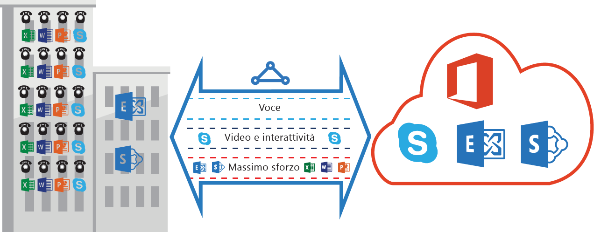

# Requisiti ExpressRoute QoS
Skype per aziende dispone di diversi carichi di lavoro che richiedono la gestione QoS differenziata. Se si prevede di utilizzare i servizi vocali tramite ExpressRoute, è necessario rispettare i requisiti descritti di seguito.

> [!NOTE]
> I requisiti QoS si applicano solo ai peer Microsoft. I valori DSCP del traffico di rete ricevuti nel peer pubblico e nel peer privato di Azure saranno reimpostati su 0. 
> 
> 

La tabella seguente fornisce un elenco di contrassegni DSCP utilizzati da Skype per aziende. Fare riferimento a [Gestione QoS per Skype per aziende](https://technet.microsoft.com/library/gg405409.aspx) per ulteriori informazioni.

| **Classe di traffico** | **Modalità di gestione (contrassegno DSCP)** | **Carichi di lavoro di Skype per aziende** |
| --- | --- | --- |
| **Voice** |ENTITY FRAMEWORK (46) |Skype / voice di Lync |
| **Interattivo** |AF41 (34) |Video, VBSS |
| AF21 (18) |Condivisione delle app | |
| **Default** |AF11 (10) |Trasferimento di file |
| CS0 (0) |Altro | |

* È necessario classificare i carichi di lavoro e contrassegnare i valori DSCP corretti. Seguire le indicazioni fornite [qui](https://technet.microsoft.com/library/gg405409.aspx) su come impostare i contrassegni DSCP nella rete.
* È necessario configurare e supportare più code di QoS nella rete. La Voce deve essere una classe autonoma e ricevere il trattamento di Entity Framework specificato in RFC 3246. 
* È possibile decidere il meccanismo di accodamento, i criteri di rilevamento della congestione e l’allocazione della larghezza di banda per ogni classe di traffico. Tuttavia, è necessario mantenere il contrassegno DSCP per i carichi di lavoro di Skype per aziende. Se si utilizzano i contrassegni DSCP non elencati sopra, ad esempio AF31 (26), è necessario riscrivere il valore DSCP su 0 prima di inviare il pacchetto a Microsoft. Microsoft invia solo i pacchetti contrassegnati con il valore di DSCP illustrato nella tabella precedente. 

## Passaggi successivi
* Fare riferimento ai requisiti per [Routing](expressroute-routing.md) e [NAT](expressroute-nat.md).
* Vedere i collegamenti seguenti per configurare la connessione ExpressRoute.
  
  * [Creare un circuito ExpressRoute](expressroute-howto-circuit-classic.md)
  * [Configurare il routing](expressroute-howto-routing-classic.md)
  * [Collegare una rete virtuale a un circuito ExpressRoute](expressroute-howto-linkvnet-classic.md)

