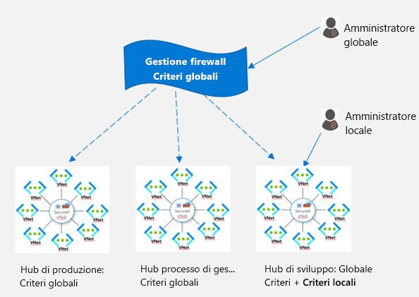

# Che cos'è Anteprima di Gestione firewall di Azure?

[!INCLUDE [Preview](../../includes/firewall-manager-preview-notice.md)]

Anteprima di Gestione firewall di Azure è un servizio di gestione della sicurezza che fornisce funzionalità di gestione dei criteri di sicurezza e delle route per i perimetri di sicurezza basati sul cloud. Funziona con [Hub rete WAN virtuale](../virtual-wan/virtual-wan-about.md#resources), una risorsa gestita da Microsoft che consente di creare facilmente architetture hub-spoke. Quando i criteri di sicurezza e routing vengono associati a un hub di questo tipo, quest'ultimo viene definito *[hub virtuale protetto](secured-virtual-hub.md)* . 

## Funzionalità di Anteprima di Gestione firewall di Azure

Anteprima di Gestione firewall di Azure offre le funzionalità seguenti:

### Distribuzione e configurazione centrali di Firewall di Azure

È possibile distribuire e configurare in modo centralizzato più istanze di Firewall di Azure che si estendono in diverse aree e sottoscrizioni di Azure. 

### Criteri gerarchici (globali e locali)

È possibile usare Anteprima di Gestione firewall di Azure per gestire in modo centralizzato i criteri di Firewall di Azure tra più hub virtuali protetti. I team IT centrali possono creare criteri firewall globali per applicare i criteri firewall dell'organizzazione a tutti i team. I criteri firewall creati localmente consentono un modello self-service DevOps per una maggiore agilità.

### Integrato con una soluzione di security come servizio di terze parti per una sicurezza avanzata

Oltre a Firewall di Azure, è possibile integrare i provider di terze parti per la security come servizio (SECaas) per fornire una protezione di rete aggiuntiva alle connessioni di rete virtuale e branch per Internet.

- Filtro del traffico da VNet a Internet (V2I)

   - Filtrare il traffico di rete virtuale in uscita con provider di sicurezza di terze parti preferito.
   - Sfruttare la protezione Internet avanzata in grado di riconoscere l'utente per i carichi di lavoro su cloud in esecuzione in Azure.

- Filtro del traffico da branch a Internet (B2I)

   Sfruttare la connettività di Azure e la distribuzione globale per aggiungere con facilità il filtro di terze parti per gli scenari da branch a Internet.

Per altre informazioni su provider di sicurezza attendibili, vedere [Che cosa sono i partner di sicurezza attendibili di Gestione firewall di Azure (anteprima)?](trusted-security-partners.md)

### Gestione centralizzata della route

È possibile instradare facilmente il traffico all'hub protetto per filtrare e accedere senza il bisogno di impostare route definite dall'utente alle reti virtuali spoke. È possibile usare provider di terze parti per il filtro del traffico da branch a Internet (B2I), affiancato con Firewall di Azure per il filtro da branch a rete virtuale (B2V), da rete virtuale a rete virtuale (V2V) e da rete virtuale a Internet (V2I). È anche possibile usare provider di terze parti per filtrare il traffico V2I, purché Firewall di Azure non sia necessario per B2V o V2V. 

## Aree di disponibilità

Le aree seguenti sono supportate per l'anteprima pubblica:

- Europa occidentale,Europa settentrionale, Francia centrale, Francia meridionale, Regno Unito meridionale, Regno Unito occidentale
- Australia orientale, Australia centrale, Australia centrale 2, Australia sud-orientale
- Canada centrale
- Stati Uniti orientali, Stati Uniti occidentali, Stati Uniti orientali 2, Stati Uniti occidentali 2, Stati Uniti centrali, Stati Uniti centro-settentrionali 2 e Stati Uniti centro-occidentali

I criteri di Firewall di Azure possono essere creati solo in queste aree, ma possono essere usati in più aree. Ad esempio, è possibile creare un criterio all'interno degli Stati Uniti occidentali e usarlo negli Stati Uniti orientali. 

## Problemi noti

Anteprima di Gestione firewall di Azure presenta i problemi noti seguenti:

|Problema  |DESCRIZIONE  |Mitigazione  |
|---------|---------|---------|
|Le reti virtuali centrali create manualmente non sono supportate|Attualmente, Gestione firewall di Azure supporta le reti create con hub virtuali. Non è ancora supportato l'uso di reti virtuali dell'hub create manualmente.|Per il momento, usare Gestione firewall di Azure con reti hub-spoke create con hub virtuali Analisi momentaneamente in corso.
|Limitazioni relative al filtro di terze parti|Il filtro del traffico V2I con provider di terze parti non è supportato con Firewall di Azure B2V e V2V.|Analisi momentaneamente in corso.|
|La suddivisione del traffico non è supportata al momento|Office 365 e la suddivisione del traffico PaaS pubblico di Azure non sono supportati al momento. Di conseguenza, se si seleziona un provider di terze parti per V2I o B2I, vengono inviati tramite il servizio partner anche tutti i PaaS pubblici di Azure e il traffico di Office 365.|Al momento è in corso un'analisi della suddivisione del traffico nell'hub.
|Un hub per ciascun'area|Non è possibile disporre di più di un hub per area|Creare più reti WAN virtuali in un'area.|
|I criteri di base devono trovarsi nella stessa area dei criteri locali|Creare tutti i criteri locali nella stessa area dei criteri di base. È comunque possibile applicare un criterio creato in un'area in un hub protetto di un'altra area.|Analisi momentaneamente in corso.|

## Passaggi successivi

- Esaminare [Panoramica della distribuzione di Anteprima di Gestione firewall di Azure](deployment-overview.md)
- Informazioni sugli [hub virtuali protetti](secured-virtual-hub.md).