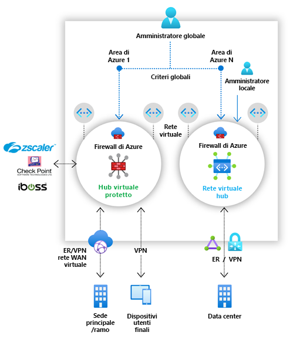

# Che cos'è Gestione firewall di Azure?

Gestione firewall di Azure è un servizio di gestione della sicurezza che fornisce funzionalità di gestione dei criteri di sicurezza e delle route centralizzate per i perimetri di sicurezza basati sul cloud. 

Gestione firewall può garantire la gestione della sicurezza per due tipi di architettura di rete:

- **Hub virtuale protetto**

   Un [hub di rete WAN virtuale di Azure](../virtual-wan/virtual-wan-about.md#resources) è una risorsa gestita da Microsoft che consente di creare facilmente architetture hub-spoke. Quando i criteri di sicurezza e routing vengono associati a un hub di questo tipo, quest'ultimo viene definito *[hub virtuale protetto](secured-virtual-hub.md)* . 
- **Rete virtuale hub**

   È una rete virtuale di Azure standard creata e gestita dall'utente. Quando a un hub di questo tipo sono associati criteri di sicurezza, l'hub è definito *rete virtuale hub*. Attualmente sono supportati solo criteri firewall di Azure. È possibile eseguire il peering di reti virtuali spoke contenenti i servizi e i server del carico di lavoro, nonché gestire firewall in reti virtuali autonome non connesse tramite peering a spoke.

Per un confronto dettagliato delle architetture di tipo *hub virtuale protetto* e *rete virtuale hub*, vedere [Informazioni sulle opzioni disponibili per l'architettura di Gestione firewall di Azure](vhubs-and-vnets.md).

## Funzionalità di Gestione firewall di Azure

Gestione firewall di Azure offre le funzionalità seguenti:

### Distribuzione e configurazione centrali di Firewall di Azure

È possibile distribuire e configurare in modo centralizzato più istanze di Firewall di Azure che si estendono in diverse aree e sottoscrizioni di Azure. 

### Criteri gerarchici (globali e locali)

È possibile usare Gestione firewall di Azure per gestire in modo centralizzato i criteri di Firewall di Azure tra più hub virtuali protetti. I team IT centrali possono creare criteri firewall globali per applicare i criteri firewall dell'organizzazione a tutti i team. I criteri firewall creati localmente consentono un modello self-service DevOps per una maggiore agilità.

### Integrato con una soluzione di security come servizio di terze parti per una sicurezza avanzata

Oltre a Firewall di Azure, è possibile integrare i provider di terze parti per la security come servizio (SECaas) per fornire una protezione di rete aggiuntiva alle connessioni di rete virtuale e branch per Internet.

Questa funzionalità è disponibile solo con distribuzioni di tipo hub virtuale protetto.

- Filtro del traffico da VNet a Internet (V2I)

   - Filtrare il traffico di rete virtuale in uscita con provider di sicurezza di terze parti preferito.
   - Sfruttare la protezione Internet avanzata in grado di riconoscere l'utente per i carichi di lavoro su cloud in esecuzione in Azure.

- Filtro del traffico da branch a Internet (B2I)

   Sfruttare la connettività di Azure e la distribuzione globale per aggiungere con facilità il filtro di terze parti per gli scenari da branch a Internet.

Per altre informazioni sui provider partner di sicurezza, vedere [Che cosa sono i provider partner di sicurezza di Gestione firewall di Azure?](trusted-security-partners.md)

### Gestione centralizzata della route

È possibile instradare facilmente il traffico all'hub protetto per filtrare e accedere senza il bisogno di impostare route definite dall'utente alle reti virtuali spoke. 

Questa funzionalità è disponibile solo con distribuzioni di tipo hub virtuale protetto.

È possibile usare provider di terze parti per il filtro del traffico da branch a Internet (B2I), affiancato con Firewall di Azure per il filtro da branch a rete virtuale (B2V), da rete virtuale a rete virtuale (V2V) e da rete virtuale a Internet (V2I). È anche possibile usare provider di terze parti per filtrare il traffico V2I, purché Firewall di Azure non sia necessario per B2V o V2V. 

## Aree di disponibilità

I criteri firewall di Azure possono essere usati in tutte le aree. Ad esempio, è possibile creare un criterio all'interno degli Stati Uniti occidentali e usarlo negli Stati Uniti orientali. 

## Problemi noti

Gestione firewall di Azure presenta i problemi noti seguenti:

|Problema  |Descrizione  |Strategia di riduzione del rischio  |
|---------|---------|---------|
|Suddivisione del traffico|Office 365 e la suddivisione del traffico PaaS pubblico di Azure non sono supportati al momento. Di conseguenza, se si seleziona un provider di terze parti per V2I o B2I, vengono inviati tramite il servizio partner anche tutti i PaaS pubblici di Azure e il traffico di Office 365.|È attualmente in corso l'analisi della suddivisione del traffico nell'hub.
|Un unico hub virtuale protetto per area|Non è possibile avere più hub virtuali protetti per area.|Creare più reti WAN virtuali in un'area.|
|I criteri di base devono trovarsi nella stessa area dei criteri locali|Creare tutti i criteri locali nella stessa area dei criteri di base. È comunque possibile applicare un criterio creato in un'area in un hub protetto di un'altra area.|Analisi in corso|
|Applicazione di filtri al traffico tra hub in distribuzioni sicure degli hub virtuali|L'applicazione di filtri alle comunicazioni tra hub virtuali protetti non è ancora supportata. Le comunicazioni tra hub tuttavia funzionano comunque se non sono abilitati filtri per il traffico privato tramite Firewall di Azure.|Analisi in corso|
|Spoke in un'area diversa rispetto all'hub virtuale|Gli spoke in un'area diversa rispetto all'hub virtuale non sono supportati.|Analisi in corso  Creare un hub per ogni area e connettere le reti virtuali tramite peering nella stessa area dell'hub.|
|Traffico tra rami con filtri abilitati per il traffico privato|Il traffico tra rami non è supportato quando sono abilitati filtri per il traffico privato. |Analisi in corso.  Non proteggere il traffico privato se la connettività tra rami è essenziale.|
|Tutti gli hub virtuali protetti che condividono la stessa rete WAN virtuale devono risiedere nello stesso gruppo di risorse.|Questo comportamento è attualmente allineato agli hub di rete WAN virtuale.|Creare più reti WAN virtuali per consentire la creazione di hub virtuali protetti in gruppi di risorse diversi.|
|L'aggiunta in blocco di indirizzi IP non riesce|Se si aggiungono più indirizzi IP pubblici, il firewall dell'hub protetto entra in uno stato di errore.|Aggiungere incrementi più piccoli di indirizzi IP pubblici. Ad esempio, aggiungerne 10 alla volta.|
|Le regole dell'applicazione non riescono in un hub protetto con DNS personalizzato (anteprima) configurato.|Il DNS personalizzato (anteprima) non funziona nelle distribuzioni di hub protetti e nelle distribuzioni di reti virtuali hub in cui è abilitato il tunneling forzato.|La correzione è in corso di analisi.|

## Passaggi successivi

- Vedere [Panoramica della distribuzione di Gestione firewall di Azure](deployment-overview.md)
- Informazioni sugli [hub virtuali protetti](secured-virtual-hub.md).
