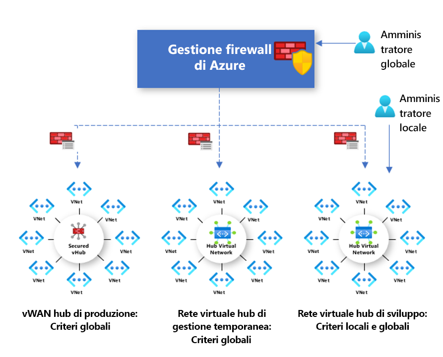

# Panoramica dei criteri di Gestione firewall di Azure

[!INCLUDE [Preview](../../includes/firewall-manager-preview-notice.md)]

I criteri firewall sono risorse di Azure contenenti raccolte di regole NAT, di rete e dell'applicazione, nonché impostazioni di intelligence sulle minacce. Sono risorse globali che possono essere usate in più istanze di Firewall di Azure in hub virtuali protetti e reti virtuali hub. I criteri funzionano in diverse aree e sottoscrizioni.

## Creazione e associazione di criteri

È possibile creare e gestire i criteri in diversi modi, ad esempio con il portale di Azure, l'API REST, i modelli, Azure PowerShell e l'interfaccia della riga di comando.

È anche possibile creare criteri eseguendo la migrazione di regole esistenti da Firewall di Azure con il portale o Azure PowerShell. Per altre informazioni, vedere [Come eseguire la migrazione di configurazioni di Firewall di Azure a criteri firewall di Azure (anteprima)](migrate-to-policy.md). 

I criteri possono essere associati a uno o più hub virtuali o reti virtuali. Il firewall può trovarsi in qualsiasi sottoscrizione associata all'account e in qualsiasi area.

## Criteri gerarchici

I nuovi criteri possono essere creati da zero o essere ereditati da criteri esistenti. L'ereditarietà consente di creare in DevOps criteri firewall locali in aggiunta ai criteri di base imposti dall'organizzazione.

I criteri creati con criteri padre non vuoti ereditano tutte le raccolte di regole dai criteri padre. Le raccolte di regole di rete ereditate dai criteri padre sono sempre prioritarie rispetto alle raccolte di regole di rete definite come parte di un nuovo criterio. La stessa logica si applica anche alle raccolte di regole dell'applicazione. Le raccolte di regole di rete, tuttavia, vengono sempre elaborate prima delle raccolte di regole dell'applicazione indipendentemente dall'ereditarietà.

Dai criteri padre viene ereditata anche la modalità di intelligence sulle minacce. È possibile sostituire questo comportamento impostando la modalità di intelligence sulle minacce su un valore diverso, ma non disattivarlo. La sostituzione è consentita solo con un valore più restrittivo. Se il criterio padre è impostato su **Avvisa solo**, ad esempio, è possibile configurare il criterio locale su **Avvisa e nega**.

Le raccolte di regole NAT non sono ereditabili perché sono specifiche di un determinato firewall.

Con l'ereditarietà, tutte le modifiche apportate ai criteri padre vengono automaticamente applicate ai criteri firewall figlio associati.

## Regole e criteri tradizionali

Firewall di Azure supporta sia regole che criteri tradizionali. La tabella seguente contiene un confronto dei criteri e delle regole.

|         |Policy  |Regole  |
|---------|---------|---------|
|Contiene     |Regole NAT, di rete e dell'applicazione e impostazioni di intelligence sulle minacce|Regole NAT, di rete e dell'applicazione |
|Protegge     |Hub virtuali e reti virtuali|Solo reti virtuali|
|Funzionalità del portale     |Gestione centrale con Gestione firewall|Esperienza autonoma a livello di firewall|
|Supporto di più firewall     |I criteri firewall sono risorse separate utilizzabili in diversi firewall|È necessario esportare e importare manualmente le regole oppure usare soluzioni di gestione di terze parti |
|Prezzi     |Fatturazione in base all'associazione di firewall. Vedere [Prezzi](#pricing)|Gratuito|
|Meccanismi di distribuzione supportati     |Portale, API REST, modelli, Azure PowerShell e interfaccia della riga di comando|Portale, API REST, modelli, PowerShell e interfaccia della riga di comando |
|Stato della versione     |Anteprima pubblica|Disponibilità generale|

## Prezzi

I criteri vengono fatturati in base alle associazioni di firewall. I criteri con una o zero associazioni di firewall sono gratuiti. I criteri con più associazioni di firewall vengono fatturati a tariffa fissa. Per altre informazioni, vedere [Prezzi di Gestione firewall di Azure](https://azure.microsoft.com/pricing/details/firewall-manager/).

## Passaggi successivi

Per informazioni su come distribuire Firewall di Azure, vedere [Esercitazione: Proteggere la rete cloud con l'anteprima di Gestione firewall di Azure usando il portale di Azure](secure-cloud-network.md).
